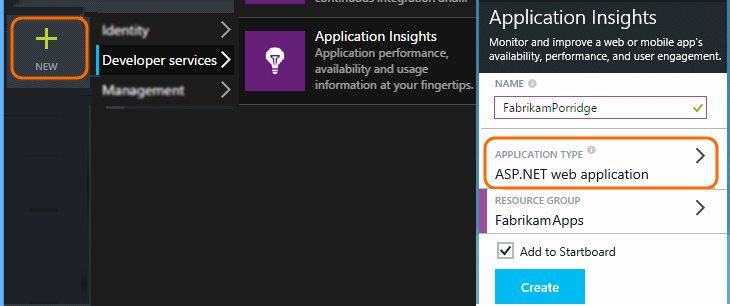

<properties
   pageTitle="Application Insights para Serviços de Nuvem do Azure"
   description="Monitorar suas funções da Web e de trabalho com eficiência com o Application Insights"
   services="application-insights"
   documentationCenter=""
   authors="soubhagyadash"
   manager="victormu"
   editor="alancameronwills"/>

<tags
   ms.service="application-insights"
   ms.devlang="na"
   ms.tgt_pltfrm="ibiza"
   ms.topic="article"
   ms.workload="tbd"
   ms.date="05/21/2015"
   ms.author="sdash"/>

# Application Insights para Serviços de Nuvem do Azure


*O Application Insights está em modo de visualização*

Os [aplicativos de serviço de Nuvem do Microsoft Azure](http://azure.microsoft.com/services/cloud-services/) podem ser monitorados pelo [Application Insights do Visual Studio][start] quanto a disponibilidade, desempenho, falhas e uso.

<!-- For illustration purposes, we have added Application Insights to this [sample Azure cloud service](sample link). This code is available [here](git link), for you to follow along with the steps below. -->

## Criar um recurso do Application Insights para cada função

Um recurso do Application Insights é onde os dados de telemetria serão analisados e exibidos.

1.  No [Portal do Azure][portal], crie um novo recurso do Application Insights. Para o tipo de aplicativo, escolha o aplicativo ASP.NET. 

    

2.  Faça uma cópia da chave de instrumentação. Você precisará disso em breve para configurar o SDK.

    


Geralmente, é melhor criar um recurso separado para os dados de cada função da Web e de trabalho.

Como alternativa, você pode enviar dados de todas as funções a apenas um recurso, mas definir uma [propriedade padrão][apidefaults] para que você possa filtrar ou agrupar os resultados de cada função.

## <a name="sdk"></a>Instalar o SDK em cada projeto


1. No Visual Studio, edite os pacotes do NuGet do seu projeto de aplicativo de área de trabalho. 

2. Instale o SDK do Application Insights para aplicativos Web.

    

    (Como alternativa, você poderia escolher o SDK do Application Insights para aplicativos Web. Isso oferece alguma telemetria interna de contadores de desempenho.)

3. Configure o SDK para enviar dados ao recurso do Application Insights.

    Abra `ApplicationInsights.config` e insira esta linha:

    `<InstrumentationKey>` *a chave de instrumentação que você copiou* `</InstrumentationKey>`

    Use a chave de instrumentação copiada do recurso do Application Insights.

    Como alternativa, você pode [definir a chave no tempo de execução][apidynamicikey]. Isso permite direcionar a telemetria de diferentes ambientes (desenvolvimento, teste, produção) para recursos diferentes.

## Executar seu aplicativo

Execute seu projeto no modo de depuração no computador de desenvolvimento ou publique-o no Azure. Use-o por alguns minutos para gerar alguns dados de telemetria.

## <a name="monitor"></a> Exibir sua telemetria

Retorne ao [Portal do Azure][portal] e navegue até seu recurso do Application Insights.


Procure dados nos gráficos de Visão Geral. Primeiro, você apenas verá um ou dois pontos. Por exemplo:


Clique em qualquer gráfico para ver métricas mais detalhadas. [Saiba mais sobre métricas.][perf]

Agora, publique seu aplicativo e assista à acumulação dos dados.


#### Não há dados?

* Abra o bloco [Pesquisar][diagnostic] para ver eventos individuais.
* Use o aplicativo abrindo páginas diferentes, para que ele gere alguma telemetria.
* Aguarde alguns segundos e clique em Atualizar.
* Consulte [Solucionar problemas][qna].


## Conclua a instalação.

Para obter a visão de 360 graus completa de seu aplicativo, há mais algumas coisas a fazer:


* [Adicione o SDK do JavaScript a suas páginas da Web][client] para obter a telemetria baseada em navegador, como contagens de exibição de página, tempos de carregamento de página, exceções de script e para permitir que você escreva telemetria personalizada em seus scripts de página.
* Adicione o acompanhamento de dependência para diagnosticar problemas causados por bancos de dados ou outros componentes usados por seu aplicativo:
 * [em seu aplicativo Web ou VM do Azure][azure]
 * [em seu servidor IIS local][redfield]
* [Capturar rastreamentos de log][netlogs] da sua estrutura de registros favorita
* [Acompanhe métricas e eventos personalizados][api] no cliente, no servidor ou em ambos, para saber mais sobre como seu aplicativo é usado.
* [Configure os testes da Web][availability] para certificar-se de manter seu aplicativo operante e responsivo.

#### Acompanhar solicitações para funções de trabalho

Você pode capturar o desempenho das chamadas a funções de trabalho acompanhando-as da mesma maneira como faz com solicitações HTTP. No Application Insights, o tipo de Solicitação de telemetria mede uma unidade de trabalho do servidor nomeada que pode ser cronometrada e pode ter êxito ou falhar independentemente. Embora as solicitações HTTP sejam capturadas automaticamente pelo SDK, você pode inserir seu próprio código para acompanhar as solicitações para funções de trabalho.

Aqui está um loop de execução típico para uma função de trabalho:

```C#

    while (true)
    {
      Stopwatch s1 = Stopwatch.StartNew();
      var startTime = DateTimeOffset.UtcNow;
      try
      {
        // ... get and process messages ...

        s1.Stop();
        telemetryClient.TrackRequest("CheckItemsTable",
            startTime, s1.Elapsed, SUCCESS_CODE, true);
      }
      catch (Exception ex)
      {
        string err = ex.Message;
        if (ex.InnerException != null)
        {
           err += " Inner Exception: " + ex.InnerException.Message;
        }
        s1.Stop();
        telemetryClient.TrackRequest("CheckItemsTable", 
            startTime, s1.Elapsed, FAILURE_CODE, false);
        telemetryClient.TrackException(ex);

        // Don't flood if we have a bug in queue process loop.
        System.Threading.Thread.Sleep(60 * 1000);
      }
    }
```
[api]: app-insights-api-custom-events-metrics.md
[apidefaults]: app-insights-api-custom-events-metrics.md#default-properties
[apidynamicikey]: app-insights-api-custom-events-metrics.md#dynamic-ikey
[availability]: app-insights-monitor-web-app-availability.md
[azure]: app-insights-azure.md
[client]: app-insights-javascript.md
[diagnostic]: app-insights-diagnostic-search.md
[netlogs]: app-insights-asp-net-trace-logs.md
[perf]: app-insights-web-monitor-performance.md
[portal]: http://portal.azure.com/
[qna]: app-insights-troubleshoot-faq.md
[redfield]: app-insights-monitor-performance-live-website-now.md
[start]: app-insights-get-started.md

<!---HONumber=58-->