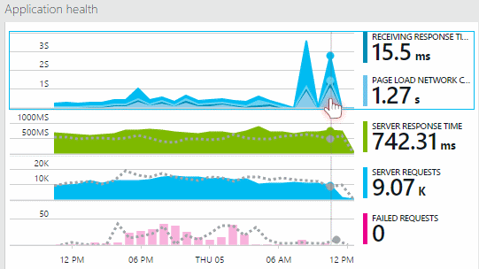
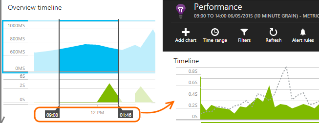
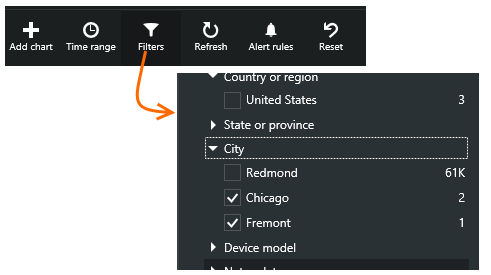
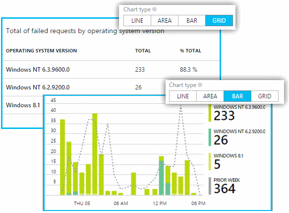

<properties 
	pageTitle="Explorar métricas no Application Insights" 
	description="Analise o uso, disponibilidade e desempenho de seu local ou um aplicativo Web do Microsoft Azure com o Application Insights." 
	services="application-insights" 
    documentationCenter=""
	authors="alancameronwills" 
	manager="ronmart"/>

<tags 
	ms.service="application-insights" 
	ms.workload="tbd" 
	ms.tgt_pltfrm="ibiza" 
	ms.devlang="na" 
	ms.topic="article" 
	ms.date="05/07/2015" 
	ms.author="awills"/>
 
# Explorar métricas no Application Insights

Métricas no [Application Insights][start] são contagens e valores medidos de eventos enviados em telemetria do seu aplicativo. Eles ajudam você a detectar problemas de desempenho e observar as tendências referentes a como seu aplicativo está sendo usado. Há uma grande variedade de métricas padrão, e você também pode criar suas próprias métricas e eventos personalizados.

Contagens de métricas e eventos são exibidas em gráficos de valores agregados como somas, médias ou contagens.

Por exemplo, se você adicionar o Application Insights a um aplicativo Web, aqui está o que você vê próximo à parte superior da visão geral:

Alguns gráficos são segmentados: a altura total do gráfico em qualquer ponto é a soma das métricas exibidas. A legenda mostra, por padrão, as quantidades maiores.

Linhas pontilhadas mostram o valor da métrica de uma semana atrás.

## Valores de um ponto

Passe o mouse sobre o gráfico para exibir os valores das métricas nesse determinado ponto.

O valor de métrica em um ponto específico é agregado durante o intervalo de amostragem anterior. Isso pode variar dependendo do intervalo de tempo do gráfico inteiro.

O intervalo de amostragem ou "intervalo" é mostrado na parte superior da folha.

## Intervalo de tempo

Você pode alterar o intervalo de tempo coberto pela maioria dos gráficos ou grades em qualquer folha.

Se você estiver esperando alguns dados que não apareceram ainda, clique em Atualizar. Os gráficos não são atualizados automaticamente. No modo de liberação, pode levar algum tempo para que dados passem pelo pipeline de análise e sejam representados em um gráfico.

Na folha visão geral, arraste uma parte do gráfico para ampliá-la em um novo gráfico.

## Metrics Explorer

Clique em qualquer gráfico na folha visão geral para ver um conjunto mais detalhado de grades e gráficos relacionados. Você pode editar esses gráficos e grades para focar nos detalhes em que você está interessado.

Por exemplo, clique no gráfico de Solicitações com falha do aplicativo Web:

## O que as figuras significam?

A legenda na lateral mostra, por padrão, o valor agregado durante o período do gráfico.

Cada ponto de dados no gráfico também é um acumulado dos valores de dados recebidos no intervalo de amostragem anterior, ou "intervalo". O intervalo é mostrado na parte superior da folha e varia de acordo com a escala de tempo total do gráfico.

Métricas diferentes são agregadas de maneiras diferentes:

 * Para uma métrica como tempo de resposta, os valores são **média** durante o período do gráfico.
 * Para contagens de eventos, como solicitações com falha, o acumulado é a **soma** das contagens durante o período.
 * Para contagens de usuários, o acumulado é o número de usuários **exclusivos** durante o período. \(Se um usuário for acompanhado mais de uma vez durante o período, ele será contado apenas uma vez.\)

Para saber se o valor é uma soma, média ou exclusivo, clique no gráfico e role para baixo até o valor selecionado. Você também pode obter uma breve descrição da métrica.

 

## Edição de gráficos e grades

Para adicionar um novo gráfico à folha:

Selecione um gráfico novo ou existente para editar o que ele mostra:

Você pode exibir mais de uma métrica em um gráfico, porém há restrições sobre as combinações que podem ser exibidas em conjunto. Assim que você escolher uma métrica, algumas das outras serão desabilitadas.

Se você codificou [métricas personalizadas][track] em seu aplicativo \(chamadas para TrackMetric e TrackEvent\), elas serão listados aqui.

## Segmentar os dados

Selecione um gráfico ou uma grade, ative o agrupamento e escolha uma propriedade pela qual agrupar:

Se você codificou [métricas personalizadas][track] em seu aplicativo e elas incluem valores de propriedade, você poderá selecionar a propriedade na lista.

O gráfico é muito pequeno para dados segmentados? Ajuste sua altura:

## Filtrar seus dados

Para ver apenas as métricas para um conjunto selecionado de valores de propriedade:

Se você não selecionar nenhum valor para uma determinada propriedade, será o mesmo que selecionar todas elas: não há nenhum filtro para essa propriedade.

Observe as contagens de eventos junto a cada valor da propriedade. Quando você seleciona valores de uma propriedade, as contagens junto a outros valores de propriedade são ajustadas.

## Remover o tráfego de testes da Web e de bot

Use o filtro **Tráfego real ou sintético** e marque **Real**.

Você também pode filtrar por **Origem do tráfego sintético**.

## Editar o tipo de gráfico

Em particular, observe que você pode alternar entre gráficos e grades:

## Salve sua folha de métricas

Quando você tiver criado alguns gráficos, salve-os como favoritos. Se você utiliza uma conta organizacional, você pode escolher entre compartilhá-la ou não com outros membros da equipe.

Para ver a folha novamente, **vá até a folha de visão geral** e abra Favoritos:

Se você escolheu o intervalo de tempo Relativo quando salvou, a folha será atualizada com as métricas mais recentes. Se você escolheu o intervalo de tempo Absoluto, ele mostrará sempre os mesmos dados.

## Redefinir a folha

Se você editar uma folha mas em seguida decidir voltar ao conjunto original salvo, clique em Redefinir.

## Definir alertas

Para ser notificado por email sobre valores incomuns de qualquer métrica, adicione um alerta. Você pode escolher para enviar o email para os administradores de conta ou para endereços de email específicos.

[Saiba mais][alerts].

<!--Link references-->

[alerts]: app-insights-alerts.md
[start]: app-insights-get-started.md
[track]: app-insights-custom-events-metrics-api.md

<!--HONumber=54-->