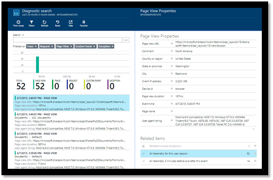

<properties 
	pageTitle="Monitorar um site do SharePoint com o Application Insights" 
	description="Iniciar o monitoramento de um novo aplicativo com uma nova chave de instrumentação" 
	services="application-insights" 
    documentationCenter=""
	authors="alancameronwills" 
	manager="ronmart"/>

<tags 
	ms.service="application-insights" 
	ms.workload="tbd" 
	ms.tgt_pltfrm="ibiza" 
	ms.devlang="na" 
	ms.topic="article" 
	ms.date="04/16/2015" 
	ms.author="awills"/>

# Monitorar um site do SharePoint com o Application Insights

[AZURE.INCLUDE [app-insights-selector-get-started](../includes/app-insights-selector-get-started.md)]

O Application Insights do Visual Studio monitora a disponibilidade, o desempenho e o uso de seus aplicativos. Aqui você aprenderá a configurá-lo para um site do SharePoint.

## Criar um recurso do Application Insights

No [Portal do Azure](http://portal.azure.com), crie um novo recurso do Application Insights. Escolha ASP.NET como o tipo de aplicativo.

A folha que será aberta é o local em que você verá os dados de uso e desempenho sobre seu aplicativo. Para retornar a ela na próxima vez em que fizer logon no Azure, você deverá encontrar um bloco para ela na tela inicial. Como alternativa, clique em Procurar para localizá-la.
    

## Adicione nosso script a suas páginas da Web

Em Início Rápido, obtenha o script para páginas da Web:

Insira o script antes da marca &lt;/head&gt; de cada página que você deseja acompanhar. Se seu site possui uma página mestra, você poderá colocar o script lá. Por exemplo, em um projeto ASP.NET MVC, você deve colocá-lo em View\Shared_Layout.cshtml

O script contém a chave de instrumentação que direciona a telemetria para o recurso do Application Insights.

### Adicionar o código às páginas do site

#### Na página mestra

Se você puder editar a página mestra do site, que fornecerá monitoramento para todas as páginas no site.

Confira a página mestra e edite-a usando o SharePoint Designer ou qualquer outro editor.

Adicione o código antes da marca </head>.

#### Ou em páginas individuais

Para monitorar um conjunto limitado de páginas, adicione o script separadamente a cada página.

Insira uma web part e insira o trecho de código nela.

## Exibir dados sobre seu aplicativo

Retorne à folha de seu aplicativo no [portal do Azure](http://portal.azure.com).

Os primeiros eventos aparecerão na Pesquisa de Diagnóstico.

Se você estiver esperando mais dados, clique em Atualizar depois de alguns segundos.

A **análise de uso** fornece um instantâneo rápido dos usuários, sessões e exibições de página:

Clique em Exibições de Página para ver mais detalhes.

Clique em Usuários para ver detalhes sobre novos usuários e suas localizações.

## Próximas etapas

* [Testes da web](app-insights-monitor-web-app-availability.md) para monitorar a disponibilidade de seu site.

* [Application Insights](app-insights-get-started.md) para outros tipos de aplicativos.

<!--Link references-->

<!---HONumber=58-->