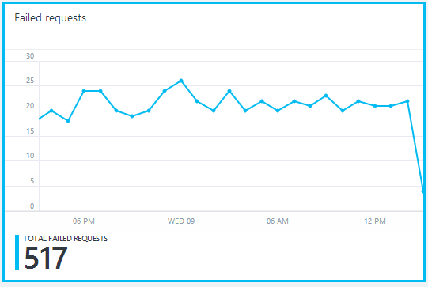

<properties title="Monitor your app's health and usage with Application Insights" pageTitle="Monitorar a integridade e o uso do aplicativo com o Application Insights" description="Get started with Application Insights. Analyze usage, availability and performance of your on-premises or Microsoft Azure applications." metaKeywords="analytics monitoring application insights" authors="awills"  manager="kamrani" />

<tags ms.service="application-insights" ms.workload="tbd" ms.tgt_pltfrm="ibiza" ms.devlang="na" ms.topic="article" ms.date="2014-09-24" ms.author="awills" />
 
# Monitore o desempenho dos aplicativos web

*O Application Insights está em visualizar.*

Certifique-se de que seu aplicativo está sendo bem executado, e saiba rapidamente sobre quaisquer falhas. [O Application Insights][start] vai lhe dizer sobre quaisquer problemas de desempenho e exceções, e o ajudará a localizar e diagnosticar as causas raízes.

O Application Insights pode monitorar os aplicativos da web ASP.NET hospedados no local ou em máquinas virtuais, bem como em sites do Microsoft Azure. 

* [Configurar o monitoramento de desempenho](#setup)
* [Veja os dados](#view)
* [O que significa tudo isso?](#metrics)
* [Problemas de diagnóstico](#diagnosis)
* [Próximas etapas](#next)

## Configurar o monitoramento de desempenho

Se você ainda não tem o Application Insights adicionado ao seu projeto (ou seja, não tem o ApplicationInsights.config), escolha uma destas formas para começar:

* [Adicione o Application Insights ao seu projeto do aplicativo no Visual Studio][greenbrown] - Recomendado. Além do monitoramento de desempenho passivo, você pode inserir o registro em log do diagnóstico e acompanhar o uso.
* [Monitore o desempenho de um site ao vivo agora][redfield] - desse modo, você não precisa atualizar o projeto do aplicativo ou reimplementar o site.
* [Para um site do Microsoft Azure](../insights-how-to-customize-monitoring/)  você já pode ver métricas na lente de monitoramento do site. 

## Exibir relatórios

Execute seu aplicativo com F5 e experimente - abra páginas diferentes.

No Visual Studio, você verá uma contagem de eventos que foram recebidas.

Abrir Application Insights do seu projeto.

Procure pelos dados nos blocos de **Integridade do aplicativo**. Primeiro, você apenas verá um ou dois pontos. Por exemplo:

Quando você executa no modo de depuração, a telemetria é expressa através da pipeline, de modo que você deve ver dados aparecendo dentro de segundos. Quando você implanta seu aplicativo, os dados se acumulam mais lentamente.

Se você não vê os dados de primeira, aguarde um minuto e, em seguida, clique em Atualizar.

### Explorando métricas

Clique em qualquer bloco para ver mais detalhes, e para ver os resultados por um período mais longo. Por exemplo, clique no bloco Solicitações e, em seguida, selecione um intervalo de tempo:

Clique em um gráfico para escolher quais métricas exibir:

> [AZURE.NOTE] **Desmarque todas as métricas** para ver a seleção completa que está disponível. As métricas se enquadram em grupos; quando qualquer membro de um grupo é selecionado, somente os outros membros do grupo aparecem.

## O que significa tudo isso? Blocos e relatórios de desempenho

Existe uma variedade de métricas de desempenho que você pode obter. Vamos começar com as que aparecem por padrão na lâmina do aplicativo.

### Solicitações

O número de solicitações de HTTP recebidas em um período especifico. Compare isso com os resultados em outros relatórios, para ver como seu aplicativo se comporta conforme a carga varia.

As solicitações HTTP incuem todas as solicitações GET ou POST para páginas, dados e imagens.

Clique no mosaico para obter contagens para URLs específicas.

### Tempo de resposta média

Mede o tempo entre uma solicitação da web inserindo seu aplicativo e a resposta que está sendo devolvida.

Os pontos mostram uma média móvel. Se existem várias solicitações, pode haver algumas que desviam da média sem um pico ou vale óbvio no gráfico.

Procure por picos incomuns. Em geral, espere o tempo de resposta para elevar com uma elevação nas solicitações. Se a elevação é desproporcional, seu aplicativo pode ser atingido por um limite de recurso como a CPU ou a capacidade de um serviço que ele usa.

Clique no bloco para obter tempos para URLs específicas.

### Solicitações mais lentas

Mostra quais solicitações podem precisar de sintonização de desempenho.

### Solicitações falhas

Uma contagem de solicitações que gerou exceções não capturadas.

Clique no bloco para ver os detalhes de falhas específicas, e selecione uma solicitação individual para ver seus detalhes. 

Somente uma amostra representativa de falhas é retida para inspeção individual.

### Outras métricas

Para ver que outras métricas que você pode exibir, clique em um gráfico e, em seguida, desmarque a seleção de todas as métricas para ver todo o conjunto disponível. Clique em (i) para ver cada definição da métrica.

Selecionar qualquer métrica ocultará as outras que não podem aparecer no mesmo gráfico.

## Problemas de diagnóstico

Aqui estão algumas dicas para localizar e diagnosticar problemas de desempenho:

* Configure os [testes na Web][availability] para ser alertado se seu site cair ou responder de forma incorreta ou lenta. 
* Compare a contagem de Solicitação com outras métricas para ver se falhas ou resposta lenta são relatadas ao carregar.
* [Inserir e pesquisar instruções de rastreamento][diagnostic] em seu código para ajudar em problemas de pinpoint.

## Próximas etapas

[Testes na web][availability] - faça com que solicitações da web sejam enviadas a seu aplicativo em intervalos regulares, em todo o mundo.

[Capture e pesquise rastreamentos de diagnóstico][diagnostic] - insira chamadas de rastreamento e filtre os resultados para identificar os problemas.

[Acompanhamento de uso][usage] - saiba como as pessoas usam seu aplicativo.

[Solução de problemas][qna] - e Perguntas e respostas

[AZURE.INCLUDE [app-insights-learn-more](../includes/app-insights-learn-more.md)]

