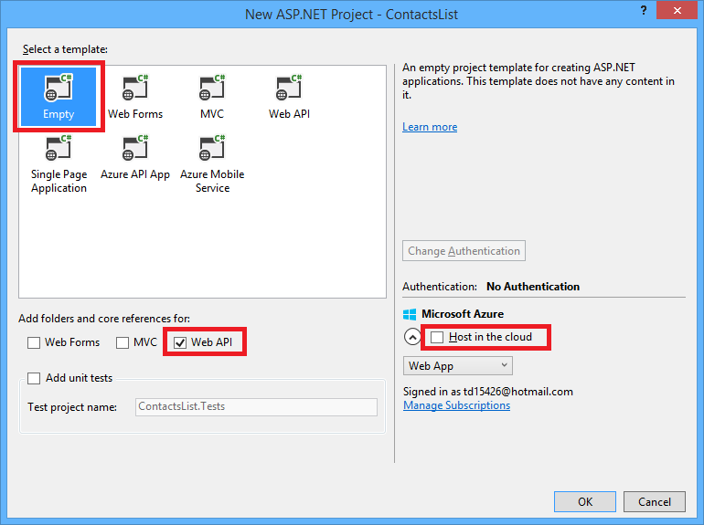
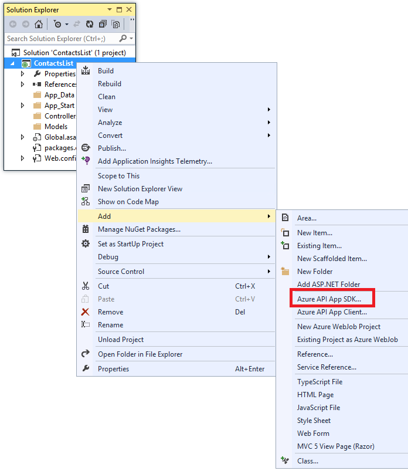
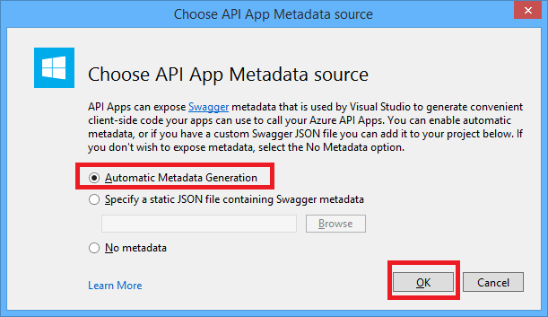

<properties 
	pageTitle="Configurar um projeto de API Web como um aplicativo de API" 
	description="Saiba como configurar um projeto de API Web como um aplicativo de API, usando o Visual Studio 2013" 
	services="app-service\api" 
	documentationCenter=".net" 
	authors="tdykstra" 
	manager="wpickett" 
	editor="jimbe"/>

<tags 
	ms.service="app-service-api" 
	ms.workload="web" 
	ms.tgt_pltfrm="dotnet" 
	ms.devlang="na" 
	ms.topic="article" 
	ms.date="02/19/2015" 
	ms.author="bradyg;tarcher"/>

# Configurar um projeto de API Web como um aplicativo de API

## Visão geral

Este tutorial mostra como pegar um projeto de API Web existente e configurá-lo para implantação como um [aplicativo de API](app-service-api-apps-why-best-platform.md) no [Serviço de Aplicativo do Azure](app-service-value-prop-what-is.md). Tutoriais subsequentes na série mostram como [implantar](app-service-dotnet-deploy-api-app.md) e [depurar](app-service-dotnet-remotely-debug-api-app.md) o projeto de aplicativo de API que você cria neste tutorial.

Para obter informações sobre aplicativos de API, consulte [O que são aplicativos de API?](app-service-api-apps-why-best-platform.md).

[AZURE.INCLUDE [install-sdk-2013-only](../includes/install-sdk-2013-only.md)]

Este tutorial requer a versão 2.5.1 ou posterior do SDK do Azure para .NET.

## Configurar um projeto de API Web 

Esta seção mostra como configurar um projeto de API Web existente como um aplicativo de API. Você começará usando o modelo de projeto de API Web para criar um projeto de API Web e, em seguida, poderá configurá-lo como um aplicativo de API.

1. Abra o Visual Studio 2013.
2. Selecione **Arquivo > Novo Projeto**. 
3. Selecione o modelo **Aplicativo Web ASP.NET**.  
4. Nomeie o projeto *ContactsList*

	

5. Clique em **OK**.

6. Na caixa de diálogo **Novo Projeto ASP.NET**, selecione o modelo de projeto **Vazio**.

7. Clique na caixa de seleção **API Web**.

8. Desmarque a opção **Host na nuvem**.

	

9. Clique em **OK** para criar o projeto.

	

10. Em **Gerenciador de Soluções**, clique com o botão direito do mouse no projeto (não na solução) e clique em **Adicionar > SDK do Aplicativo de API do Azure**.

	

11. Na caixa de diálogo **Escolher Origem de Metadados do Aplicativo de API**, clique em **Geração Automática de Metadados**.

	

	Essa opção habilita a interface do usuário dinâmica do Swagger, que você verá mais adiante no tutorial. Se você optar por carregar um arquivo de metadados do Swagger, ele será salvo com o nome de arquivo *apiDefinition.swagger.json*, conforme explicado na seção a seguir.

12. Clique em **OK**.
 
	Neste ponto, o Visual Studio instala pacotes do NuGet do aplicativo de API e adiciona metadados de aplicativo de API ao projeto API Web.

[AZURE.INCLUDE [app-service-api-review-metadata](../includes/app-service-api-review-metadata.md)]

[AZURE.INCLUDE [app-service-api-define-api-app](../includes/app-service-api-define-api-app.md)]

[AZURE.INCLUDE [app-service-api-direct-deploy-metadata](../includes/app-service-api-direct-deploy-metadata.md)]

## Próximas etapas

Seu aplicativo de API está pronto para ser implantado, e você pode seguir o tutorial [Implantar um Aplicativo de API](app-service-dotnet-deploy-api-app.md) para fazer isso.

<!--HONumber=54-->