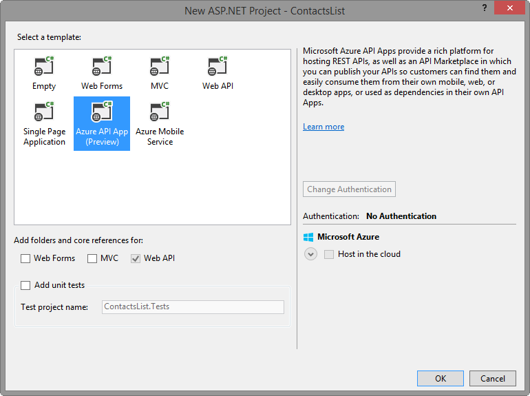

<properties 
	pageTitle="Criar um Aplicativo de API no Serviço de Aplicativo do Azure" 
	description="Este artigo mostra como usar o Visual Studio 2013 para criar uma Aplicativo de API no Serviço de Aplicativo do Azure" 
	services="app-service\api" 
	documentationCenter=".net" 
	authors="bradygaster" 
	manager="wpickett" 
	editor="jimbe"/>

<tags 
	ms.service="app-service-api" 
	ms.workload="web" 
	ms.tgt_pltfrm="dotnet" 
	ms.devlang="na" 
	ms.topic="article" 
	ms.date="02/19/2015" 
	ms.author="bradyg;tarcher"/>

# Criar um Aplicativo de API no Serviço de Aplicativo do Azure

## Visão geral

Este é o primeiro tutorial de uma série de três que o ajudarão a começar a usar os Aplicativos de API no Serviço de Aplicativo do Azure.

1. Neste tutorial, você cria um novo aplicativo de API e o prepara para ser implantado em sua assinatura do Azure. 
* Em [Implantar um Aplicativo de API](app-service-dotnet-create-api-app.md), você implanta o aplicativo de API em sua assinatura do Azure.
* Em [Depurar uma Aplicativo de API](app-service-dotnet-remotely-debug-api-app.md), você usa o Visual Studio para depurar remotamente o código enquanto ele é executado no Azure.

[AZURE.INCLUDE [install-sdk-2013-only](../includes/install-sdk-2013-only.md)]

## Criar seu primeiro aplicativo de API ##

Abra o Visual Studio 2013 e selecione **Arquivo > Novo Projeto**.  Selecione o modelo **Aplicativo Web ASP.NET**.  Nomeie o projeto *ContactsList* e clique em **OK**.

Selecione o modelo de projeto **Aplicativo de API do Azure** e clique em **OK**.

Clique com o botão direito do mouse na pasta **Modelos** no projeto de API Web e, no menu de contexto, selecione **Adicionar > Classe**. 

 

Nomeie o novo arquivo *Contact.cs* e clique em **Adicionar**. 

 

Substitua todo o conteúdo do arquivo pelo código a seguir. 

	namespace ContactsList.Models
	{
		public class Contact
		{
			public int Id { get; set; }
			public string Name { get; set; }
			public string EmailAddress { get; set; }
		}
	}

Clique com o botão direito do mouse na pasta **Controladores** e, no menu de contexto, selecione **Adicionar > Controlador**. 

Na caixa de diálogo **Adicionar Scaffold**, selecione a opção **Controlador de API Web 2 - Vazio** e clique em **Adicionar**. 

Nomeie o controlador **ContactsController** e clique em **Adicionar**. 

Substitua o código no arquivo pelo código a seguir. 

	using ContactsList.Models;
	using System;
	using System.Collections.Generic;
	using System.Linq;
	using System.Net;
	using System.Net.Http;
	using System.Threading.Tasks;
	using System.Web.Http;
	
	namespace ContactsList.Controllers
	{
	    public class ContactsController : ApiController
	    {
	        [HttpGet]
	        public IEnumerable<Contact> Get()
	        {
	            return new Contact[]{
					new Contact { Id = 1, EmailAddress = "barney@contoso.com", Name = "Barney Poland"},
					new Contact { Id = 2, EmailAddress = "lacy@contoso.com", Name = "Lacy Barrera"},
                	new Contact { Id = 3, EmailAddress = "lora@microsoft.com", Name = "Lora Riggs"}
	            };
	        }
	    }
	}

Os projetos de Aplicativo de API são habilitados para a geração automática de metadados do [Swagger](http://swagger.io/ "Official Swagger information") e uma página de teste de API.  Por padrão, a página de teste de API fica desabilitada.  Para habilitar a página de teste de API, abra o arquivo *App_Start/SwaggerConfig.cs*.  Pesquise **EnableSwaggerUI**:

Remova os comentários das seguintes linhas de código:

        })
    .EnableSwaggerUi(c =>
        {

Após a conclusão, o arquivo no Visual Studio 2013 deve se parecer com este.

Para exibir a página de teste de API, execute o aplicativo localmente e navegue até`/swagger`. 

Clique no botão **Experimentar**. Você verá que a API está funcionando e retornará o resultado esperado. 

## Próximas etapas

Seu aplicativo de API está pronto para ser implantado, e você pode seguir o tutorial [Implantar um Aplicativo de API](app-service-dotnet-deploy-api-app.md) para fazer isso.

Para saber mais, consulte [O que são Aplicativos de API?](app-service-api-apps-why-best-platform.md)

<!--HONumber=49-->