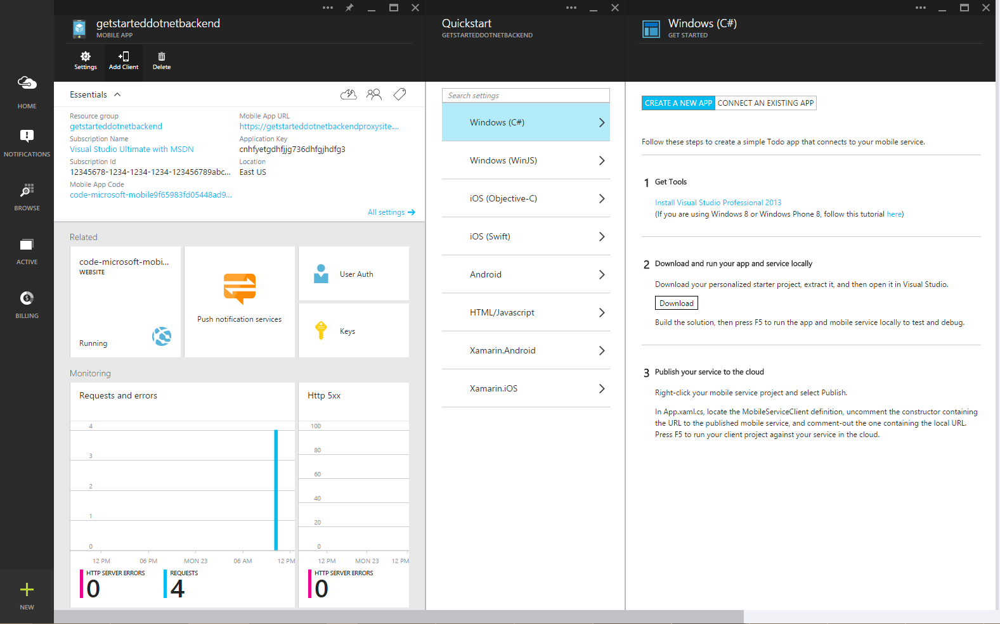

<properties
	pageTitle="Introdução aos back-ends de aplicativo móvel para aplicativos da Windows Store | Centro de Desenvolvimento Móvel"
	description="Siga este tutorial para começar a usar os back-ends do aplicativo móvel do Azure para desenvolvimento da Windows Store em C#, VB ou JavaScript."
	services="app-service\mobile"
	documentationCenter="windows"
	authors="christopheranderson"
	manager="dwrede"
	editor=""/>

<tags
	ms.service="app-service-mobile"
	ms.workload="mobile"
	ms.tgt_pltfrm="mobile-windows"
	ms.devlang="dotnet"
	ms.topic="hero-article"
	ms.date="02/24/2015"
	ms.author="chrande"/>

# Criar um aplicativo do Windows

[AZURE.INCLUDE [app-service-mobile-selector-get-started-preview](../includes/app-service-mobile-selector-get-started-preview.md)]

Este tutorial mostra como adicionar um serviço de back-end baseado em nuvem a um aplicativo universal do Windows usando o back-end de aplicativo móvel do Azure.  Soluções de aplicativos universais do Windows incluem projetos para a Windows Store 8.1 e a Loja do Windows Phone 8.1, e um projeto compartilhado comum.

[AZURE.INCLUDE [app-service-mobile-windows-universal-get-started-preview](../includes/app-service-mobile-windows-universal-get-started-preview.md)]

Para concluir este tutorial, você precisará do seguinte:

* Uma conta ativa do Azure.  Se você não tiver uma conta, pode se inscrever para uma avaliação do Azure e obter até 10 aplicativos móveis gratuitos que pode continuar usando mesmo depois do fim de sua avaliação.  Para obter detalhes, consulte [Avaliação Gratuita do Azure](http://azure.microsoft.com/pricing/free-trial/).
* <a href="https://go.microsoft.com/fwLink/p/?LinkID=257546" target="_blank">Visual Studio Professional 2013</a>.

>[AZURE.NOTE] Se desejar começar com o serviço de aplicativo do Azure antes de inscrever-se em uma conta do Azure, vá para [Testa Serviço de Aplicativo](http://go.microsoft.com/fwlink/?LinkId=523751&appServiceName=mobile), em que você pode criar imediatamente um aplicativo móvel de curta duração iniciante no aplicativo de serviço.  Não é necessário nenhum cartão de crédito; não há compromissos.

## Criar um novo back-end do aplicativo móvel

[AZURE.INCLUDE [app-service-mobile-dotnet-backend-create-new-service-preview](../includes/app-service-mobile-dotnet-backend-create-new-service-preview.md)]

## Criar um novo aplicativo universal do Windows

Depois de criar seu back-end do aplicativo móvel, você pode seguir um guia de início rápido fácil no Portal do Azure para criar um novo aplicativo ou modificar um aplicativo existente para se conectar ao back-end do aplicativo móvel.

Nesta seção, você criará um novo aplicativo universal do Windows conectado ao seu back-end de aplicativo móvel.

1. No Portal do Azure, clique em **Aplicativo Móvel** e, em seguida, clique no aplicativo móvel acabou de criar.

2. Na parte superior da folha, clique em **Adicionar Cliente** e expanda **Windows (C#)**.

   

   Isso exibe as três etapas fáceis para criar um aplicativo da Windows Store conectado ao seu back-end de aplicativo móvel.

3. Se você ainda não o fez, baixe e instale o <a href="https://go.microsoft.com/fwLink/p/?LinkID=257546" target="_blank">Visual Studio Professional 2013</a> no computador local ou na máquina virtual.

4. Em **Baixar e executar seu aplicativo e serviço localmente**, selecione um idioma para seu aplicativo da Windows Store e clique em **Baixar**.

   Isso baixa a solução que contém projetos para o back-end de aplicativo móvel e para o aplicativo de exemplo _To do list_ conectado ao back-end de aplicativo móvel.  Salve o arquivo de projeto compactado em seu computador local e anote onde ele foi salvo.

## Testar o aplicativo móvel

[AZURE.INCLUDE [app-service-mobile-dotnet-backend-test-local-service-preview](../includes/app-service-mobile-dotnet-backend-test-local-service-preview.md)]

## Publicar seu back-end do aplicativo móvel

[AZURE.INCLUDE [app-service-mobile-dotnet-backend-publish-service-preview](../includes/app-service-mobile-dotnet-backend-publish-service-preview.md)]

## Execute o aplicativo do Windows

Agora que o back-end do aplicativo móvel está publicado e o cliente está conectado ao back-end do aplicativo móvel remoto, hospedado no Azure, podemos executar o aplicativo usando o Azure para armazenar itens.

[AZURE.INCLUDE [app-service-mobile-windows-universal-test-app-preview](../includes/app-service-mobile-windows-universal-test-app-preview.md)]

<!-- Anchors. -->

[Introdução a back-ends de aplicativo móvel]:#getting-started
[Criar um novo back-end do aplicativo móvel]:#create-new-service
[Definir a instância de back-end do aplicativo móvel]:#define-mobile-app-backend-instance
[Próximas etapas]:#next-steps

<!-- Images. -->

<!-- URLs. -->
[Introdução à autenticação]: app-service-mobile-dotnet-backend-windows-store-dotnet-get-started-users-preview.md
[Visual Studio Professional 2013]: https://go.microsoft.com/fwLink/p/?LinkID=257546
[SDK do Aplicativo Móvel]: http://go.microsoft.com/fwlink/?LinkId=257545
[Portal do Azure]: https://portal.azure.com/

<!--HONumber=49-->