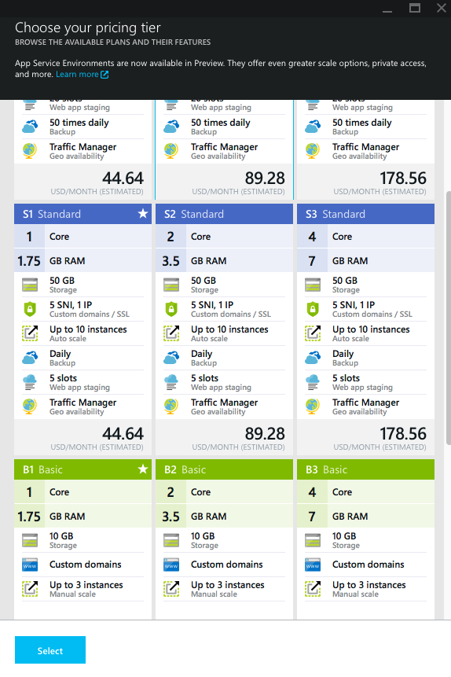
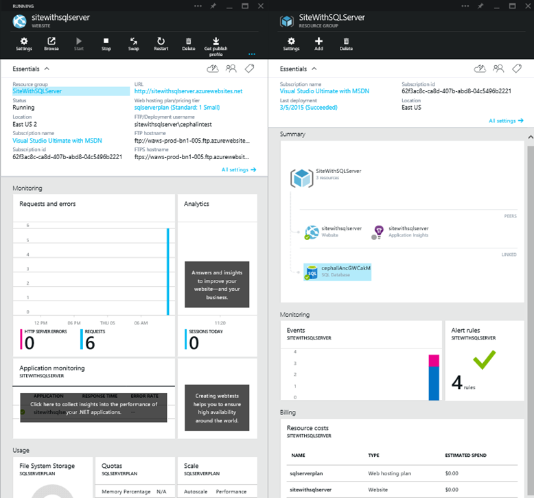
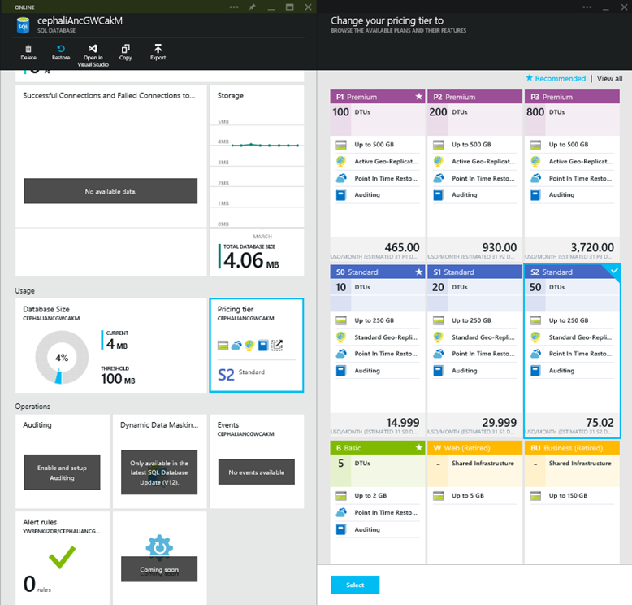
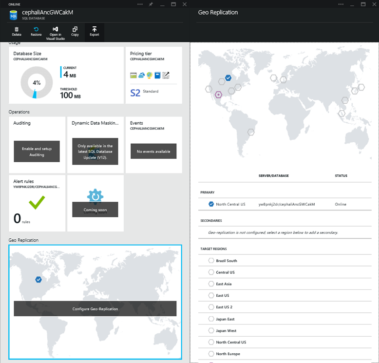

<properties 
	pageTitle="Dimensionar a camada de preços no Serviço de Aplicativo do Azure" 
	description="Saiba como ajustar a escala de aplicativos Web, móveis, de api e lógicos no Serviço de Aplicativo do Azure, incluindo dimensionamento automático." 
	services="app-service" 
	documentationCenter="" 
	authors="stepsic-microsoft-com" 
	manager="wpickett" 
	editor="mollybos"/>

<tags 
	ms.service="app-service" 
	ms.workload="web" 
	ms.tgt_pltfrm="na" 
	ms.devlang="na" 
	ms.topic="article" 
	ms.date="04/25/2015" 
	ms.author="stepsic"/>

# Dimensionar a camada de preços no Serviço de Aplicativo do Azure

Para aumentar o desempenho e a produtividade de seus aplicativos no Microsoft Azure, você pode usar o [Portal do Azure](https://portal.azure.com/) para escalar verticalmente seu plano de Serviço de Aplicativo do modo **Gratuito** para **Compartilhado**, **Básico**, **Padrão** ou **Premium**.

O nível de serviço que seu plano de Serviço de Aplicativo tem se baseia na [*Camada de preços* para o plano](/pricing/details/app-service/). Níveis de preço mais altos, como **Padrão** e **Premium**, oferecem maior eficiência e flexibilidade para determinar como os recursos do Azure são usados. Alterar a camada de preços afeta o número de núcleos e a quantidade de memória que seu serviço tem, e isso é conhecido como o *escala vertical* (ou *redução vertical*).

Além de realizar a escala vertical da camada de preços, você pode aumentar o número de instâncias que o seu serviço tem. Isso é conhecido como *escala horizontal* ou *redução vertical*. Consulte o artigo sobre [Ajustar escala da contagem de instância manual ou automaticamente](insights-how-to-scale.md) para saber mais sobre *Escala horizontal* e *Redução horizontal*.

Para obter informações sobre planos de serviço de aplicativo, consulte [O que é um plano de Serviço de Aplicativo?](web-sites-web-hosting-plan-overview.md) e [Visão geral aprofundada de planos de Serviço Aplicativo do Azure](azure-web-sites-web-hosting-plans-in-depth-overview.md). Para obter informações sobre os preços e recursos de planos individuais de Serviço de Aplicativo, consulte [Detalhes de Preços de Serviços de Aplicativo](/pricing/details/app-service/).

> [AZURE.NOTE]Antes de alternar de um modo **Gratuito** para o modo **Básico**, **Padrão** ou **Premium**, você deve primeiro remover os limites de gastos em vigor para sua assinatura de Serviço de Aplicativo do Azure. Para exibir ou alterar as opções para a sua assinatura do Serviço de Aplicativo do Microsoft Azure, consulte [Assinaturas do Microsoft Azure][azuresubscriptions].

 

## Dimensionando a camada de preço

1. No navegador, abra o [Portal do Azure][portal] e navegue até o aplicativo cuja escala você deseja ajustar.
	
2. Em **Essentials** para seu aplicativo, clique no link **Plano/camada de preços do Serviço de Aplicativo**.

3. Clique em **Camada de preços** e você verá a lista de níveis de serviço possíveis para o plano. Cada faixa é acompanhada por um preço estimado para dar uma ideia do custo médio para essa faixa.
	
	
	
4. Depois de escolher sua camada, clique em **Selecionar**.
	
	A guia **Notificações** vai piscar **SUCESSO** em verde quando a operação for concluída.
		

##Dimensionando recursos relacionados
Se seu aplicativo depender de outros serviços, como SQL ou armazenamento, você também poderá ajustar a escala com base em suas necessidades.

1. Em **Essentials**, clique no link **Grupo de recursos**.

2. Em seguida, na parte de **Resumo** da folha do grupo de recursos, clique em um dos bancos de dados (ou qualquer outro recurso que deseje dimensionar).

	
	
3. Naquela folha do recurso vinculado, clique na parte de **Camada de preço**, selecione uma das camadas com base em suas necessidades de desempenho e clique em **Selecionar**.
	
	
	
4. Se seu aplicativo usar o armazenamento, a replicação geográfica é automaticamente configurada quando você escolhe uma camada de preços que dá suporte a ela. Para SQL, por outro lado, você precisa configurar manualmente a replicação geográfica para aumentar os recursos de recuperação de desastres alta disponibilidade do banco de dados SQL. Para fazer isso, clique na parte **Replicação Geográfica**.
	
	
	

## Recursos de desenvolvedor
Dependendo da camada de preços, os seguintes recursos para desenvolvedores estarão disponíveis:

### Número de bits ###

- Os modos **Básico**, **Padrão** e **Premium** dão suporte a aplicativos de 32 e 64 bits.
- O modos dos planos **Gratuito** e **Compartilhado** dão suporte apenas a aplicativos de 32 bits.

### Suporte ao depurador ###

- Suporte ao depurador está disponível para os modos **Gratuito**, **Compartilhado** e **Básico** em uma conexão simultânea por plano de Serviço de Aplicativo.
- O suporte ao depurador está disponível para os modos **Padrão** e **Premium** em cinco conexões simultâneas por plano de Serviço de Aplicativo.

## Outros recursos

- Para obter informações detalhadas sobre todos os recursos restantes nos planos do Serviço de Aplicativo, incluindo preços e recursos de interesse para todos os usuários (incluindo desenvolvedores), consulte [Detalhes de preços do Serviço de Aplicativo](/pricing/details/web-sites/).

>[AZURE.NOTE]Se você deseja começar a usar o Serviço de Aplicativo do Azure antes de se inscrever em uma conta do Azure, vá até [Experimentar o Serviço de Aplicativo](http://go.microsoft.com/fwlink/?LinkId=523751), em que você pode criar imediatamente um aplicativo Web inicial de curta duração no Serviço de Aplicativo. Nenhum cartão de crédito é exigido, sem compromissos.

## Próximas etapas

- Para começar a usar o Azure, consulte [Avaliação Gratuita do Microsoft Azure](/pricing/free-trial/).
- Para obter informações sobre preços, suporte e SLA, visite os links a seguir.
	
	[Detalhes de preços de transferências de dados](/pricing/details/data-transfers/)
	
	[Planos de suporte do Microsoft Azure](/support/plans/)
	
	[Contratos de Nível de Serviço](/support/legal/sla/)
	
	[Detalhes de preços do banco de dados SQL](/pricing/details/sql-database/)
	
	[Tamanhos de máquina virtual e de serviço de nuvem do Microsoft Azure][vmsizes]
	
	[Detalhes de Preços do Serviço de Aplicativo](/pricing/details/app-service/)
	
	[Detalhes de Preços do Serviço de Aplicativo - Conexões SSL](/pricing/details/web-sites/#ssl-connections)

- Para obter informações sobre práticas recomendadas do Serviço de Aplicativo do Azure, incluindo a criação de uma arquitetura escalonável e flexível, consulte [Práticas recomendadas: aplicativos Web do Serviço de Aplicativo do Azure](http://blogs.msdn.com/b/windowsazure/archive/2014/02/10/best-practices-windows-azure-websites-waws.aspx).

- Vídeos sobre como dimensionar aplicativos Web:
	
	- [Quando dimensionar Sites do Azure - com Stefan Schackow](/documentation/videos/azure-web-sites-free-vs-standard-scaling/)
	- [Dimensionamento automático de Sites do Azure, CPU ou programado - com Stefan Schackow](/documentation/videos/auto-scaling-azure-web-sites/)
	- [Como dimensionar sites do Azure - com Stefan Schackow](/documentation/videos/how-azure-web-sites-scale/)

## O que mudou
* Para obter um guia sobre a alteração de Sites para o Serviço de Aplicativo, consulte: [Serviço de Aplicativo do Azure e seu impacto sobre os serviços do Azure existentes](http://go.microsoft.com/fwlink/?LinkId=529714)
* Para obter um guia sobre a alteração do portal antigo para o novo portal, consulte: [Referência para navegar no portal de visualização](http://go.microsoft.com/fwlink/?LinkId=529715)

<!-- LINKS -->
[vmsizes]: http://go.microsoft.com/fwlink/?LinkId=309169
[SQLaccountsbilling]: http://go.microsoft.com/fwlink/?LinkId=234930
[azuresubscriptions]: http://go.microsoft.com/fwlink/?LinkID=235288
[portal]: https://portal.azure.com/

<!-- IMAGES -->
[ResourceGroup]: ./media/web-sites-scale/scale10ResourceGroup.png
[ScaleDatabase]: ./media/web-sites-scale/scale11SQLScale.png
[GeoReplication]: ./media/web-sites-scale/scale12SQLGeoReplication.png

<!--HONumber=54-->