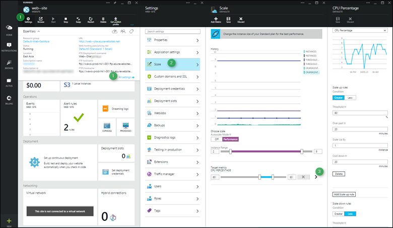
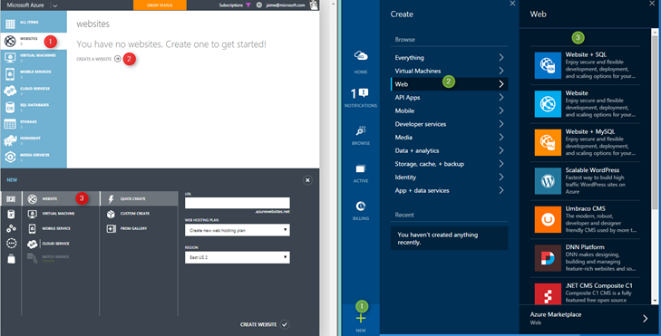
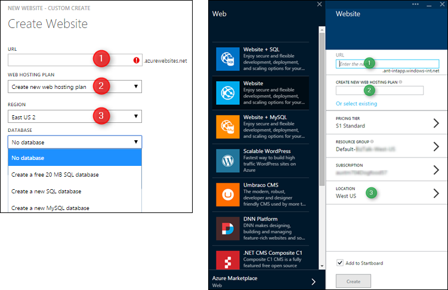
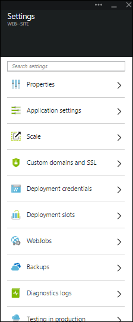
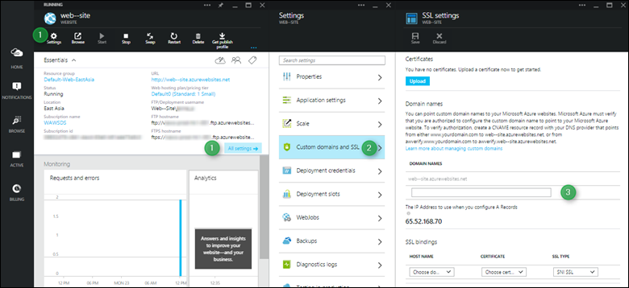
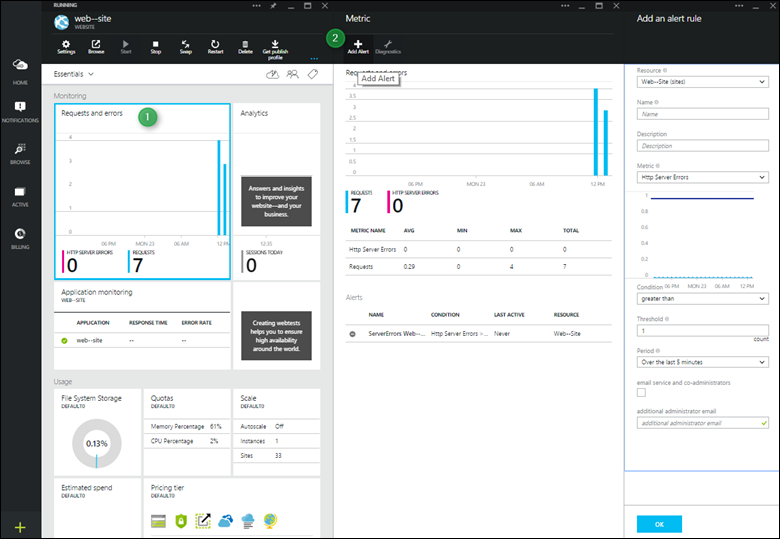
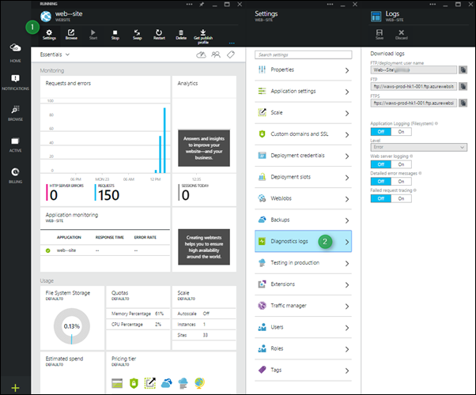
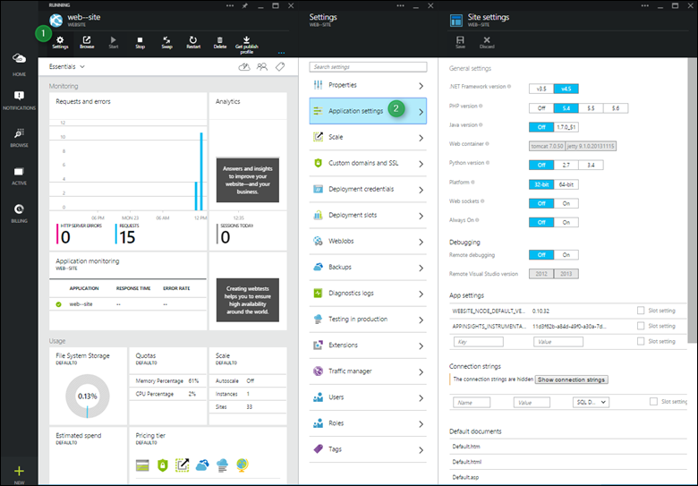

<properties
	pageTitle="Referência para navegar no portal do Azure"
	description="Conheça as diferentes experiências de usuário para aplicativos Web do Serviço de Aplicativo entre o portal de gerenciamento e o Portal do Azure"
	services="app-service\web"
	documentationCenter=""
	authors="jaime-espinosa"
	manager="wpickett"
	editor="jimbe"/>

<tags
	ms.service="app-service-web"
	ms.workload="web"
	ms.tgt_pltfrm="na"
	ms.devlang="na"
	ms.topic="article"
	ms.date="03/24/2015"
	ms.author="jaime-espinosa"/>

# Referência para navegar no portal do Azure

Os Sites do Azure agora são chamados de [Aplicativos Web do Serviço de Aplicativo](http://go.microsoft.com/fwlink/?LinkId=529714). Estamos atualizando toda a nossa documentação para refletir essa alteração de nome e fornecer instruções para o novo Portal do Azure. Até que esse processo seja concluído, você poderá usar este documento como um guia para trabalhar com Aplicativos Web no novo portal do Azure.
 
## O futuro do portal antigo

Você notará as alterações de identidade visual no portal antigo, mas esse portal está sendo substituído pelo novo portal do Azure. Como o portal antigo está sendo desativado, o foco para o novo desenvolvimento está mudando para o novo portal. Todos os novos recursos futuros para Aplicativos Web serão incluídos no novo portal. Comece a usar o novo portal para aproveitar os recursos mais recentes que os aplicativos Web têm a oferecer.

## Diferenças de layout entre o portal antigo e o Portal do Azure

No portal antigo, todos os serviços do Azure são listados no lado esquerdo. A navegação no portal antigo segue uma estrutura de árvore, em que você pode começar no serviço e navegar para cada elemento. Essa estrutura funciona bem para o gerenciamento de componentes independentes. No entanto, os aplicativos criados no Azure são uma coleção de serviços interconectados, e essa estrutura de árvore não é ideal para trabalhar com coleções de serviços. 

O novo portal facilita a compilação de aplicativos de ponta a ponta com componentes de vários serviços. O novo Portal do Azure é organizado como *journeys*. Uma *journey* é uma série de *blades*, que são contêineres para os diferentes componentes. Por exemplo, a configuração do dimensionamento automático para um aplicativo Web é uma *journey* que leva várias folhas, conforme mostrado no exemplo a seguir: a folha **site** (o título dessa folha ainda não foi atualizado para usar a nova terminologia), a folha **Configurações** e a folha **Dimensionar**. No exemplo, o dimensionamento automático está sendo configurado para depender do uso da CPU. Portanto, há também uma folha de **Percentual de CPU**. Os componentes nas *blades* são chamados de *parts*, que são semelhantes a blocos. 

## Exemplo de navegação: criar um aplicativo Web

A criação de novos aplicativos Web é muito fácil. A imagem a seguir mostra o portal antigo e o novo portal lado a lado para demonstrar que não houve muitas mudanças no número de etapas necessárias para colocar um aplicativo Web em funcionamento. 

No novo portal, você pode escolher entre os tipos mais comuns de aplicativos Web, incluindo aplicativos de galerias populares, como o WordPress. Para obter uma lista completa de aplicativos disponíveis, visite o [Azure Marketplace].

Ao criar um aplicativo Web, você especifica a URL, o plano de serviço do aplicativo e o local no novo portal, como faria no portal antigo. 

Além disso, o novo portal permite definir outras configurações comuns. Por exemplo, com os [grupos de recursos](azure-preview-portal-using-resource-groups.md) é simples ver e gerenciar recursos relacionados do Azure. 

## Exemplo de navegação: configurações e recursos

Todas as configurações e recursos agora são agrupados logicamente em uma única folha, da qual você pode navegar.

Por exemplo, você pode criar domínios personalizados clicando em **Domínios personalizados e SSL** na folha **Configurações**.

Para configurar um alerta de monitoramento, clique em **Solicitações e erros** e **Adicionar Alerta**.

Para habilitar o diagnóstico, clique em **Logs de diagnóstico** na folha **Configurações**.

 
Para definir configurações de aplicativo, clique em **Configurações do aplicativo** na folha **Configurações**. 

Com exceção do nome da marca, alguns itens no portal foram renomeados ou agrupados de modo diferente para que seja mais fácil encontrá-los. Por exemplo, a seguir está uma captura de tela da página correspondente de configurações de aplicativo (**Configurar**) no portal antigo.

## Mais Recursos

[A plataforma de aplicativos de nuvem do Azure](app-service-cloud-app-platform.md)

[Novo portal]: https://portal.azure.com
[Azure Marketplace]: /marketplace/

>[AZURE.NOTE] Se você deseja começar a usar o Serviço de Aplicativo do Azure antes de se inscrever para obter uma conta do Azure, vá para [Experimentar Serviço de Aplicativo](http://go.microsoft.com/fwlink/?LinkId=523751), onde você poderá criar imediatamente um aplicativo Web starter de curta duração no Serviço de Aplicativo. Não é exigido um cartão de crédito; sem compromisso.

## O que mudou
* Para obter um guia para a alteração de Sites para o Serviço de Aplicativo, consulte: [Serviço de Aplicativo do Azure e Seu Impacto sobre os Serviços Existentes do Azure](http://go.microsoft.com/fwlink/?LinkId=529714)
* Para obter um guia para a alteração do portal antigo para o novo portal, consulte: [Referência para navegar no portal de visualização](http://go.microsoft.com/fwlink/?LinkId=529715)

<!--HONumber=49-->