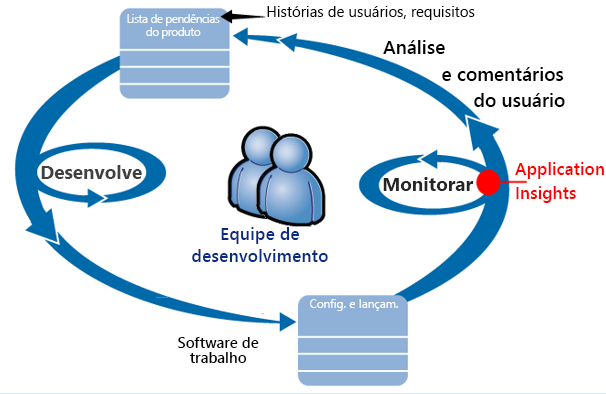
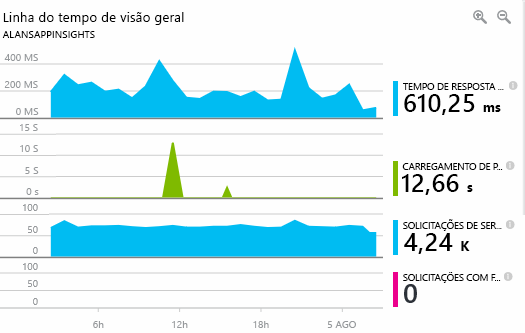
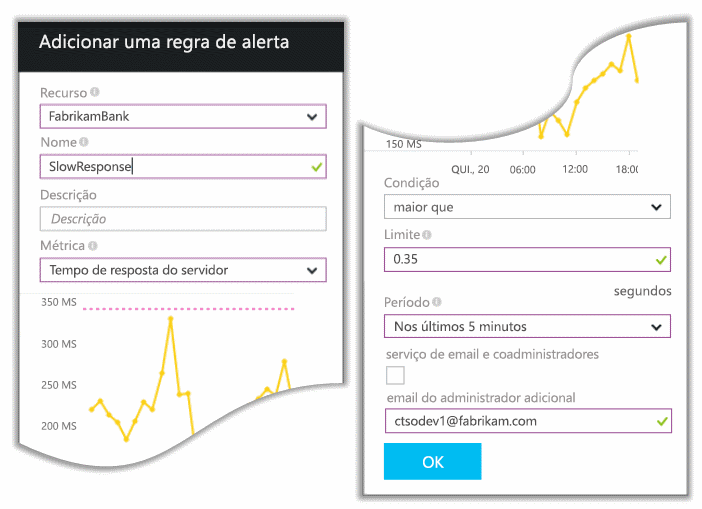
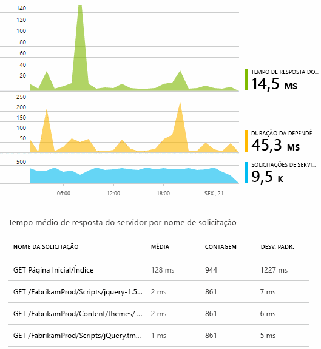

# Detectar, realizar triagem e diagnosticar com o Application Insights

O [Application Insights](app-insights-overview.md) é um serviço de Gerenciamento de Desempenho de Aplicativos (APM) extensível para desenvolvedores da Web. Ele ajuda a descobrir qual é o desempenho do seu aplicativo e que está sendo usado quando ele estiver ativo. E se houver algum problema, ele permite que você saiba, ajuda a avaliar o impacto e ajuda a determinar a causa.

Aqui está uma conta de uma equipe que desenvolve aplicativos da Web:

* *"Alguns dias atrás, implantamos um hotfix “secundário”. Não executamos uma aprovação de teste ampla, mas infelizmente algumas alterações inesperadas foram mescladas à carga, gerando incompatibilidade entre o front-end e back-end. Imediatamente as exceções de servidor aumentaram drasticamente, nosso alerta disparou e fomos informados sobre a situação. Alguns cliques no portal do Application Insights, temos informações suficientes de pilhas de chamadas de exceção para restringir o problema. Revertemos imediatamente e limitamos os danos. O Application Insights tornou essa parte do ciclo das Operações de Desenvolvimento muito fácil e prática."*

Vamos ver como uma equipe de desenvolvimento da Web usa o Application Insights para gerenciar o desempenho. Vamos acompanhar a equipe do Fabrikam Bank, que é responsável pelo sistema bancário online (OBS).

A equipe trabalha em um ciclo de devOps assim:

Requisitos de feed em sua lista de pendências de desenvolvimento (lista de tarefas). Eles trabalham em impressões curtas, o que geralmente entrega software de trabalho, normalmente na forma de melhorias e extensões para o aplicativo existente. O aplicativo ativo é frequentemente atualizado com novos recursos. Enquanto estiver ativo, a equipe monitora-o para uso com a ajuda do Application Insights e desempenho. Esses dados do APM voltam para a lista de pendências de desenvolvimento.

A equipe usa o Application Insights para monitorar o aplicativo Web ao vivo de perto em relação a/ao:

* Desempenho. Eles querem entender como os tempos de resposta variam de acordo com a contagem de solicitações; quantos recursos de CPU, rede, disco e outros recursos estão sendo usados; e onde estão os afunilamentos.
* Falhas. Se houver exceções ou solicitações com falha, ou se um contador de desempenho ficar fora de seu intervalo confortável, a equipe precisará saber disso rapidamente para que possam tomar as devidas providências.
* Uso. Sempre que um novo recurso for liberado, a equipe deseja saber até que ponto é usado e os usuários tenham alguma dificuldade com ele.

Vamos nos concentrar na parte do ciclo de comentários:

## Detectar baixa disponibilidade
Manuela Moraes é desenvolvedora sênior da equipe de OBS e assume a liderança no monitoramento do desempenho online. Ela define vários [testes de disponibilidade](app-insights-monitor-web-app-availability.md):

* Um teste de URL única para a página de aterrissagem principal para o aplicativo, http://fabrikambank.com/onlinebanking/. Ela define os critérios de código HTTP 200 e o texto “Bem-vindo!”. Se esse teste falhar, há algum problema sério com a rede ou os servidores, ou talvez um problema de implantação. (Ou alguém alterou a mensagem de boas-vindas na página sem informá-la.)
* Um teste de várias etapas mais aprofundado, que faz logon e obtém uma listagem atual das contas, verificando alguns detalhes principais em cada página. Esse teste verifica se o link para o banco de dados de contas está funcionando. Ela usa uma ID do cliente fictícia: algumas delas são mantidas para fins de teste.

Com esses testes configurados, Marcela está confiante de que a equipe saberá rapidamente sobre qualquer interrupção.  

Falhas aparecem como pontos vermelhos no gráfico de teste da Web:

Mas o mais importante, um alerta sobre qualquer falha será enviado por email à equipe de desenvolvimento. Desse modo, eles sabem a respeito antes de quase todos os clientes.

## Monitorar métricas de desempenho
Na mesma página de visão geral do Application Insights, há um gráfico que mostra as [principais métricas](app-insights-web-monitor-performance.md).

O tempo de carregamento de página do navegador é derivado da telemetria enviada diretamente a partir de páginas da Web. Tempo de resposta do servidor, contagem de solicitação do servidor e contagem de solicitação com falha são todos medidos no servidor Web e enviadas ao Application Insights a partir daí.

Manuela está um pouco preocupada com o gráfico de resposta do servidor, que mostra o tempo médio entre o momento em que o servidor recebe uma solicitação HTTP do navegador de um usuário e o momento em que ele retorna a resposta. Não é incomum ver uma variação nesse gráfico, uma vez que a carga do sistema varia. Todavia, nesse caso, parece haver que uma correlação entre pequenos aumentos na contagem de solicitações e grandes aumentos no tempo de resposta. Isso poderia indicar que o sistema está funcionando exatamente nos limites.

Ela abre os gráficos de Servidores:

Parece não haver nenhum sinal de limitação de recursos; portanto, talvez os impactos nos gráficos de resposta do servidor sejam apenas uma coincidência.

## Alertas
No entanto, ela gostaria de acompanhar os tempos de resposta. Se eles ficarem muito altos, ela desejará saber disso imediatamente.

Portanto, ela define um [alerta](app-insights-metrics-explorer.md) para tempos de resposta maiores do que um limite típico. Isso lhe dá a certeza de que será informada sobre isso caso os tempos de resposta sejam lentos.

Alertas podem ser definidos em uma grande variedade de outras métricas. Por exemplo, você pode receber emails se a contagem de exceções aumentar excessivamente ou se a memória disponível tornar-se baixa demais, ou ainda se houver um pico em solicitações de cliente.

## Alertas de detecção inteligente
No dia seguinte, chega um email de alerta do Application Insights. Mas quando ela o abre, descobre que não é o alerta de tempo de resposta que ela definiu. Em vez disso, ele informa que houve um aumento repentino de solicitações com falha – ou seja, solicitações que retornaram códigos de falha de 500 ou mais.

As solicitações com falha indicam casos em que os usuários viram um erro – geralmente, após uma exceção lançada no código. Talvez eles vejam uma mensagem dizendo "Desculpe, não foi possível atualizar os detalhes agora" ou, na hipótese mais vergonhosa possível, um despejo de pilha na tela do usuário, cortesia do servidor Web.

Esse alerta é uma surpresa, pois a última vez que ela o examinou, a contagem de solicitações com falha felizmente era baixo. Um pequeno número de falhas é esperado em um servidor ocupado.

Isso também foi um pouco surpreendente para ela, pois ela não precisou configurar esse alerta. Na verdade, a Detecção Inteligente é fornecida automaticamente com o Application Insights. Ele se ajusta automaticamente ao padrão de falha comum de seu aplicativo e “se acostuma” com as falhas em uma página específica, fica abaixo da carga alta ou é vinculado a outras métricas. Ele gera o alarme somente se há um aumento acima do que é esperado.

Este é um email muito útil. Ele não só emite um alarme, mas faz grande parte do trabalho de triagem e de diagnóstico também.

Mostra quantos clientes foram afetados e em quais páginas da Web ou operações. Manuela pode decidir se precisa convocar toda a equipe para trabalhar nisso como em um treinamento contra incêndio ou se isso pode ser ignorado até a semana seguinte.

O email também mostra que uma exceção específica ocorreu e – o mais interessante – que a falha está associada a chamadas com falha para determinado banco de dados. Isso explica o motivo pelo qual a falha apareceu de repente, mesmo que a equipe de Manuela não tenha implantado nenhuma atualização recentemente.

Ela executa ping para o líder da equipe do banco de dados. Sim, eles lançaram um hotfix a meia hora atrás e, opa, talvez tenha havido uma mudança de esquema secundária...

Portanto, o problema está prestes a ser corrigido, mesmo antes da investigação dos logs e em até 15 minutos após sua ocorrência. No entanto, Manuela clica no link para abrir o Application Insights. Ele é aberto exatamente em uma solicitação com falha, e ela pode ver a chamada com falha do banco de dados na lista associada de chamadas de dependência.

## Detectando exceções
Com um pouco de configuração, as [exceções](app-insights-asp-net-exceptions.md) são relatadas ao Application Insights automaticamente. Elas podem também ser capturadas explicitamente inserindo chamadas para [TrackException()](app-insights-api-custom-events-metrics.md#trackexception) no código:  

    var telemetry = new TelemetryClient();
    ...
    try
    { ...
    }
    catch (Exception ex)
    {
       // Set up some properties:
       var properties = new Dictionary <string, string>
         {{"Game", currentGame.Name}};

       var measurements = new Dictionary <string, double>
         {{"Users", currentGame.Users.Count}};

       // Send the exception telemetry:
       telemetry.TrackException(ex, properties, measurements);
    }

A equipe do Fabrikam Bank evoluiu na prática de sempre enviar telemetria em uma exceção, a menos que haja uma óbvia recuperação.  

Na verdade, a estratégia deles é ainda mais ampla do que isso: enviam telemetria em todos os casos nos quais o cliente está frustrado em relação ao que queria fazer, independentemente de isto corresponder a uma exceção no código ou não. Por exemplo, se o sistema de transferência externa interbancária retorna uma mensagem "não é possível concluir esta transação" por algum motivo operacional (sem culpa do cliente), eles acompanham esse evento.

    var successCode = AttemptTransfer(transferAmount, ...);
    if (successCode < 0)
    {
       var properties = new Dictionary <string, string>
            {{ "Code", returnCode, ... }};
       var measurements = new Dictionary <string, double>
         {{"Value", transferAmount}};
       telemetry.TrackEvent("transfer failed", properties, measurements);
    }

TrackException é usado para relatar exceções porque ele envia uma cópia da pilha; o TrackEvent é usado para relatar outros eventos. Você pode anexar as propriedades que podem ser úteis no diagnóstico.

Exceções e eventos aparecem na folha [Pesquisa de diagnóstico](app-insights-diagnostic-search.md). Você pode analisar para ver as propriedades adicionais e o rastreamento de pilha.

## Monitorando a atividade do usuário
Quando o tempo de resposta é constantemente bom com poucas exceções, a equipe de desenvolvimento pode pensar sobre como melhorar a experiência dos usuários e como encorajar mais usuários a atingir as metas desejadas.

Por exemplo, uma jornada típica do usuário no site tem um 'funil' claro: muitos clientes examinam as taxas de diferentes tipos de empréstimos; alguns deles preenchem o formulário de cotação; e daqueles que conseguem uma cotação, alguns vão em frente e pegam o empréstimo.

Considerando onde os números maiores de clientes caem, a empresa pode trabalhar em como conseguir mais usuários na parte inferior do funil. Em alguns casos pode haver uma falha de experiência (UX) do usuário - por exemplo, o botão "Avançar" é difícil de encontrar ou as instruções não são óbvias. Provavelmente, existem motivos de negócio mais significativos para transferências de depósito: talvez as taxas de empréstimo são muito altas.

Sejam quais forem as razões, os dados ajudam a equipe a descobrir o que os usuários estão fazendo. Mais chamadas de rastreamento podem ser inseridas para descobrir mais detalhes. TrackEvent() pode ser usado para a contagem de qualquer ação do usuário, dos muitos detalhes de cliques de botão individuais até realizações significativas como o pagamento de um empréstimo.

A equipe está acostumando-se a ter informações sobre a atividade do usuário. Hoje em dia, sempre que criam um novo recurso, eles pensam como irão receber comentários sobre seu uso. Eles criam chamadas de rastreamento para o recurso desde o início. Eles usam os comentários para melhorar o recurso em cada ciclo de desenvolvimento.

## Monitoramento proativo
Marcela não fica apenas sentada esperando por alertas. Logo após cada reimplantação, ela examina [tempos de resposta](app-insights-web-monitor-performance.md) -tanto o quadro geral e a tabela de solicitações mais lentas quanto as contagens de exceção.  

Ela pode avaliar o efeito no desempenho de cada implantação, geralmente comparando cada semana com a última. Se houver uma deterioração repentina do quadro, ela levanta a questão com os desenvolvedores relevantes.

## Triagem
Triagem - avaliar a gravidade e a extensão de um problema - é a primeira etapa depois da detecção. Devemos chamar a equipe à meia-noite? Ou o problema pode esperar até o próximo intervalo conveniente na lista de pendências? Há algumas perguntas cruciais na triagem.

Que quantidade do problema em questão está acontecendo? Os gráficos na folha visão geral oferecem alguma perspectiva para um problema. Por exemplo, o aplicativo da Fabrikam gerou quatro alertas de teste da Web em uma noite. Examinando o gráfico pela manhã, a equipe pôde ver que existiam realmente alguns pontos vermelhos, embora a maioria dos testes tenham resultado em verde. Detalhando o gráfico de disponibilidade, ficou claro que todos esses problemas intermitentes eram de um local de teste. Isso, obviamente, foi um problema de rede que afetou somente uma rota e provavelmente se resolveria sozinho.  

Por outro lado, um aumento drástico e estável no gráfico de tempos de resposta ou contagens de exceção é, obviamente, motivo para pânico.

Uma tática de triagem útil é “Experimente você mesmo”. Se você tiver o mesmo problema, saberá que ele é real.

Que fração dos usuários são afetados? Para obter uma resposta aproximada, divida a taxa de falha pela contagem de sessão.

No caso de resposta lenta, compare a tabela das solicitações com respostas mais lentas com a frequência de uso de cada página.

Quão importante é o cenário bloqueado? Se esse for um problema funcional bloqueando uma história de usuário específica, isso importa muito? Se os clientes não podem pagar suas contas, isso é sério; se eles não podem alterar suas preferências de cor da tela, talvez isso possa esperar. Os detalhes do evento ou da exceção, ou a identidade da página lenta, informam onde os clientes estão tendo problemas.

## Diagnóstico
O diagnóstico não é exatamente o mesmo que depuração. Antes de iniciar o rastreamento por meio do código, você deve ter uma ideia de porquê, de quando e de onde o problema está ocorrendo.

**Quando isso acontece?** A exibição do histórico fornecida pelos gráficos de evento e de métrica facilita correlacionar os efeitos e as possíveis causas. Se houver picos intermitentes em taxas de exceção ou de tempo de resposta, examine a contagem de solicitações: se eles atingirem o pico ao mesmo tempo, o cenário parece com o de um problema de recurso. Você precisa atribuir mais CPU ou memória? Ou é uma dependência que não é capaz de dar conta da carga?

**O problema é conosco?**  Se você tiver uma queda repentina no desempenho de um determinado tipo de solicitação - por exemplo, quando o cliente deseja um demonstrativo de conta - há uma possibilidade de ser um subsistema externo em vez de seu aplicativo Web. No Metrics Explorer, selecione a taxa de falha de dependência e taxas de duração da dependência e compare seus históricos pelas últimas horas ou dias ao problema que é detectado. Se há alterações correlacionadas, um subsistema externo pode ser a causa.  

Alguns problemas de dependência de lentidão são problemas de localização geográfica. O Fabrikam Bank usa máquinas virtuais do Azure, e descobriu que eles tinham inadvertidamente localizado seu servidor Web e servidor de conta em diferentes países. Obtiveram uma melhoria expressiva migrando um deles.

**O que fizemos?** Se o problema não parece estar em uma dependência e se não esteve sempre lá, provavelmente é causado por uma alteração recente. A perspectiva histórica fornecida pelos gráficos de métrica e evento facilita correlacionar alterações repentinas com implantações. Isso reduz o escopo da busca pelo problema.

**O que está acontecendo?** Alguns problemas ocorrem apenas raramente e podem ser difíceis de rastrear por testes offline. Tudo o que podemos fazer é tentar capturar o bug quando ele ocorre, em tempo real. Você pode inspecionar os despejos de pilha em relatórios de exceção. Além disso, você pode escrever chamadas de rastreamento, com sua estrutura de registros favorita, ou então com TrackTrace() ou TrackEvent().  

A Fabrikam tinha um problema intermitente com transferências entre contas, mas apenas com determinados tipos de conta. Para entender melhor o que estava acontecendo, eles inseriram chamadas TrackTrace() em pontos-chave do código, anexando o tipo de conta como uma propriedade para cada chamada. Isso facilitou filtrar apenas esses rastreamentos na pesquisa de diagnóstico. Eles também anexaram valores de parâmetro, como propriedades e medidas, às chamadas de rastreamento.

## Lidando com o problema
Depois de diagnosticar o problema, você pode fazer um plano para corrigi-lo. Talvez você precise reverter uma alteração recente, ou talvez você possa simplesmente seguir em frente e corrigir o problema. Quando a correção tiver sido realizada, o Application Insights dirá a você se o processo foi bem-sucedido.  

A equipe de desenvolvimento do banco da Fabrikam utiliza uma abordagem mais estruturada para medição de desempenho do que costumava utilizar antes do Application Insights.

* Eles definem metas de desempenho em termos de medidas específicas na página de visão geral do Application Insights.
* Eles criam medidas de desempenho no aplicativo desde o início, como as métricas que medem o progresso do usuário por meio de “funis”.  

## Uso
O Application Insights também pode ser usado para saber o que os usuários fazem com um aplicativo. Depois que ele é executado sem problemas, a equipe gostaria de saber quais recursos são os mais populares, do que os usuários gostam ou com o que têm dificuldade e com que frequência eles retornam. Isso os ajudará a definir as prioridades para seus futuros trabalhos. Além disso, eles podem planejar medir o sucesso de cada recurso como parte do ciclo de desenvolvimento. [Leia mais](app-insights-web-track-usage.md).

## Seus aplicativos
Portanto, é assim que uma equipe usa o Application Insights não apenas para corrigir problemas individuais, mas para melhorar seu ciclo de vida de desenvolvimento. Espero que isso tenha dado a você algumas ideias sobre como o Application Insights pode lhe ajudar com o gerenciamento do desempenho dos seus próprios aplicativos.

## Próximas etapas
Você pode começar de diversas maneiras, dependendo das características do seu aplicativo. Escolha o que lhe convém:

* [Aplicativo web do ASP.NET](app-insights-asp-net.md)
* [Aplicativo web Java](app-insights-java-get-started.md)
* [Aplicativo web do Node.js](app-insights-nodejs.md)
* Aplicativos já implantados, hospedados em [IIS](app-insights-monitor-web-app-availability.md), [J2EE](app-insights-java-live.md) ou [Azure](app-insights-azure.md).
* [Páginas da Web](app-insights-javascript.md) - aplicativo de página única ou página da web comum - use isso por conta própria ou com uma das opções de servidor.
* [Testes de disponibilidade](app-insights-monitor-web-app-availability.md) para testar seu aplicativo da internet pública.

<!--HONumber=Feb17_HO1-->

