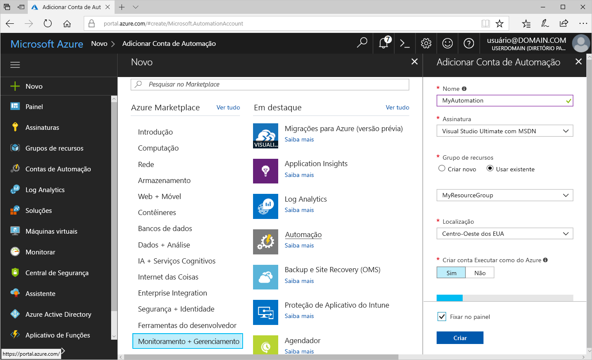
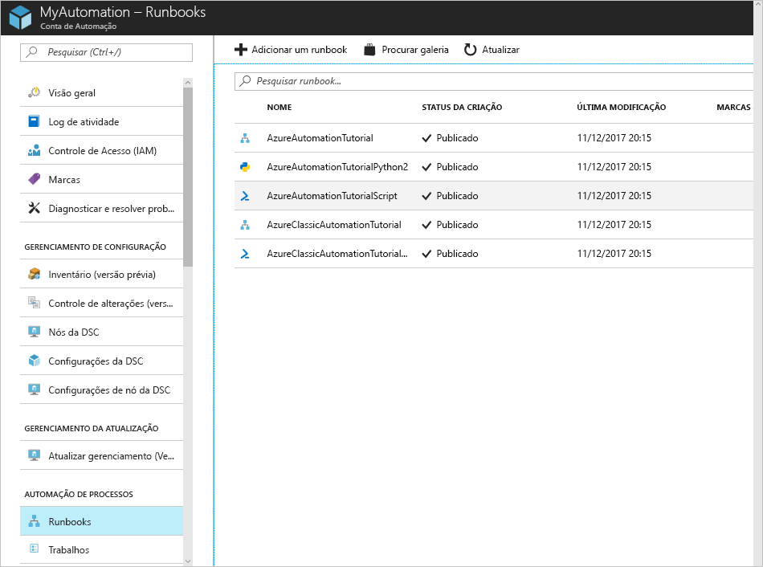
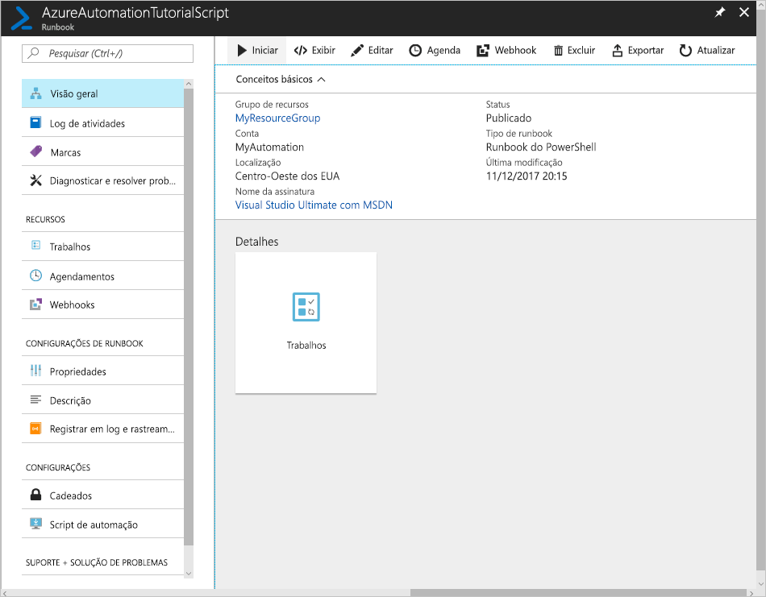

# Criar uma conta de Automação do Azure

As contas de Automação do Azure podem ser criadas por meio do Azure. Esse método fornece uma interface do usuário baseada em navegador para a criação e configuração de contas de Automação e recursos relacionados. Este guia de início rápido segue as etapas para criação de uma conta de Automação e para execução de um runbook na conta.

Caso você não tenha uma assinatura do Azure, crie uma [conta gratuita do Azure](https://azure.microsoft.com/free/?WT.mc_id=A261C142F) antes de começar.

## Fazer logon no Azure

Faça logon no Azure em https://portal.azure.com

## Criar uma conta de Automação

1. Clique no botão **Novo** localizado à esquerda superior do Azure.

1. Selecione **Monitoramento + Gerenciamento** e, em seguida, selecione **Automação**.

1. Insira as informações da conta. Para **Criar conta Executar como do Azure**, escolha **Sim** para que os artefatos que simplificam a autenticação do Azure sejam habilitados automaticamente. Ao concluir, clique em **Criar** para iniciar a implantação da conta de Automação.

      

1. A conta de Automação é fixada no painel do Azure. Quando a implantação é concluída, a visão geral de conta de Automação é aberta automaticamente.

    

## Executar um runbook

Execute um dos runbooks tutoriais.

1. Clique em **Runbooks** em **AUTOMAÇÃO DE PROCESSO**. A lista de runbooks é exibida. Por padrão, vários runbooks tutoriais são habilitados na conta.

    

1. Selecione o runbook **AzureAutomationTutorialScript**. Essa ação abre a página de visão geral do runbook.

    

1. Clique em **Iniciar** e, na página **Iniciar Runbook**, clique em **OK** para iniciar o runbook.

    

1. Após o **Status do trabalho** se tornar **Executando**, clique em **Saída** ou **Todos os Logs** para exibir a saída do trabalho de runbook. Para este runbook tutorial, a saída é uma lista dos seus recursos do Azure.

## Limpar recursos

Quando não for mais necessário, exclua o grupo de recursos, a conta de Automação e todos os recursos relacionados. Para fazer isso, selecione o grupo de recursos da conta de Automação e clique em **Excluir**.

## Próximas etapas

Neste guia de início rápido você implantou uma conta de Automação, iniciou um trabalho de runbook e exibiu os resultados do trabalho. Para saber mais sobre a Automação do Azure, continue para o início rápido para criar seu primeiro runbook.

> [!div class="nextstepaction"]
> [Guia de Início Rápido de Automação – Criar Runbook](./automation-quickstart-create-runbook.md)
