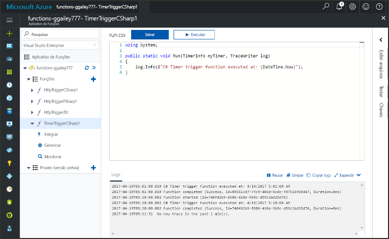

#  Criar uma função no Azure que é disparada por um temporizador

Saiba como usar o Azure Functions para criar uma função que é executada com base em uma agendamento definido por você. 

Deve levar menos de cinco minutos para concluir todas as etapas neste tópico.

## Pré-requisitos 

[!INCLUDE [Previous quickstart note](../../includes/functions-quickstart-previous-topics.md)]

Neste tópico, você pode criar uma função disparada por timer em seu aplicativo de funções existente. 

[!INCLUDE [functions-portal-favorite-function-apps](../../includes/functions-portal-favorite-function-apps.md)] 

## Criar uma função disparada por temporizador

1. Expanda seu aplicativo de funções, clique no botão **+** ao lado de **Funções** e clique no modelo **TimerTrigger** para a linguagem de programação desejada. Use então as configurações especificadas na tabela e, em seguida, clique em **Criar**:

    | Configuração      |  Valor sugerido   | Descrição                              |
    | ------------ |  ------- | -------------------------------------------------- |
    | **Nomeie sua função** | TimerTriggerCSharp1 | Define o nome da sua função disparada por temporizador.
    | **[Agendamento](http://en.wikipedia.org/wiki/Cron#CRON_expression)** | 0 */1 * * * * | Uma [expressão CRON](http://en.wikipedia.org/wiki/Cron#CRON_expression) de seis campos que agenda sua função para ser executada a cada minuto. |

    Uma nova função na linguagem de programação escolhida por você e que é executada a cada minuto é criada. 

4. Verifique a execução, exibindo informações de rastreamento gravadas nos logs. 

    

Agora, você pode alterar o agendamento da função para que ela seja executada com menos frequência, por exemplo, uma vez por hora. 

## Atualizar o agendamento do temporizador

1. Expanda sua função e clique em **Integrar**. É aqui que você define as associações de entrada e saída de sua função e também define o agendamento. 

2. Insira um novo valor de **Agendamento** de `0 0 */1 * * *` e, em seguida, clique em **Salvar**.  

Agora você tem uma função que é executada uma vez a cada hora. 

## Limpar recursos

[!INCLUDE [Next steps note](../../includes/functions-quickstart-cleanup.md)]

## Próximas etapas
Você criou uma função que é executada segundo um agendamento. 

[!INCLUDE [Next steps note](../../includes/functions-quickstart-next-steps.md)]

Para obter mais informações sobre gatilhos de temporizador, consulte [Agendar a execução de código com o Azure Functions](functions-bindings-timer.md). 

