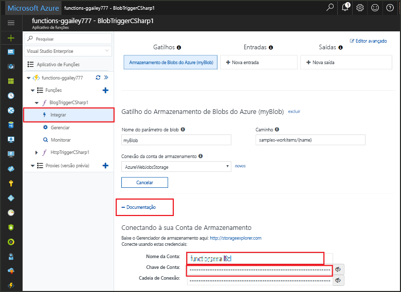
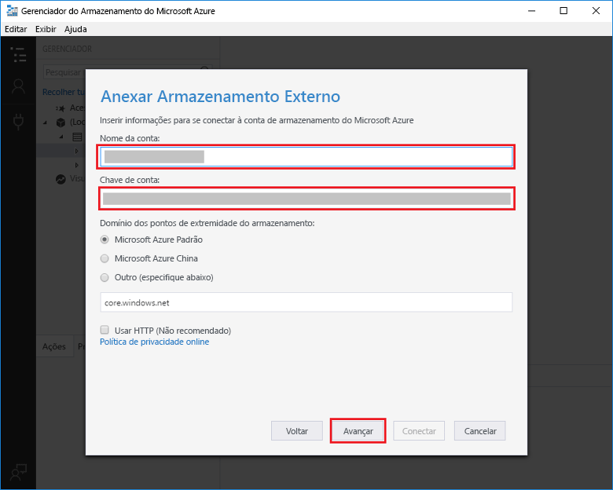
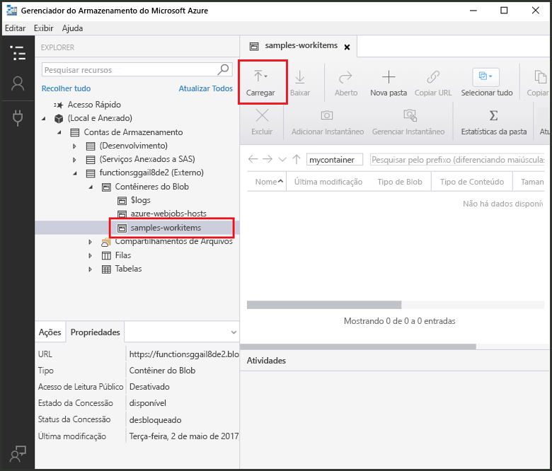

# Criar uma função disparada pelo Armazenamento de Blobs do Azure

Saiba como criar uma função disparada quando arquivos são carregados ou atualizados no Armazenamento de Blobs do Azure.  

Deve levar menos de cinco minutos para concluir todas as etapas neste tópico.

## Pré-requisitos

[!INCLUDE [Previous quickstart note](../../includes/functions-quickstart-previous-topics.md)]

Você também precisa baixar e instalar o [Gerenciador do Armazenamento do Microsoft Azure](http://storageexplorer.com/). 

[!INCLUDE [functions-portal-favorite-function-apps](../../includes/functions-portal-favorite-function-apps.md)] 

## Criar uma função disparada pelo Armazenamento de Blobs

Expanda seu aplicativo de funções, clique no botão **+** ao lado de **Funções**, clique no modelo **BlobTrigger** para a linguagem de programação desejada. Use então as configurações especificadas na tabela e, em seguida, clique em **Criar**.

    
| Configuração      |  Valor sugerido   | Descrição                                        |
| ------------ |  ----------------- | -------------------------------------------------- |
| **Caminho**   | mycontainer/{name}    | Local no Armazenamento de Blobs que está sendo monitorada. O nome do arquivo do blob é passado na associação como o parâmetro _name_.  |
| **Conexão da conta de armazenamento** | AzureWebJobStorage | Você pode usar a conexão da conta de armazenamento que já está sendo usada por seu aplicativo de funções ou criar uma nova.  |
| **Nomeie sua função** | Exclusivo no aplicativo de funções | O nome dessa função disparada por filas. | 

Em seguida, você pode se conectar à sua conta de armazenamento do Azure e criar o contêiner **mycontainer**.

## Criar o contêiner

1. Em sua função, clique em **Integrar**, expanda **Documentação**e copie **Nome da conta** e **Chave de conta**. Você usa essas credenciais para conectar-se à conta de armazenamento. Se você já tiver se conectado à conta de armazenamento, vá para a etapa 4.
 
    

2. Execute a ferramenta [Gerenciador de Armazenamento do Microsoft Azure](http://storageexplorer.com/), clique no ícone conectar-se à esquerda, escolha **Usar um nome e chave de conta de armazenamento** e clique em **Avançar**.

    
    
3. Insira o **Nome da conta** e **Chave de conta** da etapa 1, clique em **Avançar** e em **Conectar**. 
  
    

4. Expanda a conta de armazenamento anexada, clique com o botão direito do mouse em **Contêineres de blob**, clique em **Criar contêiner de blob**, digite `mycontainer` e pressione enter.
 
    

Agora que você tem um contêiner de blob, você pode testar a função carregando um arquivo para o contêiner.  

## Testar a função

1. De volta ao Portal do Azure, navegue até sua função, expanda os **Logs** na parte inferior da página e verifique se o streaming de log não está em pausa.

2. No Gerenciador de Armazenamento, expanda sua conta de armazenamento, **Contêineres de blob** e **mycontainer**. Clique em **Carregar** e depois em **Carregar arquivos...**.

    

2. Na caixa de diálogo **Carregar arquivos**, clique no campo **Arquivos**. Navegue até um arquivo em seu computador local, por exemplo, um arquivo de imagem, selecione-o e clique em **Abrir** e depois em **Carregar**.   
 
3. Volte para os logs de função e verifique se o blob foi lido. 

   

    >[!NOTE]
    > Quando seu aplicativo de funções é executado no plano de consumo padrão, pode haver um atraso de até vários minutos entre o blob que está sendo adicionado ou atualizado e a função sendo disparada. Se você precisar de baixa latência em suas funções disparadas por blob, considere executar seu aplicativo de funções em um Plano do Serviço de Aplicativo. 

## Limpar recursos

[!INCLUDE [Next steps note](../../includes/functions-quickstart-cleanup.md)]

## Próximas etapas

Você criou uma função que é executada quando um blob é adicionado a um Armazenamento de Blobs ou atualizado nele. 

[!INCLUDE [Next steps note](../../includes/functions-quickstart-next-steps.md)]

Para obter mais informações sobre gatilhos de armazenamento de blobs, consulte [Associações de Armazenamento de Blobs do Azure Functions](functions-bindings-storage-blob.md). 

