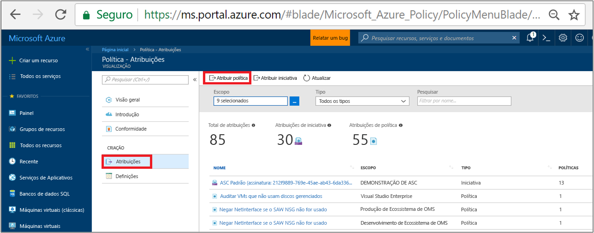
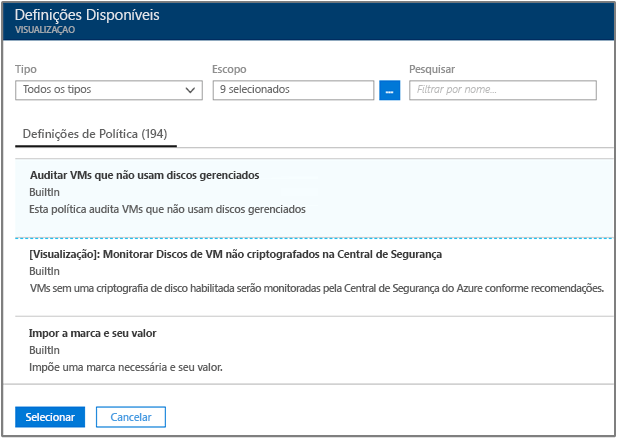
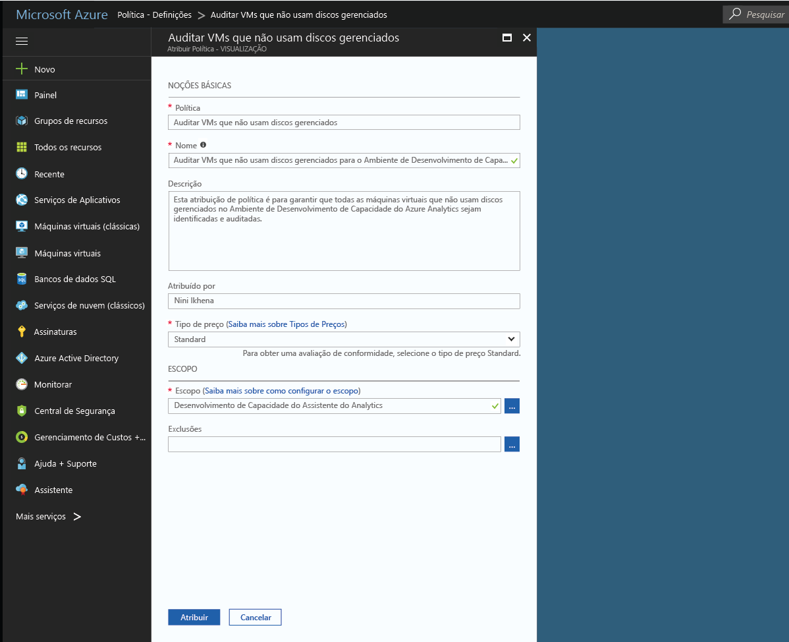
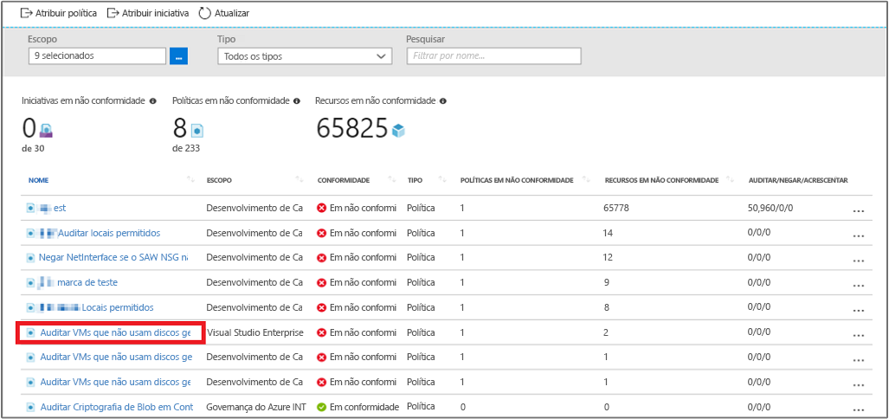
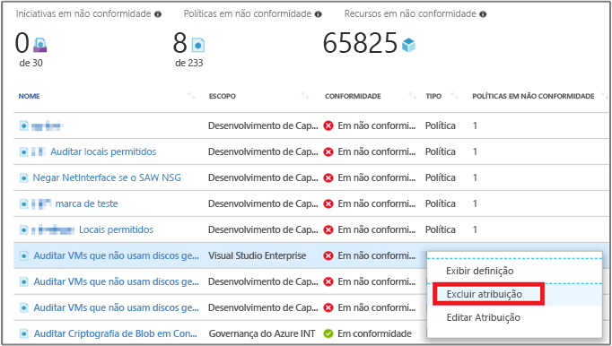

# Criar uma atribuição de política para identificar recursos sem conformidade em seu ambiente do Azure
A primeira etapa para compreender a conformidade no Azure é saber qual é a situação de seus recursos atuais. Este guia de início rápido orienta você no processo de criação de uma atribuição de política para identificar máquinas virtuais que não estão usando discos gerenciados.

No final deste processo, você terá identificado com êxito quais máquinas virtuais não estão usando discos gerenciados e, portanto, *não estão em conformidade*.

Se você não tiver uma assinatura do Azure, crie uma [conta gratuita](https://azure.microsoft.com/free/?WT.mc_id=A261C142F) antes de começar.

## Aceitar a Política do Azure

Agora o Azure Policy está disponível em Visualização Pública e é necessário registrar-se para solicitar acesso.

1. Vá até a Política do Azure em https://aka.ms/getpolicy e selecione **Inscrever-se** no painel esquerdo.

   

2. Aceite a Política do Azure selecionando na lista **Assinatura** as assinaturas com que gostaria de trabalhar. Em seguida, selecione **Registrar**.

   

   Sua solicitação é aprovada automaticamente para versão prévia. Aguarde até 30 minutos para o sistema processar seu registro.

## Criar uma atribuição de política

Neste guia de início rápido, criamos uma atribuição de política e atribuímos a definição da política *Auditar máquinas virtuais sem Managed Disks*.

1. Selecione **Atribuições** no painel esquerdo da página de Política do Azure.
2. Selecione **Atribuir Política** na parte superior do painel **Atribuições**.

   

3. Na página **Atribuir Política**, clique no  ao lado do campo **Política** para abrir a lista de definições disponíveis.

   

   A Política do Azure vem com definições de políticas internas que você pode usar. Você verá definições de políticas internas como:

   - Impor marca e seu valor
   - Aplicar marca e seu valor
   - Requer o SQL Server versão 12.0

4. Pesquise suas definições de política para encontrar a definição *Auditar VMs que não usam discos gerenciados*. Clique na política e clique em **Atribuir**.

   

5. Forneça um **Nome** de exibição para a atribuição de política. Nesse caso, vamos usar *Auditar VMs que não usam discos gerenciados*. Você também pode adicionar uma **Descrição**opcional. A descrição fornece detalhes sobre como essa atribuição de política identifica todas as máquinas virtuais criadas nesse ambiente que não usam discos gerenciados.
6. Altere o tipo de preço para **Standard** para garantir que a política seja aplicada aos recursos existentes.

   Há dois tipos de preço na Política do Azure – *Gratuito* e *Standard*. Com a camada Gratuita, você só pode impor políticas para recursos futuros, enquanto com a Standard, você também pode impô-las para recursos existentes para compreender melhor seu estado de conformidade. Como estamos na versão prévia limitada, ainda não lançamos um modelo de preços, de modo que você não receberá uma fatura por selecionar a opção *Standard*. Para saber mais sobre os preços, veja: [Preços da Política do Azure](https://acom-milestone-ignite.azurewebsites.net/pricing/details/azure-policy/).

7. Selecione o **Escopo** a que você gostaria que a política fosse aplicado.  Um escopo determina em quais recursos ou agrupamento de recursos a atribuição de política é imposta. Pode variar de uma assinatura a grupos de recursos.
8. Selecione a assinatura (ou grupo de recursos) que você registrou anteriormente quando aceitou a Política do Azure. Neste exemplo, estamos usando esta assinatura – **Azure Analytics Capacity Dev**, mas suas opções serão diferentes.

   

9. Selecione **Atribuir**.

Agora, você está pronto para identificar recursos sem conformidade para compreender o estado de conformidade de seu ambiente.

## Identificar recursos sem conformidade

Selecione **Conformidade** no painel esquerdo e pesquise a atribuição de política criada por você.

Se houver recursos sem conformidade com essa nova atribuição, eles aparecerão na guia **Recursos sem conformidade**.

Se uma condição for avaliada em recursos existentes e seu resultado for true para alguns deles, esses recursos serão marcados como sem conformidade com a política. Veja uma tabela de como as ações diferentes que temos disponíveis atualmente funcionam com o resultado da avaliação da condição e com o estado de conformidade de seus recursos.

|Recurso  |Se a condição na política for avaliada como  |Ação na política   |Estado de conformidade  |
|-----------|---------|---------|---------|
|Exists     |Verdadeiro     |NEGAR     |Sem conformidade |
|Exists     |Falso    |NEGAR     |Em conformidade     |
|Exists     |Verdadeiro     |Acrescentar   |Sem conformidade |
|Exists     |Falso    |Acrescentar   |Em conformidade     |
|Exists     |Verdadeiro     |Audit    |Sem conformidade |
|Exists     |Falso    |Audit    |Sem conformidade |

## Limpar recursos

Outros guias desta coleção dão continuidade a este guia de início rápido. Se você planeja continuar trabalhando com os tutoriais subsequentes, não limpe os recursos criados neste guia de início rápido. Caso contrário, siga estas etapas para excluir todos os recursos criados por esse início rápido no Portal do Azure.
1. Selecione **Atribuições** no painel esquerdo.
2. Pesquise pela atribuição que você acabou de criar.

   

3.  Selecione **Excluir Atribuição**.

## Próximas etapas

Neste guia de início rápido, você atribuiu uma definição de política a um escopo para garantir que todos os recursos nesse escopo estejam em conformidade e para identificar quais não são.

Para saber mais sobre a atribuição de políticas, para garantir que recursos que você criar no **futuro** estejam em conformidade, continue com o tutorial:

> [!div class="nextstepaction"]
> [Criando e gerenciando políticas](./create-manage-policy.md)
