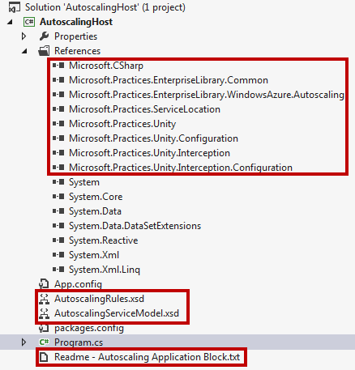
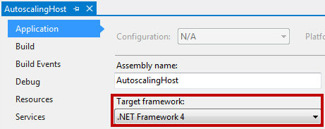
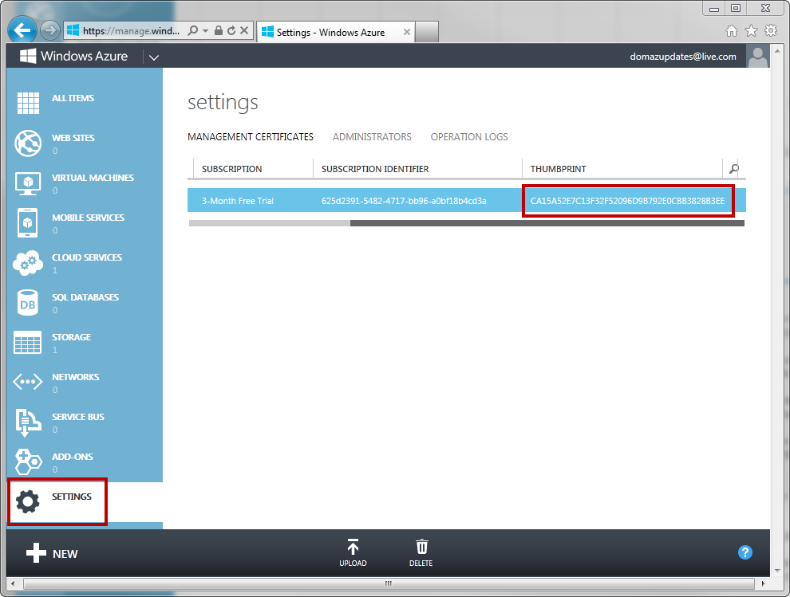
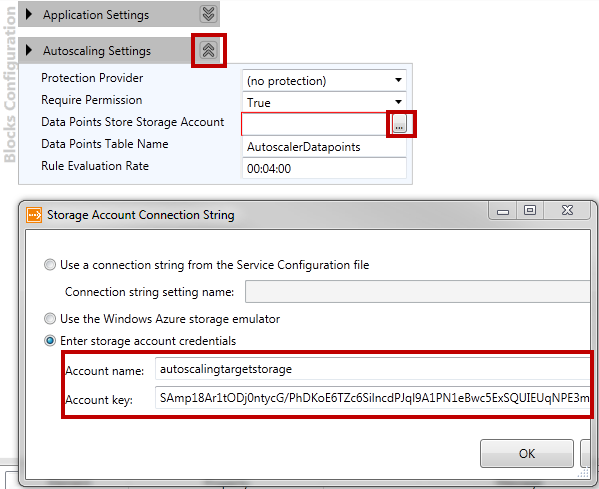
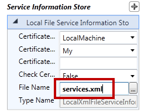

<properties urlDisplayName="Autoscaling" pageTitle="Usar o bloco de aplicativos de dimensionamento automático (.NET) - Azure" metaKeywords="Azure autoscaling, Azure autoscaling C#, Azure autoscaling .NET" description="Saiba como usar o Aplicativo de Dimensionamento Automático para Azure. Os exemplos de código são escritos em C# e usam a API .NET." metaCanonical="" services="cloud-services" documentationCenter=".NET" title="How to Use the Autoscaling Application Block" authors="rasquill" solutions="" manager="timlt" editor="" />

<tags ms.service="cloud-services" ms.workload="tbd" ms.tgt_pltfrm="na" ms.devlang="dotnet" ms.topic="article" ms.date="11/14/2014" ms.author="rasquill" />

# Como usar o Bloco de Aplicativos de Dimensionamento Automático

Este guia demonstrará como executar cenários comuns usando o Bloco de Aplicativos de Dimensionamento Automático do [Pacote de Integração do Microsoft Enterprise Library 5.0 para Azure][Pacote de Integração do Microsoft Enterprise Library 5.0 para Azure]. Os exemplos são escritos em C\# e usam a API .NET. Os cenários abordados incluem **hospedagem do bloco**, **uso de regras de restrição** e **uso de regras reativas**. Para obter mais informações sobre o Bloco de Aplicativos de Dimensionamento Automático, consulte a seção [Próximas etapas][Próximas etapas].

## Sumário

[O que é o Bloco de Aplicativos de Dimensionamento Automático?][O que é o Bloco de Aplicativos de Dimensionamento Automático?]   
 [Conceitos][Conceitos]   
 [Coletar dados do contador de desempenho do seu aplicativo do Azure de destino][Coletar dados do contador de desempenho do seu aplicativo do Azure de destino]   
 [Configurar um aplicativo host para o Bloco de Aplicativos de Dimensionamento Automático][Configurar um aplicativo host para o Bloco de Aplicativos de Dimensionamento Automático]   
 [Como: Instanciar e executar o Dimensionador Automático][Como: Instanciar e executar o Dimensionador Automático] [Como: Definir seu modelo de serviço][Como: Definir seu modelo de serviço]   
 [Como: Definir suas regras de dimensionamento automático][Como: Definir suas regras de dimensionamento automático]   
 [Como: Configurar o Bloco de Aplicativos de Dimensionamento Automático][Como: Configurar o Bloco de Aplicativos de Dimensionamento Automático]   
 [Próximas etapas][Próximas etapas]

## O que é o Bloco de Aplicativos de Dimensionamento Automático?

O Bloco de Aplicativos de Dimensionamento Automático pode dimensionar seu aplicativo do Microsoft Azure automaticamente com base nas regras que você definir especificamente para seu aplicativo. Você pode usar essas regras para ajudar seu aplicativo do Azure a manter sua taxa de transferência em resposta a alterações em sua carga de trabalho e, ao mesmo tempo, controlar os custos associados à hospedagem de seu aplicativo no Azure. Junto com o dimensionamento, aumentando ou diminuindo o número de instâncias de função de seu aplicativo, o bloco também permite que você use outras ações de dimensionamento, como a limitação de determinada funcionalidade dentro de seu aplicativo ou o uso de ações personalizadas.

Você pode optar por hospedar o bloco em uma função do Azure ou em um aplicativo local. 
O Bloco de Aplicativos de Dimensionamento Automático faz parte do [Pacote de Integração da Microsoft Enterprise Library 5.0 para Azure][Pacote de Integração da Microsoft Enterprise Library 5.0 para Azure].

## Conceitos

No diagrama a seguir, a linha verde mostra um gráfico do número de instâncias de uma função do Azure em execução por dois dias. O número de instâncias é alterado automaticamente com o tempo em resposta a um conjunto de regras de dimensionamento automático.

O bloco usa dois tipos de regras para definir o comportamento do dimensionamento automático para seu aplicativo:

-   **Regras de restrição:** Para definir os limites superior e inferior do número de instâncias, por exemplo, digamos que entre 8h e 10h todas as manhãs você deseje um mínimo de quatro e um máximo de seis instâncias, assim, você usará uma **regra de restrição**. No diagrama, as linhas em vermelho e azul representam as regras de restrição. Por exemplo, no ponto **A** no diagrama, o número mínimo de instâncias de função aumenta de dois para quatro, para acomodar o aumento previsto da carga de trabalho do aplicativo neste momento.No ponto **B** no diagrama, o número de instâncias de função é impedido de aumentar para mais de cinco para controlar os custos de execução do aplicativo.

-   **Regras reativas:**  Para habilitar que o número de instâncias de função seja alterado em resposta a alterações repentinas na demanda, use as **regras reativas**. No ponto **C** no diagrama, o bloco reduz automaticamente o número de instâncias de função, de quatro para três, em resposta a uma redução da carga de trabalho. No ponto **D**, o bloco detecta um aumento na carga de trabalho e aumenta automaticamente o número de instâncias de funções em execução de três para quatro.

O bloco armazena seus parâmetros de configuração em dois repositórios:

-   **Repositório de Regras:** O Repositório de Regras contém suas configurações de negócios; uma lista de todas as regras de dimensionamento automático que você definiu para seu aplicativo do Azure.Esse repositório normalmente é um arquivo XML que está localizado onde o Bloco de Aplicativos de Dimensionamento Automático possa lê-lo, por exemplo, no armazenamento de blob do Azure ou em um arquivo local.

-   **Repositório de Informações do Serviço:** O Repositório de Informações do Serviço armazena suas configurações operacionais, que é o modelo de serviço de seu aplicativo do Azure.Esse modelo de serviço inclui todas as informações sobre seu aplicativo do Azure (como nomes de funções e detalhes da conta de armazenamento) de que o bloco precisa ser capaz de coletar pontos de dados do aplicativo do Azure de destino e executar operações de dimensionamento.

## Coletar Dados do Contador de Desempenho do seu aplicativo do Azure de destino

As regras reativas podem usar dados do contador de desempenho das funções como parte da definição da regra. Por exemplo, uma regra reativa pode monitorar a utilização da CPU de uma função do Azure para determinar se o bloco deve iniciar uma operação de dimensionamento. O bloco lê os dados do contador de desempenho da tabela do Diagnóstico do Azure denominada **WADPerformanceCountersTable** no armazenamento do Azure.

Por padrão, o Azure não grava dados do contador de desempenho na tabela de Diagnóstico do Azure no armazenamento do Azure. Portanto, você deve modificar as funções das quais precisa coletar dados do contador de desempenho para salvar esses dados. Para obter detalhes sobre como habilitar os contadores de desempenho em seu aplicativo, consulte[Usando contadores de desempenho no Azure][Usando contadores de desempenho no Azure].

## Configurar um aplicativo host para o Bloco de Aplicativos de Dimensionamento Automático

Você pode hospedar o Bloco de Aplicativos de Dimensionamento Automático em uma função do Azure ou em um aplicativo local. O Bloco de Aplicativos de Dimensionamento Automático normalmente é hospedado em um aplicativo separado do aplicativo de destino que você deseja dimensionar automaticamente. Esta seção fornece as diretrizes de como configurar seu aplicativo host.

### Obtenha o pacote NuGet de Bloco de Aplicativos de Dimensionamento Automático

Antes de usar o Bloco de Aplicativos de Dimensionamento Automático em seu projeto do Visual Studio, você precisa obter os binários do Bloco de Aplicativos de Dimensionamento Automático e adicionar referências a eles em seu projeto. A extensão para Visual Studio do NuGet facilita a instalação e a atualização de bibliotecas e ferramentas no Visual Studio e no Visual Web Developer. O pacote NuGet para o Bloco de Aplicativos de Dimensionamento Automático é a maneira mais fácil de obter as APIs do Bloco de Aplicativos de Dimensionamento Automático. Para obter mais informações sobre o **NuGet** e sobre como instalar e usar a extensão **NuGet** para Visual Studio, consulte o site do [NuGet][NuGet].

Após o Gerenciador de Pacotes NuGet estar instalado, faça o seguinte para instalar o pacote NuGet para Dimensionamento Automático em seu aplicativo:

1.  Abra a janela **Console do Gerenciador de Pacotes NuGet**. No menu **Ferramentas**, selecione **Gerenciador de Pacotes da Biblioteca** e **Console do Gerenciador de Pacotes**.

2.  Digite o comando a seguir na janela do Console do Gerenciador de Pacotes NuGet:

        PM> Install-Package EnterpriseLibrary.WindowsAzure.Autoscaling

A instalação do pacote NuGet atualiza o projeto com todos os assemblies e referências necessários de que você precisa para usar o Bloco de Aplicativos de Dimensionamento Automático. Seu projeto agora inclui os arquivos de esquema XML para as definições de regras de dimensionamento automático e informações do serviço de dimensionamento automático. O projeto agora também inclui um arquivo Leiame que contém informações importantes sobre o Bloco de Aplicativos de Dimensionamento Automático:

### Definir a estrutura de destino para o .NET Framework 4

Seu projeto deve ter como destino o .NET Framework 4. Para alterar ou verificar a estrutura de destino:

1.  No Gerenciador de Soluções, clique com o botão direito do mouse no nome do projeto e selecione **Propriedades**.

2.  Na guia **Aplicativo** da janela Propriedades, defina a estrutura de Destino como **.NET Framework 4**.

	

### Adicionar referências de namespace

Adicione as seguintes declarações de namespace do código à parte superior de qualquer arquivo C\# no qual você deseja acessar o Bloco de Aplicativos de Dimensionamento Automático de maneira programática:

    using Microsoft.Practices.EnterpriseLibrary.Common.Configuration;
    using Microsoft.Practices.EnterpriseLibrary.WindowsAzure.Autoscaling;

## Como: Instanciar e executar o Dimensionador Automático

Use o método **IServiceLocator.GetInstance** para instanciar o
Dimensionador Automático, e chame o método **Autoscaler.Start** para executar o
**Dimensionador Automático**.

    Autoscaler scaler =
        EnterpriseLibraryContainer.Current.GetInstance<Autoscaler>();
    scaler.Start();

## Como: Definir seu modelo de serviço

Normalmente, você armazena seu modelo de serviço (uma descrição do seu ambiente do Microsoft Azure que inclui informações sobre assinaturas, serviços hospedados, funções e contas de armazenamento) em um arquivo XML. Você pode localizar uma cópia do esquema desse arquivo XML no arquivo **AutoscalingServiceModel.xsd** em seu projeto. No Visual Studio, esse esquema fornece IntelliSense e validação quando você edita o arquivo XML de modelo de serviço.

Crie um novo arquivo XML denominado **services.xml** em seu projeto.

No Visual Studio, você deve garantir que o arquivo de modelo de serviço seja copiado
na pasta de saída. Para fazer isso:

1.  Clique com o botão direito do mouse no arquivo e selecione **Propriedades**.

2.  No painel Propriedades, defina o valor de **Copiar para Diretório de Saída**
    como **Copiar sempre**.

    

	O exemplo de código a seguir mostra um modelo de serviço de exemplo em um arquivo **services.xml**:

    	<?xml version="1.0" encoding="utf-8" ?>
    	<serviceModel xmlns="http://schemas.microsoft.com/practices/2011/entlib/autoscaling/serviceModel">
      	<subscriptions>
        	<subscription name="[subscriptionname]"
                      	certificateThumbprint="[managementcertificatethumbprint]"
                      	subscriptionId="[subscriptionid]"
                      	certificateStoreLocation="CurrentUser"
                      	certificateStoreName="My">
          	<services>
            	<service dnsPrefix="[hostedservicednsprefix]" slot="Staging">
              	<roles>
                	<role alias="AutoscalingApplicationRole"
                      	roleName="[targetrolename]"
                      	wadStorageAccountName="targetstorage"/>
              	</roles>
            	</service>
          	</services>
          	<storageAccounts>
            	<storageAccount alias="targetstorage"
              	connectionString="DefaultEndpointsProtocol=https;AccountName=[storageaccountname];AccountKey=[storageaccountkey]">
            	</storageAccount>
          	</storageAccounts>
        	</subscription>
      	</subscriptions>
    	</serviceModel>

Você deve substituir os valores entre colchetes por valores específicos
ao seu ambiente e ao aplicativo de destino. Para encontrar muitos desses valores,
faça logon no [Portal de Gerenciamento do Azure][Portal de Gerenciamento do Azure].

Entre no Portal de Gerenciamento.

-   **[subscriptionname]:**Escolha um nome amigável para referir-se à assinatura do Azure que contém o aplicativo em que você deseja usar o dimensionamento automático.

-   **[subscriptionid]:**A ID exclusiva da assinatura do Azure que contém o aplicativo em que você deseja usar o dimensionamento automático.

    1.  No Portal de Gerenciamento do Azure, clique em
        **Serviços de Nuvem**.

    2.  Na lista de Serviços de Nuvem, clique no serviço que hospeda o aplicativo em que você deseja usar o dimensionamento automático. O painel Visão Rápida à direita exibirá a **ID de Assinatura**.

        

  
	-   **[hostedservicednsprefix]:**O Prefixo DNS do serviço hospedado em que você deseja usar o dimensionamento automático.

    1.  No Portal de Gerenciamento do Azure, clique em **Serviços de Nuvem**. 
    2.  Na lista de Serviços de Nuvem, localize o serviço que hospeda o aplicativo em que você deseja usar o dimensionamento automático. O nome do serviço de nuvem é o **Prefixo DNS**.

        
 
	-   **[targetrolename]:**O nome da função que é o destino de suas regras de dimensionamento automático.

    1.  No Portal de Gerenciamento do Azure, clique em **Serviços de Nuvem**.

    2.  Na lista de Serviços de Nuvem, clique no serviço que hospeda o aplicativo em que você deseja usar o dimensionamento automático e clique em **Instâncias**. A coluna **Função* exibe o nome da sua função de destino.

        

	-   **[storageaccountname]** e **[storageaccountkey]:**O nome da conta de armazenamento do Azure que você está usando para o seu aplicativo do Azure de destino.

    1.  No Portal de Gerenciamento do Azure, clique em **Armazenamento**.

    2.  Na lista de Contas de Armazenamento, selecione a conta de armazenamento que você está usando. A coluna **Nome** exibirá o **Nome**.

    3.  Clique no botão **Gerenciar chaves** na parte inferior da tela para obter a chave de acesso primário.

        
  
 
	-   **[managementcertificatethumbprint]:**  A **Impressão Digital** do Certificado de Gerenciamento que o bloco usará para proteger as solicitações de dimensionamento no aplicativo de destino.

    1.  No Portal de Gerenciamento do Azure, clique em **Configurações**.

    2.  A coluna **Impressão Digital** exibirá a **Impressão Digital**.

        
 

Para saber mais sobre o conteúdo do arquivo de modelo de serviço, consulte [Armazenando seus dados de informações de serviço][Armazenando seus dados de informações de serviço].

## Como: Definir suas regras de dimensionamento automático

Normalmente, você armazena as regras de dimensionamento automático que controlam o número de instâncias de função em seu aplicativo de destino em um arquivo XML. Você pode localizar uma cópia do esquema desse arquivo XML no arquivo **AutoscalingRules.xsd** em seu projeto.No Visual Studio, esse esquema fornece IntelliSense e validação quando você edita o arquivo XML.

Crie um novo arquivo XML denominado **rules.xml** em seu projeto.

No Visual Studio, você deve garantir que o arquivo de regras seja copiado na pasta de saída. Para fazer isso:

1.  Clique com o botão direito do mouse no arquivo e selecione **Propriedades**.

2.  No painel Propriedades, defina o valor de **Copiar para Diretório de Saída** como **Copiar sempre**.

O exemplo de código a seguir mostra uma regra de exemplo definida em um arquivo **rules.xml**
:

    <?xml version="1.0" encoding="utf-8" ?>
    <rules xmlns="http://schemas.microsoft.com/practices/2011/entlib/autoscaling/rules">
      <constraintRules>
        <rule name="default" enabled="true" rank="1" description="The default constraint rule">
          <actions>
            <range min="2" max="6" target="AutoscalingApplicationRole"/>
          </actions>
        </rule>
      </constraintRules>
      <reactiveRules>
        <rule name="ScaleUpOnHighUtilization" rank="10" description="Scale up the web role" enabled="true" >
          <when>
            <any>
               <greaterOrEqual operand="WebRoleA_CPU_Avg_5m" than="60"/>
            </any>
          </when>
          <actions>
            <scale target="AutoscalingApplicationRole" by="1"/>
          </actions>
        </rule>
        <rule name="ScaleDownOnLowUtilization" rank="10" description="Scale up the web role" enabled="true" >
          <when>
            <all>
              <less operand="WebRoleA_CPU_Avg_5m" than="60"/>
            </all>
          </when>
          <actions>
            <scale target="AutoscalingApplicationRole" by="-1"/>
          </actions>
        </rule>
      </reactiveRules>
      <operands>
        <performanceCounter alias="WebRoleA_CPU_Avg_5m"
          performanceCounterName="\Processor(_Total)\% Processor Time"
          source ="AutoscalingApplicationRole"
          timespan="00:05:00" aggregate="Average"/>
      </operands>
    </rules>

Nesse exemplo, há três regras de dimensionamento automático (uma **regra de restrição** e duas **regras reativas**) que operam em um destino chamado **AutoscalingApplicationRole** que é o alias de uma função definida no **modelo de serviço**:

-   A regra de restrição está sempre ativa e define o número mínimo de instâncias de função como dois e o número máximo de instâncias de função como seis.

-   As duas regras reativas usam um **operando** chamado **WebRoleA\_CPU\_Avg\_5m** que calcula o uso médio da CPU nos últimos cinco minutos para uma função do Azure chamada **AutoscalingApplicationRole.** Esta função está definida no **modelo de serviço**.

-   A regra reativa chamada **ScaleUpOnHighUtilization** incrementa a contagem de instâncias da função de destino por um se a utilização média da CPU nos últimos cinco minutos tiver sido maior ou igual a 60%.

-   A regra reativa chamada **ScaleDownOnLowUtilization** reduzirá a contagem de instâncias da função de destino em um se a utilização média da CPU nos últimos cinco minutos tiver sido menor ou igual a 60%.

## Como: Configurar o Bloco de Aplicativos de Dimensionamento Automático

Após ter definido seu modelo de serviço e as regras de dimensionamento automático, você deverá configurar o Bloco de Aplicativos de Dimensionamento Automático para usá-los. Essas informações de configuração operacionais são armazenadas no arquivo de configuração de aplicativo.

Por padrão, o Bloco de Aplicativos de Dimensionamento Automático espera que as regras de dimensionamento automático e o modelo de serviço estejam armazenados em blobs do Azure. Neste exemplo, você configurará o bloco para carregá-los por meio do sistema de arquivos local.

### Configurar o Bloco de Aplicativos de Dimensionamento Automático no aplicativo host

1.  Clique com o botão direito do mouse no arquivo **App.config** no Gerenciador de Soluções e, em seguida, clique em **Editar o Arquivo de Configuração**.

2.   No menu **Blocos**, clique em **Adicionar Configurações de Dimensionamento Automático**:  
	
  
3.  Expanda as **Configurações de Dimensionamento Automático** e, em seguida, clique nas reticências (...)     ao lado de **Conta de Armazenamento do Repositório de Pontos de Dados**, adicione o **Nome da conta** e a **Chave da conta** da conta de armazenamento do Azure na qual o bloco armazenará os pontos que coletar (consulte [Como: Defina seu modelo de serviço][Como: Defina seu modelo de serviço] se não tiver certeza quanto a onde localizar esses valores) e, em seguida, clique em **OK**:  

	

4.  Expanda a seção **Configurações do Dimensionamento Automático** para revelar as seções **Repositório de Regras** e **Repositório de Informações do Serviço**.  Por padrão, eles são configurados para usar o Armazenamento de Blob do Azure:  
	

5.  Clique no sinal de adição (+) ao lado de **Repositório de Regras**, aponte para **Definir Repositório de Regras**, clique em **Usar Repositório de Regras de Arquivo Local** e, em seguida, clique em **Sim**.

6.  Na caixa **Nome do Arquivo**, digite **rules.xml**.  Esse é o nome do arquivo que contém as regras de dimensionamento automático:  
	

7.  Clique no sinal de adição (+) ao lado de **Repositório de Informações de Serviço**, aponte para **Definir Repositório de Informações de Serviço**, clique em **Usar Repositório de Informações de Serviço de Arquivo Local** e, em seguida, clique em **Sim**.

8.  Na caixa **Nome do Arquivo**, digite **services.xml**.  Esse é o nome do arquivo que contém as regras de dimensionamento automático:  
	

9.  Na janela Configuração da Enterprise Library, no menu **Arquivo**, clique em **Salvar** para salvar as alterações na configuração. Em seguida, na janela Configuração da Enterprise Library, no menu **Arquivo**, clique em **Sair**.

Para obter informações detalhadas sobre as ações que o Bloco de Aplicativos de Dimensionamento Automático está executando, você precisa capturar as mensagens do log que ele grava. Por exemplo, se estiver hospedando o bloco em um aplicativo de console, você poderá exibir as mensagens de log na janela de Saída no Visual Studio. A seção a seguir mostra como configurar esse comportamento.

### Configurar o registro em log no aplicativo host Bloco de Aplicativos de Dimensionamento Automático

1.  No Visual Studio, clique duas vezes no arquivo **App.config** no Gerenciador de Soluções para abri-lo no editor. Em seguida, adicione a seção **system.diagnostics** conforme demonstrado no exemplo a seguir:

        <?xml version="1.0" encoding="utf-8" ?>
        <configuration>
          ...
          <system.diagnostics>
            <sources>
              <sourcename="Autoscaling General" switchName="SourceSwitch" switchType="System.Diagnostics.SourceSwitch" />
              <sourcename="Autoscaling Updates" switchName="SourceSwitch" switchType="System.Diagnostics.SourceSwitch" />
            </sources>
            <switches>
              <addname="SourceSwitch" value="Verbose, Information, Warning, Error, Critical" />
            </switches>
          </system.diagnostics>
        </configuration>

2.  Salve suas alterações.

Agora, você pode executar o aplicativo de console do host do Bloco de Aplicativos de Dimensionamento Automático e observar como as regras de dimensionamento automático funcionam com seu aplicativo Azure de destino. Ao executar o aplicativo de console do host, você deverá ver mensagens semelhantes às seguintes na janela de Saída no Visual Studio. Essas mensagens de log ajudarão você a compreender o comportamento do bloco. Por exemplo, elas indicam quais regras estão sendo correspondidas pelo bloco e quais ações o bloco está tomando.

    Autoscaling General Verbose: 1002 : Rule match.
    [BEGIN DATA]{"EvaluationId":"6b27dfa0-b671-44a3-adf1-bb1e0b7c3726",
    "MatchingRules":[{"RuleName":"default","RuleDescription":"The default constraint rule",
    "Targets":["AutoscalingApplicationRole"]},{"RuleName":"ScaleUp","RuleDescription":"Scale up the web role",
    "Targets":[]},{"RuleName":"ScaleDown","RuleDescription":"Scale up the web role","Targets":[]}]}

    Autoscaling Updates Verbose: 3001 : The current deployment configuration for a hosted service is about to be checked
    to determine if a change is required (for role scaling or changes to settings).
    [BEGIN DATA]{"EvaluationId":"6b27dfa0-b671-44a3-adf1-bb1e0b7c3726",
    "HostedServiceDetails":{"Subscription":"AutoscalingHowTo","HostedService":"autoscalingtarget",
    "DeploymentSlot":"Staging"},"ScaleRequests":{"AutoscalingApplicationRole":{"Min":2,"Max":6,"AbsoluteDelta":0,
    "RelativeDelta":0,"MatchingRules":"default"}},"SettingChangeRequests":{}}

    Autoscaling Updates Verbose: 3003 : Role scaling requests for hosted service about to be submitted.
    [BEGIN DATA]{"EvaluationId":"6b27dfa0-b671-44a3-adf1-bb1e0b7c3726",
    "HostedServiceDetails":{"Subscription":"AutoscalingHowTo","HostedService":"autoscalingtarget",
    "DeploymentSlot":"Staging"},
    "ScaleRequests":{"AutoscalingApplicationRole":
    {"Min":2,"Max":6,"AbsoluteDelta":0,"RelativeDelta":0,"MatchingRules":"default"}},
    "SettingChangeRequests":{},"InstanceChanges":{"AutoscalingApplicationRole":{"CurrentValue":1,"DesiredValue":2}},
    "SettingChanges":{}}

    Autoscaling Updates Information: 3002 : Role configuration changes for deployment were submitted.
    [BEGIN DATA]{"EvaluationId":"6b27dfa0-b671-44a3-adf1-bb1e0b7c3726",
    "HostedServiceDetails":{"Subscription":"AutoscalingHowTo","HostedService":"autoscalingtarget",
    "DeploymentSlot":"Staging"},"ScaleRequests":{"AutoscalingApplicationRole":{"Min":2,"Max":6,"AbsoluteDelta":0,
    "RelativeDelta":0,"MatchingRules":"default"}},"SettingChangeRequests":{},
    "InstanceChanges":{"AutoscalingApplicationRole":{"CurrentValue":1,"DesiredValue":2}},
    "SettingChanges":{},"RequestID":"f8ca3ada07c24559b1cb075534f02d44"}

## Próximas etapas

Agora que você aprendeu os conceitos básicos de como usar o Bloco de Aplicativos de Dimensionamento Automático, siga estes links para saber como implementar cenários de dimensionamento automático mais complexos:

-   [Hospedando o Bloco de Aplicativos de Dimensionamento Automático em uma função de trabalho][Hospedando o Bloco de Aplicativos de Dimensionamento Automático em uma função de trabalho]
-   [Implementando comportamento de limitação][Implementando comportamento de limitação]
-   [Compreendendo as classificações e a reconciliação das regras][Compreendendo as classificações e a reconciliação das regras]
-   [Estendendo e modificando o Bloco de Aplicativos de Dimensionamento Automático][Estendendo e modificando o Bloco de Aplicativos de Dimensionamento Automático]
-   [Usando o Estabilizador de Otimização para evitar oscilação de alta frequência e otimizar os custos][Usando o Estabilizador de Otimização para evitar oscilação de alta frequência e otimizar os custos]
-   [Usando notificações e redimensionamento manual][Usando notificações e redimensionamento manual]
-   [Definindo grupos de escala][Definindo grupos de escala]
-   [Usando os WASABiCmdlets para manipular o bloco via Windows PowerShell][Usando os WASABiCmdlets para manipular o bloco via Windows PowerShell]
-   [Guia do desenvolvedor para o Pacote de Integração da Enterprise Library 5.0 para Azure][Guia do desenvolvedor para o Pacote de Integração da Enterprise Library 5.0 para Azure]
-   [Como o Sage reduz os custos de hospedagem do Azure usando dimensionamento automático][Como o Sage reduz os custos de hospedagem do Azure usando dimensionamento automático]
-   [Reduzindo os custos de hospedagem do TechNet e do MSDN e o impacto ambiental com o dimensionamento automático no Azure][Reduzindo os custos de hospedagem do TechNet e do MSDN e o impacto ambiental com o dimensionamento automático no Azure]

  [Pacote de Integração da Microsoft Enterprise Library 5.0 para Azure]:
    http://go.microsoft.com/fwlink/?LinkID=235134
  [Próximas etapas]: #NextSteps
  [O que é o Bloco de Aplicativos de Dimensionamento Automático?]: #WhatIs
  [Conceitos]: #Concepts
  [Coletar dados do contador de desempenho do seu aplicativo do Azure de destino]: #PerfCounter
  [Configurar um aplicativo host para o Bloco de Aplicativos de Dimensionamento Automático]: #CreateHost
  [Como: Instanciar e executar o Dimensionador Automático]: #Instantiate
  [Como: Definir seu modelo de serviço]: #DefineServiceModel
  [Como: Configurar o Bloco de Aplicativos de Dimensionamento Automático]: #Configure
  [Usando contadores de desempenho no Azure]: http://www.windowsazure.com/pt-br/develop/net/common-tasks/performance-profiling/
  [NuGet]: http://nuget.org/
  [Portal de Gerenciamento do Azure]: http://manage.windowsazure.com
  [Hospedando o Bloco de Aplicativos de Dimensionamento Automático em uma função de trabalho]: http://msdn.microsoft.com/pt-br/library/hh680914(PandP.50).aspx
  [Implementando comportamento de limitação]: http://msdn.microsoft.com/pt-br/library/hh680896(PandP.50).aspx
  [Compreendendo as classificações e a reconciliação das regras]: http://msdn.microsoft.com/pt-br/library/hh680923(PandP.50).aspx
  [Estendendo e modificando o Bloco de Aplicativos de Dimensionamento Automático]: http://msdn.microsoft.com/pt-br/library/hh680889(PandP.50).aspx
  [Usando o Estabilizador de Otimização para evitar oscilação de alta frequência e otimizar os custos]: http://msdn.microsoft.com/pt-br/library/hh680951(PandP.50).aspx
  [Usando notificações e redimensionamento manual]: http://msdn.microsoft.com/pt-br/library/hh680885(PandP.50).aspx
  [Definindo grupos de escala]: http://msdn.microsoft.com/pt-br/library/hh680902(PandP.50).aspx
  [Usando os WASABiCmdlets para manipular o bloco via Windows PowerShell]: http://msdn.microsoft.com/pt-br/library/hh680938(PandP.50).aspx
  [Guia do desenvolvedor para o Pacote de Integração da Enterprise Library 5.0 para Azure]: http://msdn.microsoft.com/pt-br/library/hh680949(PandP.50).aspx
  [Como o Sage reduz os custos de hospedagem do Azure usando dimensionamento automático]: http://msdn.microsoft.com/pt-br/library/jj838716(PandP.50).aspx
  [Reduzindo os custos de hospedagem do TechNet e do MSDN e o impacto ambiental com o dimensionamento automático no Azure]: http://msdn.microsoft.com/pt-br/library/jj838718(PandP.50).aspx
  [Como: Definir suas regras de dimensionamento automático]: #DefineAutoscalingRules

<!--HONumber=35.1-->
