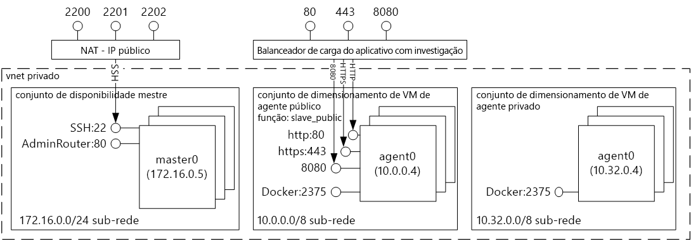
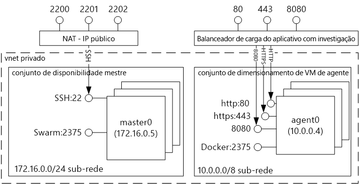

# Introdução às soluções de hospedagem de contêineres do Docker com o Serviço de Contêiner do Azure 
O Serviço de Contêiner do Azure simplifica a criação, a configuração e o gerenciamento de um cluster de máquinas virtuais que são pré-configuradas para executar os aplicativos contidos. Ele usa uma configuração otimizada de ferramentas populares de agendamento de software livre e de orquestração. Isso permite que você use suas habilidades existentes ou explore uma experiência cada vez maior da comunidade para implantar e gerenciar aplicativos baseados em contêiner no Microsoft Azure.

O Serviço de Contêiner do Azure utiliza o formato de contêiner do Docker para garantir que os contêineres de seu aplicativo são totalmente portáteis. também dá suporte à opção de selecionar o Marathon e DC/SO, Docker Swarm ou Kubernetes para que você possa dimensionar esses aplicativos para milhares de contêineres ou até mesmo dezenas de milhares.

Usando o Serviço de Contêiner do Azure, você pode aproveitar as vantagens dos recursos de nível empresarial do Azure e ainda manter a portabilidade do aplicativo, incluindo a portabilidade nas camadas de orquestração.

## Usando o Serviço de Contêiner do Azure
Nosso objetivo com o Serviço de Contêiner do Azure é fornecer um ambiente de hospedagem de contêineres usando ferramentas e tecnologias de código-fonte aberto, que são comuns entre os nossos clientes hoje. Com essa finalidade, expusemos os pontos de extremidade da API padrão para seu orquestrador escolhido (DC/SO, Docker Swarm ou Kubernetes). Usando esses pontos de extremidade, é possível utilizar qualquer software que possa se comunicar com os pontos de extremidade. Por exemplo, no caso do ponto de extremidade Docker Swarm, você pode optar por usar a interface de linha de comando do Docker (CLI). Para o DC/SO, você pode optar pela CLI do DCOS. Para Kubernetes, você pode escolher `kubectl`.

## Criação de um cluster do Docker usando o Serviço de Contêiner do Azure
Para começar a usar o Serviço de Contêiner do Azure, implante um cluster do Serviço de Contêiner do Azure através do portal (pesquise no Marketplace por **Serviço de Contêiner do Azure**) usando um modelo do Azure Resource Manager ([Docker Swarm](https://github.com/Azure/azure-quickstart-templates/tree/master/101-acs-swarm), [DC/SO](https://github.com/Azure/azure-quickstart-templates/tree/master/101-acs-dcos) ou [Kubernetes](https://github.com/Azure/azure-quickstart-templates/tree/master/101-acs-kubernetes)) ou com a [CLI do Azure 2.0](container-service-create-acs-cluster-cli.md). Os modelos de início rápido fornecidos também podem ser modificados para incluir uma configuração do Azure avançada ou adicional. Para obter mais informações, consulte [Implantar um cluster do Serviço de Contêiner do Azure](container-service-deployment.md).

## Implantação de um aplicativo
O Serviço de Contêiner do Azure fornece uma opção de Docker Swarm, DC/SO ou Kubernetes para orquestração. Como implantar o aplicativo depende do orquestrador que você escolhe.

### Usando o DC/SO
Controlador de domínio/OS é um sistema operacional distribuído baseado no kernel de sistemas distribuídos do Apache Mesos. O Apache Mesos está hospedado na Apache Software Foundation e lista alguns dos [principais nomes em IT](http://mesos.apache.org/documentation/latest/powered-by-mesos/) como usuários e colaboradores.

Controlador de domínio/sistema operacional e Apache Mesos incluem um conjunto de recursos impressionantes:

* Escalabilidade comprovada
* Mestre e subordinados replicados com tolerância a falhas que usam o ZooKeeper
* Suporte para contêineres formatados pelo Docker
* Isolamento nativo entre tarefas com contêineres do Linux
* Agendamento de vários recursos (memória, CPU, disco e portas)
* APIs do Java, Python e C++ para desenvolver novos aplicativos paralelos
* Uma interface do usuário da Web para exibir o estado do cluster

Por padrão, o controlador de domínio/sistema operacional em execução no serviço de contêiner do Azure inclui a plataforma de orquestração Marathon para cargas de trabalho de agendamento. No entanto, o Mesosphere Universe está incluído entre os serviços que podem ser adicionados ao seu serviço com a implantação de DC/SO do ACS. Os serviços no Universe incluem Spark, Hadoop, Cassandra e muito mais.

#### Usando o Marathon
O Marathon é um sistema de inicialização e controle de todo o cluster para serviços em cgroups ou, no caso do Serviço de Contêiner do Azure, em contêineres formatados pelo Docker. O Marathon fornece uma interface do usuário da Web na qual você pode implantar seus aplicativos. Você pode acessar isso em uma URL semelhante a `http://DNS_PREFIX.REGION.cloudapp.azure.com`, em que DNS\_PREFIX e REGION são definidos no momento da implantação. É claro, você também pode fornecer seu próprio nome DNS. Para saber mais sobre como executar um contêiner usando a interface do usuário da Web do Marathon, consulte [Gerenciamento de contêiner DC/SO por meio da interface do usuário da Web do Marathon](container-service-mesos-marathon-ui.md).

Você também pode usar as APIs REST para se comunicar com o Marathon. Há uma série de bibliotecas de cliente que estão disponíveis para cada ferramenta. Elas abrangem uma variedade de linguagens e, claro, você pode usar o protocolo HTTP em qualquer linguagem. Além disso, muitas ferramentas populares de DevOps dão suporte para o Marathon. Isso oferece uma flexibilidade máxima para a equipe de operações quando estiver trabalhando com um cluster do Serviço de Contêiner do Azure. Para saber mais sobre como executar um contêiner usando a API REST do Marathon, consulte [Gerenciamento de contêiner DC/SO por meio da API REST do Marathon](container-service-mesos-marathon-rest.md).

### Usando o Docker Swarm
O Docker Swarm fornece o clustering nativo para o Docker. Como o Docker Swarm atende à API padrão do Docker, qualquer ferramenta que já se comunica com um daemon do Docker pode usar o Swarm escalar transparentemente para vários hosts no Serviço de Contêiner do Azure.

[!INCLUDE [container-service-swarm-mode-note](../../../includes/container-service-swarm-mode-note.md)]

As ferramentas com suporte para gerenciar contêineres em um cluster do Swarm, incluem, entre outras:

* Dokku
* CLI do Docker e Docker Compose
* Krane
* Jenkins

### Como usar Kubernetes
O Kubernetes é uma ferramenta de orquestrador de contêiner popular, de software livre com nível de produção. O Kubernetes automatiza a implantação, o dimensionamento e o gerenciamento de aplicativos em contêineres. Por ser uma solução de código-fonte aberto, ela é conduzida pela comunidade de código-fonte aberto, é executada diretamente no Serviço de Contêiner do Azure e pode ser usada para implantar contêineres em grande escala no Serviço de Contêiner do Azure.

Ele tem um conjunto avançado de recursos, incluindo:
* Dimensionamento em escala horizontal
* Descoberta de serviço e balanceamento de carga
* Segredos e gerenciamento de configuração
* Reversões e distribuições automatizadas baseadas em API
* Autorrecuperação

## Vídeos
Introdução ao Serviço de Contêiner do Azure (101):  

> [!VIDEO https://channel9.msdn.com/Shows/Azure-Friday/Azure-Container-Service-101/player]
>
>

Criação de aplicativos com o serviço de contêiner do Azure (Compilação 2016)

> [!VIDEO https://channel9.msdn.com/Events/Build/2016/B822/player]
>
>

## Próximas etapas

Implantar um cluster de serviço de contêiner usando o [portal](container-service-deployment.md) ou a [CLI do Azure 2.0](container-service-create-acs-cluster-cli.md).
