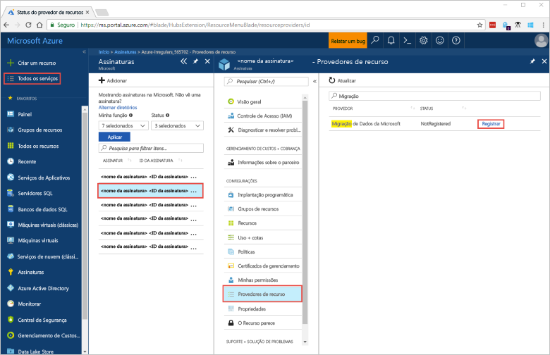
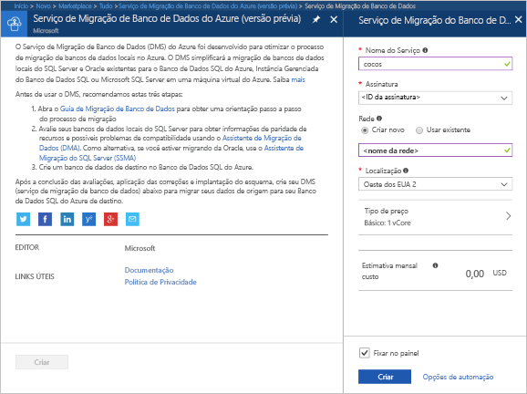
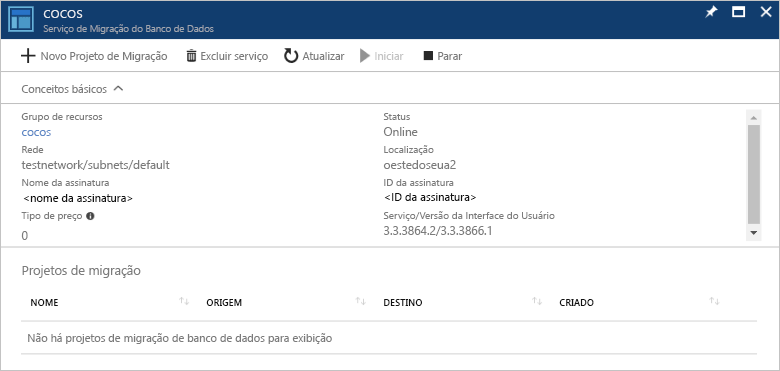

# Crie uma instância do Serviço de Migração de Banco de Dados do Azure usando o Portal do Azure
Nesse Início Rápido, use o Portal do Azure para criar uma instância do Serviço de Migração de Banco de Dados do Azure.  Depois de criar o serviço, pode usá-lo para migrar dados do SQL Server no local para um banco de dados SQL do Azure.

Se você não tiver uma assinatura do Azure, crie uma conta [gratuita](https://azure.microsoft.com/free/) antes de começar.

## Faça logon no Portal do Azure
Primeiro, abra seu navegador da Web e navegue até o [portal do Microsoft Azure](https://portal.azure.com/). Insira suas credenciais para entrar no portal. A exibição padrão é o painel de serviço.

## Registre o provedor de recursos
Registre o provedor de recursos Microsoft.DataMigration antes de criar sua primeira instância do Serviço de Migração de Banco de Dados.

1. No portal do Azure, selecione **Todos os serviços**e, em seguida, selecione **Assinaturas**.

2. Selecione a assinatura na qual você deseja criar a instância do Serviço de Migração do Banco de Dados do Azure e, em seguida, selecione **Provedores de recursos**.

3. Pesquise por migração e, em seguida, à direita do **Registrar**.

## Crie uma instância do serviço
1. Clique em **+ Criar um recurso** para criar uma instância do Serviço de Migração de Banco de Dados do Azure, que está atualmente em versão prévia.

2. Pesquise no marketplace para "migração", selecione **Serviço de Migração de Banco de Dados do Azure** e, em seguida, na tela **Serviço de Migração de Banco de Dados do Azure (versão prévia)**, clique em **Criar**.

3. Na tela de **Serviço de Migração de Banco de Dados**: 

    - Escolha um **Nome de serviço** que seja fácil de lembrar e exclusivo para identificar sua instância de Serviço de Migração de Banco de Dados do Azure.
    - Selecione a **Assinatura** do Azure na qual quer criar a instância.
    - Crie uma nova **Rede** com um nome exclusivo.
    - Escolha o **Local** mais próximo ao seu servidor de origem ou de destino.
    - Selecione Básico: 1 vCore como **Tipo de preço**.

    
4. Selecione **Criar**.

Após alguns instantes, sua instância do Serviço de Migração de Banco de Dados do Azure é criado e estará pronto para uso. O Serviço de Migração do Banco de Dados exibe conforme mostrado na imagem seguinte:

## Limpar recursos
Você pode limpar todos os recursos criados nesse início rápido excluindo o [Grupo de recursos do Azure](../azure-resource-manager/resource-group-overview.md).  Para excluir o grupo de recursos, navegue até a instância do Serviço de Migração de Banco de Dados do Azure que você criou. Selecione o nome do **Grupo de recursos** e selecione **Excluir grupo de recursos**.  Essa ação exclui todos os ativos no grupo de recursos, bem como o grupo em si.

## Próximas etapas
> [!div class="nextstepaction"]
> [Migrar SQL Server local para o Banco de Dados SQL do Azure](tutorial-sql-server-to-azure-sql.md)