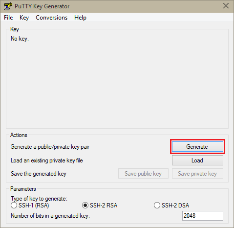
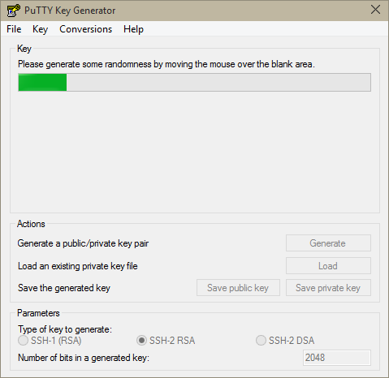

<properties
   pageTitle="Usar chaves SSH com Hadoop no HDInsight baseado em Linux do Windows | Azure"
   description="Saiba como criar e usar chaves SSH para autenticar em clusters HDInsight baseados em Linux."
   services="hdinsight"
   documentationCenter=""
   authors="Blackmist"
   manager="paulettm"
   editor="cgronlun"/>

<tags
   ms.service="hdinsight"
   ms.devlang=""
   ms.topic="article"
   ms.tgt_pltfrm="na"
   ms.workload="big-data"
   ms.date="02/18/2015"
   ms.author="larryfr"/>

##Usar SSH com Hadoop baseado em Linux no HDInsight do Windows (Preview)

Clusters de HDInsight baseados em Linux oferecem a opção de proteção de acesso do SSH usando uma senha ou uma chave SSH. Esse documento fornece informações sobre como se conectar ao HDInsight de clientes do Windows usando o cliente SSH PuTTY.

> [AZURE.NOTE] As etapas neste artigo presumem que você esteja usando um cliente do Windows. Se você estiver usando um cliente Linux, Unix ou OS X, consulte [Usar SSH com Hadoop baseado em Linux no HDInsight dos Linux, Unix ou OS X](hdinsight-hadoop-linux-use-ssh-unix.md).

##Pré-requisitos

* **PuTTY** e **PuTTYGen** para clientes Windows. Esses utilitários estão disponíveis em <a href="http://www.chiark.greenend.org.uk/~sgtatham/putty/download.html" target="_blank">http://www.chiark.greenend.org.uk/~sgtatham/putty/download.html</a>

* Um navegador da Web moderno que ofereça suporte a HTML5

OU

* PowerShell do Azure

OU

* Ferramentas de Linha de Comando de Plataformas Cruzadas do Azure

##O que é o SSH?

SSH é um utilitário para efetuar login e executar remotamente comandos em um servidor remoto. Com o HDInsight baseado em Linux, o SSH estabelece uma conexão segura para o nó principal do cluster e fornece uma linha de comando que você usa para digitar comandos. Os comandos são executados diretamente no servidor.

##Criar uma chave SSH (opcional)

Ao criar um cluster HDInsight baseado em Linux, você tem a opção de usar uma senha ou chave SSH para autenticar o servidor ao usar o SSH. Chaves SSH são consideradas mais seguras, porque elas são baseadas em certificado. Use as informações a seguir se você planeja usar chaves SSH com o cluster.

1. Abra o **PuTTYGen**.

2. Para **Tipo de chave para gerar**, selecione **SSH-2 RSA** e clique em **Gerar**.

	

3. Mova o mouse na área abaixo da barra de progresso, até que a barra seja preenchida. Mover o mouse gera dados aleatórios são usados para gerar a chave.

	

	Depois que a chave foi gerada, a chave pública será exibida.

4. Para maior segurança, você pode inserir uma frase secreta no campo **Senha da Chave** e digitar o mesmo valor no campo **Confirmar senha**.

	
	
	> [AZURE.NOTE] É altamente recomendável que você use uma senha segura para a chave. No entanto, se você esquecer a senha, não é possível recuperá-la.

5. Clique em **Salvar chave privada** para salvar a chave para um arquivo **.ppk**. Essa chave será usada para autenticar seu cluster HDInsight baseado em Linux.

	> [AZURE.NOTE] Você deve armazenar essa chave em um local seguro, porque ela pode ser usada para acessar seu cluster HDInsight baseado em Linux.

6. Clique em **Salvar chave pública** para salvar a chave como um arquivo **.txt**. Isso permite que você reutilize a chave pública no futuro quando criar outros clusters HDInsight baseados em Linux.

	> [AZURE.NOTE] A chave pública também é exibida na parte superior do **PuTTYGen**. Com o botão direito nesse campo, copie o valor e cole-o em um formulário, como o Assistente do HDInsight no Portal de Gerenciamento do Azure.

##Criar um cluster HDInsight baseado em Linux

Ao criar um cluster HDInsight baseado em Linux, você deve fornecer a **chave pública** criada anteriormente. Para clientes do Windows, há duas maneiras de criar um cluster HDInsight baseado em Linux:

* **Portal de Gerenciamento do Azure** - usa um portal baseado na Web para criar o cluster

* **Interface de linha de comando entre plataformas do Azure (xplat-cli)** - usa comandos da linha de comando para criar o cluster

Cada um desses métodos exigirá a **chave pública**. Para obter mais informações sobre como criar um cluster HDInsight baseado em Linux, consulte <a href="./hdinsight-hadoop-provision-linux-clusters/" target="_blank">Provisionar clusters HDInsight baseados em Linux</a>.

###Portal de Gerenciamento do Azure

Ao usar o portal para criar um cluster HDInsight baseado em Linux, você deve inserir um nome de usuário e uma senha ou chave pública no formulário a seguir.

Isso cria um logon para o usuário especificado e permite a autenticação de senha ou autenticação de chave SSH.

###Interface de Linha de Comando de Plataforma Cruzada do Azure

Você pode usar a <a href="../xplat-cli/" target="_brad">Interface de linha de comando entre plataformas do Azure</a> para criar um novo cluster usando o comando  `azure hdinsight cluzter create`.

Para saber mais sobre o uso deste comando, consulte <a href="../hdinsight-hadoop-provision-linux-clusters/" target="_blank">Provisionar clusters Linux do Hadoop no HDInsight usando opções personalizadas</a>

##Conectar-se a um cluster HDInsight baseado em Linux

1. Abra o PuTTY.

	

2. Se você tiver fornecido uma **chave SSH** quando criou sua conta de usuário, deve executar a etapa a seguir para selecionar a **chave privada** a ser usada para autenticar para o cluster.

	Em **Categoria**, expanda **Conexão**, **SSH** e selecione **Auth**. Finalmente, clique em **Procurar** e selecione o **.ppk** que contém sua **chave privada**.

	

3. Em **Categoria**, selecione **Sessão**. Na tela **Opções básicas para sua sessão PuTTY**, digite o endereço SSH do seu servidor HDInsight no campo **Nome do host (ou endereço IP)**. O endereço do SSH é o nome do cluster e **-ssh.azurehdinsight.net**. Por exemplo, **mycluster-ssh.azurehdinsight.net**.

	

4. Para salvar as informações de conexão para uso futuro, digite um nome para essa conexão em **Sessões Salvas** e clique em **Salvar**. A conexão será adicionada à lista de sessões salvas.

5. Clique em **Abrir** para se conectar ao cluster.

	> [AZURE.NOTE] Se esta for a primeira vez que você se conectou ao cluster, você receberá um alerta de segurança. Isso é normal - selecione **Sim** para armazenar em cache a chave RSA2 do servidor para continuar.

6. Quando solicitado, insira o usuário que você inseriu ao criar o cluster. Se você tiver fornecido um **senha** para o usuário, você deverá inseri-la também.

##Adicionar contas

2. Gere uma nova **chave pública** e **chave privada** para a nova conta de usuário conforme descrito anteriormente.

1. De uma sessão SSH para o cluster, adicione o novo usuário com o comando a seguir.

		sudo adduser --disabled-password <username> 

	Isso criará uma nova conta de usuário, mas desativará a autenticação de senha.

2. Crie a pasta e os arquivos para manter a chave usando os seguintes comandos.

		sudo mkdir -p /home/<username>/.ssh
		sudo touch /home/<username>/.ssh/authorized_keys
		sudo nano /home/<username>/.ssh/authorized_keys

3. Quando o editor nano for aberto, copie e cole nos conteúdo da **chave pública** para a nova conta de usuário. Por fim, use **Ctrl-X** para salvar o arquivo e saia do editor.

	

4. Use o seguinte comando para alterar a propriedade da pasta .ssh e os conteúdos para a nova conta de usuário.

		sudo chown -hR <username>:<username> /home/<username>/.ssh

5. Agora você deve ser capaz de autenticar para o servidor com a nova conta de usuário e **chave privada**.

##Túnel SSH

O SSH também pode ser usado para criar um túnel de solicitações locais, como solicitações da Web, para o cluster HDInsight. A solicitação será encaminhada para o recurso solicitado como se tivesse sido originada no nó principal do cluster HDInsight.

Isso é mais útil ao acessar serviços baseados na Web no cluster HDInsight que usam nomes de domínio interno para os nós de cabeçalho ou de trabalho no cluster. Por exemplo, algumas seções da página da Web Ambari usam nomes de domínio internos como **headnode0.mycluster.d1.internal.cloudapp.net**. Esses nomes não podem ser resolvidos por fora do cluster, porém, as solicitações transmitidas via SSH se originam dentro do cluster e serão resolvidas corretamente.

Use as seguintes etapas para criar um túnel SSH e configurar seu navegador para usá-lo para se conectar ao cluster.

1. Abra o PuTTY e insira suas informações de conexão, conforme documentado na seção [Conectar](#connect) .

2. Na seção **Categoria** à esquerda da caixa de diálogo, expanda **Conexão**, **SSH** e finalmente selecione **Túneis**.

2. Forneça as seguintes informações sobre o formulário **Opções para controlar o encaminhamento de porta do SSH**.

	* **Porta de origem** - a porta no cliente que você deseja encaminhar. Por exemplo, **9876**

	* **Destino** - o endereço SSH para o cluster HDInsight baseado em Linux. Por exemplo, **mycluster-ssh.azurehdinsight.net**

	* **Dinâmico** - habilita o roteamento de proxy SOCKS dinâmico

	

3. Por fim, selecione **Adicionar** para adicionar as configurações, selecione **Abrir** para abrir uma conexão SSH.

4. Quando solicitado, faça logon no servidor. Isso estabelecerá uma sessão SSH e habilitará o túnel.

2. Configure o programa cliente, como o Firefox, use **localhost:9876** como um proxy **SOCKS v5**. Aqui está a aparência das configurações do Firefox.

	

	> [AZURE.NOTE] Selecionar **DNS Remoto** resolverá solicitações DNS usando o cluster HDInsight. Se não selecionado, o DNS será resolvido localmente.

	Você pode garantir que o tráfego esteja sendo encaminhado por meio do túnel visitando um site como <a href="http://www.whatismyip.com/" target="_blank">http://www.whatismyip.com/</a>, com as configurações de proxy habilitadas e desabilitadas no Firefox. Quando habilitada, o endereço IP será para uma máquina no datacenter do Microsoft Azure.

###Extensões do navegador

Embora configurar o navegador para usar o túnel funcione, geralmente não deseja encaminhar todo o tráfego através do túnel. Extensões de navegador como <a href="http://getfoxyproxy.org/" target="_blank">FoxyProxy</a> dão suporte padrão de correspondência para solicitações de URL (apenas FoxyProxy Standard ou Plus) para que somente as solicitações de URLs específicas sejam enviadas através do túnel.

Se você tiver instalado o **FoxyProxy Standard**, use as seguintes etapas para configurá-lo para encaminhar o tráfego apenas para HDInsight pelo túnel.

1. Abra a extensão FoxyProxy no seu navegador. Por exemplo, no Firefox, selecione o ícone FoxyProxy ao lado do campo de endereço.

	

2. Selecione **Adicionar Novo Proxy**, a guia **Geral** e insira um nome de proxy do **HDInsight**.

	

3. Selecione a **guia Detalhes de Proxy** e preencha os campos a seguir.

	* **Host ou Endereço IP** - localhost, como estamos usando um túnel SSH no computador local

	* **Porta** - a porta usada para o túnel SSH

	* **Proxy SOCKS** - selecione para habilitar o navegador a usar o túnel como um proxy

	* **SOCKS v5** - selecione para definir a versão necessária do proxy

	

4. Selecione a guia **Padrões de URL** e selecione **Adicionar Novo Padrão**. Use o seguinte para definir o padrão e clique em **OK**.

	* **Nome do Padrão** - **headnode** - isso é apenas um nome amigável para o padrão

	* **Padrão de URL** - **\*headnode\*** - define um padrão que corresponde a qualquer URL com a palavra **headnode** nela.

	

4. Selecione **Ok** para adicionar o proxy e fechar as **Configurações de Proxy**

5. Na parte superior da caixa de diálogo FoxyProxy, altere **Selecionar Modo** para **Usar proxies com base em seus padrões predefinidos e prioridades** e selecione **Fechar**.

	

Após seguir essas etapas, somente as solicitações de URLs que contêm a cadeia de caracteres **headnode** serão roteadas através do túnel SSL.

##Próximas etapas

Agora que você entende como autenticar usando uma chave SSH, aprenda a usar o MapReduce com Hadoop no HDInsight.

* [Use o hive com o HDInsight](hdinsight-use-hive.md)

* [Usar o Pig com o HDInsight](hdinsight-use-pig.md)

* [Usar trabalhos MapReduce com o HDInsight](hdinsight-use-mapreduce.md)
 
<!--HONumber=47-->
