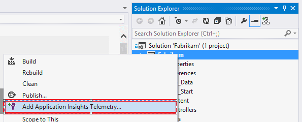

<properties 
	pageTitle="Monitorar o desempenho do aplicativo" 
	description="Traçar tempo de resposta e de carga, informações de dependência e definir alertas para desempenho." 
	services="azure-portal" 
	documentationCenter="na" 
	authors="alancameronwills" 
	manager="keboyd"/> 
<tags 
	ms.service="azure-portal" 
	ms.workload="na" 
	ms.tgt_pltfrm="na" 
	ms.devlang="na" 
	ms.topic="article" 
	ms.date="04/28/2015" 
	ms.author="awills"/> 

# Monitorar desempenho do aplicativo 

No [Portal do Azure](http://portal.azure.com) você pode configurar o monitoramento para coletar as estatísticas e detalhes sobre as dependências de aplicativo em seus aplicativos Web ou máquinas virtuais.

O Azure dá suporte ao APM (monitoramento do desempenho de aplicativos) tirando vantagem das *extensões*. Essas extensões são instaladas em seu aplicativo, coletam os dados e reportam-se de volta aos serviços de monitoramento. 

## Habilitar uma extensão 

1. Clique em **Procurar** e selecione o aplicativo Web ou a máquina virtual que você deseja instrumentar.

2. Clique no bloco **Monitoramento de aplicativos** sob **Monitoramento**.

3. Escolha o provedor de extensão que você gostaria de usar, como **Application Insights** ou **New Relic**. 

 

Ou então, se você estiver usando uma máquina virtual:

 

## Explorar os dados de seu aplicativo por um tempo para gerar alguma telemetria. 

1. Em seguida, do seu aplicativo Web ou de uma folha de máquina virtual, você verá a extensão instalada. 

2. Clique na linha que representa o aplicativo para navegar até esse provedor: 

 

Você também pode usar **Procurar** para ir diretamente até a conta do New Relic ou o componente do Application Insights que você usou. 

Depois de abrir a lâmina, para Application Insights, por exemplo, você pode: 

- Desempenho aberto: 

- Analise de modo mais aprofundado para ver as solicitações individuais: 
 

- Este é um exemplo que mostra a quantidade de tempo gasto em uma dependência SQL, incluindo o número de chamadas SQL e estatísticas relacionadas, como a duração média e o desvio padrão. 

 

### Requisitos adicionais para o Application Insights 

O New Relic pode ser instalado automaticamente sem nenhuma instrumentação adicional, mas o Application Insights tem um requisito adicional.

 

Quando for solicitado que você faça logon, use as credenciais de sua conta do Azure. 

##Próximas etapas 

* [Monitorar as métricas de integridade do serviço](insights-how-to-customize-monitoring.md) para verificar se o serviço está disponível e responsivo. 

* [Habilitar monitoramento e diagnóstico](insights-how-to-use-diagnostics.md) para coletar métricas detalhadas de alta frequência no seu serviço. 

* [Receber notificações de alerta](insights-receive-alert-notifications.md) sempre que ocorrerem eventos operacionais ou métricas cruzarem um limite. 

* Usar [Application Insights para páginas da Web e aplicativos JavaScript](app-insights-web-track-usage.md) para obter a análise do cliente sobre os navegadores que visitam uma página da web. 

* [Monitorar a disponibilidade e capacidade de resposta de qualquer página da Web](app-insights-monitor-web-app-availability.md) com o Application Insights para que você possa descobrir se a página está inativa.

<!--HONumber=54-->