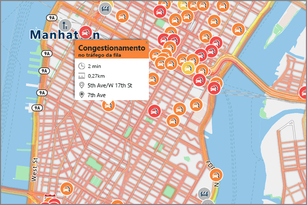

# <a name="an-introduction-to-azure-location-based-services-preview"></a>Uma introdução aos Serviços do Azure Baseados na Localização (versão prévia)
Os Serviços do Azure Baseados na Localização são um portfólio de serviços geoespaciais que inclui APIs de serviço para Mapas, Pesquisa, Roteamento, Tráfego e Fusos Horários. O portfólio de serviços compatíveis com OneAPI do Azure permite que você use ferramentas de desenvolvimento familiares para desenvolver rapidamente soluções de escala que integram informações de localização em suas soluções do Azure. Os Serviços do Azure Baseados na Localização fornecem aos desenvolvedores de todos os setores recursos avançados geoespaciais, contendo os novos dados de mapeamento obrigatórios para fornecer um contexto geográfico para aplicativos Web e móveis. Os Serviços do Azure Baseados na Localização são um conjunto de APIs REST compatíveis com a One API do Azure, acompanhado de um controle JavaScript baseado na Web para tornar o desenvolvimento super fácil, flexível e portátil em várias mídias. 

Os Serviços do Azure Baseados na Localização consistem em cinco serviços principais para reforçar os aplicativos do Azure que exigem contexto geográfico. Cada uma desses serviços é explicado detalhadamente abaixo.

**Serviço de Renderização** – O Serviço de Renderização foi concebido para os desenvolvedores criarem aplicativos Web e móveis baseados em mapeamento. O serviço usa imagens gráficas de varredura de alta qualidade, disponíveis em 19 de níveis de zoom ou imagens de mapa do formato de vetor totalmente personalizável.


**Serviço de Roteiros** – O Serviço de Roteiros é criado com cálculos robustos de geometria de infraestrutura do mundo real e várias direções de modo de transporte. O serviço permite aos desenvolvedores calcular as direções para vários modos de transporte como carro, caminhão, bicicleta ou caminhada; assim como a inclusão de várias informações, como condições de tráfego, restrições de peso ou transporte de materiais perigosos.


**Serviço de Pesquisa** – O Serviço de Pesquisa foi concebido para que os desenvolvedores procurem por endereços, locais, listagens de negócios por nome ou categoria e outras informações geográficas. O Serviço de Pesquisa também pode [inverter os endereços código geográfico](https://en.wikipedia.org/wiki/Reverse_geocoding) e fazer o cruzamento de ruas baseado em um valor de latitude/longitude. 


**Serviço de Fuso Horário** – O Serviço de Fuso Horário permite consultar informações de fuso horário atuais, históricos e informações futuras de fuso horário usando qualquer um dos pares de latitude-longitude ou uma [ID IANA](http://www.iana.org/). O Serviço de Fuso Horário também permite converter IDs de fuso horário do Microsoft Windows em fusos horários IANA, buscar uma diferença de fuso horário em relação ao UTC e obter a hora atual em um fuso horário respectivo. Uma resposta JSON normal para uma consulta para o Serviço de Fuso Horário é semelhante ao seguinte:

```JSON
{
    "Version": "2017c",
    "ReferenceUtcTimestamp": "2017-11-20T23:09:48.686173Z",
    "TimeZones": [{
        "Id": "America/Los_Angeles",
        "ReferenceTime": {
            "Tag": "PST",
            "StandardOffset": "-08:00:00",
            "DaylightSavings": "00:00:00",
            "WallTime": "2017-11-20T15:09:48.686173-08:00",
            "PosixTzValidYear": 2017,
            "PosixTz": "PST+8PDT,M3.2.0,M11.1.0"
        }
    }]
}
```

**Serviço de Tráfego** – O Serviço de Tráfego é um conjunto de serviços Web projetado para os desenvolvedores criarem aplicativos Web e móveis que utilizam tráfego. Ele está dividido da seguinte forma:
1. Fluxo de Tráfego - fornece velocidades observadas em tempo real e tempos de deslocamento para todos os caminhos principais da rede; e, 
2. Incidentes de Tráfego - fornece uma visão precisa sobre as obstruções e incidentes de tráfego em torno do caminho da rede.



Os Serviços do Azure Baseados na Localização foram criados para mobilidade e podem ligar aplicativos de plataforma cruzada já que o modelo de programação é independente e dá suporte à saída JSON por meio de APIs REST. Além disso, o Azure LBS oferece um Controle de Mapeamento de JavaScript conveniente com um modelo de programação simples para um desenvolvimento rápido fácil de aplicativos Web e móveis. 

Os Serviços do Azure Baseados na Localização usam um esquema de autenticação baseada em chave, então acessar os serviços é uma questão de navegar até o [portal do Azure](http://portal.azure.com) e criar uma conta dos Serviços do Azure Baseados na Localização. Sua conta é fornecida com duas chaves geradas previamente para você. Comece integrando esses recursos de localização diretamente em seus aplicativos usando qualquer uma de suas chaves nas solicitações para os Serviços do Azure Baseados na Localização.

Crie uma [conta dos Serviços do Azure Baseados na Localização hoje!](http://aka.ms/azurelbsportal)

## <a name="next-steps"></a>Próximas etapas

Agora você tem uma visão geral dos Serviços do Azure Baseados na Localização (versão prévia). A próxima etapa é testar um aplicativo de exemplo mostrando os Serviços Baseados na Localização, e criar um cenário de ponta a ponta em seu aplicativo Web.

> [!div class="nextstepaction"]
> [Inicie uma pesquisa de mapa interativo de demonstração usando os Serviços do Azure Baseados na Localização (versão prévia)](quick-demo-map-app.md)
> [Procure ponto de interesse mais próximo usando os Serviços do Azure Baseados na Localização](tutorial-search-location.md)