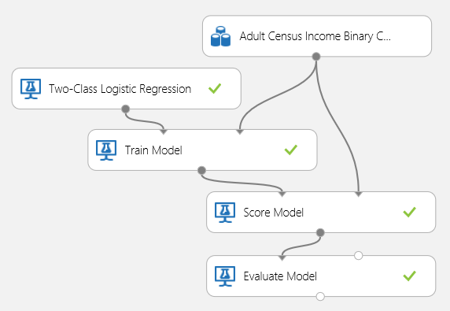
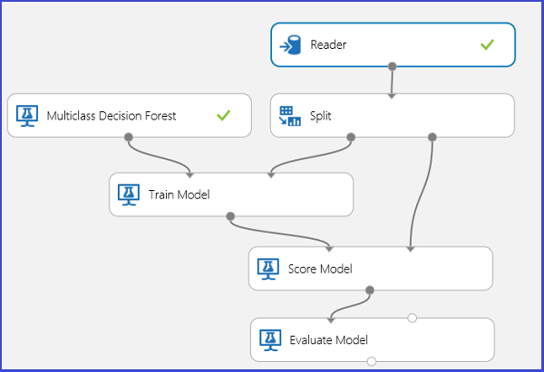
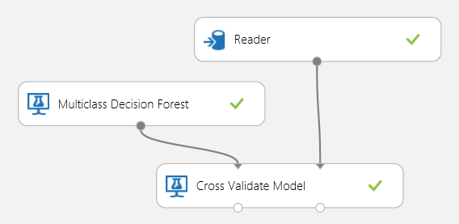
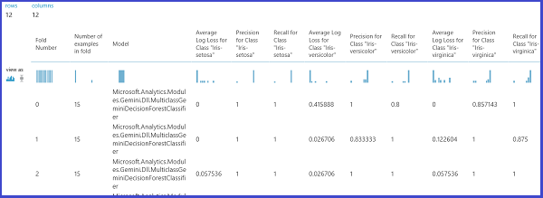

<properties 
	pageTitle="Como avaliar o desempenho do modelo no Aprendizado de Máquina do Azure | Azure" 
	description="Explica como avaliar o desempenho do modelo no Aprendizado de Máquina do Azure." 
	services="machine-learning"
	documentationCenter="" 
	authors="bradsev" 
	manager="paulettm" 
	editor="cgronlun"/>

<tags 
	ms.service="machine-learning" 
	ms.workload="data-services" 
	ms.tgt_pltfrm="na" 
	ms.devlang="na" 
	ms.topic="article" 
	ms.date="03/11/2015" 
	ms.author="bradsev" />

# Como avaliar o desempenho do modelo no Aprendizado de Máquina do Azure

Este tópico demonstra como avaliar o desempenho de um modelo no Estúdio de Aprendizado de Máquina do Microsoft Azure e fornece uma breve explicação sobre as métricas disponíveis para essa tarefa.  Três cenários comuns de aprendizado supervisionado são apresentados: 

* regressão
* classificação binária 
* classificação multiclasse

Avaliar o desempenho de um modelo é um dos estágios principais do processo de ciência de dados.  Indica o êxito da pontuação (previsões) de um conjunto de dados feitas por meio de um modelo treinado. 

O Aprendizado de máquina do Azure dá suporte à avaliação de modelo por meio de dois dos seus principais módulos de aprendizado de máquina:  **Avaliar Modelo** e **Modelo de Avaliação Cruzado**.  Esses módulos permitem que você veja como o seu modelo é executado em termos de um número de métricas que são usados normalmente em estatísticas e aprendizado de máquina.

##Validação cruzada x Avaliação##
Avaliação e Validação cruzada são as formas padrão de medir o desempenho do seu modelo.  Ambas geram métricas de avaliação que você pode inspecionar ou comparar com os outros modelos.

O **Modelo de avaliação** espera um conjunto de dados de pontuação como entrada (ou 2 caso você deseje comparar o desempenho de 2 modelos diferentes).  Isso significa que você precisa treinar o modelo usando o módulo **Treinar modelo** e fazer previsões em um conjunto de dados usando o módulo **Modelo de pontuação**, para poder avaliar os resultados.  A avaliação se baseia na probabilidades/nos rótulos pontuados juntamente com os rótulos de true, que são produzidos pelo módulo **Modelo de pontuação**.

Como alternativa, você pode usar a validação cruzada para executar várias operações para avaliar-treinar-pontuar (10 partições) automaticamente em diferentes subconjuntos dos dados de entrada.  Os dados de entrada são divididos em 10 partes, em que uma está reservada para teste, e as outras 9 para treinamento.  Esse processo é repetido 10 vezes e as métricas de avaliação são transformadas em médias.  Isso ajuda a determinar como um modelo seria generalizado para novos conjuntos de dados.  O módulo **Modelo de Validação Cruzada** é usado em um modelo não treinado e alguns conjuntos de dados rotulados e gera os resultados da avaliação de cada uma das 10 partições, além dos resultados médios.

Nas seções a seguir, podemos compilar modelos de regressão e classificação simples e avaliar seu desempenho usando os módulos **Avaliar Modelo** e **Modelo de Validação Cruzada**.

##Avaliar um Modelo de regressão##
Suponha que desejamos prever o preço do carro usando alguns recursos, como dimensões, potência, especificações de mecanismo e assim por diante.  Este é um problema comum de regressão, em que a variável de destino (*preço*) é um valor numérico contínuo.  Conseguimos ajustar um modelo de regressão linear simples que, considerando os valores das características de um determinado carro, pode prever o preço daquele carro.  Esse modelo de regressão pode ser usado para a pontuação do mesmo conjunto de dados no qual treinamos.  Assim que tivermos os preços previstos para todos os carros, poderemos avaliar o desempenho do modelo observando quanto, em média, as previsões se desviam dos preços reais.  Para ilustrar isso, usamos o  *Automobile price data (Raw) dataset* disponível na seção **Conjuntos de dados salvos** no Estúdio de Aprendizado de Máquina do Microsoft Azure.
 
###Criando o experimento###
Adicione os seguintes módulos ao seu espaço de trabalho no Estúdio de Aprendizado de Máquina do Microsoft Azure:

- Dados de preço de automóvel (Brutos)
- Regressão Linear
- Modelo de Treinamento
- Modelo de Pontuação
- Avaliar modelo

Conecte as portas, conforme mostrado abaixo na Figura 1, e defina a coluna Rótulo do **módulo Modelo de Treinamento** para  *price*.
 

Figura 1.  Avaliar um Modelo de regressão.

###Inspecionando os Resultados da avaliação###
Depois de executar o teste, você pode clicar na porta de saída do módulo **Avaliar modelo** e selecionar *Visualize* para ver os resultados da avaliação.  As métricas de avaliação disponíveis para modelos de regressão são: *Mean Absolute Error*, *Root Mean Absolute Error*, *Relative Absolute Error*, *Relative Squared Error*e  *Coefficient of Determination*.

O termo "erro" aqui representa a diferença entre o valor previsto e o valor verdadeiro.  O valor absoluto ou o quadrado dessa diferença geralmente são computados para capturar a magnitude total do erro em todas as instâncias, como a diferença entre o valor previsto e o verdadeiro pode ser negativa em alguns casos.  As métricas de erro medem o desempenho de previsão de um modelo de regressão em termos do desvio da média de suas previsões dos valores verdadeiros.  Valores mais baixos de erro significam que o modelo é mais preciso para fazer previsões.  Uma métrica de erro geral 0 significa que o modelo se ajusta aos dados perfeitamente.

O coeficiente de determinação, que também é conhecido como R ao quadrado, também é uma maneira padrão de medir o quão bem o modelo se ajusta aos dados.  Ele pode ser interpretado como a proporção da variação explicada pelo modelo.  Uma proporção mais alta é melhor nesse caso, em que 1 indica um ajuste perfeito.
 

Figura 2.  Métrica de avaliação de regressão linear.

###Usando Validação Cruzada###
Como mencionado anteriormente, você pode executar o treinamento repetido, as pontuação e as avaliações automaticamente usando o módulo **Modelo de Validação Cruzada**.  Tudo o que você precisa nesse caso é um conjunto de dados, um modelo não treinado e um módulo **Modelo de Validação Cruzada** (veja a figura abaixo).  Observe que você precisa definir a coluna de rótulo como *price* nas propriedades do módulo **Modelo de Validação Cruzada**.

Figura 3.  A validação cruzada em um modelo de regressão.

Depois de executar o teste, você pode inspecionar os resultados da avaliação clicando na porta de saída à direita do módulo **Modelo de Validação Cruzada**.  Isso fornecerá uma exibição detalhada das métricas para cada iteração (partição) e os resultados médios de cada uma das métricas (Figura 4).
 

Figura 4.  Resultados de Validação cruzada de um modelo de regressão.

##Avaliar um modelo de classificação binária##
Em um cenário de classificação binária, a variável de destino tem somente dois resultados possíveis, por exemplo:  {0, 1} ou {falso, verdadeiro}, {negativo, positivo}.  Suponha que você terá um conjunto de dados de funcionários adultos com alguns dados demográficos e variáveis de emprego e que você será solicitado a prever o nível de renda, uma variável binária com os valores {"<=50K", ">50K"}.  Em outras palavras, a classe negativa representa os funcionários que recebem um valor menor ou igual a 50 mil por ano, e a classe positiva representa todos os outros funcionários.  Como no cenário de regressão, podemos treinar um modelo, pontuar alguns dados e avaliar os resultados.  A principal diferença é a opção de métricas que o Aprendizado de Máquina do Azure computa e as saídas.  Para ilustrar o cenário de previsão de nível de renda, utilizaremos o conjunto de dados [Adulto](http://archive.ics.uci.edu/ml/datasets/Adult) para criar uma experiência de Aprendizado de Máquina do Azure e avaliar o desempenho de um modelo de regressão logística de duas classes, uma classificação binária comumente usada.

###Criando o experimento###
Adicione os seguintes módulos ao seu espaço de trabalho no Estúdio de Aprendizado de Máquina do Microsoft Azure:

- Conjunto de dados de classificação binária de receita no recenseamento adulto
- Regressão logística de duas classes
- Modelo de Treinamento
- Modelo de Pontuação
- Avaliar modelo

Conecte as portas, conforme mostrado abaixo na Figura 5, e defina a coluna Rótulo do **módulo Modelo de Treinamento** para  *income*.

Figura 5.  Avaliar um modelo de classificação binária.

###Inspecionando os Resultados da avaliação###
Depois de executar o teste, você pode clicar na porta de saída do módulo **Avaliar modelo** e selecionar *Visualize* para ver os resultados da avaliação (Figura 7).  A métrica de avaliação disponível para modelos de classificação binária: *Accuracy*, *Precision*, *Recall*, *F1 Score* e *AUC*.  Além disso, o módulo gera uma matriz de confusão mostrando o número de verdadeiros positivos, de falsos negativos, falsos positivos e verdadeiros negativos, bem como as curvas  *ROC*, *Precision/Recall* e *Lift*.

A precisão é simplesmente a proporção das instâncias classificadas corretamente.  Geralmente, ela é a primeira métrica a observar ao avaliar um classificador.  No entanto, quando os dados de teste não estão desbalanceados (em que a maioria das instâncias pertence a uma das classes), ou você está mais interessado no desempenho em qualquer uma das classes, a precisão realmente não captura a eficácia de um classificador.  No cenário de classificação de nível de renda, suponha que você esteja testando em alguns dados em que 99% das instâncias representam pessoas que ganham um valor menor ou igual a 50 mil por ano.  É possível obter uma precisão de 0,99 prevendo a classe "<=50K" para todas as instâncias.  O classificador parece estar fazendo um bom trabalho em geral nesse caso, mas na realidade, ele não consegue classificar qualquer uma das pessoas com um recebimento mais elevado (% 1) corretamente.

Por esse motivo, é útil computar métricas adicionais que capturam aspectos mais específicos da avaliação.  Antes de entrar em detalhes sobre essas métricas, é importante compreender a matriz de confusão de uma avaliação de classificação binária.  Os rótulos de classe no conjunto de treinamento podem assumir apenas 2 valores possíveis, o que normalmente chamamos como positivo ou negativo.  As instâncias positivas e negativas que um classificador prevê corretamente são chamadas verdadeiros positivos (TP) e verdadeiros negativos (TN), respectivamente.  Da mesma forma, as instâncias classificadas incorretamente são chamadas de falsos positivos (FP) e falsos negativos (FN).  A matriz de confusão é simplesmente uma tabela que mostra o número de instâncias que se enquadram em cada uma dessas 4 categorias.  O Aprendizado de Máquina do Azure decide automaticamente qual das duas classes no conjunto de dados é a classe positiva.  Se os rótulos de classe forem inteiros ou boolianos, as instâncias de rotuladas como 'true' ou '1' serão atribuídas à classe positiva.  Se os rótulos forem cadeias de caracteres, como no caso do conjunto de dados de renda, os rótulos serão classificados em ordem alfabética e o primeiro nível será escolhido para ser a classe negativa, enquanto o segundo nível será a classe positiva.

Figura 6.  Matriz de confusão de classificação binária.

Voltando ao problema de classificação de renda, queremos fazer várias perguntas de avaliação que nos ajudam a compreender o desempenho do classificador usado.  É uma pergunta muito natural:  "Dentre os indivíduos que o modelo prevê estarem ganhando > 50 mil (TP + FP), quantos foram classificados corretamente (TP)?"  Essa questão pode ser respondida examinando a **Precisão** do modelo, que é a proporção de positivos que foram classificados corretamente:  TP/(TP+FP).  Outra pergunta comum é "Dentre todos os funcionários com renda alta > 50 mil (TP + FN), quantos o classificador classifica corretamente (TP)".  Isso é realmente o **Lembrete** ou a taxa de positivo verdadeiro:  TP/(TP+FN) do classificador.  Você observará que há uma opção óbvia entre a precisão e a recuperação.  Por exemplo, dado um conjunto de dados relativamente equilibrado, uma classificação que prevê principalmente instâncias positivas, teria um lembrete alto, mas uma precisão bastante baixa com muitas instâncias negativas deve ser classificada incorretamente, resultando em um grande número de falsos positivos.  Para ver um gráfico de como essas duas métricas variam, você pode clicar na curva 'PRECISION/RECALL' na página de saída do resultado de avaliação (parte superior esquerda da Figura 7).

Figura 7.  Resultados da avaliação de classificação binária.

Outra métrica relacionada usada com frequência é a **Pontuação F1**, que leva a precisão e o lembrete em consideração.  Ela é a média harmônica dessas 2 métricas e é calculada como tal:  F1 = 2 (precisão x rechamada) / (precisão + lembrete).  A pontuação F1 é uma boa maneira de resumir a avaliação de um único número, mas é sempre uma boa prática examinar a precisão e a recuperação para entender melhor como um classificador se comporta.

Além disso, um pode inspecionar a taxa verdadeira positiva versus os falsos positivos na curva **Característica de Operação do Receptor (ROC)** e o valor correspondente da **Área sob a curva (AUC)**.  Quanto mais próxima essa curva estiver do canto superior esquerdo, melhor estará o desempenho do classificador (que é maximizar a taxa de positivos verdadeiros enquanto minimiza os falsos positivos).  As curvas que estão próximas à diagonal do gráfico, o resultado dos classificadores que tendem a fazer previsões próximas à previsão aleatória.

###Usando Validação Cruzada###
Como no exemplo de regressão, podemos executar validação cruzada para treinar repetidamente, classificar e avaliar os diferentes subconjuntos de dados automaticamente.  Da mesma forma, podemos usar o módulo **Modelo de Validação Cruzada**, um modelo de regressão logística não treinado e um conjunto de dados.  A coluna de rótulo deve ser definida como  *income* nas propriedades do módulo **Modelo de Validação Cruzada**.  Após executar o experimento e clicar na porta de saída à direita do módulo **Modelo de Validação Cruzada**, podemos ver os valores de métrica de classificação binária para cada partição, além da média e do desvio padrão de cada um. 
 

Figura 8.  Validação cruzada em um modelo de classificação binária.

Figura 9.  Resultados de validação cruzada de um classificador binário.

##Avaliar um modelo de classificação com multiclass##
Nesse experimento, usaremos o popular conjunto de dados [Iris](http://archive.ics.uci.edu/ml/datasets/Iris "Iris") que contém instâncias de 3 diferentes tipos (classes) da fábrica Iris.  Há 4 valores de recurso (comprimento/largura da sépala e comprimento/largura da pétala) para cada instância.  Nas experiências anteriores, treinamos e testamos os modelos usando os mesmos conjuntos de dados.  Aqui, usaremos o módulo de divisão para criar 2 subconjuntos de dados, treinar no primeiro e pontuar e avaliar no segundo. 
O conjunto de dados Iris está disponível publicamente no [Repositório de aprendizado de máquina UCI](http://archive.ics.uci.edu/ml/index.html)e pode ser baixado usando um módulo **Leitor**.

###Criando o experimento###
Adicione os seguintes módulos ao seu espaço de trabalho no Estúdio de Aprendizado de Máquina do Microsoft Azure:

- Leitor
- Floresta de decisão multiclass
- Divisão
- Modelo de Treinamento
- Modelo de Pontuação
- Avaliar modelo

Conecte as portas, conforme mostrado abaixo na Figura 10.

Configure o índice da coluna Rótulo do módulo do Modelo de treinamento para 5.  O conjunto de dados não tem nenhuma linha de cabeçalho, mas sabemos que os rótulos de classe estão na quinta coluna.

Clique no módulo **Leitor** e defina a propriedade *Data source*  *Web URL via HTTP*e  *URL* para http://archive.ics.uci.edu/ml/machine-learning-databases/iris/iris.data.

Configure a fração de instâncias a serem usadas para treinamento no módulo **Divisão** (0.7, por exemplo).
 

Figura 10.  Avaliar um classificador Multiclass

###Inspecionando os Resultados da avaliação###
Execute o experimento e clique na porta de saída **Avaliar modelo**.  Os resultados de avaliação são apresentados na forma de uma matriz de confusão, nesse caso.  A matriz mostra o real versus as instâncias previstas para todas as 3 classes.
 

Figura 11.  Resultados da avaliação de classificação multiclass.

###Usando Validação Cruzada###
Como mencionado anteriormente, você pode executar o treinamento repetido, as pontuação e as avaliações automaticamente usando o módulo **Modelo de Validação Cruzada**.  Você precisará de um conjunto de dados, um modelo de não treinado e um módulo **Modelo de Validação Cruzado** (veja a figura abaixo).  Novamente, você precisa definir a coluna de rótulo do módulo **Modelo de Avaliação Cruzada** (índice de coluna 5 neste caso).  Após executar a porta de saída no experimento e clicar na porta à direita de **Modelo de Validação Cruzado**, você pode inspecionar os valores de métrica para cada partição, bem como o desvio médio e o padrão.  As métricas exibidas aqui são semelhantes àquelas discutidas no caso de classificação binária.  No entanto, observe que em classificação multiclass, os verdadeiros positivos/negativos e falsos positivos/negativos de computação são feitos baseados em uma base por classe, pois não há nenhuma classe geral positiva ou negativa.  Por exemplo, ao computar a precisão ou o cancelamento da classe 'Iris-setosa', supõe-se que essa seja a classe positiva e todas as outras sejam negativas.
 

Figura 12.  Validação cruzada em um modelo de classificação Multiclass.

Figura 13.  Resultados da validação cruzada de um modelo de classificação multiclass.

<!--HONumber=49-->