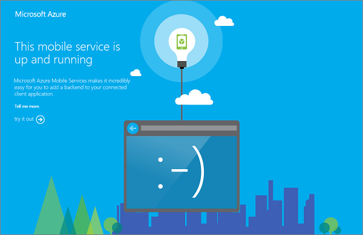

<properties urlDisplayName="Store .NET backend project code in source control" pageTitle="Armazenar o código do projeto no controle de origem - Serviços Móveis do Azure" metaKeywords ="" description="Saiba como armazenar seu projeto de back-end do .NET e publicar a partir de um repositório Git local no computador." metaCanonical="" services="mobile-services" documentationCenter="Mobile" title="Store project code in source control" authors="glenga" solutions="" manager="dwrede" editor="" />

<tags ms.service="mobile-services" ms.workload="mobile" ms.tgt_pltfrm="mobile-multiple" ms.devlang="multiple" ms.topic="article" ms.date="11/5/2014" ms.author="glenga" />

	<a href="/pt-br/documentation/articles/mobile-services-dotnet-backend-store-code-source-control/" title=".NET backend" class="current">Back-end do .NET</a> | <a href="/pt-br/documentation/articles/mobile-services-store-scripts-source-control/"  title="JavaScript backend">Back-end do JavaScript</a>

# Armazenar o código do projeto no controle de origem

Este tópico mostra como usar o controle de origem fornecido pelos Serviços Móveis do Azure para armazenar o seu projeto de serviço de back-end do .NET. Seu projeto pode ser publicado simplesmente carregando do repositório Git local para o seu serviço móvel de produção. 

O tutorial o orientará por estas etapas:

1. [Habilitar o controle do código-fonte no seu serviço móvel].
2. [Instalar o Git e criar o repositório local].
3. [Publicar seu projeto usando o Git].

Para concluir este tutorial, você deve já ter criado um serviço móvel ao concluir a [Introdução aos Serviços Móveis] ou ao concluir o tutorial [Adicionar os Serviços Móveis para um aplicativo existente].

##Habilitar o controle do código-fonte no seu serviço móvel

[WACOM.INCLUDE [mobile-services-enable-source-control](../includes/mobile-services-enable-source-control.md)]

##Instalar o Git e criar o repositório local

1. Instale o Git no seu computador local. 

	As etapas necessárias para instalar o Git variam de acordo com o sistema operacional. Consulte [Instalando o Git] para distribuições específicas de sistemas operacionais e orientações de instalação.

	> [WACOM.NOTE]
	> Em alguns sistemas operacionais, estão disponíveis uma versão de linha de comando e uma versão da GUI do Git estão. As instruções fornecidas neste artigo usam a versão de linha de comando.

2. Abra uma linha de comando, como **GitBash** (Windows) ou **Bash** (shell Unix). Nos sistemas OS X, você pode acessar a linha de comando por meio do aplicativo **Terminal**.

3. Na linha de comando, altere para o diretório no qual você armazenará seus scripts. Por exemplo, "cd SourceControl".

4. Use o comando a seguir para criar uma cópia local do seu novo repositório Git, substituindo "<your_git_URL>" pela URL do repositório Git para o seu serviço móvel:

		git clone <your_git_URL>

5. Quando solicitado, digite o nome de usuário e a senha definidos no momento em que habilitou o controle do código-fonte no seu serviço móvel. Após a autenticação bem-sucedida, você verá uma série de respostas, como esta:

		remote: Counting objects: 8, done.
		remote: Compressing objects: 100% (4/4), done.
		remote: Total 8 (delta 1), reused 0 (delta 0)
		Unpacking objects: 100% (8/8), done.

6. Navegue até o diretório que executou o comando "clone git" e observe que um novo diretório é criado com o nome do serviço móvel. Para um serviço móvel back-end do .NET, o repositório git está vazio no início. 

Agora que você criou seu repositório local, você pode publicar seu projeto de serviço de back-end do .NET deste repositório.

##Publicar seu projeto usando o Git

1. Crie um novo projeto de serviço móvel de back-end do .NET no Visual Studio 2013 ou mova um projeto existente para o novo repositório local.  

	Para um teste rápido, baixe e salve o projeto quickstart de Serviços Móveis para essa pasta.

2. Remova quaisquer pastas de pacote NuGet, deixando o arquivo packages.config.

	Os Serviços Móveis irão automaticamente restaurar seus pacotes do NuGet com base no arquivo packages.confign. Você também pode definir um arquivo. gitignore para evitar que os diretórios de pacote sejam adicionados. 
 
3. No prompt de comando do Git, digite o comando a seguir para iniciar o acompanhamento do novo arquivo de script:

		$ git add .
	
4. Digite o comando a seguir para confirmar as alterações:

		$ git commit -m "adding the .NET backend service project"

5. Digite o seguinte comando para carregar as alterações para o repositório remoto e fornecêr suas credenciais:

		$ git push origin master
	
	Você deve ver uma série de comandos que indica que o projeto foi implantado para os Serviços Móveis, que os pacotes foram adicionados e o serviço foi reiniciado.

6. Navegue até a URL do seu serviço móvel de back-end do .NET e você verá o seguinte:

	

Agora, seu projeto de serviço móvel é mantido no controle de origem e você pode publicar atualizações de serviço simplesmente ao enviar atualizações no seu repositório local. Para obter mais informações sobre como fazer alterações no modelo de dados em um serviço móvel de back-end do .NET que usa um banco de dados SQL, consulte [Como fazer alterações no modelo de dados para um serviço móvel de back-end do .NET].

## Próximas etapas

Agora que concluiu este tutorial, você sabe como armazenar seus scripts no controle do código-fonte. Considere aprender mais sobre os serviços móveis: 

+ [Como fazer alterações no modelo de dados para um serviço móvel de back-end do .NET]
	  Mostra como usar Migrações Code First do Entity Framework para fazer alterações no modelo de dados para um Banco de Dados SQL existente para evitar perder os dados existentes. 	

+ [Chamar uma API personalizada do cliente] 
	  Mostra como criar APIs personalizadas que podem ser chamados a partir do cliente.

<!-- Anchors. -->
[Habilitar o controle do código-fonte no seu serviço móvel]: #enable-source-control
[Instalar o Git e criar o repositório local]: #clone-repo
[Publicar seu projeto usando o Git]: #deploy-scripts

<!-- Images. -->

<!-- URLs. -->
[Site do Git]: http://git-scm.com
[Controle do código-fonte]: http://msdn.microsoft.com/pt-br/library/windowsazure/c25aaede-c1f0-4004-8b78-113708761643
[Instalando o Git]: http://git-scm.com/book/en/Getting-Started-Installing-Git
[Introdução aos Serviços Móveis]: /pt-br/documentation/articles/mobile-services-dotnet-backend-ios-get-started/
[Adicionar os Serviços Móveis em um aplicativo existente]: /pt-br/documentation/articles/mobile-services-dotnet-backend-ios-get-started-data/
[Portal de Gerenciamento do Azure]: https://manage.windowsazure.com/
[Chamar uma API personalizada do cliente]: /pt-br/documentation/articles/mobile-services-dotnet-backend-ios-call-custom-api/
[Como fazer alterações no modelo de dados para um serviço móvel de back-end do .NET]: /pt-br/documentation/articles/mobile-services-dotnet-backend-how-to-use-code-first-migrations

<!--HONumber=35.2-->
