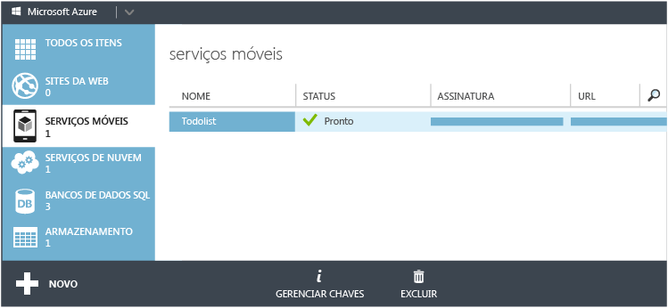

<properties 
	pageTitle="Introdução às notificações por push (Android JavaScript) | Centro de desenvolvimento dos Serviços Móveis" 
	description="Saiba como usar serviços móveis do Azure para enviar notificações por push para seu aplicativo JavaScript do Android." 
	services="mobile-services, notification-hubs" 
	documentationCenter="android" 
	authors="RickSaling" 
	writer="ricksal" 
	manager="dwrede" 
	editor=""/>

<tags 
	ms.service="mobile-services" 
	ms.workload="mobile" 
	ms.tgt_pltfrm="Mobile-Android" 
	ms.devlang="Java" 
	ms.topic="article" 
	ms.date="10/16/2014" 
	ms.author="ricksal"/>

# Adicionar notificações por push ao seu aplicativo de Serviços Móveis

[AZURE.INCLUDE [mobile-services-selector-get-started-push](../includes/mobile-services-selector-get-started-push.md)]

Este tópico mostra como usar os Serviços Móveis do Azure para enviar notificações por push a um aplicativo Android usando o Google Cloud Messaging (GCM). Neste tutorial, você habilita as notificações por push usando os Hubs de Notificação do Azure no projeto de início rápido. Ao concluir, seu serviço móvel enviará uma notificação por push sempre que um registro for inserido.

Este tutorial explica as etapas básicas para habilitar as notificações por push:

1. [Habilitar o Google Cloud Messaging](#register)
2. [Configurar os Serviços Móveis](#configure)
3. [Adicionar notificações por push ao aplicativo](#add-push)
4. [Atualizar scripts para enviar notificações por push](#update-scripts)
5. [Inserir dados para receber notificações](#test)

>[AZURE.NOTE] Se você gostaria de ver o código-fonte do aplicativo concluído, clique <a href="https://github.com/RickSaling/mobile-services-samples/tree/futures/GettingStartedWithPush/Android" target="_blank">aqui</a>.

##Pré-requisitos

[AZURE.INCLUDE [mobile-services-android-prerequisites](../includes/mobile-services-android-prerequisites.md)]

##Habilitar o Google Cloud Messaging

>[AZURE.NOTE]Para concluir o procedimento, você deve ter uma conta do Google com um endereço de email verificado. Para criar uma nova conta do Google, vá para <a href="http://go.microsoft.com/fwlink/p/?LinkId=268302" target="_blank">accounts.google.com</a>.

[AZURE.INCLUDE [Enable GCM](../includes/mobile-services-enable-Google-cloud-messaging.md)]

Em seguida, você usará esse valor de chave de API para habilitar os Serviços Móveis para autenticar com o GCM e enviar notificações por push em nome do seu aplicativo.

##Configurar Serviços Móveis para enviar solicitações por push

1. Faça logon no [Portal de Gerenciamento do Azure], clique em **Serviços Móveis** e clique em seu aplicativo.

   	

2. Clique na guia **Push**, insira o valor **Chave do API** obtido do GCM no procedimento anterior e clique em **Salvar**.

	>[AZURE.NOTE]Quando você estiver concluindo este tutorial usando um serviço móvel mais antigo, poderá ver um link na parte inferior da guia **Push** que diz **Habilitar Push Aprimorado**. Clique aqui agora para atualizar seu serviço móvel para se integrar com Hubs de Notificação. Essa alteração não pode ser revertida. Para obter detalhes sobre como habilitar as notificações por push aprimoradas em um serviço móvel em produção, consulte <a href="http://go.microsoft.com/fwlink/p/?LinkId=391951">esta orientação</a>.

   	

	> [AZURE.IMPORTANTE] Quando você define suas credenciais do GCM para notificações por push aprimoradas na guia Enviar por Push no portal, elas são compartilhadas com os Hubs de Notificação para configurar o hub de notificação com seu aplicativo.

O serviço móvel e seu aplicativo agora estão configurados para trabalhar com os GCM e os Hubs de Notificação.

##Adicionar notificações por push ao seu aplicativo

###Verificar Versão de SDK do Android

[AZURE.INCLUDE [Verify SDK](../includes/mobile-services-verify-android-sdk-version.md)]

A próxima etapa é instalar os serviços do Google Play. O Google Cloud Messaging tem alguns requisitos mínimos de nível de API para desenvolvimento e teste, com os quais a propriedade **minSdkVersion** no Manifesto deve estar em conformidade. 

Se estiver testando com um dispositivo mais antigo, consulte [Configurar o SDK do Google Play Services] para determinar o mínimo que pode ser definido para esse valor e defina-o de maneira apropriada.

###Inclua o Google Play Services no projeto

[AZURE.INCLUDE [Add Play Services](../includes/mobile-services-add-Google-play-services.md)]

###Incluir código

[AZURE.INCLUDE [mobile-services-android-getting-started-with-push](../includes/mobile-services-android-getting-started-with-push.md)]

##Atualizar o script de inserção registrado no Portal de Gerenciamento

1. No Portal de Gerenciamento, clique na guia **Dados** e clique na tabela **TodoItem**. 

   	

2. Em **todoitem**, clique na guia **Script** e selecione **Inserir**.
   
  	

   	Isso exibirá a função chamada quando ocorrer uma inserção na tabela **TodoItem**.

3. Substitua a função de inserção pelo seguinte código e clique em **Salvar**:

		function insert(item, user, request) {
		// Define a payload for the Google Cloud Messaging toast notification.
		var payload = {
		    data: {
		        message: item.text 
		    }
		};		
		request.execute({
		    success: function() {
		        // If the insert succeeds, send a notification.
		        push.gcm.send(null, payload, {
		            success: function(pushResponse) {
		                console.log("Sent push:", pushResponse, payload);
		                request.respond();
		                },              
		            error: function (pushResponse) {
		                console.log("Error Sending push:", pushResponse);
		                request.respond(500, { error: pushResponse });
		                }
		            });
		        },
		    error: function(err) {
		        console.log("request.execute error", err)
		        request.respond();
		    }
		  });
		}

   	Isso registra um novo script de inserção, que usa o [objeto gcm] para enviar uma notificação por push a todos os dispositivos registrados depois que a inserção for bem-sucedida. 

##Testar notificações por push no seu aplicativo

Você pode testar o aplicativo anexando um telefone Android com um cabo USB diretamente ou usando um dispositivo virtual no emulador.

###Configurando o emulador para teste

Quando você executa o aplicativo no emulador, certifique-se de usar um Android Virtual Device (AVD) que dá suporte a APIs do Google.

1. Reinicie o Eclipse e, em seguida, no Gerenciador de Pacotes, clique com botão direito do mouse no projeto, clique em **Propriedades**, em **Android**, marque **APIs do Google** e clique em **OK**.

	

  	Isso tem como alvo o projeto para APIs do Google.

2. Na **Janela**, selecione **Android Virtual Device Manager**, selecione o dispositivo e clique em **Editar**.

	

3. Selecione **APIs do Google** em **Destino** e clique em OK.

   	

	Destina-se ao AVD para usar APIs do Google.

###Executando o teste

1. No menu **Executar** no Eclipse, clique em **Executar** para iniciar o aplicativo.

2. No aplicativo, digite um texto significativo, como _Uma nova tarefa de Serviços Móveis_ e clique no botão **Adicionar**.

  	

3. Passe o dedo para baixo da parte superior da tela para abrir a Central de Notificação do dispositivo para ver a notificação.

Este tutorial foi concluído com êxito.

## Próximas etapas

<!---Este tutorial demonstrou os conceitos básicos de como habilitar um aplicativo Android para usar Serviços Móveis e Hubs de Notificação para enviar notificações por push. Em seguida, considere concluir o próximo tutorial, [Enviar notificações por push para usuários autenticados], que permite mostrar como usar marcas para enviar notificações por push de um Serviço Móvel para um único usuário autenticado.

+ [Enviar notificações por push para usuários autenticados]
	 Saiba como usar marcas para enviar notificações por push de um Serviço Móvel para apenas um usuário autenticado.

+ [Enviar notificações de transmissão para assinantes]
	 Saiba como os usuários podem registrar e receber notificações por push para categorias de interesse.

+ [Enviar notificações baseadas em modelo para assinantes]
	 Saiba usar modelos para enviar notificações por push de um Serviço Móvel, sem precisar colocar cargas específicas de plataforma no seu back-end.
-->

Saiba mais sobre os Serviços Móveis e Hubs de Notificação nos tópicos a seguir:

* [Introdução aos dados]
   Saiba mais sobre como armazenar e consultar dados usando os serviços móveis.

* [Introdução à autenticação]
   Saiba como autenticar os usuários de seu aplicativo com diferentes tipos de conta usando serviços móveis.

* [O que são Hubs de Notificação?]
   Saiba mais sobre como os Hubs de Notificação funcionam para entregar notificações aos seus aplicativos entre todas as diversas principais plataformas de cliente.

* [Depurar aplicativos de Hubs de Notificação](http://go.microsoft.com/fwlink/p/?linkid=386630)
   Obter orientação ao solucionar problemas ou ao depurar soluções de hubs de notificação. 

* [Como usar a biblioteca de cliente Android para os serviços móveis]
   Saiba mais sobre como usar os Serviços Móveis com o Android.

* [Referência de script de servidor dos Serviços Móveis]
   Saiba mais sobre como implementar a lógica de negócios no seu serviço móvel.

<!-- Anchors. -->
[Registrar seu aplicativo para notificações por push e configurar os Serviços Móveis]: #register
[Atualizar o código de notificação por push gerado]: #update-scripts
[Inserir dados para receber notificações]: #test
[Próximas etapas]:#next-steps

<!-- Images. -->
[13]: ./media/mobile-services-windows-store-javascript-get-started-push/mobile-quickstart-push1.png
[14]: ./media/mobile-services-windows-store-javascript-get-started-push/mobile-quickstart-push2.png

<!-- URLs. -->
[Enviar uma página do aplicativo]: http://go.microsoft.com/fwlink/p/?LinkID=266582
[Meus Aplicativos]: http://go.microsoft.com/fwlink/p/?LinkId=262039
[Live SDK para Windows]: http://go.microsoft.com/fwlink/p/?LinkId=262253
[Introdução aos Serviços Móveis]: /en-us/documentation/articles/mobile-services-android-get-started/
[Introdução aos dados]: /en-us/documentation/articles/mobile-services-android-get-started-data/
[Introdução à autenticação]: /en-us/documentation/articles/mobile-services-android-get-started-users
[Introdução às notificações por push]: /en-us/develop/mobile/tutorials/get-started-with-push-js
[Notificações por push para usuários do aplicativo]: /en-us/develop/mobile/tutorials/push-notifications-to-users-js
[Autorizar usuários com scripts]: /en-us/develop/mobile/tutorials/authorize-users-in-scripts-js
[JavaScript e HTML]: /en-us/develop/mobile/tutorials/get-started-with-push-js
[Configurar o SDK do Google Play Services]: http://go.microsoft.com/fwlink/?LinkId=389801
[Portal de Gerenciamento do Azure]: https://manage.windowsazure.com/
[Como usar a biblioteca de cliente Android para os serviços móveis]: /en-us/documentation/articles/mobile-services-android-how-to-use-client-library

[objeto GCM]: http://go.microsoft.com/fwlink/p/?LinkId=282645

[Referência de script de servidor dos Serviços Móveis]: http://go.microsoft.com/fwlink/?LinkId=262293

[Enviar notificações por push para usuários autenticados]: /en-us/documentation/articles/mobile-services-javascript-backend-android-push-notifications-app-users/

[O que são Hubs de Notificação?]: /en-us/documentation/articles/notification-hubs-overview/
[Enviar notificações de transmissão para assinantes]: /en-us/documentation/articles/notification-hubs-android-send-breaking-news/
[Enviar notificações baseadas em modelo para assinantes]: /en-us/documentation/articles/notification-hubs-android-send-localized-breaking-news/
\n<!--HONumber=42-->
