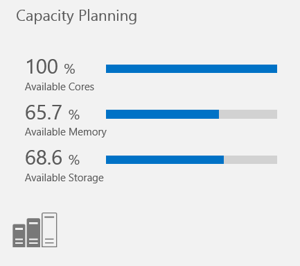
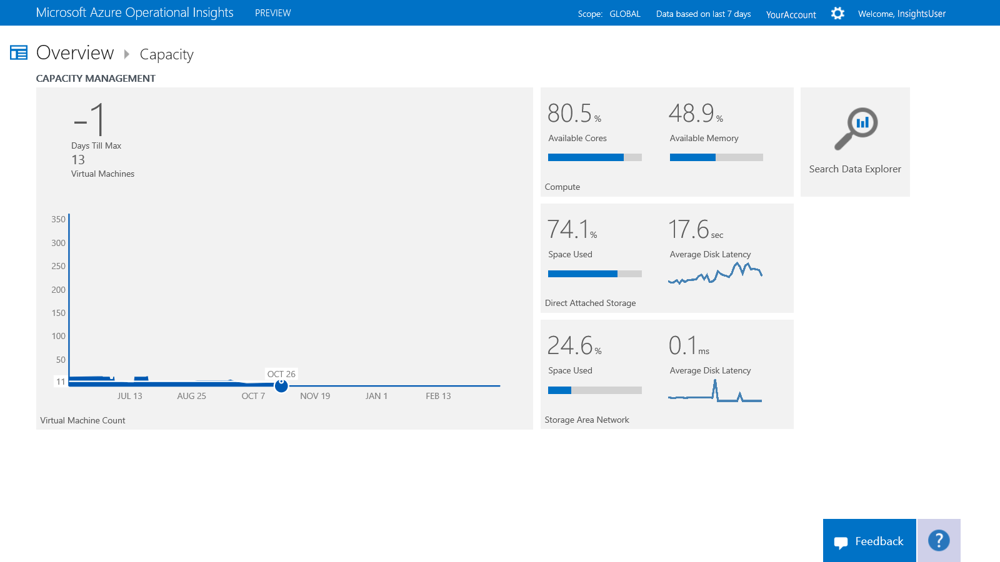
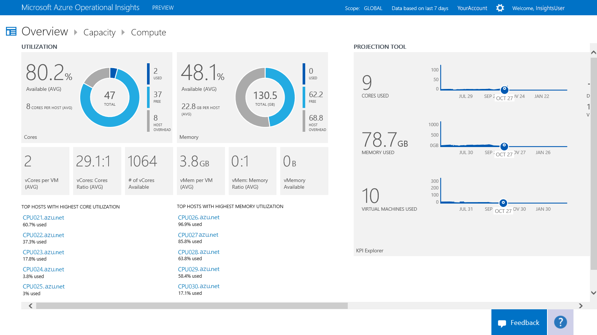
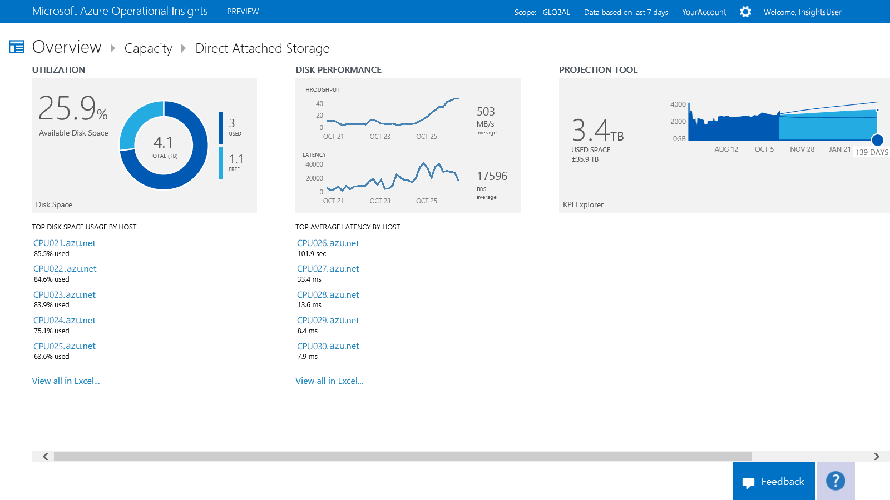

<properties 
   pageTitle="Gerenciar a capacidade de infraestrutura"
   description="Aprenda a usar o pacote de inteligência de planejamento de capacidade no Insights Operacionais para ajudar a compreender a capacidade da sua infraestrutura de servidor"
   services="operational-insights"
   documentationCenter=""
   authors="bandersmsft"
   manager="jwhit"
   editor="tysonn" />
<tags 
   ms.service="operational-insights"
   ms.devlang="na"
   ms.topic="article"
   ms.tgt_pltfrm="na"
   ms.workload="na"
   ms.date="03/20/2015"
   ms.author="banders" />

# Gerenciar a capacidade de infraestrutura

Você pode usar o pacote de inteligência de planejamento de capacidade no Insights Operacionais do Microsoft Azure para ajudá-lo a compreender a capacidade da sua infraestrutura de servidor. Instale o pacote de inteligência para atualizar o agente do Operations Manager e o módulo de configuração básica do Insights Operacionais. O pacote de inteligência lê os contadores de desempenho no servidor monitorado e envia dados de uso para o serviço de informações operacionais na nuvem para processamento. Lógica é aplicada aos dados de uso e o serviço de nuvem registra os dados. Ao longo do tempo, padrões de uso são identificados e a capacidade é projetada com base no consumo atual.

Por exemplo, uma projeção pode identificar quando a núcleos do de processador adicionais ou memória adicional serão necessários para um servidor individual. Neste exemplo, a projeção pode indicar que o servidor precisará de mais memória em 30 dias. Isso pode ajudá-lo a planejar uma atualização de memória durante a próxima janela de manutenção do servidor, que pode ocorrer uma vez a cada duas semanas.

## Painel de gerenciamento de capacidade

Antes de poder usar o painel de gerenciamento de capacidade no Insights Operacionais do Microsoft Azure, você deve ter o pacote de inteligência instalado. Para saber mais sobre como instalar pacotes de inteligência, consulte [Usar a Galeria para adicionar ou remover pacotes de inteligência](operational-insights-add-intelligence-packs.md). Após a instalação do pacote de inteligência de planejamento de capacidade, você pode exibir a capacidade dos seus servidores monitorados usando o bloco **Planejamento de Capacidade** na página **Visão Geral** do Insights Operacionais. 

O bloco abre o painel **Gerenciamento de Capacidade**, em que você pode exibir um resumo da capacidade do servidor. A página exibe os seguintes blocos em que você pode clicar:

- *Contagem de máquina virtual*: Mostra o número de dias restantes para a capacidade das máquinas virtuais

- *Computação*: Mostra os núcleos do processador e a memória disponível

- *Armazenamento*: Mostra o espaço em disco usado e a latência média do disco

- *Pesquisa*: O Gerenciador de dados que você pode usar para pesquisar todos os dados no sistema do Insights Operacionais

>[AZURE.NOTE] Para exibir dados de gerenciamento de capacidade, habilite a conectividade do Operations Manager com o Virtual Machine Manager (VMM). Para obter informações adicionais sobre como conectar os sistemas, consulte Como conectar o VMM com o Operations Manager.

### Para exibir uma página de capacidade

- Na página **Visão Geral**, clique em **Gerenciamento de Capacidade** e, em seguida, clique em **Computação** ou **Armazenamento**.

## Página de computação

Você pode usar o painel **Computação** no Insights Operacionais do Microsoft Azure para exibir informações de capacidade sobre utilização, dias de capacidade projetados e a eficiência relacionada à sua infraestrutura. Você usa a área **Utilização** para exibir a utilização do núcleo e da memória da CPU em seus hosts de máquina virtual. Você pode usar a ferramenta de projeção para estimar quanta capacidade deve estar disponível para um determinado intervalo de datas. Você pode usar a área **Eficiência** para ver quão eficientes são os hosts da máquina virtual. Você pode exibir detalhes sobre itens vinculados clicando neles.

Você pode gerar uma pasta de trabalho do Excel para as seguintes categorias:

- Hosts principais com maior utilização de núcleo

- Hosts principais com maior utilização de memória

- Hosts principais com máquinas virtuais ineficientes

- Hosts principais por utilização

- Hosts com menor utilização

As seguintes áreas são mostradas no painel **Computação**:

**Utilização**: Exiba a utilização de memória e núcleo da CPU em seus hosts da máquina virtual.

- *Núcleos usados*: Soma de todos os hosts (% da CPU utilizada multiplicada pelo número de núcleos físicos no host).

- *Núcleos livres*: Total de núcleos físicos menos núcleos usados.

- *Percentual de núcleos disponíveis*: Núcleos físicos livres divididos pelo número total de núcleos físicos.

- *Núcleos virtuais por VM*: Total de núcleos virtuais no sistema dividido pelo número total de máquinas virtuais no sistema.

- *Proporção de núcleos virtuais para núcleos físicos*: Proporção do total de núcleos virtuais para núcleos físicos que são usados por máquinas virtuais no sistema.

- *Número de núcleos virtuais disponíveis*: Proporção de núcleo virtual para núcleos físicos multiplicada pelos núcleos físicos disponíveis.

- *Memória usada*: Soma da memória utilizada por todos os hosts.

- *Memória livre*: Memória física total menos a memória usada.

- *Percentual de memória disponível*: Memória física livre dividida pelo total de memória física.

- *Memória virtual por VM*: Memória virtual total no sistema dividida pelo número total de máquinas virtuais no sistema.

- *Proporção de memória virtual para memória física*: Memória virtual total no sistema dividida pela memória física total no sistema.

- *Memória virtual disponível*: Proporção de memória virtual para memória física multiplicada pela memória física disponível.

**Ferramenta de projeção**

Usando a ferramenta de projeção, você pode exibir as tendências históricas para a utilização de recursos. Isso inclui as tendências de uso de máquinas virtuais, memória, núcleo e armazenamento. A funcionalidade de projeção usa um algoritmo de projeção para ajudá-lo a saber quando você está com pouco de cada um dos recursos. Isso ajuda a calcular o planejamento de capacidade adequado para que você possa saber quando precisa adquirir mais capacidade (por exemplo, memória, núcleos ou armazenamento).

**Eficiência**

- *VM ociosa*: Usando menos de 10% da CPU e 10% da memória para o período de tempo especificado.

- *VM superutilizada*: Usando mais de 90% da CPU e 90% da memória para o período de tempo especificado.

- *Host ocioso*: Usando menos de 10% da CPU e 10% da memória para o período de tempo especificado.

- *Host Superutilizado*: Usando mais de 90% da CPU e 90% da memória para o período de tempo especificado.

### Para trabalhar com itens na página Computação

1. No painel **Computação**, na área **Utilização**, exiba informações de capacidade sobre os núcleos e a memória da CPU em uso.

2. Clique em um item para abri-lo na página de **Pesquisa** e exiba informações detalhadas sobre ele.

3. Na ferramenta **Projeção**, mova o controle deslizante de data para exibir uma projeção da capacidade que será usada na data que você escolher.

3. Na área **Eficiência**, exiba informações de eficiência da capacidade sobre máquinas virtuais e hosts de máquina virtual.

## Página Armazenamento Anexado Direto

Você pode usar o painel **Armazenamento Anexado Direto** no Insights Operacionais do Microsoft Azure para exibir informações de capacidade sobre utilização do armazenamento, desempenho do disco e dias projetados da capacidade do disco. Use a área **Utilização** para exibir o uso de espaço em disco em seus hosts de máquina virtual. Use a área **Desempenho do Disco** para exibir a taxa de transferência e a latência do disco e nos hosts da máquina virtual. Você também pode usar a ferramenta de projeção para estimar quanto de capacidade deve estar disponível para um determinado intervalo de datas. Você pode exibir detalhes sobre itens vinculados clicando neles.

Você pode gerar uma pasta de trabalho do Excel com base nessas informações de capacidade para as seguintes categorias:

- Maior uso de espaço em disco por host

- Maior latência média por host

As seguintes áreas são mostradas na página **Armazenamento**:

- *Utilização*: Exiba o uso de espaço em disco nos hosts da máquina virtual.

- *Espaço Total em Disco*: Soma (espaço em disco lógico) para todos os hosts

- *Espaço em Disco Usado*: Soma (espaço em disco lógico utilizado) para todos os hosts

- *Espaço em Disco Disponível*: Espaço total em disco menos o espaço em disco usado

- *Percentual do disco usado*: Espaço em disco utilizado dividido pelo espaço total em disco

- *Percentual do disco disponível*: Espaço em disco disponível dividido pelo espaço total em disco

**Desempenho do Disco**

Usando Insights Operacionais, você pode exibir a tendência de uso histórico do espaço em disco. A funcionalidade de projeção usa um algoritmo para projetar o uso futuro. Para uso do espaço em particular, a capacidade de projeção permite projetar quando você poderá ficar sem espaço em disco. Isso ajudará a planejar o armazenamento adequado e saber quando você precisa adquirir mais armazenamento.

**Ferramenta de projeção**

Usando a ferramenta de projeção, você pode exibir as tendências históricas para utilização do espaço em disco. A funcionalidade de projeção também permite projetar quando você ficará com pouco espaço em disco. Isso ajudará a planejar a capacidade adequada e a saber quando você precisa adquirir mais capacidade de armazenamento.

### Para trabalhar com itens na página Armazenamento Anexado Direto

1. No painel **Armazenamento Anexado Direto**, na área **Utilização**, você pode exibir as informações de utilização do disco.

2. Clique em um item vinculado para abri-lo na página de **Pesquisa** e exibir informações detalhadas sobre ele.

3. Na área **Desempenho do Disco**, você pode exibir informações de taxa de transferência e latência de disco.

4. Na **ferramenta Projeção**, mova o controle deslizante de data para exibir uma projeção da capacidade que será usada na data que você escolher.

<!--HONumber=52-->