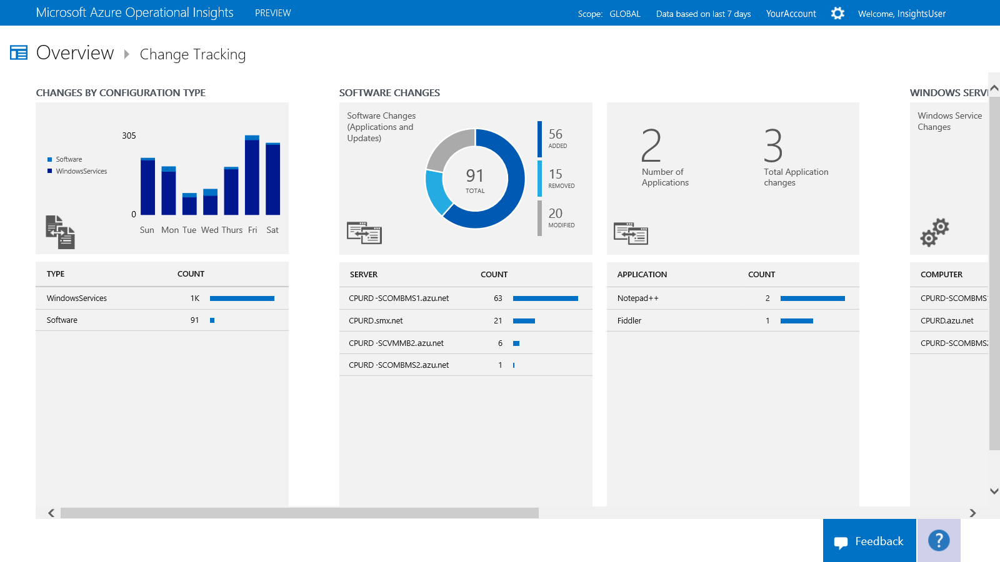
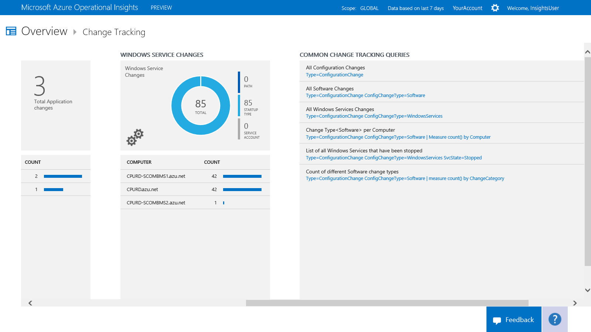

<properties 
   pageTitle="Identificar diferenças com o controle de alterações"
   description="Use o pacote de inteligência de Controle de Alterações de Configuração no Insights Operacionais do Microsoft Azure para ajudá-lo a identificar facilmente as alterações no software e nos Serviços Windows que ocorrem em seu ambiente"
   services="operational-insights"
   documentationCenter=""
   authors="bandersmsft"
   manager="jwhit"
   editor="tysonn" />
<tags 
   ms.service="operational-insights"
   ms.devlang="na"
   ms.topic="article"
   ms.tgt_pltfrm="na"
   ms.workload="na"
   ms.date="03/20/2015"
   ms.author="banders" />

# Identificar diferenças com o controle de alterações

Você pode usar o pacote de inteligência de Controle de Alterações de Configuração no Insights Operacionais do Microsoft Azure para ajudá-lo a identificar facilmente as alterações ao software e serviços do Windows que ocorrem em seu ambiente - identificar essas alterações de configuração pode ajudá-lo a detectar problemas operacionais.

Instale o pacote de inteligência para atualizar o agente do Operations Manager e o módulo de configuração básica do Insights Operacionais. Alterações a software e serviços do Windows instalados nos servidores monitorados são lidas e, em seguida, os dados são enviados para o serviço Insights Operacionais na nuvem para processamento. A lógica é aplicada aos dados recebidos e o serviço de nuvem registra os dados. Quando as alterações são encontradas, os servidores com as alterações são mostrados no painel Controle de Alterações. Usando as informações no painel Controle de Alterações, você pode ver facilmente as alterações feitas à sua infraestrutura de servidor.

## Use o Controle de Alterações

Antes de poder usar o Controle de Alterações no Insights Operacionais, você deve ter o pacote de inteligência instalado. Para saber mais sobre como instalar pacotes de inteligência, consulte [Usar a Galeria para adicionar ou remover pacotes de inteligência](operational-insights-add-intelligence-packs.md). 

Após a instalação, você pode exibir o resumo das alterações aos servidores monitorados usando o bloco **Controle de Alterações** na página **Visão geral** do Insights Operacionais. 

Você pode exibir as alterações à sua infraestrutura e então analisar em detalhes para as seguintes categorias:

- Alterações por tipo de configuração para serviços de software e do Windows

- Alterações de software para aplicativos e atualizações para servidores individuais

- Número total de alterações de software para cada aplicativo

- Alterações no serviço Windows para servidores individuais

### Para exibir as alterações para qualquer tipo de alteração

1. Na página **Visão Geral**, clique no bloco **Controle de Alterações**.

2. No painel **Controle de Alterações**, revise as informações resumidas em uma das folhas de tipo de alteração e, em seguida, clique em uma para exibir informações detalhadas sobre ela na página de **Pesquisa**.

3. Em qualquer uma das páginas de Pesquisa, você pode exibir os resultados por tempo, resultados detalhados e o histórico de pesquisa. Você também pode filtrar por facetas para restringir os resultados.

4. Em qualquer página em Pesquisa, você pode **Exportar** os detalhes de resultados em um arquivo CSV que você pode abrir com o Excel ou outro aplicativo que você então você pode exibir ou modificar.

<!--HONumber=52-->