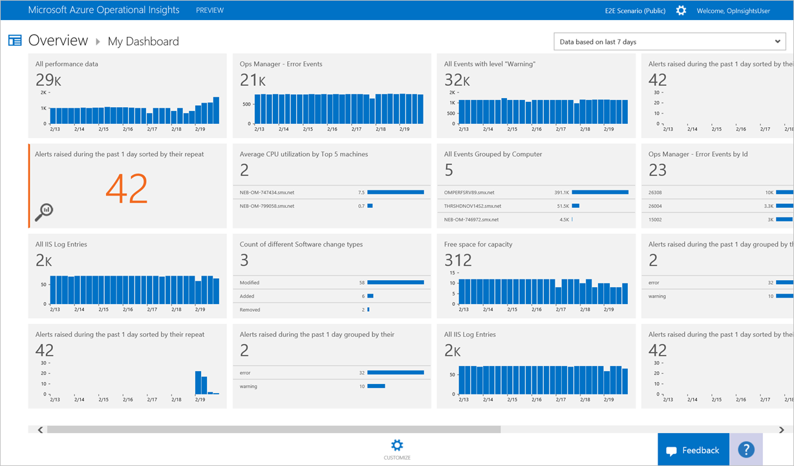
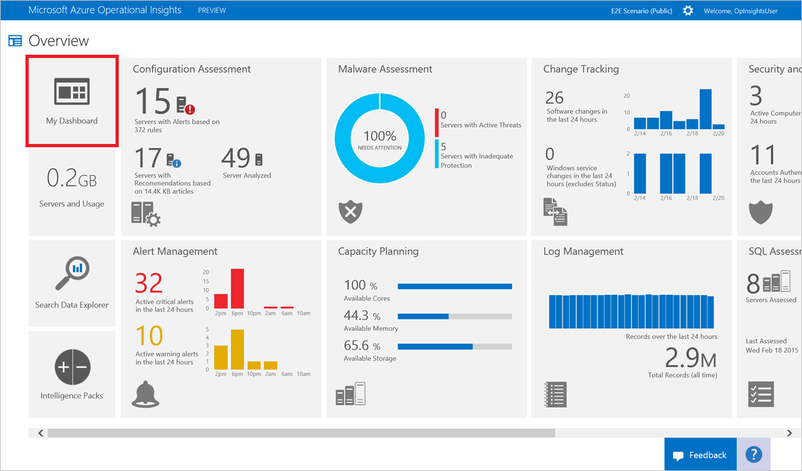
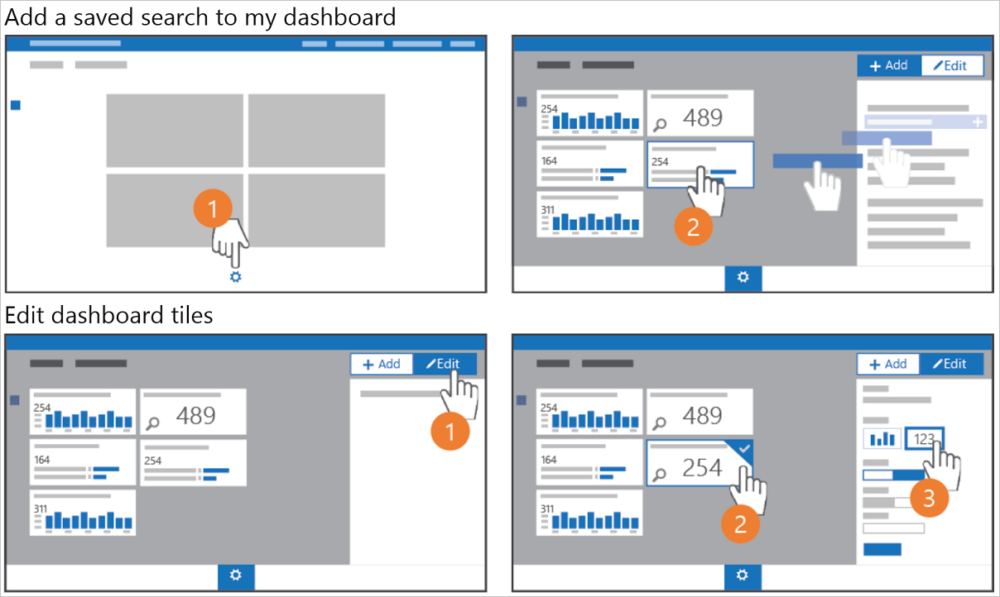
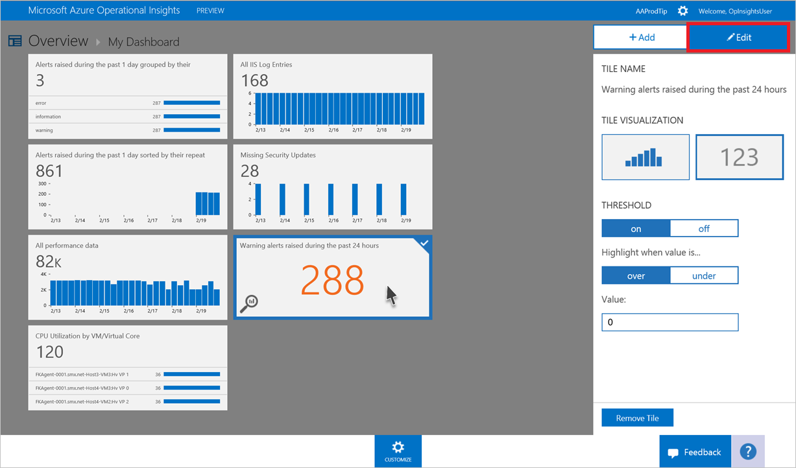
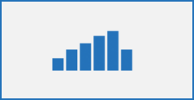
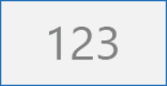

<properties 
	pageTitle="Painéis de Informações Operacionais" 
	description="Artigo informativo sobre o uso básico do painel para as Informações Operacionais" 
	services="operational-insights" 
	documentationCenter="" 
	authors="bandersmsft" 
	manager="jwhit" 
	editor=""/>

<tags 
	ms.service="operational-insights" 
	ms.workload="na" 
	ms.tgt_pltfrm="na" 
	ms.devlang="na" 
	ms.topic="article" 
	ms.date="04/30/2015" 
	ms.author="banders"/>

# Painéis de Informações Operacionais

[AZURE.INCLUDE [operational-insights-note-moms](../includes/operational-insights-note-moms.md)]

Este guia ajuda a entender como os Painéis de Informações Operacionais podem visualizar todas as pesquisas salvas, dando a você uma lente única para exibir seu ambiente.

## Como crio meu painel?

Para começar, vá para a Visão Geral das Informações Operacionais do Azure clicando no botão Visão Geral na navegação à esquerda. Você verá o bloco "Meu Painel" à esquerda. Clique para fazer uma busca detalhada do painel.

## Adicionando um bloco

Nos painéis, os blocos são ativados pelas pesquisas salvas. As Informações Operacionais vêm com muitas pesquisas salvas previamente, portanto, você pode começar imediatamente. Você verá a seguinte ilustração explicando como começar.

Na exibição Meu Painel, basta clicar na engrenagem 'personalizar' na parte inferior da página para entrar no modo de personalização. O painel que é aberto no lado direito da página mostra todas as pesquisas salvas do seu espaço de trabalho.

Para visualizar uma pesquisa salva como um bloco, simplesmente arraste-a para o espaço vazio à esquerda. Quando você arrastar, ela se transformará em um bloco.

## Editar um bloco

Na exibição Meu Painel, basta clicar na engrenagem 'personalizar' na parte inferior da página para entrar no modo de personalização. Clique no bloco que você deseja editar. O painel direito muda para editar e fornece uma seleção de opções: 

### Visualizações do bloco#
Há dois tipos de visualizações do bloco para escolher:

**Gráfico de Barras** 
 

Exibe uma linha do tempo dos resultados salvos da pesquisa ou uma lista de resultados por campo, dependendo de sua pesquisa agregar os resultados por campo ou não.

**Métrica** 
 

Exibe as visitas totais dos resultados da pesquisa como um número em um bloco. Os blocos da métrica permitem que você defina um limite que destacará o bloco quando o limite for atingido.

### Limite
Você pode criar um limite em um bloco usando a visualização Métrica. Selecione para criar um valor de limite no bloco. Escolha se é para destacar o bloco quando o valor fica acima ou abaixo do limite escolhido, então, defina o valor de limite abaixo.

## Organizando o painel
Para organizar seu painel, navegue para a exibição Meu Painel e clique na engrenagem 'personalizar' na parte inferior da página para entrar no modo de personalização. Clique e arraste o bloco que você deseja mover e mova-o para onde deseja que fique.

## Remover um bloco
Para remover um bloco, navegue para a exibição Meu Painel e clique na engrenagem **personalizar** na parte inferior da página para entrar no modo de personalização. Selecione o bloco que você deseja remover, clique no painel direito e selecione **Remover Bloco**. 
<!--HONumber=54-->