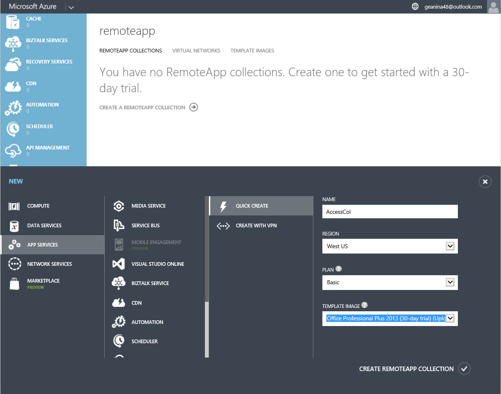
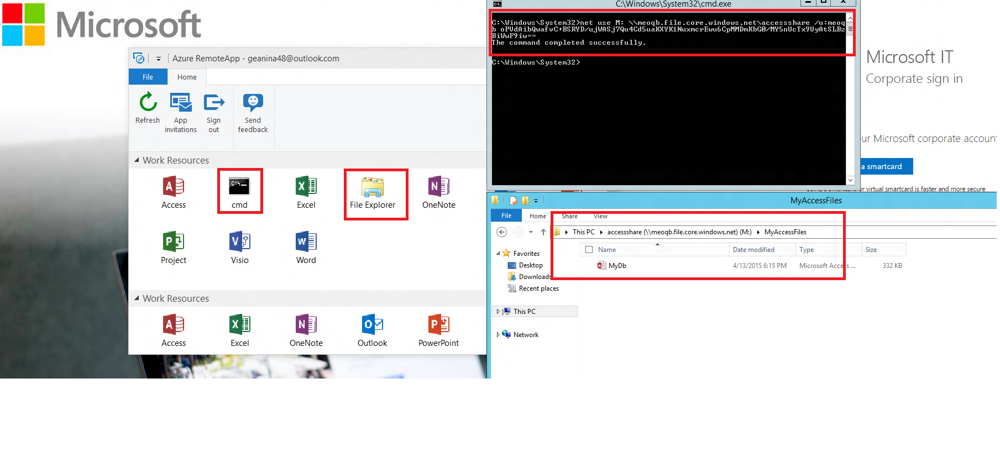
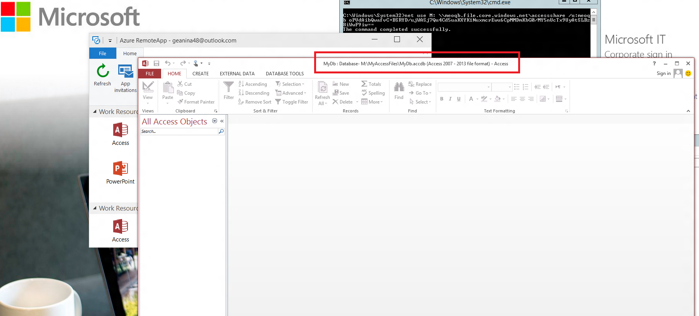

<properties
   pageTitle="Execute qualquer aplicativo em qualquer dispositivo com o RemoteApp"
   description="Aprenda a compartilhar qualquer aplicativo com os usuários usando o RemoteApp."
   services="remoteapp"
   documentationCenter=""
   authors="lizap"
   manager="mbaldwin"
   editor=""/>

<tags
   ms.service="remoteapp"
   ms.devlang="na"
   ms.topic="article"
   ms.tgt_pltfrm="na"
   ms.workload="compute"
   ms.date="04/14/2015"
   ms.author="elizapo"/>

# Execute qualquer aplicativo em qualquer dispositivo com o RemoteApp

Este tutorial mostra como executar aplicativos do Windows em qualquer lugar em qualquer dispositivo, agora, de verdade. Seja o Internet Explorer 6, um aplicativo personalizado escrito há 10 anos ou um aplicativo do Office, os usuários não precisam mais estar vinculados a um sistema operacional específico (como o Windows XP) para esses poucos aplicativos.

Usando o RemoteApp, os usuários também podem usar seus próprios dispositivos Android ou Apple e obter a mesma experiência que eles têm no Windows (ou no Windows Phone). Isso é realizado hospedando seus aplicativos do Windows em uma coleção de máquinas virtuais do Windows no Azure onde os usuários podem acessá-los em qualquer lugar em que com conexão à Internet. Agora vamos começar!

Para este tutorial, vamos compartilhar o acesso com todos os nossos usuários. Como o Access é um banco de dados e queremos que esse banco de dados seja útil, podemos realizar algumas etapas adicionais para permitir que os usuários acessem o compartilhamento de dados do Access.

[AZURE.INCLUDE [free-trial-note](../includes/free-trial-note.md)]

## Criar uma coleção de RemoteApp

Comece pela criação de uma coleção. A coleção serve como um contêiner para seus aplicativos e usuários. Cada coleção é baseada em uma imagem - você pode criar sua própria ou usar uma fornecida com sua assinatura. Para este tutorial, estamos usando a imagem de avaliação do Office 2013 - ela contém o aplicativo deseja compartilhar.

1. No portal de gerenciamento do Azure, role para baixo no painel de navegação à esquerda até ver o Azure RemoteApp. Abra essa página.
2. Clique em **Criar uma coleção de RemoteApp**.
3. Clique em **Criação rápida** e digite um nome para a coleção.
4. Selecione a região que você deseja usar para criar sua coleção. Para obter a melhor experiência, selecione a região mais próxima geograficamente do local onde os usuários acessarão o aplicativo. Por exemplo, neste tutorial, os usuários estarão localizados em Redmond, Washington. A região do Azure mais próxima é **Oeste dos EUA**.
5. Selecione o plano de cobrança que você deseja usar. O plano de cobrança básico coloca 16 usuários em uma VM grande do Azure, enquanto o plano de cobrança padrão tem 10 usuários em uma VM grande do Azure. Como um exemplo geral, o plano básico funciona muito bem para fluxo de trabalho de tipo de entrada de dados. Para um aplicativo de produtividade, como o Office, você desejaria o plano padrão. 
6. Por fim, selecione a imagem do Office 2013 Professional. Esta imagem contém aplicativos do Office 2013.  
7. Clique em **Criar coleção do RemoteApp**.

Isso inicia a criação de sua coleção, mas pode demorar até uma hora.

Agora você está pronto para adicionar os usuários.

## Compartilhar o aplicativo com usuários

Depois que a coleção foi criada com êxito, é hora de publicar o Access a usuários e adicionar os usuários que devem ter acesso a ele.

Se você navegou para fora do nó do Azure RemoteApp enquanto a coleção estava sendo criada, comece fazendo seu caminho de volta para ele na home page do Azure.

1. Clique em **RemoteApp** no painel de navegação à esquerda.
2. Clique na coleção que você criou anteriormente para acessar opções adicionais e configurar a coleção. 
3. Na guia **Publicação**, clique em **Publicar** na parte inferior da tela e, em seguida, clique **Publicar programas do menu Iniciar**. 
4. Selecione os aplicativos que você deseja publicar na lista. Para nossa finalidade, escolhemos o Access. Clique em **Concluído**. Aguarde até que os aplicativos concluam a publicação. 

1. Quando o aplicativo tiver terminado de publicação, vá até a guia **Acesso de usuário** para adicionar todos os usuários que precisem acessar seus aplicativos. Insira nomes de usuário (endereço de email) para seus usuários e, em seguida, clique em **Salvar**. 

1. Agora, é hora de falar aos usuários sobre esses novos aplicativos e como acessá-los. Para fazer isso, envie um email que os direcione para a URL de download do cliente de área de trabalho remota. 

## Configurar o acesso ao Access

Alguns aplicativos precisam de configuração adicional após você implantá-los por meio do RemoteApp. Em particular, para o Access, vamos criar um compartilhamento de arquivo no Azure que qualquer usuário pode acessar. (Se não quiser fazer isso, você pode criar uma [coleção híbrida](remoteapp-create-hybrid-deployment.md) [em vez de nossa coleção de nuvem], que permite que os usuários acessem arquivos e suas informações em sua rede local.) Em seguida, precisaremos dizer a nossos usuários para mapear uma unidade local no seu computador para o sistema de arquivos do Azure.

A primeira parte você, no papel de administrador, faz. Em seguida, temos algumas etapas para seus usuários.

1. Comece publicando a interface de linha de comando (cmd.exe). Na guia **Publicação**, selecione **cmd** e, em seguida, clique em **Publicar > Publicar programa usando o caminho**.
2. Digite o nome do aplicativo e o caminho. Para nosso objetivo, use "Gerenciador de Arquivos" como o nome e "% SYSTEMDRIVE%\\windows\\explorer.exe" como o caminho. 
3. Agora, você precisa criar uma [conta de armazenamento](storage/storage-create-storage-account.md) do Azure. Nomeamos o nosso "accessstorage", então escolha um nome que seja significativo para você (pode haver apenas um "accessstorage"). 
4. Agora volte ao seu painel para que você possa obter o caminho para o armazenamento (local de ponto de extremidade). Você usará isso daqui a pouco, portanto certifique-se de copiá-lo em algum lugar. 
5. Em seguida, quando a conta de armazenamento tiver sido criada, você precisa da chave de acesso primário. Clique em **Gerenciar chaves de acesso** e, em seguida, copie a chave de acesso primário.
6. Agora, defina o contexto da conta de armazenamento, crie um novo compartilhamento de arquivo para o Access. Execute os seguintes cmdlets em uma janela elevada do Windows PowerShell:
   
        $ctx=New-AzureStorageContext <account name> <account key>
    	$s = New-AzureStorageShare <share name> -Context $ctx

	Estes são os cmdlets que executamos para nosso compartilhamento:
    
	    $ctx=New-AzureStorageContext accessstorage <key>
    	$s = New-AzureStorageShare <share name> -Context $ctx

Agora, é a vez do usuário. Primeiro, faça com que os usuários instalem um [cliente RemoteApp](remoteapp-clients.md). Em seguida, os usuários precisam mapear uma unidade de sua conta para esse compartilhamento de arquivo do Azure criado por você e adicionar seus arquivos do Access. É desse jeito que eles fazem isso:

1. No cliente RemoteApp, acesse os aplicativos publicados. Inicie o programa cmd.exe.
2. Execute o comando a seguir para mapear uma unidade do computador para o compartilhamento de arquivos: net use z: <accountname>.file.core.windows.net<nome do compartilhamento> /u:<user name> <account key>
1. Agora, inicie o aplicativo do Gerenciador de arquivos no RemoteApp. Copie quaisquer arquivos do Access que você deseje usar no aplicativo compartilhado para o compartilhamento de arquivos. 
1. Por fim, abra o Access e abra o banco de dados que você acabou de compartilhar. Você deve ver os dados no Access em execução na nuvem. 

Agora você pode usar o Access em qualquer um dos seus dispositivos - certifique-se de instalar um cliente RemoteApp.

<!--Every topic should have next steps and links to the next logical set of content to keep the customer engaged-->
## Próximas etapas

Agora que você já dominou a criação de uma coleção, tente criar uma [coleção que use o Office 365](remoteapp-tutorial-o365anywhere.md). Ou você pode criar uma [coleção híbrida ](remoteapp-create-hybrid-deployment.md)que possa acessar sua rede local.

<!--Image references-->

<!--HONumber=52-->
