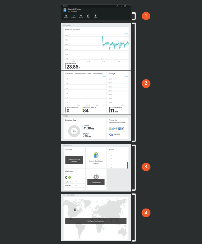
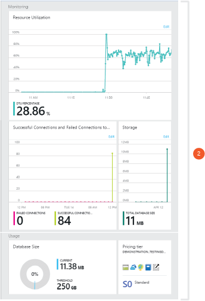
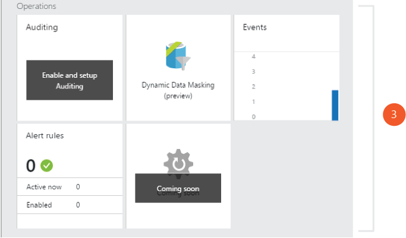
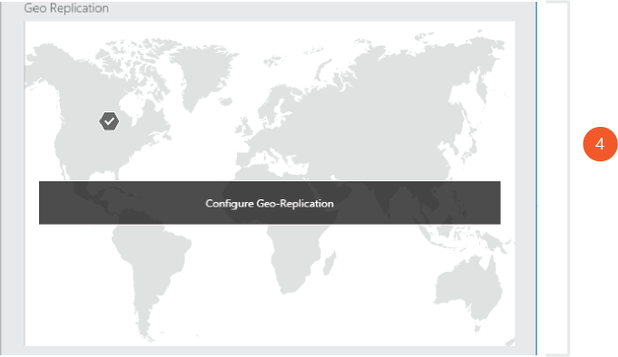

<properties 
	pageTitle="Gerenciar o Bancos de Dados SQL do Azure usando o Portal de Gerenciamento do Azure" 
	description="Saiba como usar o Portal de Gerenciamento do Azure para gerenciar um banco de dados relacional na nuvem." 
	services="sql-database" 
	documentationCenter="" 
	authors="stevestein" 
	manager="jeffreyg" 
	editor=""/>

<tags 
	ms.service="sql-database" 
	ms.devlang="NA" 
	ms.workload="data-management" 
	ms.topic="article" 
	ms.tgt_pltfrm="NA" 
	ms.date="04/14/2015" 
	ms.author="sstein"/>

# Gerenciando Bancos de Dados SQL do Azure usando o Portal de Gerenciamento do Azure

O [Portal de Gerenciamento do Azure][Management Portal] permite que você crie, monitore e gerencie servidores e bancos de dados SQL do Azure. Este artigo destacará as operações de banco de dados que podem ser realizadas usando o Portal de Gerenciamento. Saiba mais sobre as outras ferramentas de gerenciamento de banco de dados SQL do Azure [aqui][AzureDb management overview].

>[AZURE.NOTE]Se você não estiver familiarizado com o Portal de Gerenciamento do Azure, este[tour em vídeo fornecerá uma visão geral][Azure Portal Tour] de seus recursos e conceitos gerais.

## 1. Ações de gerenciamento de banco de dados

O Portal de Gerenciamento do Azure fornece um conjunto de ações comuns de banco de dados acessíveis na parte superior da folha de um banco de dados. Você pode restaurar um banco de dados para um ponto anterior no tempo, abrir um banco de dados no Visual Studio, copiar um banco de dados para um novo servidor e exportar o banco de dados para uma conta de armazenamento do Azure.

## 2. Monitoramento de banco de dados

Por padrão, os bancos de dados SQL do Azure apresentam gráficos de monitoramento de DTU (Unidade de taxa de transferência de banco de dados), do tamanho do banco de dados e da integridade da conexão. Esses gráficos de monitoramento podem ser personalizados e ampliados para mostrar a Porcentagem de CPU, Porcentagem de E/S de dados, Bloqueios, Porcentagem de E/S de log ou até mesmo a porcentagem de solicitações bloqueadas pelo firewall. Para saber mais sobre como personalizar os gráficos de monitoramento, clique [aqui][Azure part monitoring].

Além disso, as regras de alerta podem ser configuradas para monitorar uma métrica especificada e alertar um administrador e coadministrador designados quando os limites predefinidos forem atingidos. Para saber mais sobre como configurar as regras de alerta no Portal de Gerenciamento do Azure, clique [aqui][Azure part monitoring].

## 3. Segurança e auditoria de banco de dados

Os Bancos de Dados SQL do Azure podem ser configurados para rastrear todos os eventos do banco de dados e gravá-los em um log de auditoria em sua conta de armazenamento do Azure. Esse recurso pode ajudar você a manter uma conformidade regulatória, a entender a atividade do banco de dados e a obter informações sobre discrepâncias que poderiam indicar preocupações de negócios ou suspeitas de violações de segurança. Para saber mais sobre auditoria de banco de dados SQL do Azure, clique [aqui][AzureDb Auditing]

Bancos de dados SQL do Azure também podem ser configurados para mascarar dados confidenciais a usuários não privilegiados. Saiba mais sobre os recursos de ocultação de dados dinâmicos de bancos de dados SQL do Azure clicando [aqui][AzureDb datamasking]

## 4. Replicação geográfica

É possível configurar bancos de dados SQL do Azure para replicar de forma assíncrona as transações confirmadas para um banco de dados secundário. Parte de replicação geográfica no Portal de Gerenciamento permite que você selecione a região do Azure na qual gostaria de colocar o banco de dados secundário. Para saber mais sobre a replicação geográfica de banco de dados no Azure, clique [aqui][Database geo-replication]

##Recursos adicionais
* [Introdução ao Banco de Dados SQL][]   
* [Gerenciando o Banco de Dados SQL do Azure usando o SQL Server Management Studio][]   
* [Monitorando o Banco de Dados SQL Usando Exibições de Gerenciamento Dinâmico][]   
* [Referência Transact-SQL (Banco de Dados SQL)][]
  
[Azure Portal Tour]: https://go.microsoft.com/fwlink/?LinkID=522341
[Management Portal]: https://portal.azure.com
[Azure part monitoring]: documentdb-monitor-accounts.md
[AzureDb management overview]: http://azure.microsoft.com/blog/2014/12/22/client-tooling-updates-for-azure-sql-database/
[Introdução ao Banco de Dados SQL]: http://azure.microsoft.com/services/sql-database
[Database geo-replication]: http://azure.microsoft.com/blog/2014/07/12/spotlight-on-sql-database-active-geo-replication/
[Gerenciando o Banco de Dados SQL do Azure usando o SQL Server Management Studio]: sql-database-manage-azure-ssms.md
[Monitorando o Banco de Dados SQL Usando Exibições de Gerenciamento Dinâmico]: http://msdn.microsoft.com/library/windowsazure/ff394114.aspx
[Referência Transact-SQL (Banco de Dados SQL)]: http://msdn.microsoft.com/library/bb510741(v=sql.120).aspx
[AzureDb Auditing]: http://azure.microsoft.com/documentation/articles/sql-database-auditing-get-started/
[AzureDb datamasking]: http://azure.microsoft.com/documentation/articles/sql-database-dynamic-data-masking-get-started/

<!---HONumber=58-->