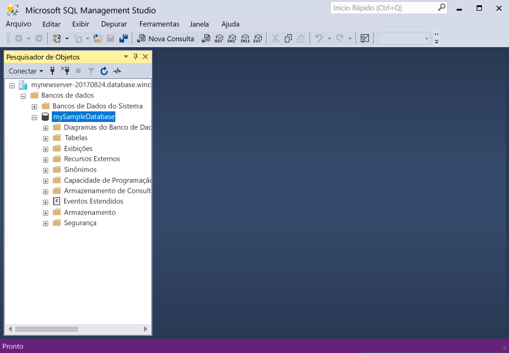

# <a name="azure-sql-database-use-sql-server-management-studio-to-connect-and-query-data"></a>Banco de Dados SQL do Azure: Use o SQL Server Management Studio para conectar e consultar dados

O [SQL Server Management Studio](https://msdn.microsoft.com/library/ms174173.aspx) (SSMS) é uma ferramenta de gerenciamento usada para criar e gerenciar os recursos do SQL Server a partir da interface do usuário ou em scripts. Este guia rápido demonstra como usar o SSMS para conectar um banco de dados SQL do Azure, em seguida, usar instruções Transact-SQL para consultar, inserir, atualizar e excluir os dados no banco de dados. 

Este início rápido usa como ponto de partida os recursos criados em um destes inícios rápidos:

- [Criar Banco de dados - Portal](sql-database-get-started-portal.md)
- [Criar Banco de dados - CLI](sql-database-get-started-cli.md)

Antes de começar, verifique se você instalou a versão mais recente do [SSMS](https://msdn.microsoft.com/library/mt238290.aspx). 

## <a name="get-connection-information"></a>Obter informações de conexão

Obtenha o nome de servidor totalmente qualificado para o servidor de Banco de Dados SQL do Azure no Portal do Azure. Use o nome do servidor totalmente qualificado para se conectar ao servidor usando o SQL Server Management Studio.

1. Faça logon no [Portal do Azure](https://portal.azure.com/).
2. Selecione **Bancos de Dados SQL** no menu à esquerda e clique em seu banco de dados na página **Bancos de Dados SQL**. 
3. No painel **Essentials**, na página do Portal do Azure de seu banco de dados, localize e copie o **Nome do servidor**.

    


## <a name="connect-to-the-server-and-your-new-database"></a>Conecte-se ao servidor e ao seu novo banco de dados

Use o SQL Server Management Studio para estabelecer uma conexão com seu servidor de Banco de Dados SQL do Azure. 

> [!IMPORTANT]
> Um servidor lógico do Banco de Dados SQL do Azure escuta na porta 1433. Se você estiver tentando conectar um servidor lógico do Banco de Dados SQL do Azure de dentro de um firewall corporativo, essa porta deverá estar aberta no firewall corporativo para que você possa conectar-se com êxito.
>

1. Abra o SQL Server Management Studio.

2. Na caixa de diálogo **Conectar ao Servidor**, insira as informações a seguir:
   - **Tipo de servidor**: especifique mecanismo de banco de dados
   - **Nome do servidor**: insira seu nome do servidor totalmente qualificado, como **mynewserver20170313.database.windows.net**
   - **Autenticação**: especifique a Autenticação do SQL Server
   - **Logon**: insira a conta do administrador do servidor
   - **Senha**: insira a senha para sua conta do administrador do servidor

     

3. Clique em **Opções**. Na seção **Conectar banco de dados**, digite **mySampleDatabase** para conectar o banco de dados criado anteriormente.

     

4. Clique em **Conectar**. A janela Pesquisador de Objetos abre no SSMS. 

     

4. No Pesquisador de Objetos, expanda **Bancos de Dados** e expanda **mySampleDatabase** para exibir os objetos no banco de dados de exemplo.

## <a name="query-data"></a>Consultar dados

Use a instrução [SELECT](https://msdn.microsoft.com/library/ms189499.aspx) de Transact-SQL para consultar dados no Banco de Dados SQL do Azure.

1. No Pesquisador de Objetos, clique com o botão direito em **mySampleDatabase** e clique em **Nova Consulta**. Uma janela de consulta em branco conectada ao seu banco de dados é aberta.
2. Na janela de consulta, insira a seguinte consulta:

   ```sql
   SELECT pc.Name as CategoryName, p.name as ProductName
   FROM [SalesLT].[ProductCategory] pc
   JOIN [SalesLT].[Product] p
   ON pc.productcategoryid = p.productcategoryid;
   ```

3. Na barra de ferramentas, clique em **Executar** para recuperar dados das tabelas Product e ProductCategory.

    

## <a name="insert-data"></a>Inserir dados

Use a instrução [INSERT](https://msdn.microsoft.com/library/ms174335.aspx) de Transact-SQL para inserir dados no Banco de Dados SQL do Azure.

1. Na janela de consulta, substitua a consulta anterior pela seguinte consulta:

   ```sql
   INSERT INTO [SalesLT].[Product]
           ( [Name]
           , [ProductNumber]
           , [Color]
           , [ProductCategoryID]
           , [StandardCost]
           , [ListPrice]
           , [SellStartDate]
           )
     VALUES
           ('myNewProduct'
           ,123456789
           ,'NewColor'
           ,1
           ,100
           ,100
           ,GETDATE() );
   ```

2. Na barra de ferramentas, clique em **Executar** para inserir uma nova linha na tabela Product.

    

## <a name="update-data"></a>Atualizar dados

Use a instrução [UPDATE](https://msdn.microsoft.com/library/ms177523.aspx) de Transact-SQL para atualizar dados no Banco de Dados SQL do Azure.

1. Na janela de consulta, substitua a consulta anterior pela seguinte consulta:

   ```sql
   UPDATE [SalesLT].[Product]
   SET [ListPrice] = 125
   WHERE Name = 'myNewProduct';
   ```

2. Na barra de ferramentas, clique em **Executar** para atualizar a linha especificada na tabela Product.

    

## <a name="delete-data"></a>Excluir dados

Use a instrução [ELETE](https://msdn.microsoft.com/library/ms189835.aspx) de Transact-SQL para excluir dados no Banco de Dados SQL do Azure.

1. Na janela de consulta, substitua a consulta anterior pela seguinte consulta:

   ```sql
   DELETE FROM [SalesLT].[Product]
   WHERE Name = 'myNewProduct';
   ```

2. Na barra de ferramentas, clique em **Executar** para excluir a linha especificada na tabela Product.

    

## <a name="next-steps"></a>Próximas etapas

- Para saber mais sobre o SSMS, consulte [Usar o SQL Server Management Studio](https://msdn.microsoft.com/library/ms174173.aspx).
- Para conectar e consultar usando o Visual Studio Code, veja [Conectar e consultar com o Visual Studio Code](sql-database-connect-query-vscode.md).
- Para conectar e consultar usando o .NET, veja [Conectar e consultar com o .NET](sql-database-connect-query-dotnet.md).
- Para conectar e consultar usando o PHP, veja [Conectar e consultar com o PHP](sql-database-connect-query-php.md).
- Para conectar e consultar usando o Node.js, veja [Conectar e consultar com o Node.js](sql-database-connect-query-nodejs.md).
- Para conectar e consultar usando o Java, veja [Conectar e consultar com o Java](sql-database-connect-query-java.md).
- Para conectar e consultar usando o Python, veja [Conectar e consultar com o Python](sql-database-connect-query-python.md).
- Para conectar e consultar usando o Ruby, veja [Conectar e consultar com o Ruby](sql-database-connect-query-ruby.md).

