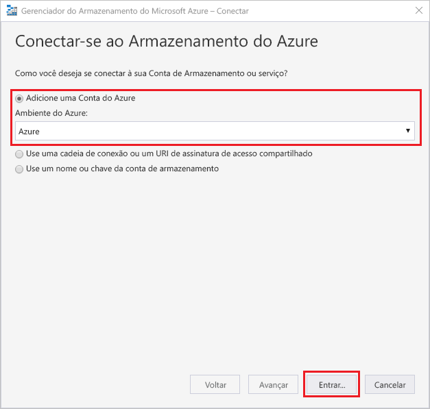
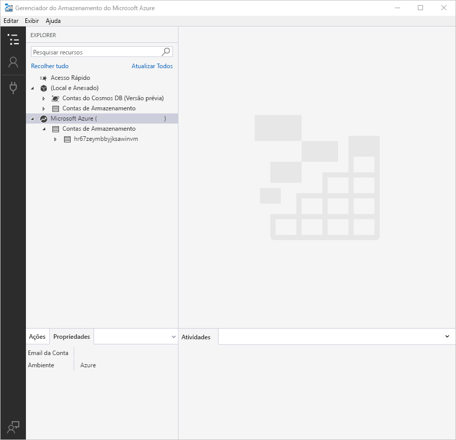
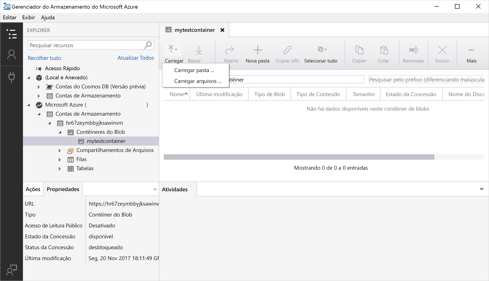
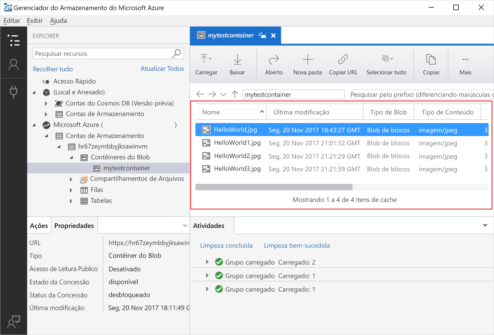

# Transfira objetos de/para o Armazenamento de Blobs do Azure usando o Gerenciador de Armazenamento do Azure

O [Gerenciador de Armazenamento do Azure](https://azure.microsoft.com/features/storage-explorer/) é uma interface de usuário multiplataforma usada para gerenciar o conteúdo de suas contas de armazenamento. Este guia detalha o uso do Gerenciador de Armazenamento do Azure para transferir arquivos entre um disco local e o Armazenamento de Blobs do Azure.

Se você não tiver uma assinatura do Azure, crie uma [conta gratuita](https://azure.microsoft.com/free/?WT.mc_id=A261C142F) antes de começar.

Este guia de início rápido requer que o Gerenciador de Armazenamento do Azure esteja instalado. Se você precisa instalá-lo, visite [Gerenciador de Armazenamento do Azure](https://azure.microsoft.com/features/storage-explorer/) para baixá-lo para o Windows, Macintosh ou Linux.

[!INCLUDE [storage-quickstart-tutorial-create-account-portal](../../../includes/storage-quickstart-tutorial-create-account-portal.md)]

## Fazer logon no Gerenciador de Armazenamento

Na primeira inicialização, é exibida a janela **Gerenciador de Armazenamento do Microsoft Azure – Conectar**. O Gerenciador de Armazenamento fornece várias maneiras de se conectar às contas de armazenamento. A tabela a seguir lista as diferentes maneiras de conexão:

|Tarefa|Finalidade|
|---|---|
|Adicionar uma conta do Azure | Redireciona você para a página de logon das suas organizações para autenticação no Azure. |
|Usar uma cadeia de conexão ou um URI de assinatura de acesso compartilhado | Podem ser usados para acessar diretamente um contêiner ou uma conta de armazenamento com um token SAS ou uma cadeia de conexão compartilhada. |
|Usar um nome e uma chave da conta de armazenamento| Use o nome e a chave da sua conta de armazenamento para se conectar ao armazenamento do Azure.|

Selecione **Adicionar uma Conta do Azure** e clique em **Entrar...**. Siga os avisos da tela para entrar na sua conta do Azure.

Ao concluir a conexão, o Gerenciador de Armazenamento do Azure carrega exibindo a guia **Explorer**. Essa exibição lhe dá informações de todas suas contas de armazenamento do Azure e do armazenamento local, configuradas por meio do [Emulador de Armazenamento do Azure](../common/storage-use-emulator.md?toc=%2fazure%2fstorage%2fblobs%2ftoc.json), das contas do [Cosmos DB](../../cosmos-db/tutorial-documentdb-and-mongodb-in-storage-explorer.md?toc=%2fazure%2fstorage%2fblobs%2ftoc.json) ou dos ambientes do [Azure Stack](../../azure-stack/user/azure-stack-storage-connect-se.md?toc=%2fazure%2fstorage%2fblobs%2ftoc.json).

## Criar um contêiner

Os blobs são sempre carregados em um contêiner. Isso permite que você organize grupos de blobs da mesma forma que organiza os arquivos em pastas no seu computador.

Para criar um contêiner, expanda a conta de armazenamento criada por você na etapa a seguir. Selecione **Contêineres de Blobs**, clique com botão direito do mouse e selecione **Criar Contêiner de Blobs**. Insira o nome de seu contêiner de blobs. Confira a seção [Regras de nomenclatura do contêiner](storage-dotnet-how-to-use-blobs.md#create-a-container) para obter uma lista de regras e restrições sobre como nomear os contêineres de blob. Ao concluir, pressione **Enter** para criar o contêiner de blob. Após a criação com êxito do contêiner de blobs, ele será exibido na pasta **Contêineres de Blob** da conta de armazenamento selecionada.

## Carregar blobs para o contêiner

O Armazenamento de Blobs dá suporte a blobs de blocos, blobs de acréscimo e blobs de páginas. Os arquivos VHD usados para auxiliar VMs IaaS são blobs de páginas. Os blobs de acréscimo são usados para registro em log, como quando você quer gravar em um arquivo e depois adicionar mais informações. A maioria dos arquivos armazenados no Armazenamento de Blobs são blobs de blocos.

Na faixa de opções do contêiner, selecione **Carregar**. Essa operação lhe dá a opção de carregar um arquivo ou uma pasta.

Escolha os arquivos ou pastas a serem carregados. Selecione o **tipo de blob**. Opções aceitáveis são **Acrescentar**, **Página** ou blob de **Blocos**.

Se for carregar um arquivo. vhd ou. vhdx, escolha **Carregar arquivos .vhd/.vhdx como blobs de página (recomendado)**.

No campo **Carregar para a pasta (opcional)**, escolha um nome de pasta para armazenar os arquivos ou pastas em uma pasta sob o contêiner. Se nenhuma pasta for escolhida, os arquivos são carregados diretamente no contêiner.

Ao selecionar **OK**, os arquivos selecionados são colocados na fila para carregamento e cada arquivo é carregado. Quando o carregamento for concluído, os resultados são mostrados na janela **Atividades**.

## Exibir blobs em um contêiner

No aplicativo **Gerenciador de Armazenamento do Azure**, selecione um contêiner em uma conta de armazenamento. O painel principal mostra uma lista dos blobs no contêiner selecionado.

## Baixar blobs

Para baixa blobs usando o **Gerenciador de Armazenamento do Azure**, com um blob selecionado, selecione **Baixar** na faixa de opções. Uma caixa de diálogo é aberta, na qual é possível inserir um nome de arquivo. Selecione **Salvar** para iniciar o download de um blob para a localização local.

## Gerenciar instantâneos

O Gerenciador de Armazenamento do Azure fornece a capacidade de obter e gerenciar [instantâneos](storage-blob-snapshots.md) de seus blobs. Para obter um instantâneo de um blob, clique com o botão direito do mouse no blob e selecione **Criar Instantâneo**. Para exibir instantâneos de um blob, clique com o botão direito do mouse no blob e selecione **Gerenciar Instantâneos**. Uma lista de instantâneos do blob é mostrada na guia atual.

## Gerenciar políticas de acesso

O Gerenciador de Armazenamento fornece a capacidade de gerenciar políticas de acesso para contêineres dentro da sua interface do usuário. Há dois tipos de políticas de acesso seguro (SAS): nível de serviço e nível de conta. As SAS de nível de conta têm como alvo a conta de armazenamento e podem se aplicar a vários serviços e recursos. As SAS de nível de serviço são definidas em um recurso sob um serviço específico. Para gerar uma SAS de nível de serviço, clique com o botão direito do mouse em qualquer contêiner e selecione **Gerenciar Políticas de Acesso...**. Para gerar um SAS de nível de conta, clique com o botão direito do mouse na conta de armazenamento.

Selecione **Adicionar** para adicionar uma nova política de acesso e definir as permissões para a política. Ao concluir, selecione **Salvar** para salvar a política de acesso. Agora essa política está disponível para uso ao configurar uma Assinatura de Acesso Compartilhado.

## Trabalhar com Assinaturas de Acesso Compartilhado

Assinaturas de Acesso Compartilhado (SAS) podem ser recuperadas por meio do Gerenciador de Armazenamento. Clique com o botão direito do mouse em uma conta de armazenamento, um contêiner ou um blob e escolha **Obter Assinatura de Acesso Compartilhado...**. Escolha a hora de início e de expiração, além das permissões para a URL de SAS, e selecione **Criar**. A URL completa com a cadeia de consulta e a própria cadeia de consulta são fornecidas e podem ser copiadas na próxima tela.

## Próximas etapas

Neste guia de início rápido, você aprendeu a transferir arquivos entre um disco local e o armazenamento de Blobs do Azure usando o **Gerenciador de Armazenamento do Azure**. Para saber mais sobre como trabalhar com o Armazenamento de Blobs, prossiga para as instruções do Armazenamento de Blobs.

> [!div class="nextstepaction"]
> [Instruções de operações do Armazenamento de Blobs](storage-how-to-use-blobs-powershell.md)
