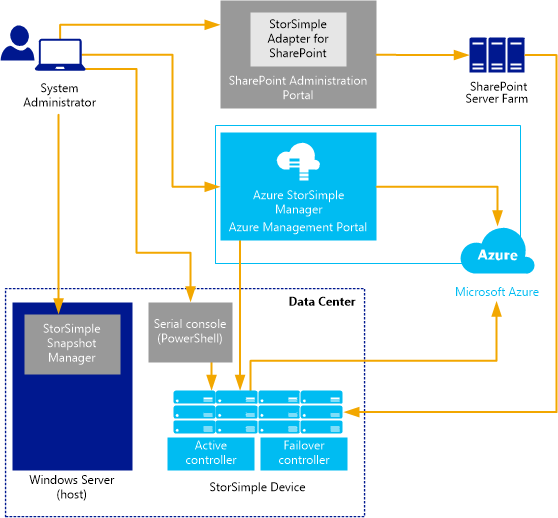

<properties 
   pageTitle="O que é StorSimple?" 
   description="Descreve os recursos, a arquitetura e os componentes do StorSimple." 
   services="storsimple" 
   documentationCenter="NA" 
   authors="SharS" 
   manager="AdinaH" 
   editor=""/>

<tags
   ms.service="storsimple"
   ms.devlang="NA"
   ms.topic="article"
   ms.tgt_pltfrm="NA"
   ms.workload="TBD" 
   ms.date="02/17/2015"
   ms.author="v-sharos@microsoft.com"/>

# O que é StorSimple? 

O Microsoft Azure StorSimple é uma solução eficiente, econômica e gerenciável que elimina muitos dos problemas e dos custos associados à proteção de dados e ao armazenamento empresarial. Ele usa um dispositivo proprietário (o dispositivo Microsoft Azure StorSimple) e ferramentas de gerenciamento integradas para fornecer uma visualização perfeita de todo o armazenamento corporativo, incluindo armazenamento em nuvem.

## Por que usar StorSimple?

O Microsoft Azure StorSimple fornece os seguintes benefícios:

- **Integração transparente** - o Microsoft Azure StorSimple usa o protocolo Internet Small Computer System Interface (iSCSI) para vincular invisivelmente recursos de armazenamento de dados. Isso garante que os dados armazenados na nuvem, no data center ou em servidores remotos pareçam estar armazenados em um único local.
- **Redução dos custos de armazenamento** - o Microsoft Azure StorSimple aloca armazenamento de nuvem ou local suficiente para atender às demandas atuais e amplia o armazenamento em nuvem somente quando necessário. Ele reduz ainda mais os requisitos de armazenamento e as despesas, eliminando versões redundantes dos mesmos dados (eliminação de duplicação) e usando compactação.
- **Gerenciamento simplificado de armazenamento** - o Microsoft Azure StorSimple fornece ferramentas de administração do sistema que você pode usar para configurar e gerenciar dados armazenados localmente, em um servidor remoto e na nuvem. Além disso, você pode gerenciar o backup e restaurar as funções de um snap-in do MMC (Console de Gerenciamento Microsoft). O StorSimple fornece uma interface opcional separada que você pode usar para estender os serviços de gerenciamento e proteção de dados do StorSimple ao conteúdo armazenado em servidores do SharePoint. 
- **Melhorias na recuperação de desastres e conformidade** - o Microsoft Azure StorSimple não exige muito tempo para recuperação. Em vez disso, ele restaura os dados conforme necessário. Isso significa que as operações normais podem continuar com um mínimo de interrupção. Além disso, você pode configurar políticas para especificar agendamentos de backup e retenção de dados.
- **Mobilidade de dados** - dados carregados nos Serviços de Nuvem do Microsoft Azure podem ser acessados de outros sites para fins de recuperação e migração. Além disso, você pode usar o StorSimple para configurar dispositivos virtuais StorSimple em máquinas virtuais (VMs) em execução no Microsoft Azure. As VMs podem usar dispositivos virtuais para acessar dados armazenados para fins de teste ou recuperação. 

O diagrama a seguir fornece uma exibição de alto nível da solução Microsoft Azure StorSimple.

**Arquitetura do Microsoft Azure StorSimple**

## Componentes do StorSimple

A solução Microsoft Azure StorSimple inclui os seguintes componentes:

- **Dispositivo do Microsoft Azure StorSimple** - uma matriz de armazenamento híbrido local que contém unidades de estado sólido (SSDs) e unidades de disco rígido (HDDs), juntamente com controladores redundantes e recursos de failover automático. Os controladores de gerenciam o armazenamento hierárquico, colocando dados usados no momento (ou mais acessados) no armazenamento local (no dispositivo ou em servidores locais), ao mesmo tempo movendo dados menos dados para a nuvem.
- **Dispositivo virtual StorSimple** - é uma versão de software do dispositivo StorSimple que replica a arquitetura e os recursos do dispositivo de armazenamento híbrido físico. O dispositivo virtual StorSimple é executado em um único nó em uma máquina virtual do Azure. O dispositivo virtual é adequado para uso em cenários pequenos de piloto e teste. Você não pode criar um dispositivo virtual StorSimple em um servidor local ou em um dispositivo StorSimple.
- **Windows PowerShell para StorSimple** - uma interface de linha de comando que você pode usar para gerenciar o dispositivo StorSimple. O Windows PowerShell para StorSimple tem recursos que permitem registrar seu dispositivo StorSimple, configurar a interface de rede em seu dispositivo, instalar determinados tipos de atualizações, solucionar problemas de seu dispositivo acessando a sessão de suporte e alterar o estado do dispositivo. Você pode acessar o Windows PowerShell para StorSimple conectando-se ao console serial ou usando o Windows PowerShell remotamente.
- **Serviço StorSimple Manager** - uma extensão do Portal de Gerenciamento do Azure que permite gerenciar um dispositivo StorSimple ou o dispositivo virtual StorSimple em uma única interface web. Você pode usar o serviço StorSimple Manager para criar e gerenciar serviços, exibir e gerenciar dispositivos, exibir alertas, gerenciar volumes e exibir e gerenciar políticas de backup e o catálogo de backup.
- **Gerenciador de instantâneos StorSimple** - um snap-in do MMC que usa grupos de volume e o serviço de cópias de sombra de Volume do Windows para gerar backups consistentes com o aplicativo. Além disso, você pode usar o Gerenciador de instantâneos do StorSimple para criar o clone e agendamentos de backup ou restaurar volumes. 
- **Adaptador StorSimple para SharePoint** - uma ferramenta que estende transparentemente o armazenamento e proteção de dados do Microsoft Azure StorSimple para os farms do SharePoint Server, maximizando o armazenamento do StorSimple visualizável e gerenciável por meio do Portal de administração do SharePoint.

## Próximas etapas

Leia sobre os [Componentes do StorSimple](https://technet.microsoft.com/library/cc754482.aspx) e examine as [notas de versão do StorSimple](https://msdn.microsoft.com/library/azure/dn772367.aspx)

<!--HONumber=52-->