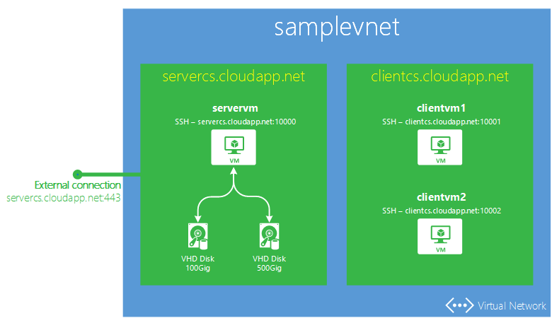

<properties
   pageTitle="Criar uma implantação de várias VMs usando a CLI x-plat do Azure | Azure"
   description="Saiba como criar uma implantação de VM múltipla usando a CLI x-plat do Azure"
   services="virtual-machines"
   documentationCenter="nodejs"
   authors="AlanSt"
   manager="timlt"
   editor=""/>

   <tags
   ms.service="virtual-machines"
   ms.devlang="nodejs"
   ms.topic="article"
   ms.tgt_pltfrm="vm-linux"
   ms.workload="infrastructure-services"
   ms.date="02/20/2015"
   ms.author="alanst;kasing"/>

# Criar uma implantação de várias VMs usando a CLI x-plat do Azure | Azure

O script a seguir mostra como configurar uma implantação de serviço de várias nuvens e VMs em uma VNET usando a Interface de Linha de Comando entre Plataformas do Azure (xplat-cli).

A imagem a seguir explica qual será a aparência de sua implantação após a conclusão do script:

O script cria uma máquina virtual (**servervm**) no serviço de nuvem **servercs** com dois discos de dados anexados e duas VMs (**clientvm1, clientvm2**) no serviço de nuvem **workercs**. Os serviços de nuvem são colocados na VNET **samplevnet**. O serviço de nuvem **servercs** também tem um ponto de extremidade configurado para conectividade externa.

## Script CLI para que isso aconteça
O código para configurar é relativamente simples:

>[AZURE.NOTE] Você provavelmente precisará alterar o servercs de nomes do serviço de nuvem e workercs para que os nomes do serviço de nuvem seja exclusivos

    azure network vnet create samplevnet -l "West US"
    azure vm create -l "West US" -w samplevnet -e 10000 -z Small -n servervm servercs b39f27a8b8c64d52b05eac6a62ebad85__Ubuntu-14_10-amd64-server-20150202-pt-br-30GB azureuser Password@1
    azure vm create -l "West US" -w samplevnet -e 10001 -z Small -n clientvm1 clientcs b39f27a8b8c64d52b05eac6a62ebad85__Ubuntu-14_10-amd64-server-20150202-pt-br-30GB azureuser Password@1
    azure vm create -l "West US" -w samplevnet -e 10002 -c -z Small -n clientvm2 clientcs b39f27a8b8c64d52b05eac6a62ebad85__Ubuntu-14_10-amd64-server-20150202-pt-br-30GB azureuser Password@1
    azure vm disk attach-new servervm 100
    azure vm disk attach-new servervm 500
    azure vm endpoint create servervm 443 443 -n https -o tcp

Como é o código para subdividi-lo:

    azure vm delete -b -q servervm
    azure vm delete -b -q clientvm1
    azure vm delete -b -q clientvm2
    azure network vnet delete -q samplevnet

*A opção -q suprime a confirmação interativa para excluir objetos, -b limpa os discos/blobs associados com a VM.*

## Formulários genéricos dos comandos usados

Embora você possa encontrar mais informações usando a opção -help em qualquer um dos comandos CLI do Azure, o formulário genérico de cada comando conforme usado acima é:

    azure network vnet create -l <Region> <VNet_name>
    azure network vnet delete -q <VNet_name>

    azure vm create -l <Region> -w <Vnet_name> -e <SSH_port> -z <VM_size> -n <VM_name> <Cloud_service_name> <VM_image> <Username> <Password>
    azure vm delete -b -q <VM_name>
    azure vm disk attach-new <VM_name>
    azure vm endpoint create <VM_name> <External_port> <Internal_port> -n <Endpoint_name> -o <TCP/UDP>

## Próximas etapas

 
* [Computação Linux e Software Livre no Azure](../virtual-machines-linux-opensource/)
* [Como fazer logon em uma máquina virtual que executa o Linux](../virtual-machines-linux-how-to-log-on/)

<!--HONumber=47-->
