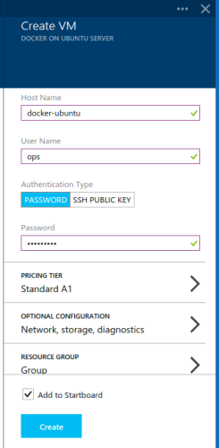

<properties 
	pageTitle="Como usar o Docker rapidamente com a imagem da VM Ubuntu-Docker" 
	description="Descreve e demonstra como usar Docker no servidor do Ubuntu em minutos diretamente da Galeria de Imagens do Azure" 
	services="virtual-machines" 
	documentationCenter="" 
	authors="squillace" 
	manager="timlt" 
	editor="tysonn"/>

<tags 
	ms.service="virtual-machines" 
	ms.devlang="na" 
	ms.topic="article" 
	ms.tgt_pltfrm="vm-linux" 
	ms.workload="infrastructure" 
	ms.date="02/02/2015" 
	ms.author="rasquill"/>

<!--The next line, with one pound sign at the beginning, is the page title--> 
# Como começar rapidamente com Docker no Azure Marketplace 

A maneira mais rápida de começar a usar o [Docker] é ir para o Azure Marketplace e criar uma máquina virtual usando o modelo de imagem do **Docker no servidor do Ubuntu** criado por [Canonical] em conjunto com [MSOpenTech]. Isso cria uma VM de servidor do Ubuntu e instala automaticamente a [Extensão de VM do Docker](http://azure.microsoft.com/documentation/articles/virtual-machines-docker-vm-extension/) juntamente com o mecanismo de Docker **mais recente** previamente instalado e em execução no Azure.  

Você pode conectar-se à VM imediatamente com SSH e começar a trabalhar com o Docker diretamente sem fazer mais nada. 

> [AZURE.NOTE]A VM criada pelo modelo do Azure Marketplace não hospeda a API remota do Docker para o gerenciamento por um cliente remoto do docker. Para habilitar o controle do host do Docker nesta VM remotamente, consulte [Executando o Docker com HTTPS](https://docs.docker.com/articles/https/) ou siga as etapas em [Usando a extensão de VM do Docker do Portal do Azure](http://azure.microsoft.com/documentation/articles/virtual-machines-docker-with-portal/) ou [Usando a extensão de VM do Docker do azure-cli](http://azure.microsoft.com/documentation/articles/virtual-machines-docker-with-xplat-cli/). Se você estiver se sentindo especialmente nerd, é possível criar o [Cliente do Windows Docker](https://github.com/ahmetalpbalkan/Docker.DotNet) do Github e tente isto também (ou simplesmente pegue-o no [nuget](https://www.nuget.org/packages/Docker.DotNet/)). 

Neste tópico:

- [Faça logon no Portal]
- [Crie uma máquina virtual com a imagem de Docker de Canonical e MSOpenTech]
- [Conecte-se com o SSH e divirta-se]

## <a id='logon'>Faça logon no Portal</a>

Essa parte é fácil, a menos que você não tenha uma conta do Azure. [Obtenha uma gratuita facilmente](http://azure.microsoft.com/pricing/free-trial/)!

## <a id='createvm'>Crie uma máquina virtual com a imagem de Docker de Canonical e MSOpenTech</a>

1. Depois que você fizer logon, clique em **Novo** no canto inferior esquerdo para criar uma nova imagem de VM. Você pode ver a imagem correta na faixa imediatamente:

> 

2. Se não, pesquise-a na Galeria de Imagens: 

> 

3. Forneça o nome de usuário e a senha para a instância, ou um arquivo **.pem** para habilitar SSH usando um certificado. (A imagem mostra como especificar uma combinação de nome de usuário e senha.) Em seguida, pressione **Criar** na parte inferior.

> 

4. E aguarde até que ela esteja sendo executada. Isso não deve demorar.

> 

## <a id='havingfun'>Conecte-se com o SSH e divirta-se</a>

Agora a diversão começa. Você pode conectar-se imediatamente à máquina virtual usando SSH:

> 

e começar a usar comandos do Docker, lembrando que, nesta VM do Azure, a configuração padrão requer **`sudo`**:

> 

<!--Every topic should have next steps and links to the next logical set of content to keep the customer engaged-->
## Próximas etapas

Você vai querer começar a usar o [Docker]! 

<!--Anchors-->
[Faça logon no Portal]: #logon
[Crie uma máquina virtual com a imagem de Docker de Canonical e MSOpenTech]: #createvm
[Conecte-se com o SSH e divirta-se]: #havingfun
[Próximas etapas]: #next-steps

[Docker]: https://www.docker.com/
[BusyBox]: http://en.wikipedia.org/wiki/BusyBox
[Imagem de rascunho do Docker]: https://docs.docker.com/articles/baseimages/#creating-a-simple-base-image-using-scratch
[Canonical]: http://www.canonical.com/
[MSOpenTech]: http://msopentech.com/

<!--HONumber=47-->
