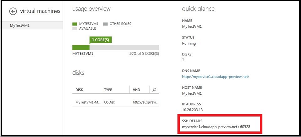

<properties 
	pageTitle="Fazer logon em uma máquina virtual executando o Linux no Azure" 
	description="Saiba como fazer logon em uma máquina virtual do Azure que executa Linux usando um cliente SSH (Secure Shell)." 
	services="virtual-machines" 
	documentationCenter="" 
	authors="KBDAzure" 
	manager="timlt" 
	editor=""/>

<tags 
	ms.service="virtual-machines" 
	ms.workload="infrastructure-services" 
	ms.tgt_pltfrm="vm-linux" 
	ms.devlang="na" 
	ms.topic="article" 
	ms.date="11/12/2014" 
	ms.author="kathydav"/>

#Como fazer logon em uma máquina virtual executando o Linux #

Em uma máquina virtual que executa o sistema operacional Linux, use um cliente Secure Shell (SSH) para fazer logon.

Instale um cliente SSH no computador que você deseja usar para fazer logon na máquina virtual. Há muitos programas de cliente SSH que você pode escolher. Estas são algumas opções:

- Em um computador que executa um sistema operacional Windows, poderá usar um cliente SSH como PuTTY. Para obter mais informações, consulte a [Página de download do PuTTY (em inglês)](http://www.chiark.greenend.org.uk/~sgtatham/putty/download.html).
- Em um computador que executa um sistema operacional Linux, poderá usar um cliente SSH como OpenSSH. Para obter mais informações, consulte [OpenSSH](http://www.openssh.org/).

>[AZURE.NOTE] Para mais dicas de requisitos e solução de problemas, consulte [Conecte-se à uma máquina virtual Azure com RDP ou SSH](http://go.microsoft.com/fwlink/p/?LinkId=398294). 

Este procedimento mostra como usar o programa PuTTY para acessar a máquina virtual.

1. Localize o **Nome do host** e as **Informações da porta** no [Portal de Gerenciamento](http://manage.windowsazure.com). Você pode encontrar as informações que você precisa no painel da máquina virtual. Clique no nome da máquina virtual e procure os **Detalhes de SSH** na seção **Visão Rápida** do painel de controle.

	

2. Abra o programa PuTTY.

3. Digite o Nome do Host e as Informações da porta coletadas do painel de controle e, em seguida, clique em **Abrir**.

	

4. Faça logon na máquina virtual usando a conta especificada quando a máquina foi criada. Para obter mais detalhes sobre como criar uma máquina virtual com o nome de usuário e senha, consulte [criar uma máquina Virtual executando Linux](http://azure.microsoft.com/documentation/articles/virtual-machines-linux-tutorial/). 

	

>[AZURE.NOTE] A extensão VMAccess pode ajudá-lo a redefinir a chave SSH ou a senha, caso a esqueça. Se você esquecer o nome de usuário, você pode usar a extensão para criar um novo com a autoridade sudo. Para instruções, consulte [Como redefinir uma senha ou SSH para máquinas virtuais Linux]. 
	
Você agora pode trabalhar com a máquina virtual, como faria com qualquer outro servidor.

<!-- LINKS -->
[Como redefinir uma senha ou SSH para máquinas virtuais Linux]: http://go.microsoft.com/fwlink/p/?LinkId=512138
<!--HONumber=42-->
