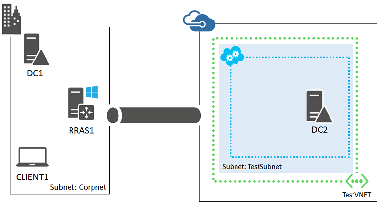
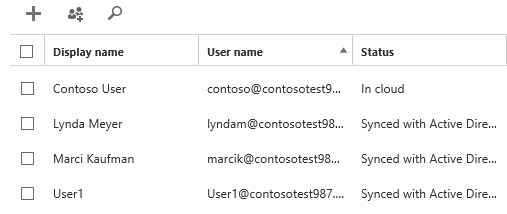

<properties 
	pageTitle="Configurar a Sincronização de Diretórios (DirSync) do Office 365 em uma nuvem híbrida para teste" 
	description="Aprenda a configurar um servidor de Sincronização de Diretórios (DirSync) do Office 365 em uma nuvem híbrida para testes profissionais de TI ou testes de desenvolvimento." 
	services="virtual-network" 
	documentationCenter="" 
	authors="JoeDavies-MSFT" 
	manager="timlt" 
	editor=""/>

<tags 
	ms.service="virtual-network" 
	ms.workload="infrastructure-services" 
	ms.tgt_pltfrm="na" 
	ms.devlang="na" 
	ms.topic="article" 
	ms.date="03/05/2015" 
	ms.author="josephd"/>

#Configurar a Sincronização de Diretórios (DirSync) do Office 365 em uma nuvem híbrida para teste

Este tópico orienta a criação de um ambiente de nuvem híbrida para testar a Sincronização de Diretórios (DirSync) do Office 365 com sincronização de senha hospedada no Microsoft Azure. Veja abaixo a configuração resultante.

 
Esta configuração simula um servidor DirSync no ambiente de produção do Azure em seu local na Internet. Ele consiste em:

- Uma rede local simplificada (a sub-rede Corpnet).
- Uma rede virtual entre locais hospedada no Azure (TestVNET).
- Uma conexão de VPN site a site.
- Uma assinatura de avaliação do Office 365 FastTrack.
- Um servidor DirSync e um controlador de domínio secundário na rede virtual TestVNET.

Esta configuração proporciona uma base e um ponto de partida comum com os quais é possível:

- Desenvolver e testar aplicativos para Office 365 que dependem de sincronização com um domínio local do Active Directory usando sincronização de senha.
- Realizar testes dessa carga de trabalho de TI baseada em nuvem.

Há três fases principais para configurar esse ambiente de teste de nuvem híbrida:

1.	Configurar um ambiente de nuvem híbrida para testes.
2.	Configurar a avaliação do Office 365 FastTrack.
3.	Configurar o servidor DirSync (DS1).

Se ainda não tiver uma assinatura do Azure, você poderá se inscrever para uma avaliação gratuita em [Teste o Azure](http://azure.microsoft.com/pricing/free-trial/). Se você tiver uma assinatura do MSDN, consulte [Benefício do Azure para assinantes do MSDN](http://azure.microsoft.com/pricing/member-offers/msdn-benefits-details/).

##Fase 1: Configurar o ambiente de nuvem híbrida

Use as instruções no tópico [Configurar um ambiente de nuvem híbrida para testes](virtual-networks-setup-hybrid-cloud-environment-testing.md) . Como esse ambiente de teste não exige a presença do servidor APP1 na sub-rede Corpnet, fique à vontade para desligá-lo por enquanto.

Esta é a configuração atual.

##Fase 2: Configurar a avaliação do Office 365 FastTrack

Para iniciar sua avaliação do Office 365 FastTrack, é necessário um nome de empresa fictício e uma conta da Microsoft. É recomendável que você use, como nome da empresa, uma variante do nome da empresa Contoso, que é uma empresa fictícia usada no conteúdo de exemplo da Microsoft, mas isso não é necessário.

Em seguida, inscreva-se para uma nova conta da Microsoft. Vá para **http://outlook.com** e crie uma conta com um endereço de email como user123@outlook.com. Você se inscreverá para uma avaliação do Office 365 FastTrack usando essa conta.

Em seguida, inscreva-se para uma nova avaliação do Office 365 FastTrack.

1.	Faça logon em CLIENT1 com as credenciais da conta CORP\User1.
2.	Abra o Internet Explorer e vá para **http://fasttrack.office.com**.
3.	Clique em **Introdução ao FastTrack**.
4.	Na página Introdução ao FastTrack, em **Primeiro, inscreva-se para uma avaliação do Office 365**, clique em **Para empresas, inscreva-se aqui**.
5.	Na página Etapa 1, preencha a página, especificando sua nova conta da Microsoft em **Endereço de email comercial** e clique em **Avançar**.
6.	Na página Etapa 2, digite o nome de uma conta inicial do Office 365 no primeiro campo, o nome da empresa fictícia e uma senha. Registre o endereço de email resultante (como user123@contoso123.onmicrosoft.com) e a senha em um local seguro. Você precisará dessas informações para concluir o Assistente de Configuração da Ferramenta de Sincronização do Active Directory na Fase 3. Clique em **Avançar**.
7.	Na página Etapa 3, digite o número de telefone de seu smartphone ou celular compatível com mensagens de texto e clique em **Enviar SMS para mim**.
8.	Ao receber a mensagem de texto em seu telefone, digite o código de verificação e clique em **Criar minha conta**. 
9.	Quando o Office 365 terminar de criar sua conta, clique em **Você está pronto**.
10.	Agora, você deve ver a página principal do portal do Office 365. Na faixa de opções superior, clique em **Admin**e, em seguida, em **Office 365**. A página do Centro de Administração do Office 365 aparece. Mantenha essa página aberta no CLIENT1.

Esta é a configuração atual.

##Fase 3: Configurar o servidor DirSync (DS1)

Primeiro, crie uma máquina virtual do Azure para o DS1 com estes comandos no prompt de comando do PowerShell do Azure em seu computador local. Antes de executar estes comandos, preencha os valores variáveis e remova os caracteres < e >.

	$ServiceName="<The cloud service name for your TestVNET virtual network>"	
	$LocalAdminName="<A local administrator account name>" 
	$LocalAdminPW="<The password for the local administrator account>"
	$User1Password="<The password for the CORP\User1 account>"
	$image= Get-AzureVMImage | where { $_.ImageFamily -eq "Windows Server 2012 R2 Datacenter" } | sort PublishedDate -Descending | select -ExpandProperty ImageName -First 1
	$vm1=New-AzureVMConfig -Name DS1 -InstanceSize Medium -ImageName $image
	$vm1 | Add-AzureProvisioningConfig -AdminUserName $LocalAdminName -Password $LocalAdminPW -WindowsDomain -Domain "CORP" -DomainUserName "User1" -DomainPassword $User1Password -JoinDomain "corp.contoso.com"
	$vm1 | Set-AzureSubnet -SubnetNames TestSubnet
	New-AzureVM -ServiceName $ServiceName -VMs $vm1 -VNetName TestVNET

Em seguida, conecte-se à máquina virtual DS1.

1.	Na página de máquinas virtuais do Portal de Gerenciamento do Azure, clique em **Executando** na coluna STATUS da máquina virtual DS1.
2.	Na barra de tarefas, clique em **Conectar**. 
3.	Quando solicitado a abrir DS1.rdp, clique em **Abrir**.
4.	Quando receber uma caixa de mensagem Conexão de Área de Trabalho Remota, clique em **Conectar**.
5.	Quando solicitado a fornecer credenciais, use estas:
	- Nome: **CORP\User1**
	- Senha: [Senha da conta User1]
6.	Quando receber uma caixa de mensagem Conexão de Área de Trabalho Remota referente a certificados, clique em **Sim**.

Em seguida, configure uma regra do Firewall do Windows para permitir o tráfego e testar a conectividade básica. Em um prompt de comando com nível de administrador do Windows PowerShell no DS1, execute estes comandos.

	Set-NetFirewallRule -DisplayName "File and Printer Sharing (Echo Request - ICMPv4-In)" -enabled True
	ping dc1.corp.contoso.com

O comando ping deve resultar em quatro respostas bem-sucedidas do endereço IP 10.0.0.1.

Em seguida, instale o .NET 3.5 no DS1 com este comando no prompt de comando do Windows PowerShell.

	Add-WindowsFeature NET-Framework-Core

Depois, instale a Sincronização de Diretórios no DS1.

1.	Execute o Internet Explorer, digite **http://go.microsoft.com/fwlink/?LinkID=278924** na barra de endereços e pressione ENTER. Quando solicitado a executar dirsync.exe, clique na seta ao lado de **Salvar**, clique em **Salvar como**e, em seguida, clique em **Salvar** para salvar o arquivo na pasta Downloads. Para obter mais informações sobre como instalar a ferramenta, consulte [Instalar ou atualizar a ferramenta Sincronização de Diretórios](http://technet.microsoft.com/library/jj151800).
2.	Abra a pasta **Downloads**, clique com o botão direito no arquivo **dirsync** e clique em **Executar como administrador**.
3.	Na página de boas-vindas do Assistente de Instalação da Sincronização do Active Directory, clique em **Avançar**. 
4.	Na página Termos de Licença, clique em **Aceito** e clique em **Avançar**.
5.	Na página Selecionar Pasta de Instalação, clique em **Avançar**. Pode levar alguns minutos para concluir a instalação.
6.	Na página concluído, desmarque **Iniciar o Assistente de Configuração agora** e clique em **Concluir**.
7.	Na tela Iniciar, clique em **user1** e, depois, em **Sair**.

Em seguida, habilite a Sincronização de Diretórios para sua versão de avaliação do Office 365 FastTrack.

1.	Em CLIENT1, na página **Centro de Administração do Office 365**, no painel esquerdo, clique em **Usuários** e, em seguida, em **Usuários Ativos**.
2.	Para **Sincronização do Active Directory**, clique em **Configurar**.
3.	Na página Configurar e gerenciar a sincronização do Active Directory, na etapa 3, clique em **Ativar**.
4.	Quando a pergunta **Deseja ativar a sincronização do Active Directory?** for exibida, clique em **Ativar**. Depois disso, a mensagem **A sincronização do Active Directory está ativada.** é exibida na etapa 3.
5.	Deixe a página **Configurar e gerenciar a sincronização do Active Directory** aberta no CLIENT1.

Em seguida, faça logon no DC1 com a conta de CORP\User1 e abra um prompt de comando do Windows PowerShell com nível de administrador. Execute estes comandos para criar uma nova unidade organizacional chamada contoso_users e adicionar duas novas contas de usuário, para Marci Kaufman e Lynda Meyer.

	New-ADOrganizationalUnit -Name contoso_users -Path "DC=corp,DC=contoso,DC=com"
	New-ADUser -SamAccountName marcik -AccountPassword (Read-Host "Set user password" -AsSecureString) -name "Marci Kaufman" -enabled $true -PasswordNeverExpires $true -ChangePasswordAtLogon $false -Path "OU=contoso_users,DC=corp,DC=contoso,DC=com"
	New-ADUser -SamAccountName lyndam -AccountPassword (Read-Host "Set user password" -AsSecureString) -name "Lynda Meyer" -enabled $true -PasswordNeverExpires $true -ChangePasswordAtLogon $false -Path "OU=contoso_users,DC=corp,DC=contoso,DC=com"

Ao executar cada comando do Windows PowerShell, você será solicitado a fornecer a senha do novo usuário. Registre essas senhas e armazene-as em um local seguro. Você precisará delas mais tarde.

Depois, configure a Sincronização de Diretórios no DS1.

1.	Faça logon no DS1 com a conta de CORP\User1.
2.	Na tela **inicial**, digite **Sincronização de Diretórios**.
3.	Clique com o botão direito em **Configuração de Sincronização de Diretórios** e clique em **Executar como administrador**. Isso inicia o Assistente de Configuração.
4.	Na página de Boas-vindas, clique em **Avançar**.
5.	Na página Credenciais do Active Directory do Microsoft Azure, digite o endereço de email e a senha da conta inicial que você criou quando configurou a versão de avaliação do Office 365 FastTrack na fase 2. Clique em Avançar. 
6.	Na página Credenciais do Active Directory, digite **CORP\User1** em **Nome de usuário** e a senha da conta User1 em **Senha**. Clique em **Avançar**.
7.	Na página Implantação Híbrida, selecione **Habilitar Implantação Híbrida** e clique em **Avançar**.
8.	Na página Sincronização de Senha, selecione **Habilitar Sincronização de Senha** e clique em **Avançar**.
9.	A página Configuração é exibida. Quando a configuração for concluída, clique em **Avançar**.
10.	Na página Concluído, clique em **Concluir**. Quando solicitado, clique em **OK**.

Em seguida, verifique se as contas de usuário no domínio CORP estão sincronizadas com o Office 365. Observe que pode levar algumas horas para a sincronização ocorrer.

No CLIENT1, na página **Configurar e gerenciar a sincronização do Active Directory**, clique no link **usuários** na etapa 6 dessa página. Se a sincronização de diretório tiver ocorrido com êxito, você verá algo semelhante a isto.

A coluna **Status** indica que a conta foi obtida por meio da sincronização com um domínio do Active Directory.

Em seguida, demonstre a sincronização de senha do Office 365 com a conta Lynda Meyer do Active Directory.  

1.	No CLIENT1, na página **Usuários Ativos**, selecione a conta **Lynda Meyer**.
2.	Nas propriedades da conta Lynda Meyer, em **Licença Atribuída**, clique em **Editar**.
3.	Na guia **Atribuir Licença**, selecione um local em **Definir local do usuário** (como Estados Unidos).
4.	Selecione **Microsoft Office 365 Plano E3** e clique em **Salvar**.
5.	Feche o Internet Explorer.
6.	Execute o Internet Explorer e vá para **http://portal.microsoftonline.com**. 
7.	Faça logon com as credenciais do Office 365 de Lynda Meyer. Seu nome de usuário será lyndam@<*Seu Nome Fictício*>.onmicrosoft.com. A senha é a senha da conta de usuário Lynda Meyer do Active Directory.
8.	Após o logon bem-sucedido, você verá a página do portal principal do Office 365 com **Vamos fazer a diferença hoje**.

Esta é a configuração atual.

 
Este ambiente agora está pronto para você executar testes de aplicativos do Office 365 que se baseiam na funcionalidade DirSync do Office 365 ou testar a funcionalidade e o desempenho de DirSync do DS1.

##Recursos adicionais

[Implantar a Sincronização de Diretórios (DirSync) do Office 365 no Microsoft Azure](http://technet.microsoft.com/library/dn635310.aspx)

[Soluções usando os servidores do Office e a nuvem](http://technet.microsoft.com/library/dn262744.aspx)

[Configurar um ambiente de nuvem híbrida para teste](virtual-networks-setup-hybrid-cloud-environment-testing.md)

[Configurar um farm de intranet do SharePoint em uma nuvem híbrida para teste](virtual-networks-setup-sharepoint-hybrid-cloud-testing.md)

[Configurar um aplicativo LOB baseado na Web em uma nuvem híbrida para teste](virtual-networks-setup-lobapp-hybrid-cloud-testing.md)

[Configurar um ambiente de nuvem híbrida simulado para testes](virtual-networks-setup-simulated-hybrid-cloud-environment-testing.md)

<!--HONumber=47-->
