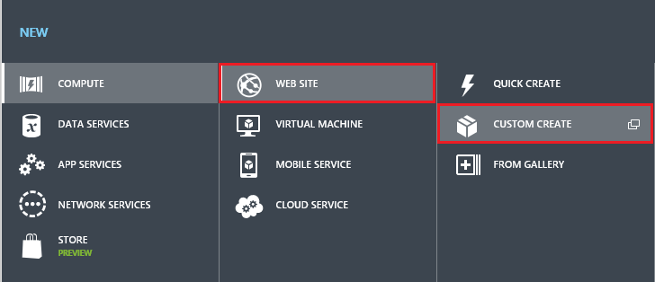
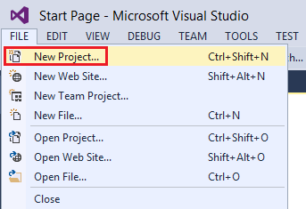
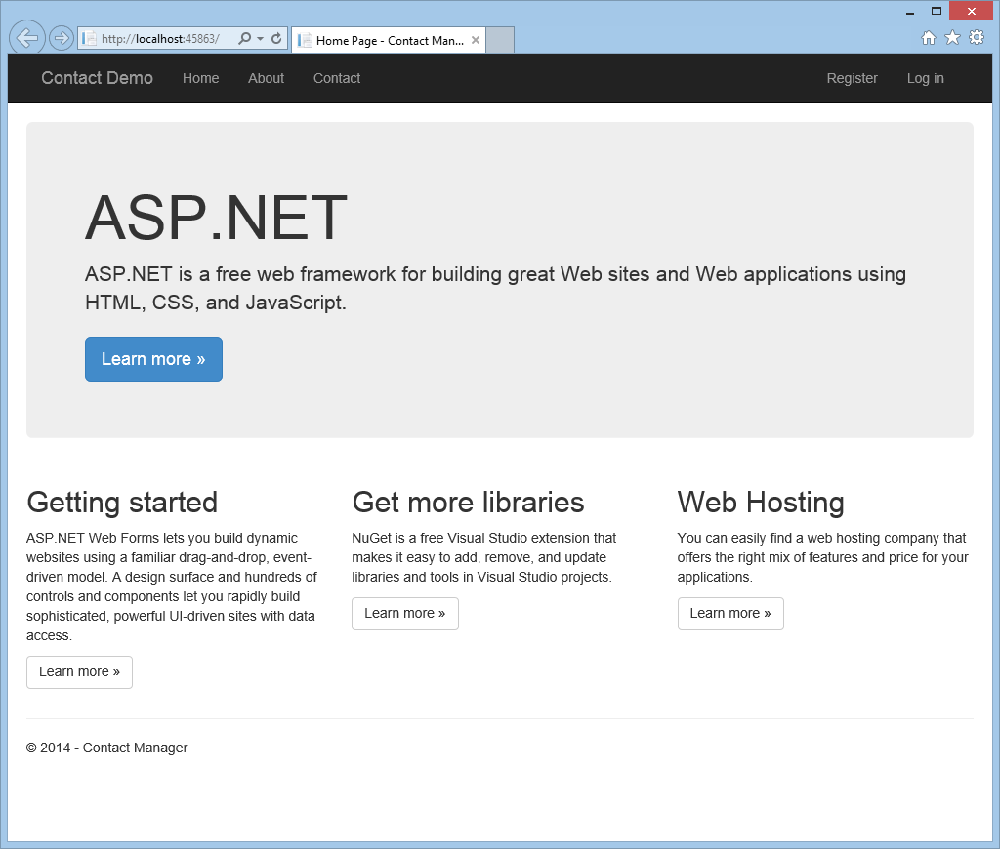
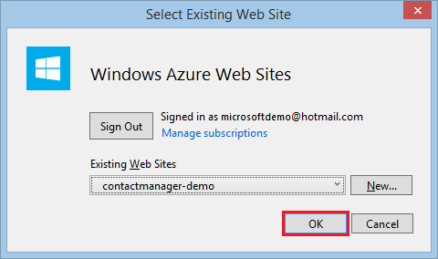
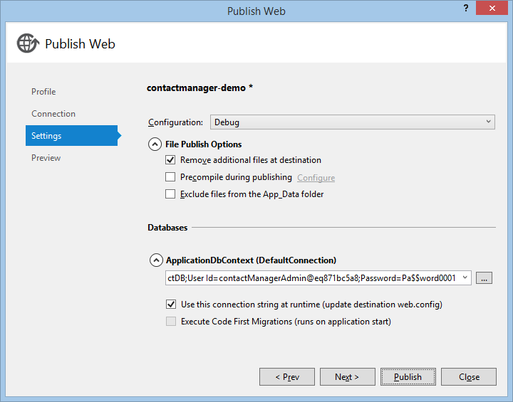
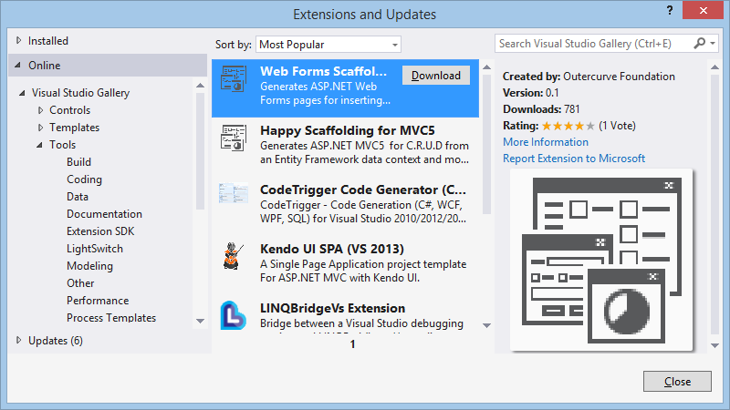
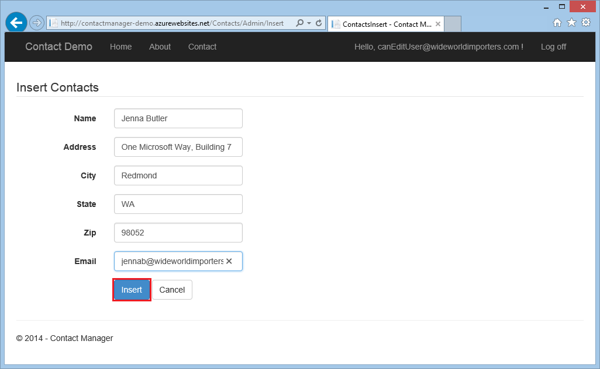

<properties pageTitle="Implantar um aplicativo de Web Forms ASP.NET seguro com Associação, OAuth e banco de dados SQL em um Site do Azure" metaKeywords="Azure WebForms Hello World Tutorial, Azure Getting Started with WebForms Tutorial, Azure C# WebForms Hello World Tutorial, SQL Azure C# WebForms Tutorial" description="Este tutorial mostra como criar um aplicativo de web seguro do Web Forms do ASP.NET 4.5 que incorpora um banco de dados SQL e implantar o aplicativo no Azure." metaCanonical="" services="web-sites" documentationCenter=".NET" title="Deploy a secure ASP.NET 4.5 Web Forms app to an Azure Website" authors="erikre"  solutions="" manager="wpickett" editor="mollybos"  />

<tags ms.service="web-sites" ms.workload="web" ms.tgt_pltfrm="na" ms.devlang="dotnet" ms.topic="article" ms.date="09/25/2014" ms.author="erikre" />

# Implantar um aplicativo de Web Forms ASP.NET seguro com Associação, OAuth e banco de dados SQL em um Site do Azure

Este tutorial mostra como criar um aplicativo de Web Forms do ASP.NET 4.5 seguro que incorpora um banco de dados SQL e implanta o aplicativo no Azure. 

>[WACOM.NOTE] 
Para uma versão MVC deste tutorial, consulte [Implantar um aplicativo ASP.NET MVC 5 seguro com Associação, OAuth e banco de dados SQL em um site do Azure](http://azure.microsoft.com/pt-br/documentation/articles/web-sites-dotnet-deploy-aspnet-mvc-app-membership-oauth-sql-database/).

É possível abrir uma conta do Azure gratuitamente e, se você ainda não tiver o Visual Studio 2013, o SDK instalará automaticamente o Visual Studio 2013 para o Web Express. É possível iniciar o desenvolvimento para o Azure de maneira gratuita.

Este tutorial pressupõe que você não tem nenhuma experiência anterior utilizando o Microsoft Azure. Ao concluir este tutorial, você terá um aplicativo Web em funcionamento na nuvem e utilizando um banco de dados também localizado na nuvem.

Você aprenderá a:

- Criar um projeto de Web Forms ASP.NET 4.5 seguro e publicá-lo em um Site do Azure.
- Utilizar OAuth e o banco de dados de associação do ASP.NET para proteger seu aplicativo.
- Utilizar um único banco de dados tanto para dados do aplicativo quanto para associação.
- Utilizar o Scaffolding dos Web Forms para criar páginas web que permitem a você modificar dados.
- Como usar a nova API de associação para adicionar usuários e funções.
- Como usar um banco de dados SQL para armazenar dados no Azure.

Você criará um aplicativo Web de lista de contatos simples, que é criado no Web Forms do ASP.NET 4.5 e que utiliza o Entity Framework para acesso ao banco de dados. A imagem a seguir mostra a página de Web Forms que permite acesso para leitura e gravação no banco de dados:

>[WACOM.NOTE] 
Para concluir este tutorial, você precisa de uma conta do Azure. Se não tiver uma conta, você poderá <a href="/pt-br/pricing/member-offers/msdn-benefits-details/?WT.mc_id=A261C142F" target="_blank">ativar os benefícios de assinante MSDN</a> ou <a href="/pt-br/pricing/free-trial/?WT.mc_id=A261C142F" target="_blank">inscrever-se para uma avaliação gratuita</a>.

Este tutorial contém as seguintes seções:

- [Configurar o ambiente de desenvolvimento](#set-up-the-development-environment)
- [Configurar o ambiente do Azure](#Set-up-the-Azure-environment)
- [Criar um aplicativo de Web Forms ASP.NET](#Create-an-ASP.NET-Web-Forms-Application)
- [Adicionar um banco de dados ao aplicativo](#Add-a-Database-to-the-Application)
- [Habilitar SSL para o projeto](#Enable-SSL-for-the-Project)
- [Adicionar um provedor de OAuth 2.0](#Add-an-OAuth-2.0-Provider)
- [Utilizar a API de associação para restringir o acesso](#Use-the-Membership-API-to-Restrict-Access)
- [Implantar o aplicativo com o banco de dados no Azure](#Deploy-the-Application-with-the-Database-to-Azure)
- [Revisar o banco de dados](#Review-the-Database)
- [Próximas etapas](#Next-Steps)

##Configurar o ambiente de desenvolvimento 
Para começar, defina o ambiente de desenvolvimento instalando o Visual Studio 2013 e o SDK do Azure para .NET.

1. Instale o [Visual Studio 2013](http://go.microsoft.com/fwlink/?LinkId=306566), se você ainda não tiver instalado.  
2. Instale o [SDK do Azure para o Visual Studio 2013](http://go.microsoft.com/fwlink/?linkid=324322&clcid=0x409). Este tutorial requer o Visual Studio 2013 antes de se instalar o SDK do Azure para o Visual Studio 2013.

	>[WACOM.NOTE]  
 Dependendo de quantas dependências de SDK você já tiver no seu computador, a instalação do SDK pode demorar bastante, de vários minutos a meia hora, ou mais.  

3. Se for solicitado que você execute ou salve o executável da instalação, clique em **Executar**.
4. Na janela do **Instalador de Plataforma Web**, clique em **Instalar** e prossiga com a instalação.  
	  

	>[WACOM.NOTE]  
	Se você já tem o SDK instalado, não há nenhum item a instalar. O número de itens a instalar aparecerá no canto inferior esquerdo da janela do **Web Platform Installer**.  

5. Se você ainda não tem o **Visual Studio Atualização 2**, baixe e instale o **[Visual Studio 2013 Atualização 2](http://www.microsoft.com/download/details.aspx?id=42666)** ou posterior.  

	>[WACOM.NOTE]  
	É necessário que você instale o Visual Studio 2013 Atualização 2 ou posterior para utilizar o Google OAuth 2.0 e o SSL localmente, sem advertências. Além disso, você precisa da Atualização 2 para utilizar o Scaffolding dos Web Forms.  

Quando a instalação for concluída, você terá todo o necessário para iniciar o desenvolvimento.

##Configurar o ambiente do Azure
Nesta seção você irá configurar o ambiente do Azure criando um Site e um banco de dados SQL no Azure.

###Criar um site e um banco de dados SQL no Azure 
Neste tutorial, seu Site do Azure será executado em um ambiente de hospedagem compartilhado, o que significa que ele é executado em máquinas virtuais (VMs) que são compartilhadas com outros sites do Azure. Um ambiente de hospedagem compartilhado é uma maneira de começar na nuvem a um baixo custo. Mais tarde, se seu tráfego da Web aumentar, o aplicativo poderá ser dimensionado para atender à necessidade executando em VMs dedicadas. Se precisar de uma arquitetura mais complexa, você poderá migrar para um Serviço de Nuvem do Azure. Os serviços de nuvem são executados em VMs dedicadas que podem ser configuradas de acordo com suas necessidades. 

O banco de dados SQL do Azure é um serviço de banco de dados relacional baseado em nuvem que é fundamentado em tecnologias do SQL Server. As ferramentas e os aplicativos que funcionam com o SQL Server também funcionam com o banco de dados SQL.

1. No [Portal de gerenciamento do Azure](https://manage.windowsazure.com/), clique em **Sites** na guia à esquerda e, em seguida, clique em **Novo**.  
	
2. Clique em **Site** e, em seguida, clique em **Criação personalizada**.  
	  
	O assistente de **Novo site - Criação personalizada** é aberto.  

3. Na etapa **Criar Site** do assistente, insira uma cadeia de caracteres na caixa **URL** a ser utilizada como a URL exclusiva de seu aplicativo. A URL completa consistirá no que você digitar aqui mais o sufixo que você vê ao lado da caixa de texto. A ilustração mostra uma URL que provavelmente será executada, portanto, **você deve escolher uma URL diferente**.  
	  
4. Na lista suspensa Plano de Hospedagem na Web, escolha a região mais próxima de você. Essa configuração especifica em qual datacenter sua máquina virtual executará.
5. Na lista suspensa **Banco de dados**, escolha **Criar um banco de dados SQL de 20 MB gratuito**.
6. Na caixa **Nome da Cadeia de Conexão de BD (banco de dados)**, deixe o valor padrão de *DefaultConnection*.
7. Clique na seta na parte inferior da caixa de diálogo. 
O assistente avança para a etapa **Especificar configurações do banco de dados **.
8. Na caixa **Nome**, digite *`ContactDB`*.  
	  
9. Na caixa **Servidor**, selecione **Novo Servidor do Banco de Dados SQL**.
Como alternativa, se tiver criado um banco de dados SQL Server, você poderá selecionar esse SQL Server no controle suspenso.
10. Defina a **Região** como a mesma área na qual você criou o site.
11. Insira um **Nome de Logon** e **Senha** de administrador. 
Se selecionou **Novo servidor do Banco de Dados SQL**, você não digitará um nome e uma senha existentes aqui; digite um novo nome e uma senha, que você está definindo agora, para usar mais tarde ao acessar o banco de dados. Se você tiver selecionado um SQL Server criado anteriormente, será solicitada a senha para o nome da conta do SQL Server anterior que você criou. Para este tutorial, não selecionaremos a caixa **Avançado**.
12. Clique na marca de seleção no canto inferior direito da caixa para indicar que você concluiu.

O **Portal de gerenciamento do Azure** retorna para a página **Sites** e a coluna **Status** mostra que o site está em criação. Depois de pouco tempo (normalmente menos de um minuto), a coluna **Status** mostra que o site foi criado com êxito. Na barra de navegação à esquerda, o número de sites presentes na sua conta é exibido próximo ao ícone **Sites**, enquanto o número de bancos de dados aparece ao lado do ícone **Bancos de dados SQL**.
##Criar um aplicativo de Web Forms ASP.NET 
Você criou um Site do Azure, mas ainda não há conteúdo nele. A próxima etapa é criar o aplicativo Web do Visual Studio que será publicado no Azure.
###Criar o projeto 
1. Selecione **Novo projeto** do menu **Arquivo** no Visual Studio.  
	  
2. Selecione o grupo de modelos **Modelos** -> **Visual C#** -> **Web** à esquerda. 
3. Escolha o modelo **Aplicativo Web ASP.NET** na coluna central.
4. Nomeie o projeto *ContactManager* e clique em **OK**.  
	  

	>[WACOM.NOTE]  
	O nome do projeto nessa série de tutoriais é **ContactManager**. É recomendável que você utilize exatamente esse nome de projeto, de modo que o código fornecido pela série de tutoriais funcione conforme esperado.  

5. Na caixa de diálogo **Novo projeto do ASP.NET** selecione o modelo **Web Forms**. Desmarque o **Host na caixa de seleção de nuvem** se ele estiver selecionado e clique em **OK**.  
	  
	O aplicativo de Web Forms será criado.
###Atualizar a página mestra
No Web Forms do ASP.NET, as páginas mestras permitem que você crie um layout consistente para as páginas em seu aplicativo. Uma única página mestra define a aparência e comportamento padrão que você deseja para todas as páginas (ou um grupo de páginas) em seu aplicativo. Então, você pode criar páginas de conteúdo individuais com o conteúdo que você deseja exibir. Quando os usuários solicitarem as páginas de conteúdo, o ASP.NET as mescla com a página mestra para produzir uma saída que combina o layout da página mestra com o conteúdo da página de conteúdo.
O novo site precisa do nome do aplicativo e um link atualizado. O link direcionará para a página que exibirá os detalhes de contato. Para fazer essas alterações, você modificará o HTML na página mestra. 

1. No **Gerenciador de Soluções**, encontre a página *Site.Master*. 
2. Se a página estiver em modo de exibição de **Design**, alterne para o modo de exibição de **Código-Fonte**.
3. Atualize a página mestra modificando ou adicionando a marcação destacada em amarelo:

<pre class="prettyprint">
<%@ Master Language=&quot;C#&quot; AutoEventWireup=&quot;true&quot; CodeBehind=&quot;Site.master.cs&quot; Inherits=&quot;ContactManager.SiteMaster&quot; %>

<!DOCTYPE html>

<html lang=&quot;en&quot;>
<head runat=&quot;server&quot;>
    <meta charset=&quot;utf-8&quot; />
    <meta name=&quot;viewport&quot; content=&quot;width=device-width, initial-scale=1.0&quot; />
    <title><%: Page.Title %> - <mark>Contact Manager</mark></title>

    <asp:PlaceHolder runat=&quot;server&quot;>
        <%: Scripts.Render(&quot;~/bundles/modernizr&quot;) %>
    </asp:PlaceHolder>
    <webopt:bundlereference runat=&quot;server&quot; path=&quot;~/Content/css&quot; />
    <link href=&quot;~/favicon.ico&quot; rel=&quot;shortcut icon&quot; type=&quot;image/x-icon&quot; />

</head>
<body>
    <form runat=&quot;server&quot;>
        <asp:ScriptManager runat=&quot;server&quot;>
            <Scripts>
                <%--To learn more about bundling scripts in ScriptManager see http://go.microsoft.com/fwlink/?LinkID=301884 --%>
                <%--Framework Scripts--%>
                <asp:ScriptReference Name=&quot;MsAjaxBundle&quot; />
                <asp:ScriptReference Name=&quot;jquery&quot; />
                <asp:ScriptReference Name=&quot;bootstrap&quot; />
                <asp:ScriptReference Name=&quot;respond&quot; />
                <asp:ScriptReference Name=&quot;WebForms.js&quot; Assembly=&quot;System.Web&quot; Path=&quot;~/Scripts/WebForms/WebForms.js&quot; />
                <asp:ScriptReference Name=&quot;WebUIValidation.js&quot; Assembly=&quot;System.Web&quot; Path=&quot;~/Scripts/WebForms/WebUIValidation.js&quot; />
                <asp:ScriptReference Name=&quot;MenuStandards.js&quot; Assembly=&quot;System.Web&quot; Path=&quot;~/Scripts/WebForms/MenuStandards.js&quot; />
                <asp:ScriptReference Name=&quot;GridView.js&quot; Assembly=&quot;System.Web&quot; Path=&quot;~/Scripts/WebForms/GridView.js&quot; />
                <asp:ScriptReference Name=&quot;DetailsView.js&quot; Assembly=&quot;System.Web&quot; Path=&quot;~/Scripts/WebForms/DetailsView.js&quot; />
                <asp:ScriptReference Name=&quot;TreeView.js&quot; Assembly=&quot;System.Web&quot; Path=&quot;~/Scripts/WebForms/TreeView.js&quot; />
                <asp:ScriptReference Name=&quot;WebParts.js&quot; Assembly=&quot;System.Web&quot; Path=&quot;~/Scripts/WebForms/WebParts.js&quot; />
                <asp:ScriptReference Name=&quot;Focus.js&quot; Assembly=&quot;System.Web&quot; Path=&quot;~/Scripts/WebForms/Focus.js&quot; />
                <asp:ScriptReference Name=&quot;WebFormsBundle&quot; />
                <%--Site Scripts--%>
            </Scripts>
        </asp:ScriptManager>

        

            

                

                    <button type=&quot;button&quot; class=&quot;navbar-toggle&quot; data-toggle=&quot;collapse&quot; data-target=&quot;.navbar-collapse&quot;>
                        
                        
                        
                    </button>
                    <a class=&quot;navbar-brand&quot; runat=&quot;server&quot; <mark>id=&quot;ContactDemoLink&quot;</mark> href=&quot;~/<mark>Contacts/Default.aspx</mark>&quot;><mark>Contact Demo</mark></a>
                

                

                    <ul class=&quot;nav navbar-nav&quot;>
                        <li><a runat=&quot;server&quot; href=&quot;~/&quot;>Home</a></li>
                        <li><a runat=&quot;server&quot; href=&quot;~/About&quot;>About</a></li>
                        <li><a runat=&quot;server&quot; href=&quot;~/Contact&quot;>Contact</a></li>
                    </ul>
                    <asp:LoginView runat=&quot;server&quot; ViewStateMode=&quot;Disabled&quot;>
                        <AnonymousTemplate>
                            <ul class=&quot;nav navbar-nav navbar-right&quot;>
                                <li><a runat=&quot;server&quot; href=&quot;~/Account/Register&quot;>Register</a></li>
                                <li><a runat=&quot;server&quot; href=&quot;~/Account/Login&quot;>Log in</a></li>
                            </ul>
                        </AnonymousTemplate>
                        <LoggedInTemplate>
                            <ul class=&quot;nav navbar-nav navbar-right&quot;>
                                <li><a runat=&quot;server&quot; href=&quot;~/Account/Manage&quot; title=&quot;Manage your account&quot;>Hello, <%: Context.User.Identity.GetUserName()  %> !</a></li>
                                <li>
                                    <asp:LoginStatus runat=&quot;server&quot; LogoutAction=&quot;Redirect&quot; LogoutText=&quot;Log off&quot; LogoutPageUrl=&quot;~/&quot; OnLoggingOut=&quot;Unnamed_LoggingOut&quot; />
                                </li>
                            </ul>
                        </LoggedInTemplate>
                    </asp:LoginView>
                

            

        

        

            <asp:ContentPlaceHolder ID=&quot;MainContent&quot; runat=&quot;server&quot;>
            </asp:ContentPlaceHolder>
            

            <footer>
                
&copy; <%: DateTime.Now.Year %> - <mark>Contact Manager</mark>

            </footer>
        

    </form>
</body>
</html>
</pre>  

Mais adiante, neste tutorial, você adicionará o scaffolding para Web Forms. O scaffolding criará a página à qual o link "Contato/Demonstração" acima faz referência.
###Executar o aplicativo localmente 
1. No **Gerenciador de Soluções**, clique com o botão direito do mouse na página *Default.aspx* e selecione **Definir como página inicial**. 
2. Em seguida, pressione **CTRL+F5** para executar o aplicativo.  
	A página padrão do aplicativo aparece na janela do navegador padrão.
	  

Isso é tudo que necessita ser feito, por enquanto, para criar o aplicativo que você implantará no Azure. Posteriormente, você adicionará a funcionalidade do banco de dados, além das páginas necessárias para exibir e editar dados de contato.
###Implantar o Aplicativo no Azure
Agora que você criou e executou seu aplicativo localmente, é hora de implantá-lo no Azure.

1. No Visual Studio, clique com o botão direito do mouse no projeto em **Gerenciador de Soluções** e selecione **Publicar** no menu de contexto.  
	  
	A caixa de diálogo **Publicar Web** é exibida.  

2. Na guia **Perfil** da caixa de diálogo **Publicar Web**, clique em **Sites do Azure**.  
	  
3. Se você ainda não fez sua autenticação, clique no botão **Entrar** na caixa de diálogo **Selecionar site existente**. Após ter concluído a autenticação, selecione o site que você criou na primeira parte deste tutorial. Clique em **OK** para continuar.  
	  
O Visual Studio baixará as configurações de publicação.
4. Na caixa de diálogo **Publicar Web**, clique em **Publicar**.  
	  
Você verá o status geral da publicação na janela **Atividade de publicação Web** no Visual Studio:  
	  

O aplicativo que você criou agora está em execução na nuvem. Na próxima vez em que você implantar o aplicativo por meio do Visual Studio, somente os arquivos alterados (ou novos) serão implantados.  
	  

>[WACOM.NOTE] 
Se ocorrer um erro durante a publicação em um site já estabelecido, é possível limpar o local antes de adicionar os novos arquivos.  
Publique o aplicativo novamente, porém na caixa de diálogo **Publicar na Web**, selecione a guia **Configurações**. Em seguida, defina as configurações como **Depurar** e selecione a opção **Remover os arquivos adicionais presentes no destino**. Selecione **Publicar** para implantar seu aplicativo novamente.  
	  

##Adicionar um banco de dados ao aplicativo 
Em seguida, você atualizará o aplicativo Web Forms para adicionar a funcionalidade de exibir e atualizar contatos, além de armazenar os dados no banco de dados padrão. Quando você criou o projeto Web Forms, o banco de dados também foi criado por padrão. O aplicativo utilizará o Entity Framework para acessar o banco de dados e ler e atualizar os dados nele presentes.
###Adicionar Uma Classe de Modelo de Dados 
Você começa criando um modelo de dados simples por meio de código. Este modelo de dados estará contido em uma classe chamada `Contacts`. O nome da classe `Contacts` foi escolhido para evitar um conflito de nome de classe com a classe `Contact` contida no arquivo Contact.aspx.cs criado pelo modelo de Web Forms.  

1. No **Gerenciador de Soluções**, clique com o botão direito do mouse na pasta *Models*, clique em **Adicionar** -> **Classe**.  
	  
	A caixa de diálogo **Adicionar novo item** é exibida.  

2. Nomeie essa nova classe * Contacts.cs*.  
	  
3. Substitua o código padrão pelo código a seguir:  
	<pre class="prettyprint">
	using System.ComponentModel.DataAnnotations;
	using System.Globalization;
	
	namespace ContactManager.Models
	{
	    public class Contacts
	    {
	        [ScaffoldColumn(false)]
	        [Key]
	        public int ContactId { get; set; }
	        public string Name { get; set; }
	        public string Address { get; set; }
	        public string City { get; set; }
	        public string State { get; set; }
	        public string Zip { get; set; }
	        [DataType(DataType.EmailAddress)]
	        public string Email { get; set; }
	    }
	}
	</pre>

A classe **Contacts** define os dados que você armazenará para cada contato, além de uma chave primária (`ContactID`) exigida pelo banco de dados. A classe **Contatos** representa os dados de contato que serão exibidos. Cada instância de um objeto Contatos corresponderá a uma linha dentro de uma tabela de banco de dados relacional, sendo que cada propriedade da classe Contatos será mapeada para uma coluna na tabela de banco de dados relacional. Posteriormente neste tutorial, você revisará os dados de contato contidos no banco de dados.

###Scaffolding de Web Forms 
Você criou a classe de modelo **Contacts** acima. Agora, é possível utilizar o Scaffolder de Web Forms para gerar páginas intituladas como *Listar*, *Inserir*, *Editar* e *Excluir* que serão utilizadas ao trabalhar com esses dados. O Scaffolder de Web Forms utiliza o Entity Framework, Bootstrap e Dados Dinâmicos. Por padrão, o Scaffolder de Web Forms é instalado como uma extensão de seu projeto, como parte do modelo de projeto ao utilizar o Visual Studio 2013.

As etapas a seguir permitirão que você utilize o Scaffolder de Web Forms.

1. No Visual Studio, na barra de menus selecione **Ferramentas** -> **Extensões e atualizações**.  
	A caixa de diálogo **Extensões e atualizações** é exibida.
2. No painel esquerdo da caixa de diálogo, selecione **Online** -> **Galeria do Visual Studio** -> **Tools** -> **Scaffolding**.
3. Se você não vê 'Web Forms Scaffolding' (Scaffolding de Web Forms) na lista, insira 'Web Forms Scaffolding' na caixa de pesquisa, à direita da caixa de diálogo.  
4. Se o Scaffolder de Web Forms ainda não está instalado, selecione **Download** para baixar e instalar o 'Web Forms Scaffolding'. Reinicie o Visual Studio se necessário. Certifique-se de salvar as alterações para o projeto quando solicitado.  
	  
5. Compile o projeto (**Ctrl+Shift+B**).  
	É necessário compilar o projeto antes de utilizar o mecanismo de scaffolding.  
6. No **Gerenciador de Soluções**, clique com botão direito do mouse em *project* e, em seguida, selecione **Adicionar** -> **Novo item Scaffold**.  
	A caixa de diálogo **Adicionar Scaffold** é exibida.
7. Selecione **Web Forms** no painel esquerdo e selecione **Páginas de Web Forms utilizando Entity Framework** do painel central. Clique em **Adicionar**.  
	  
	A caixa de diálogo **Adicionar páginas de Web Forms** é exibida.  

8. Na caixa de diálogo **Adicionar páginas de Web Forms**, defina a **Classe do modelo** para `Contact (ContactManager.Models)`. Defina a **Classe do contexto de dados** para `ApplicationDbContext (ContactManager.Models)`. Clique em **Adicionar**. 
	  

O Scaffolder de Web Forms adiciona uma nova pasta que contém as páginas *Default.aspx*, * Delete.aspx*, * Edit.aspx* e *Insert.aspx*. O Scaffolder de Web Forms também cria uma pasta *DynamicData* que contém outras pastas, uma nomeada *EntityTemplates* e outra *FieldTemplates*. O `ApplicationDbContext` será utilizado tanto para o banco de dados de associação quanto para os dados de contato.

###Configurar o aplicativo para usar o Modelo de Dados 
A próxima tarefa é habilitar o recurso Code First Migrations para criar o banco de dados com base no modelo de dados criado. Além disso, você adicionará dados de exemplo e um inicializador de dados.  

1. No menu **Ferramentas**, selecione **Gerenciador de Pacotes NuGet** e, em seguida, **Console do Gerenciador de Pacotes**.  
	  
2. Na janela Console do Gerenciador de Pacotes, digite o seguinte comando:  
	<pre class="prettyprint">
	enable-migrations
	</pre>  
	O comando enable-migrations cria a pasta *Migrations* e coloca nessa pasta um arquivo *Configuration.cs* que pode ser editado para enviar o banco de dados e configurar as migrações de dados.  
3. Na janela **Console do Gerenciador de Pacotes**, digite o seguinte comando:  
	<pre class="prettyprint">
	add-migration Initial
	</pre>  
	O comando `add-migration Initial` gera um arquivo chamado <date_stamp>Initial na pasta *Migrations* que cria o banco de dados. O primeiro parâmetro (Initial) é arbitrário e é usado para criar o nome do arquivo. Você pode ver os novos arquivos de classe no **Gerenciador de Soluções**. Na classe `Initial`, o método `Up` cria a tabela `Contact e o método `Down` (utilizado quando você deseja retornar ao estado anterior) a descarta.  
4. Abra o arquivo *Migrations\Configuration.cs*. 
5. Adicione o seguinte namespace:  
	<pre class="prettyprint">
	using ContactManager.Models;
	</pre>  
6. Substitua o método `Seed` pelo seguinte código:  
	<pre class="prettyprint">
	protected override void Seed(ContactManager.Models.ApplicationDbContext context)
	{
	    context.Contacts.AddOrUpdate(p => p.Name,
	       new Contacts
	       {
	           ContactId = 1,
	           Name = "Ivan Irons",
	           Address = "One Microsoft Way",
	           City = "Redmond",
	           State = "WA",
	           Zip = "10999",
	           Email = "ivani@wideworldimporters.com",
	       },
	       new Contacts
	        {
	            ContactId = 2,
	            Name = "Brent Scholl",
	            Address = "5678 1st Ave W",
	            City = "Redmond",
	            State = "WA",
	            Zip = "10999",
	            Email = "brents@wideworldimporters.com",
	        },
	        new Contacts
	        {
	            ContactId = 3,
	            Name = "Terrell Bettis",
	            Address = "9012 State St",
	            City = "Redmond",
	            State = "WA",
	            Zip = "10999",
	            Email = "terrellb@wideworldimporters.com",
	        },
	        new Contacts
	        {
	            ContactId = 4,
	            Name = "Jo Cooper",
	            Address = "3456 Maple St",
	            City = "Redmond",
	            State = "WA",
	            Zip = "10999",
	            Email = "joc@wideworldimporters.com",
	        },
	        new Contacts
	        {
	            ContactId = 5,
	            Name = "Ines Burnett",
	            Address = "7890 2nd Ave E",
	            City = "Redmond",
	            State = "WA",
	            Zip = "10999",
	            Email = "inesb@wideworldimporters.com",
	        }
	        );
	}
	</pre>
Esse código inicializa (propaga) o banco de dados com as informações de contato. Para obter mais informações sobre a propagação do banco de dados, consulte [Propagando e depurando BDs do Entity Framework (EF) ](http://blogs.msdn.com/b/rickandy/archive/2013/02/12/seeding-and-debugging-entity-framework-ef-dbs.aspx).  
7. No **Console do Gerenciador de Pacotes**, insira o comando:  
	<pre class="prettyprint">
	update-database
	</pre>  
O `update-database` executa a primeira migração que cria o banco de dados. Por padrão, o banco de dados é criado como um banco de dados LocalDB do SQL Server Express.  
	  

###Executar o aplicativo localmente e exibir os dados 
Execute o aplicativo agora para ver como você pode exibir os contatos.

1. Primeiro, compile o projeto (**Ctrl+Shift+B**).  
2. Pressione **Ctrl+F5** para executar o aplicativo.  
	O navegador será aberto e mostrará a página *Default.aspx*.
3. Selecione o link de **Demonstração de contato** na parte superior da página para exibir a página *Contact List* (Lista de contato).  
	  

##Habilitar SSL para o projeto 
O SSL é um protocolo que permite que os servidores Web e clientes Web se comuniquem de modo mais seguro, por meio de criptografia. Quando o SSL não é utilizado, os dados enviados entre o cliente e servidor ficam abertos à detecção de pacotes por qualquer um com acesso físico à rede. Adicionalmente, diversos esquemas comuns de autenticação não são seguros por HTTP puro. Em particular, a autenticação Básica e a autenticação de formulários enviam credenciais sem criptografia. Para serem seguros, esses esquemas de autenticação precisam utilizar o SSL.

1. No **Gerenciador de Soluções**, clique no projeto **ContactManager** e então pressione **F4** para exibir a janela **Propriedades**. 
2. Altere **SSL Habilitado** para `true`. 
3. Copie a **URL do SSL** para utilizá-la posteriormente.  
	A URL do SSL será `https://localhost:44300/`, a menos que você tenha criado Sites SSL anteriormente (como mostrado abaixo).
	  
4. No **Gerenciador de Soluções**, clique com o botão direito do mouse no projeto **Contact Manager** e clique em **Propriedades**.
5. Na guia à esquerda, clique em **Web**.
6. Altere a **Url do projeto** para utilizar a **URL do SSL** que você salvou anteriormente.  
	  
7. Salve a página pressionando **CTRL+S**.
8. Pressione **Ctrl+F5** para executar o aplicativo. O Visual Studio exibirá uma opção para que você possa evitar avisos do SSL.  
9. Clique em **Sim** para confiar no certificado SSL do IIS Express e continuar.  
	  
	Será exibido um aviso de segurança.  

10. Clique em **Sim** para instalar o certificado no localhost.  
	  
	A janela do navegador será exibida.  

Você pode testar seu aplicativo Web localmente, utilizando o SSL.

##Adicionar um provedor de OAuth 2.0 
O Web Forms ASP.NET oferecem opções aprimoradas de associação e autenticação. Esses aprimoramentos incluem OAuth. O OAuth é um protocolo aberto que permite autorização segura em um método simples e padrão da web, aplicativos móveis e de área de trabalho. O modelo de Internet do ASP.NET MVC usa OAuth para expor o Facebook, Twitter, Google e a Microsoft como provedores de autenticação. Embora este tutorial use apenas o Google como o provedor de autenticação, você pode facilmente modificar o código para usar qualquer um dos provedores. As etapas para implementar outros provedores são muito semelhantes às etapas que você verá neste tutorial. 

Além da autenticação, o tutorial também utilizará funções para implementar a autorização. Somente os usuários que você adicionar à função `canEdit` poderão alterar dados (criar, editar ou excluir contatos). 

As etapas a seguir permitirão que você adicione um provedor de autenticação do Google.

1. Abra o arquivo *App_Start\Startup.Auth.cs*. 
2. Remova os caracteres do comentário do método `app.UseGoogleAuthentication()` para que o método pareça-se com o seguinte:  
	<pre class="prettyprint">
	            app.UseGoogleAuthentication(new GoogleOAuth2AuthenticationOptions()
	            {
	                ClientId = "",
	                ClientSecret = ""
	            });
	</pre>
3. Navegue até o [Console para Desenvolvedores do Google](https://console.developers.google.com/). Você também precisará se autenticar com sua conta de email de desenvolvedor do Google (gmail.com). Se você não tiver uma conta do Google, selecione o link **Criar uma conta**.  
	Em seguida, você verá o **Console de desenvolvedores do Google**.
	  

4. Clique no botão **Criar projeto** e insira um nome e uma ID de projeto (você pode utilizar os valores padrões). Em seguida, clique em **caixa de seleção do contrato** e no botão **Criar**.  
	  
	Em poucos segundos o novo projeto será criado e o navegador exibirá a nova página de projetos.
5. Na guia esquerda, clique em **APIs e autenticação** e, em seguida, clique em **Credenciais**.
6. Clique em **Criar nova ID de cliente** em **OAuth**.  
	A caixa de diálogo **Criar ID de cliente** será exibida.
	  
7. Na caixa de diálogo **Criar ID de Cliente**, mantenha o **aplicativo Web** padrão para o tipo de aplicativo.  
8. Defina as **Origens de JavaScript autorizados** para a URL do SSL utilizado anteriormente por você neste tutorial (**https://localhost:44300/**, a menos que você tenha criado outros projetos de SSL).  
	Essa URL é a origem para o seu aplicativo. Para este exemplo, você irá inserir apenas a URL de teste do localhost. Todavia, você pode inserir múltiplas URLs na conta, para localhost e produção.  

9. Defina a **URI de redirecionamento autorizado** com o seguinte:  
	<pre class="prettyprint">  
	https://localhost:44300/signin-google  
	</pre>  
Este valor é o URI que o OAuth ASP.NET utiliza para comunicar-se com o servidor google OAuth. Lembre-se da URL do SSL que você utilizou acima (**https://localhost:44300/** a menos que você tenha criado outros projetos de SSL).  
10. Clique no botão **Criar ID de cliente**.
11. No Visual Studio, atualize o método `UseGoogleAuthentication` da página *Startup.Auth.cs* copiando e colando o **AppId** e **App Secret** no método. Os valores de **AppId** e de **App Secret**, mostrados abaixo, são exemplos e não funcionarão.  
	<pre class="prettyprint">  
	using System;
	using Microsoft.AspNet.Identity;
	using Microsoft.AspNet.Identity.EntityFramework;
	using Microsoft.AspNet.Identity.Owin;
	using Microsoft.Owin;
	using Microsoft.Owin.Security.Cookies;
	using Microsoft.Owin.Security.DataProtection;
	using Microsoft.Owin.Security.Google;
	using Owin;
	using ContactManager.Models;
	
	namespace ContactManager
	{
	    public partial class Startup {
	
	        // For more information on configuring authentication, please visit http://go.microsoft.com/fwlink/?LinkId=301883
	        public void ConfigureAuth(IAppBuilder app)
	        {
	            // Configure the db context and user manager to use a single instance per request
	            app.CreatePerOwinContext(ApplicationDbContext.Create);
	            app.CreatePerOwinContext<ApplicationUserManager>(ApplicationUserManager.Create);
	
	            // Enable the application to use a cookie to store information for the signed in user
	            // and to use a cookie to temporarily store information about a user logging in with a third party login provider
	            // Configure the sign in cookie
	            app.UseCookieAuthentication(new CookieAuthenticationOptions
	            {
	                AuthenticationType = DefaultAuthenticationTypes.ApplicationCookie,
	                LoginPath = new PathString("/Account/Login"),
	                Provider = new CookieAuthenticationProvider
	                {
	                    OnValidateIdentity = SecurityStampValidator.OnValidateIdentity<ApplicationUserManager, ApplicationUser>(
	                        validateInterval: TimeSpan.FromMinutes(20),
	                        regenerateIdentity: (manager, user) => user.GenerateUserIdentityAsync(manager))
	                }
	            });
	            // Use a cookie to temporarily store information about a user logging in with a third party login provider
	            app.UseExternalSignInCookie(DefaultAuthenticationTypes.ExternalCookie);
	
	            // Uncomment the following lines to enable logging in with third party login providers
	            //app.UseMicrosoftAccountAuthentication(
	            //    clientId: "",
	            //    clientSecret: "");
	
	            //app.UseTwitterAuthentication(
	            //   consumerKey: "",
	            //   consumerSecret: "");
	
	            //app.UseFacebookAuthentication(
	            //   appId: "",
	            //   appSecret: "");
	
	            app.UseGoogleAuthentication(new GoogleOAuth2AuthenticationOptions()
	            {
	                ClientId = "<mark>000000000000.apps.googleusercontent.com</mark>",
	                ClientSecret = "<mark>00000000000</mark>"
	            });
	        }
	    }
	}
	</pre>  
12. Pressione **CTRL+F5** para compilar e executar o aplicativo. Clique no link **Log in**.
13. Em **Utilizar outro serviço para fazer logon**, clique em **Google**.  
	  
14. Se é necessário inserir suas credenciais, você será redirecionado ao site do Google onde vai inserir essas credenciais.  
	  
15. Após inserir suas credenciais, aparecerá uma solicitação para que você dê permissões para o aplicativo Web que acabou de criar:  
	  
16. Clique em **Aceitar**. Você será agora redirecionado de volta à página **Registrar** do aplicativo **ContactManager**, na qual será possível registrar sua conta do Google.
	  
17. Você tem a opção de alterar o nome de registro do email local utilizado para sua conta do Gmail, mas normalmente você deverá preferir manter o alias do email padrão (ou seja, aquele utilizado para a autenticação). Clique em **Logon**.

##Utilizar a API de associação para restringir o acesso 
A Identidade do ASP.NET é o sistema de associação utilizado para autenticação ao criar um aplicativo Web ASP.NET. Ela torna mais fácil integrar dados de perfil específicos de usuário com dados de aplicativo. Além disso, a Identidade ASP.NET permite que você escolha o modelo de persistência para perfis de usuário em seu aplicativo. É possível armazenar os dados em um banco de dados SQL Server ou outro dispositivo de armazenamento de dados, incluindo armazenamento de dados *NoSQL* como Tabelas de armazenamento do Azure. 

Ao utilizar o modelo padrão de Web Forms do ASP.NET, você tem funcionalidade integrada de associação que pode ser utilizada imediatamente, a partir do momento em que o aplicativo é executado. Você utilizará a Identidade do ASP.NET para acrescentar uma função de administrador e atribuir um usuário a essa função. Em seguida, você aprenderá como restringir o acesso à pasta de administração e às páginas que são utilizadas para modificar os dados de contato.

###Adicionar um Administrator 
Utilizando a Identidade do ASP.NET, é possível adicionar uma função de administrador e atribuir um usuário a essa função, por meio de código. 

1. No **Gerenciador de Soluções**, abra o arquivo *Configuration.cs* na pasta *Migrations*.
2. Adicione as seguintes instruções 'using' no namespace 'ContactManger.Migrations':  
	<pre class="prettyprint">
	using Microsoft.AspNet.Identity;
	using Microsoft.AspNet.Identity.EntityFramework;
	</pre>
3. Adicione o seguinte método 'AddUserAndRole' na classe 'Configuration' após o método 'Seed':  
	<pre class="prettyprint">
        public void AddUserAndRole(ContactManager.Models.ApplicationDbContext context)
        {
            IdentityResult IdRoleResult;
            IdentityResult IdUserResult;

            var roleStore = new RoleStore<IdentityRole>(context);
            var roleMgr = new RoleManager<IdentityRole>(roleStore);

            if (!roleMgr.RoleExists(&quot;canEdit&quot;))
            {
                IdRoleResult = roleMgr.Create(new IdentityRole { Name = &quot;canEdit&quot; });
            }

            //var userStore = new UserStore<ApplicationUser>(context);
            //var userMgr = new UserManager<ApplicationUser>(userStore);
            var userMgr = new UserManager<ApplicationUser>(new UserStore<ApplicationUser>(context));

            var appUser = new ApplicationUser
            {
                UserName = &quot;canEditUser@wideworldimporters.com&quot;,
                Email = &quot;canEditUser@wideworldimporters.com&quot;
            };
            IdUserResult = userMgr.Create(appUser, &quot;Pa$$word1&quot;);

            if (!userMgr.IsInRole(userMgr.FindByEmail(&quot;canEditUser@wideworldimporters.com&quot;).Id, &quot;canEdit&quot;))
            {
              //  IdUserResult = userMgr.AddToRole(appUser.Id, &quot;canEdit&quot;);
                IdUserResult = userMgr.AddToRole(userMgr.FindByEmail(&quot;canEditUser@wideworldimporters.com&quot;).Id, &quot;canEdit&quot;);
            }
        }
	</pre>
4. Adicione uma chamada para o método `AddUserAndRole` desde o início do método `Seed`. Observe que somente o início do método `Seed` é mostrado.  
	<pre class="prettyprint">
        protected override void Seed(ContactManager.Models.ApplicationDbContext context)
        {
            <mark>AddUserAndRole(context);</mark>
	</pre>  
5. Após salvar todas as suas alterações, execute o comando a seguir no **Console do gerenciador de Pacotes**:  
	<pre class="prettyprint">
	Update-Database
	</pre>
	Esse código cria uma nova função chamada 'canEdit' e um novo usuário local com o email canEditUser@wideworldimporters.com. Em seguida, o código adiciona canEditUser@wideworldimporters.com à função 'canEdit'. Para obter mais informações, consulte a página de recursos de [Identidade do ASP.NET](http://www.asp.net/identity).  

###Restringir o Acesso à Pasta de Administração 
O aplicativo de exemplo **ContactManager** permite que usuários anônimos e aqueles que já realizaram logon exibam contatos. Todavia, após você completar essa seção, os usuários que já fizeram logon e aos quais foi atribuída a função "canEdit" serão os únicos usuários capazes de modificar os contatos.

Você criará uma pasta chamada *Admin*, que somente os usuários aos quais for atribuída a função "canEdit" poderão acessar.

1. No **Gerenciador de Soluções**, adicione uma subpasta à pasta *Contacts* e nomeie a nova subpasta como *Admin*.
2. Mova os arquivos a seguir da pasta *Contacts* para a pasta *Contacts/Admin*:  
	- *Delete.aspx *e* Delete.aspx.cs*
	- *Edit.aspx * e * Edit.aspx.cs*
	- *Insert.aspx * e * Insert.aspx.cs*
3. Atualize as referências de vínculo em *Contacts/Default.aspx* adicionando "Admin /" antes das referências de páginas que se vinculam ao * Insert.aspx*, * Edit.aspx*, e * Delete.aspx*:  
	<pre class="prettyprint">
	<%@ Page Title=&quot;ContactsList&quot; Language=&quot;C#&quot; MasterPageFile=&quot;~/Site.Master&quot; CodeBehind=&quot;Default.aspx.cs&quot; Inherits=&quot;ContactManager.Contacts.Default&quot; ViewStateMode=&quot;Disabled&quot; %>
	<%@ Register TagPrefix=&quot;FriendlyUrls&quot; Namespace=&quot;Microsoft.AspNet.FriendlyUrls&quot; %>
	
	<asp:Content runat=&quot;server&quot; ContentPlaceHolderID=&quot;MainContent&quot;>
	    <h2>Contacts List</h2>
	    

	        <asp:HyperLink runat=&quot;server&quot; NavigateUrl=&quot;<mark>Admin/</mark>Insert.aspx&quot; Text=&quot;Create new&quot; />
	    

	    

	        <asp:ListView runat=&quot;server&quot;
	            DataKeyNames=&quot;ContactId&quot; ItemType=&quot;ContactManager.Models.Contacts&quot;
	            AutoGenerateColumns=&quot;false&quot;
	            AllowPaging=&quot;true&quot; AllowSorting=&quot;true&quot;
	            SelectMethod=&quot;GetData&quot;>
	            <EmptyDataTemplate>
	                There are no entries found for Contacts
	            </EmptyDataTemplate>
	            <LayoutTemplate>
	                <table class=&quot;table&quot;>
	                    <thead>
	                        <tr>
	                            <th>Name</th>
	                            <th>Address</th>
	                            <th>City</th>
	                            <th>State</th>
	                            <th>Zip</th>
	                            <th>Email</th>
	                            <th>&nbsp;</th>
	                        </tr>
	                    </thead>
	                    <tbody>
	                        <tr runat=&quot;server&quot; id=&quot;itemPlaceholder&quot; />
	                    </tbody>
	                </table>
	            </LayoutTemplate>
	            <ItemTemplate>
	                <tr>
	                    <td>
	                        <asp:DynamicControl runat=&quot;server&quot; DataField=&quot;Name&quot; ID=&quot;Name&quot; Mode=&quot;ReadOnly&quot; />
	                    </td>
	                    <td>
	                        <asp:DynamicControl runat=&quot;server&quot; DataField=&quot;Address&quot; ID=&quot;Address&quot; Mode=&quot;ReadOnly&quot; />
	                    </td>
	                    <td>
	                        <asp:DynamicControl runat=&quot;server&quot; DataField=&quot;City&quot; ID=&quot;City&quot; Mode=&quot;ReadOnly&quot; />
	                    </td>
	                    <td>
	                        <asp:DynamicControl runat=&quot;server&quot; DataField=&quot;State&quot; ID=&quot;State&quot; Mode=&quot;ReadOnly&quot; />
	                    </td>
	                    <td>
	                        <asp:DynamicControl runat=&quot;server&quot; DataField=&quot;Zip&quot; ID=&quot;Zip&quot; Mode=&quot;ReadOnly&quot; />
	                    </td>
	                    <td>
	                        <asp:DynamicControl runat=&quot;server&quot; DataField=&quot;Email&quot; ID=&quot;Email&quot; Mode=&quot;ReadOnly&quot; />
	                    </td>
	                    <td>
	                        <a href=&quot;<mark>Admin/</mark>Edit.aspx?ContactId=<%#: Item.ContactId%>&quot;>Edit</a> | 
	                        <a href=&quot;<mark>Admin/</mark>Delete.aspx?ContactId=<%#: Item.ContactId%>&quot;>Delete</a>
	                    </td>
	                </tr>
	            </ItemTemplate>
	        </asp:ListView>
	    

	</asp:Content>
	</pre>
4. Atualize as seis referências do código 'Response.Redirect("Default.aspx")' a 'Response.Redirect("~/Contacts/Default.aspx")' para os três arquivos a seguir:  
	- *Delete.aspx.cs*
	- *Edit.aspx.cs*
	- *Insert.aspx.cs*  

	Agora, todos os links funcionarão corretamente quando você exibir e atualizar os dados de contato.
5. Para restringir o acesso à pasta *Admin*, no **Gerenciador de Soluções**, clique com o botão direito do mouse na pasta *Admin* e selecione **Adicionar novo item**.
6. Na lista de modelos Web do Visual C#, selecione **Arquivo de configuração Web** da lista do meio, aceite o nome padrão de *Web.config* e, em seguida, selecione **Adicionar**.
7. Substitua o conteúdo XML existente no arquivo *Web.config* pelo seguinte:
	<pre class="prettyprint">
	<?xml version=&quot;1.0&quot;?>
	<configuration>
	  <system.web>
	    <authorization>
	      <allow roles=&quot;canEdit&quot;/>
	      <deny users=&quot;*&quot;/>
	    </authorization>
	  </system.web>
	</configuration>
	</pre>
8. Salve o arquivo *Web.config*. 
O arquivo *Web.config* especifica que somente os usuários atribuídos à função "canEdit" podem acessar as páginas contidas na pasta *Admin*. 

Quando um usuário que não é parte da função "canEdit" tenta modificar os dados, ele é redirecionado à página *Log in*.

##Implantar o aplicativo com o banco de dados no Azure 
Agora que o aplicativo Web está concluído, você pode publicá-lo no Azure.

###Publicar o Aplicativo 
1. No Visual Studio, compile o projeto (**Ctrl+Shift+B**).
2. No **Gerenciador de Soluções**, clique com o botão direito do mouse no projeto e selecione **Publicar**.  
	  
	A caixa de diálogo **Publicar Web** é exibida.  
	  
3. Na guia **Perfil**, selecione **Sites do Azure** como o destino de publicação, caso não esteja selecionada.  
	  
4. Clique em **Entrar** se você ainda não tiver se autenticado.
5. Selecione o site existente que você criou anteriormente neste tutorial na caixa suspensa de **Sites existentes** e clique no botão **OK**.  
	  
	Se você for solicitado a salvar alterações feitas no perfil, selecione **Sim**.
6. Clique na guia **Configurações**.  
	  
7. Defina a caixa suspensa **Configuração** como **Depuração**.
8. Clique no ícone com a **seta para baixo** próximo ao **ApplicationDbContext** e defina-o como **ContactDB**.
9. Marque a caixa de seleção **Executar Code First Migrations**.  

	>[WACOM.NOTE]  
	Neste exemplo, é necessário marcar essa caixa de seleção na primeira vez em que você publicar o aplicativo. Desse modo, o método *Seed* no arquivo *Configuration.cs* será chamado apenas uma vez.  

10. Em seguida, clique em **Publicar**.  
	Seu aplicativo será publicado no Azure.

>[WACOM.NOTE]  
Se você fechou e abriu novamente o Visual Studio depois de criar o perfil de publicação, talvez não visualize a cadeia de conexão na lista suspensa. Nesse caso, em vez de editar o perfil de publicação que você criou anteriormente, crie um novo da mesma maneira como criou anteriormente e siga estas etapas na guia **Configurações**.)  

###Revisar o Aplicativo no Azure 
1. No navegador, clique no link **Demonstração de contato**.  
	A lista de contatos é exibida.
	  

2. Selecione **Criar novo** na página **Lista de contatos**.  
	  
	Você é redirecionado para a página **Logon**, pois não fez logon com uma conta que possa modificar contatos.  
3. Após inserir o email e senha abaixo, clique no botão **Log in**.  
	**Email**: `canEditUser@wideworldimporters.com`  
	**Senha**: `Pa$$word1`  
	  

4. Insira novos dados para cada campo e, em seguida, pressione o botão **Inserir**.  
	  
	A página *EditContactList.aspx* é exibida com o novo registro.  
	  

5. Selecione o link **Log off**.

###Parar o Aplicativo 
Para evitar que outras pessoas se registrem e utilizem seu aplicativo de exemplo, você interromperá o site.

1. No Visual Studio, no **Menu Exibir**, selecione **Gerenciador de Servidores**. 
2. No **Gerenciador de Servidores**, navegue até **Sites**.
3. Clique com o botão direito do mouse em cada instância do Site e selecione **Parar Site**.  
	  

Alternativamente, no Portal de Gerenciamento do Microsoft Azure será possível selecionar o site e clicar no ícone **parar** na parte inferior da página.  
	  

##Revisar o banco de dados 
É importante saber como exibir e modificar o banco de dados diretamente. Saber como trabalhar diretamente com o banco de dados permite que você confirme dados presentes no banco de dados e também compreenda como os dados são armazenados em cada tabela.

###Examine o BD do SQL Azure 
1. No Visual Studio, abra **Gerenciador de Servidores** e navegue até **ContactDB**.
2. Clique com o botão direito do mouse em **ContactDB** e selecione **Abrir no Explorador de objetos do SQL Server**.  
	  
3. Se a caixa de diálogo **Adicionar regra de firewall** for exibida, selecione **Adicionar regra de firewall**.  

	>[WACOM.NOTE]  
	Se você não pode expandir o item **Bancos de dados SQL** e não pode ver o item **ContactDB** do Visual Studio, é possível seguir as instruções para abrir uma porta de firewall ou um grupo de portas. Para fazer isso, siga as instruções em **Configurar regras de firewall do Azure** perto do final do [Tutorial MVC](http://azure.microsoft.com/pt-br/documentation/articles/web-sites-dotnet-deploy-aspnet-mvc-app-membership-oauth-sql-database/). Como alternativa, você também pode revisar os dados do banco de dados local compilando, executando o aplicativo e adicionando dados a ele localmente (**CTRL+F5** a partir do Visual Studio).  

4. Se a caixa de diálogo **Conectar-se ao servidor** for exibida, insira a **senha** que você criou no início deste tutorial e pressione o botão **Conectar**.  

	>[WACOM.NOTE]  
	Se você não se lembra da senha, é possível encontrá-la em seu arquivo de projeto local. No **Gerenciador de Soluções**, expanda a pasta *Properties* e, em seguida, a pasta *PublishProfiles*. Abra o arquivo *contactmanager.pubxml* (seu arquivo pode ser nomeado de modo diferente). Pesquise no arquivo por sua senha para publicação.
5. Expanda o bando de dados **contactDB** e as **Tabelas**.
6. Clique com o botão direito do mouse na tabela **dbo.AspNetUsers** e selecione **Exibir Dados**.  
	  
	É possível exibir os dados associados ao usuário canEditUser@contoso.com.  
	  

###Adicionar um usuário à função de administrador editando o banco de dados 
Anteriormente, no tutorial, você utilizou o código para adicionar usuários à função canEdit. Um método alternativo é manipular diretamente os dados nas tabelas de associação. As etapas a seguir mostram como utilizar esse método alternativo para adicionar um usuário a uma função.

1. No **Explorador de objetos do SQL Server**, clique com o botão direito do mouse em **dbo.AspNetUserRoles** e selecione **Exibir dados**.
	  
2. Copie a *RoleId* e cole-a na linha vazia (nova).  
	  
3. Na tabela **dbo.AspNetUsers**, encontre o usuário que você deseja incluir na função e copie a *ID* do usuário.
4. Cole a *Id* copiada no campo **UserId** da nova linha na tabela **AspNetUserRoles**.  

>[WACOM.NOTE]  
Estamos trabalhando em uma ferramenta que facilitará bastante o gerenciamento de usuários e funções.  

##Próximas etapas
Para obter mais informações sobre Web Forms do ASP.NET, consulte [Saiba sobre os Web Forms do ASP.NET](http://www.asp.net/web-forms) no site do ASP.NET e [Guias e tutoriais do Microsoft Azure](http://azure.microsoft.com/pt-br/documentation/services/web-sites/#net).

Este tutorial foi baseado no tutorial MVC [Implantar um aplicativo do ASP.NET MVC 5 seguro com Associação, OAuth e Banco de dados SQL em um site do Azure](http://azure.microsoft.com/pt-br/documentation/articles/web-sites-dotnet-deploy-aspnet-mvc-app-membership-oauth-sql-database/) programado por Rick Anderson (Twitter [@RickAndMSFT](https://twitter.com/RickAndMSFT)) com assistência de Tom Dykstra e Barry Dorrans (Twitter [@blowdart](https://twitter.com/blowdart)). 

Deixe comentários sobre o que você gostou e o que gostaria de ver melhorado, não apenas sobre o próprio tutorial, mas também sobre os produtos que ele demonstra. Seus comentários nos ajudarão a priorizar melhorias. Você também pode solicitar e votar em novos tópicos em [Mostre-me como com código](http://aspnet.uservoice.com/forums/228522-show-me-how-with-code).

