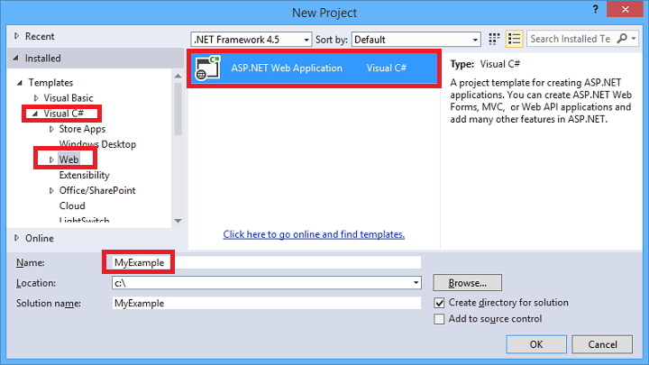
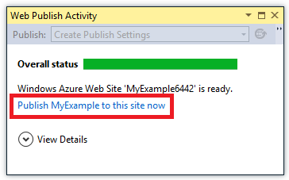

<properties linkid="develop-net-tutorials-get-started-vs2013" urlDisplayName="Introdução ao Windows Azure" pageTitle="Introdução ao Windows Azure para .NET" metaKeywords="" description="Este tutorial mostra como implantar um site do ASP.NET no Windows Azure usando o Visual Studio 2013. Em menos de 15 minutos, você terá um aplicativo em funcionamento na nuvem." metaCanonical="" services="web-sites" documentationCenter=".NET" title="Introdução ao Windows Azure e o ASP.NET" authors=""  solutions="" writer="tdykstra" manager="wpickett" editor="mollybos"  />

# Introdução ao Windows Azure e o ASP.NET

<a href="/pt-br/develop/net/tutorials/get-started/" title="Visual Studio 2013" class="current">Visual Studio 2013</a><a href="/pt-br/develop/net/tutorials/get-started-vs2012/" title="Visual Studio 2012">Visual Studio 2012</a>

Este tutorial mostra como implantar um aplicativo Web ASP.NET em um site do Windows Azure usando o assistente Publicar Web no Visual Studio 2013 ou no Visual Studio 2013 for Web Express. (Se você preferir usar o Visual Studio 2012, consulte [a versão anterior deste tutorial](/pt-br/develop/net/tutorials/get-started-vs2012/).)

É possível abrir uma conta do Windows Azure gratuitamente e, se você ainda não tiver o Visual Studio 2013, o SDK instalará automaticamente o Visual Studio 2013 for Web Express. Assim, você pode começar a desenvolver para o Windows Azure de maneira totalmente gratuita.

Este tutorial pressupõe que você não tem nenhuma experiência anterior com o Windows Azure. Ao concluir este tutorial, você terá um aplicativo Web simples em funcionamento na nuvem.
 
Você aprenderá:

* Como habilitar a máquina para desenvolvimento do Windows Azure instalando o SDK do Windows Azure.
* Como criar um projeto Visual Studio ASP.NET MVC 5 e publicá-lo em um site do Windows Azure.

A ilustração a seguir mostra o aplicativo concluído:

<strong>Observação</strong>
para concluir este tutorial, você precisará de uma conta do Windows Azure. Se não tiver uma conta, você poderá <a href="/pt-br/pricing/member-offers/msdn-benefits-details/?WT.mc_id=A261C142F" target="_blank">ativar os benefícios de assinante MSDN</a> ou <a href="/pt-br/pricing/free-trial/?WT.mc_id=A261C142F" target="_blank">inscrever-se para uma avaliação gratuita</a>.

 
### Segmentos do tutorial

1. [Definir o ambiente de desenvolvimento](#setupdevenv)
3. [Criar um aplicativo ASP.NET MVC 5](#createapp)
4. [Implantar o aplicativo no Windows Azure](#deploytowindowsazure)
5. [Próximas etapas](#nextsteps)

[WACOM.INCLUDE [install-sdk-2013-only](../includes/install-sdk-2013-only.md)]

<h2>Criar o aplicativoCriar um aplicativo ASP.NET MVC 5</h2>

A próxima etapa é criar um projeto de aplicativo Web do Visual Studio que você publicará no Windows Azure.

### Criar o projeto

1. Abra o Visual Studio 2013 ou o Visual Studio 2013 Express for Web.

2. No menu **Arquivo**, clique em **Novo Projeto**.

	

3. Na caixa de diálogo **Novo Projeto**, expanda **C#** e selecione **Web** em **Modelos Instalados** e, em seguida, selecione **Aplicativo Web ASP.NET**.

3. Verifique se o **.NET Framework 4.5** está selecionado como a estrutura de destino.

4. Nomeie o aplicativo **MyExample** e clique em **OK**.

	

5. Na caixa de diálogo **Novo Projeto ASP.NET**, selecione o modelo **MVC** e clique em **Alterar Autenticação**.

	

6. Na caixa de diálogo **Alterar Autenticação**, clique em **Sem Autenticação** e clique em **OK**.

	

	O aplicativo de exemplo que você está criando não possui recursos que exijam que os usuários façam logon. Para obter informações sobre como implementar recursos de autenticação e autorização, consulte a seção [Próximas etapas](#nextsteps) no final deste tutorial. 

5. Na caixa de diálogo **Novo Projeto ASP .NET**, clique em **OK**.

	

### Executar o aplicativo localmente

1. Pressione CTRL+F5 para executar o aplicativo.

	A home page do aplicativo é exibida no navegador padrão.

	

	A URL 'http://localhost' mostra que ele está sendo executado no computador local. Por padrão, ele é executado no IIS Express, que é uma versão simples do IIS desenvolvida para uso durante o desenvolvimento de aplicativos Web.

	Isso é tudo o que é preciso fazer para criar um aplicativo simples que você pode implantar no Windows Azure.

<h2>Implantar o aplicativoImplantar o aplicativo no Windows Azure</h2>

1. Feche o navegador.

5. No **Gerenciador de Soluções** do Visual Studio, clique com o botão direito do mouse no projeto e selecione **Publicar** no menu de contexto.

	

	O assistente de **Publicar Web** é aberto.

6. Na guia **Perfil** do assistente de **Publicar Web**, clique em **Importar**.

	

	A caixa de diálogo **Importar Perfil de Publicação** é aberta.

5. Use um dos seguintes métodos para habilitar o Visual Studio para se conectar à sua conta do Windows Azure.

	* Clique em **Entrar** e, em seguida, insira as credenciais de sua conta do Windows Azure.

		Esse método é mais rápido e fácil, mas se usar esse método, você não poderá ver o Banco de Dados SQL ou os Serviços Móveis no Windows Azure na janela **Gerenciador de Servidores**.

	* Clique em **Gerenciar assinaturas** para instalar um certificado de gerenciamento que permita o acesso à sua conta.

		Na caixa de diálogo **Gerenciar Assinaturas do Windows Azure**, clique na guia **Certificados** e, em seguida, clique em **Importar**. Siga as instruções para baixar e importar um arquivo de assinatura (também chamado de arquivo *.publishsettings*) para a sua conta do Windows Azure.

		> [WACOM.NOTE] Baixe o arquivo de assinatura em uma pasta fora de seus diretórios de código-fonte (por exemplo, na pasta Downloads) e exclua-o após a conclusão da importação. Um usuário mal-intencionado que obtenha acesso ao arquivo de assinatura pode editar, criar e excluir os serviços do Windows Azure.

		Para obter mais informações, consulte [Gerenciar contas, assinaturas e funções administrativas](http://go.microsoft.com/fwlink/?LinkId=324796#BKMK_AccountVCert).

2. Na caixa de diálogo **Importar Configurações de Publicação**, selecione o botão de opção **Importar de um Site do Windows Azure** e, em seguida, clique em **Novo**.

	

3. Na caixa de diálogo **Criar um site no Windows Azure**, digite uma cadeia de caracteres na caixa **Nome do site** para ser usada como a URL exclusiva de seu aplicativo.

	A URL completa consistirá no que você digitar aqui mais o sufixo que você vê ao lado da caixa de texto. Se outra pessoa já tiver usado a URL digitada, você verá um ponto de exclamação vermelho à direita em vez de uma marca de verificação verde, e você precisará inserir outro valor.

4. Na lista suspensa **Local**, escolha o local mais próximo de você.

	Essa configuração especifica em qual data center seu site será executado. 

5. Deixe os campos de banco de dados inalterados.

	Para este tutorial, você não está usando um banco de dados. A seção [Próximas etapas](#nextsteps) no final do tutorial vincula a um tutorial que mostra como usar um banco de dados.

6. Clique em **Criar**. 

	

	Em poucos segundos, o site é criado. Quando você retornar para a caixa de diálogo **Importar Configurações de Publicação**, o novo site estará selecionado na lista suspensa.

6. Clique em **OK**.

	

8. Na guia **conexão** do assistente de **Publicar Web**, clique em **Validar Conexão** para verificar se as configurações estão corretas.

	

	Quando a conexão tiver sido validada, uma marca de seleção verde será mostrada ao lado do botão **Validar Conexão**. 

9. Clique em **Avançar**.

	

10. Na guia **Configurações**, clique em **Avançar**.

	

	Você pode aceitar as configurações padrão nesta guia.  Você está implantando uma configuração de compilação de versão e não precisa excluir arquivos no servidor de destino, pré-compilar o aplicativo ou excluir arquivos na pasta App_Data.

11. Na guia **visualização**, clique em **Iniciar Visualização**.

	

	A guia exibe uma lista dos arquivos que serão copiados no servidor. A exibição da visualização não é obrigatória para publicar o aplicativo, mas é uma função reconhecidamente útil.

12. Clique em **Publicar**.

	

	O Visual Studio inicia o processo de cópia dos arquivos no servidor do Windows Azure.

13. A janela **Saída** mostra quais ações de implantação foram executadas e os relatórios da conclusão com êxito da implantação.

	

14. Após a implantação bem-sucedida, o navegador padrão abre automaticamente a URL do site implantado.

	O aplicativo que você criou agora está em execução na nuvem.

	

<h2>Próximas etapasPróximas etapas</h2>

Neste tutorial, você viu como implantar um aplicativo Web simples em um site do Windows Azure. Outros recursos estão disponíveis para mostrar a você como gerenciar, dimensionar e solucionar problemas do site, como adicionar a funcionalidade de autorização, autenticação de banco de dados e como decidir se seu aplicativo deve ser executado em um Serviço de Nuvem do Windows Azure em vez de em um Site do Windows Azure.

<h3>Como gerenciar um site</h3>
O [Portal de Gerenciamento do Windows Azure][Portal] é uma interface que você pode usar para gerenciar e monitorar todos os serviços do Windows Azure.

Você pode criar novos sites, serviços de nuvem, máquinas virtuais, bancos de dados e muito mais. Você pode criar aplicativos de software livre na galeria. E pode gerenciar os serviços que você criou. Por exemplo, a captura de tela a seguir mostra os botões **Parar**, **Reiniciar** e **Excluir** de um site do Windows Azure na guia **Painel** do portal de gerenciamento. O **Painel** também mostra a estatística de desempenho, como Tempo de CPU usado, número de solicitações, dados de entrada e de saída e quaisquer erros que possam ter ocorrido.

Você pode alterar outras configurações do site na guia **Configurar**. Para obter mais informações, consulte [Como gerenciar sites (a página pode estar em inglês)](/pt-br/manage/services/web-sites/how-to-manage-websites/).

Você também pode criar algumas funções de gerenciamento de site diretamente no **Gerenciador de Servidores** no Visual Studio. Para obter informações sobre o que você pode fazer no **Gerenciador de Servidores**, consulte [Solucionando problemas de Sites do Windows Azure no Visual Studio (a página pode estar em inglês)](/pt-br/develop/net/tutorials/troubleshoot-web-sites-in-visual-studio/).

<h3>Como dimensionar um site</h3>
Quando seu site é público e começa a receber mais tráfego, os tempos de resposta podem se tornar lentos. Para corrigir isso, você pode adicionar facilmente recursos do servidor na guia **Dimensionar** do portal de gerenciamento. Para obter mais informações, consulte [Como dimensionar um site (a página pode estar em inglês)](/pt-br/manage/services/web-sites/how-to-scale-websites/). (A adição de recursos do servidor para dimensionar um site não é gratuita.)

<h3>Como solucionar problemas de um site</h3>
Convém examinar a saída de rastreamento ou o log para obter ajuda na solução de problemas. O Visual Studio fornece ferramentas internas para facilitar a exibição dos logs do Windows Azure à medida que são gerados em tempo real. Você também pode executar em modo de depuração remotamente no Windows Azure. Para obter mais informações, consulte [Solucionando problemas de Sites do Windows Azure no Visual Studio (a página pode estar em inglês)](/pt-br/develop/net/tutorials/troubleshoot-web-sites-in-visual-studio/).

<h3>Como adicionar funcionalidade de banco de dados e autorização</h3>
A maioria dos sites de produção usam um banco de dados e restringem algumas funções de site a usuários autorizados determinados. Para um tutorial que mostra como começar com o acesso ao banco de dados, autenticação e autorização, consulte [Implantar um aplicativo ASP.NET MVC seguro com associação, OAuth e Banco de Dados SQL a um Site do Windows Azure (a página pode estar em inglês)](/pt-br/develop/net/tutorials/web-site-with-sql-database/).

<h3>Como decidir se seu aplicativo deve ser executado em um Serviço de Nuvem</h3>
Em algumas situações, convém executar o aplicativo em um Serviço de Nuvem do Windows Azure em vez de em um Site do Windows Azure. Para obter mais informações, consulte [Modelos de execução do Windows Azure (a página pode estar em inglês)](/pt-br/develop/net/fundamentals/compute/) e [Sites, Serviços de Nuvem e VMs do Windows Azure: quando usar o quê?](http://www.windowsazure.com/pt-br/manage/services/web-sites/choose-web-app-service/). Para obter uma série de tutoriais que mostram como criar um aplicativo Web ASP.NET de várias camadas e implantá-lo em um Serviço de Nuvem, consulte [Aplicativo .NET de várias camadas usando tabelas de armazenamento, filas e blobs (a página pode estar em inglês)](/pt-br/develop/net/tutorials/multi-tier-web-site/1-overview/).

[Portal]: http://manage.windowsazure.com

