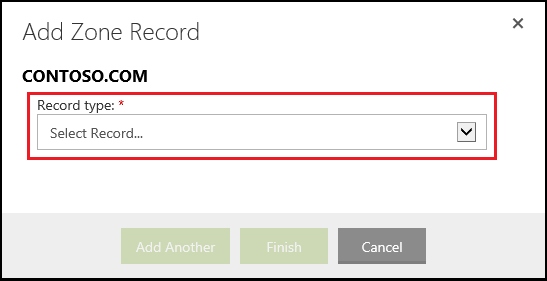

<properties 
	pageTitle="Configurar um nome de domínio GoDaddy para um site do Azure que usa o Gerenciador de Tráfego" 
	description="Saiba como usar um nome de domínio do GoDaddy com Websites do Azure" 
	services="web-sites" 
	documentationCenter="" 
	authors="blackmist" 
	manager="wpickett" 
	editor=""/>

<tags 
	ms.service="web-sites" 
	ms.workload="web" 
	ms.tgt_pltfrm="na" 
	ms.devlang="na" 
	ms.topic="article" 
	ms.date="09/17/2014" 
	ms.author="larryfr, jroth"/>

#Configurando um nome de domínio personalizado para um Site do Azure (GoDaddy)

<a href="/pt-br/documentation/articles/web-sites-custom-domain-name" title="Custom Domain">Domínio personalizado</a><a href="/pt-br/documentation/articles/web-sites-godaddy-custom-domain-name" title="GoDaddy" class="current">GoDaddy</a><a href="/pt-br/documentation/articles/web-sites-network-solutions-custom-domain-name" title="Network Solutions">soluções de rede</a><a href="/pt-br/documentation/articles/web-sites-registerdotcom-custom-domain-name" title="Register.com">Register.com</a><a href="/pt-br/documentation/articles/web-sites-enom-custom-domain-name" title="Enom">Enom</a><a href="/pt-br/documentation/articles/web-sites-moniker-custom-domain-name" title="Moniker">Moniker</a><a href="/pt-br/documentation/articles/web-sites-dotster-custom-domain-name" title="Dotster">Dotster</a><a href="/pt-br/documentation/articles/web-sites-domaindiscover-custom-domain-name" title="DomainDiscover">DomainDiscover</a><a href="/pt-br/documentation/articles/web-sites-directnic-custom-domain-name" title="Directnic">Directnic</a>

<a href="/pt-br/documentation/articles/web-sites-godaddy-custom-domain-name/" title="Websites" class="current">Site</a> | <a href="/pt-br/documentation/articles/web-sites-godaddy-traffic-manager-custom-domain-name/" title="Website using Traffic Manager">Site usando o Gerenciador de Tráfego</a>

[AZURE.INCLUDE [websites-cloud-services-css-guided-walkthrough](../includes/websites-cloud-services-css-guided-walkthrough.md)]

[AZURE.INCLUDE [intro](../includes/custom-dns-web-site-intro.md)]

Este artigo fornece instruções sobre como usar um nome de domínio personalizado adquirido do [Go Daddy](https://godaddy.com) com os sites do Azure.

[AZURE.INCLUDE [introfooter](../includes/custom-dns-web-site-intro-notes.md)]

Neste artigo:

-   [Compreendendo os registros DNS](#understanding-records)
-   [Adicionar um registro DNS a seu domínio personalizado](#bkmk_configurecname)
-   [Habilitar o domínio no site](#enabledomain)

<h2>Compreendendo os registros DNS</h2>

[AZURE.INCLUDE [understandingdns](../includes/custom-dns-web-site-understanding-dns-raw.md)]

<h2>Adicionar um registro DNS a seu domínio personalizado</h2>

Para associar seu domínio personalizado a um site do Azure, você deve adicionar uma nova entrada na tabela DNS para seu domínio personalizado usando as ferramentas fornecidas pelo GoDaddy. Use as seguintes etapas para localizar as ferramentas DNS para o GoDaddy.com

1. Faça logon na sua conta do GoDaddy.com e selecione **Minha Conta** e, em seguida, **Gerenciar meus domínios**. Por último, selecione o menu suspenso para o nome de domínio que você deseje usar com seu site do Azure e selecione **Gerenciar DNS**.

	

2. Na página **Detalhes do domínio**, role até a guia **Arquivo de zona DNS**. Esta é a seção usada para adicionar e modificar registros DNS para o nome do domínio. 

	

	Selecione **Adicionar registro** para adicionar um registro existente.

	Para **editar** um registro existente, selecione o ícone de lápis e papel do lado do registro.

	> [AZURE.NOTE]  Antes de adicionar os novos registros, observe que o GoDaddy já criou os registros DNS para subdomínios populares (chamados **Host** no editor), como **email**, **arquivos**, **mail** e outros. Se o nome que você deseja usar já existir, modifique o registro existente em vez de criar um novo.

4. Ao adicionar um registro, você deve primeiro, selecionar o tipo de registro.

	

	Em seguida, você deve fornecer o **Host** (o domínio ou subdomínio personalizado) e o que **Aponta**.

	

	* Ao adicionar um **registro A (host)** - você deve definir o campo **Host** como **@** (isso representa o nome do domínio raiz, como **contoso.com**) * (um caractere curinga para corresponder a vários subdomínios) ou o subdomínio que você deseja usar (por exemplo, **www**). Você deve definir o campo **Aponta para** como o endereço IP do seu site do Azure.
	
		> [AZURE.NOTE] Ao usar um registro (host) A, você também deve adicionar um registro CNAME com a seguinte configuração:
		> 
		> * Um valor **Host** de**awverify** que **aponta para** um valor de **awverify.&lt;yourwebsitename&gt;.azurewebsites.net**.
		> 
		> Esse registro CNAME é usado pelo Azure para validar que você possui o domínio descrito pelo registro A

	* Ao adicionar um **registro CNAME (alias)** - você deve definir o campo **Host** como o subdomínio que deseja usar. Por exemplo, **www**. Você deve definir o campo **Aponta para** como o nome do domínio **.azurewebsites.net** do Site do Azure. Por exemplo, **contoso.azurwebsites.net**.

5. Ao concluir a adição ou a modificação dos registros, clique em **Concluir** para salvar as alterações.

<h2>Habilitar o nome do domínio no seu site</h2>

[AZURE.INCLUDE [modos](../includes/custom-dns-web-site-enable-on-web-site.md)]

<!--HONumber=42-->
