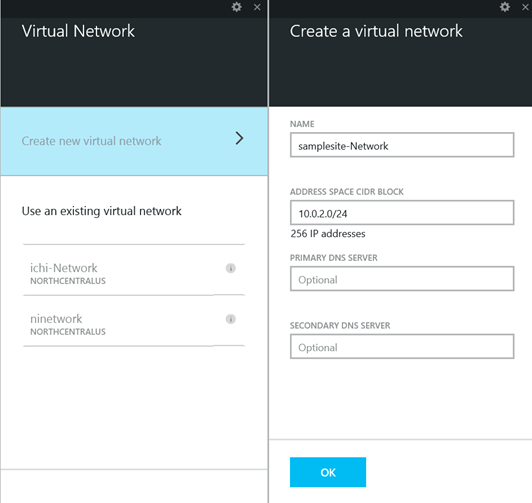
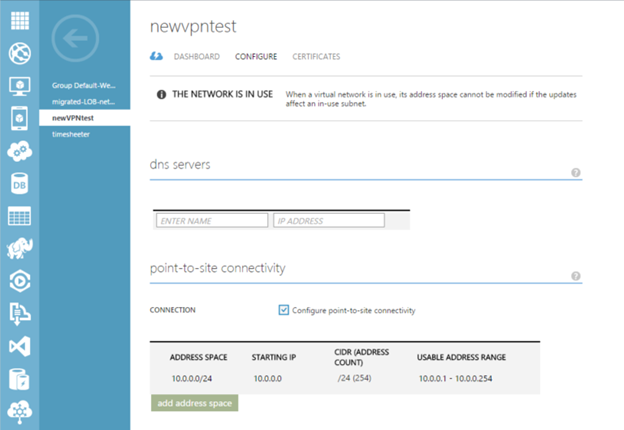
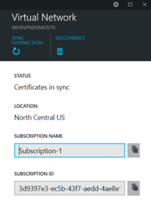

<properties title="Integrate your Azure Website with an Azure Virtual Network" pageTitle="Integrar o site do Azure com a VNet do Azure" description="Mostra como conectar um site do Azure a uma rede de virtual do Azure nova ou existente" metaKeywords="" services="web-sites,virtual-network" solutions="web,integration,infrastructure" documentationCenter="" authors="cephalin" videoId="" scriptId="" manager="wpickett" />

<tags ms.service="web-sites" ms.workload="web" ms.tgt_pltfrm="na" ms.devlang="na" ms.topic="article" ms.date="09/24/2014" ms.author="cephalin" />

# Integrar seu site do Azure com uma Rede virtual do Azure #
Este documento descreve o recurso de visualização de integração da rede virtual e mostra como configurá-lo com o site do Azure.  Se você não está familiarizado como as Redes virtuais do Azure, esta é uma capacidade que permitirá que você desenvolva soluções híbridas com seus recursos locais e do Azure.  

Esta integração fornece acesso ao seu site aos recursos na sua rede virtual, mas não concede acesso ao seu site por meio da rede virtual.  Alguns cenários padrão estão onde o seu site precisa de acesso a um banco de dados ou aos serviços da Web que estão executando em máquinas virtuais na sua VNET ou até em seu próprio data center.  Ele não permite que você monte uma unidade.  No momento, ele também não oferece suporte para habilitar a integração com os sistemas de autenticação na sua vnet.  O recurso está no modo de visualização e continuará a ser aperfeiçoado antes de alcançar a GA.

Para obter mais detalhes sobre as Redes virtuais do Azure consulte a Visão geral da Rede Virtual do Azure sobre os casos de uso e benefícios de uma Rede virtual do Azure.

## Introdução ##
Veja aqui algumas coisas para se ter em mente antes de conectar seu site a uma rede virtual.

1.	Os sites podem apenas ser conectados a uma rede virtual se estão executando em um plano de hospedagem na web que esteja na faixa de preço 'Padrão'.  Os sites gratuitos, compartilhados e básicos não podem se conectar a uma rede virtual.
2.	Se a sua rede virtual de destino já existe, você deve ter o ponto a site habilitado com o gateway de roteamento dinâmico antes de conectá-la a um site.  Não é possível habilitar a VPN ponto a site se o seu gateway está configurado com o roteamento estático.
3.	Você pode ter apenas 5 redes configuradas no seu plano de hospedagem na Web.  Um site pode somente estar conectado a um rede de cada vez.  Estas 5 redes podem ser usadas por qualquer número de sites da Web no mesmo plano de hospedagem na Web.  

Você tem a opção de se conectar a uma rede virtual nova ou existente.  Se você criar uma nova rede então um gateway será pré-configurado para você.  Observe que ao criar e configurar uma nova rede virtual levará alguns minutos.  

Se seu site não estiver na faixa Padrão então a interface de usuário o informa e lhe fornece acesso as faixas de preço caso você clique nela.

 

## Como o sistema funciona ##
	De modo oculto, este recurso utiliza a tecnologia VPN Ponto a site para se conectar ao site do Azure para sua VNET.  A arquitetura do sistema de sites do Azure tem vários locatários por natureza o que impede o provisionamento de sites diretamente em uma VNET como é feito com as máquinas virtuais.  Ao desenvolver uma tecnologia ponto a site limitamos o acesso à rede para apenas a máquina virtual que está hospedando o site.  O acesso à rede é ainda mais limitado nestes hosts do site assim seus sites podem apenas acessar as redes que você configurar para eles acessarem.  

O trabalho exigido para proteger suas redes para somente os sites que precisam de acesso impede a capacidade de criar conexões SMB.  Embora seja possível acessar recursos remotos, isto não inclui ser capaz de montar uma unidade remota.

 
Se você ainda não configurou um servidor DNS com sua rede virtual será necessário usar endereços IP.  Certifique-se de expor suas portas para seus pontos de extremidade desejados através do seu firewall.  Quando se trata de testar sua conexão o único método atualmente disponível é usar um site ou trabalho web que faz uma chamada para seu ponto de extremidade desejado.  Ferramentas como ping ou nslookup não funcionam através do console Kudu.  Esta é uma área que será aperfeiçoada no futuro próximo.  

## Conecte-se a uma rede pré-existente ##
Para se conectar um site a uma Rede Virtual vá para a lâmina do site, clique no bloco da Máquina virtual na seção Sistemas de rede e selecione umas das redes pré-existentes.

 
O sistema então criará um certificado para autenticar com sua VNET se for o primeiro site na sua assinatura a estabelecer uma conexão àquela rede.  Para ver o certificado vá para o portal atual, navegue para as Redes virtuais, selecione a rede e selecione a guia Certificados.  

Na imagem acima você pode ver uma rede chamada cantConnectVnet que está esmaecida e não pode ser selecionada.  Há apenas dois motivos que este deve ser o caso.  Significa que você não tem a VPN ponto a site habilitado na sua rede ou você não forneceu um gateway de roteamento dinâmico na sua VNET.  Quando ambos os itens são satisfeitos então você poderá secionar a VNET para integração com seu site.

## Crie e conecte-se a uma nova VNET ##
Além de se conectar a uma VNET, você pode também criar uma VNET nova na interface do usuário do site e se conectar automaticamente a ela.  Para fazer isto siga o mesmo caminho para atingir a interface de usuário da Rede Virtual e selecione Criar nova rede virtual.  A interface de usuário que abre permite que você nomeie a rede, especifique o espaço de endereço e defina os endereços para os servidores DNS para serem usados pela rede virtual.

 
A criação da nova rede virtual com gateways configurados pode levar até 30 minutos para ser concluída.  Durante este período a interface de usuário informará a você que ainda está trabalhando nisto e exibirá a seguinte mensagem.

Assim que a rede tiver ingressado no site, o site terá acesso aos recursos naquela VNET sobre o TCP ou UDP.  Se você deseja acessar recursos no seu sistema local que estão disponíveis por meio da VPN site a site para sua VNET, então será necessário adicionar rotas para sua própria rede corporativa para permitir que o tráfego vá de sua rede para os endereços ponto a site configurados na sua VNET.

Depois de concluir com êxito a integração, o portal exibirá informações básicas sobre a conexão, fornecerá uma maneira de desconectar o site da rede e também fornecerá a você uma maneira de sincronizar os certificados usados para autenticar a conexão.  A sincronização pode ser necessária se um certificado expirou ou foi revogado.  

Gerenciando a conexão de rede virtual
Você pode ver um lista de todas as redes virtuais atualmente associadas aos sites em um plano de hospedagem na Web visitando a lâmina do plano de hospedagem na Web.  Você pode ter no máximo 5 redes associadas a um plano de hospedagem na Web padrão.

Caso o plano de hospedagem da Web seja reduzido a um plano inferior como o Gratuito, Compartilhado ou Básico, então as conexões de rede virtual que são usadas pelos sites naquele plano serão desabilitadas.  Caso o plano seja reduzido de volta para um plano Padrão, então estas conexões de rede serão reestabelecidas.

Neste momento não é possível, no Azure, pegar uma máquina virtual existente e movê-la para um rede virtual.  A máquina virtual precisa ser fornecida para aquela rede virtual durante a criação.  

## Acessando recursos locais ##
Ao trabalhar com uma VNET que foi configurada com o VPN site a site, há uma etapa adicional necessária para fornecer acesso aos seus recursos locais por meio do site do Azure.  Será necessário adicionar rotas para sua rede local para permitir que o tráfego vá de sua rede para os endereços ponto a site configurados na sua VNET.  Para ver o intervalo IP para sua conectividade ponto a site, vá para a área de Redes no portal atual, como exibido aqui.

## Certificados ##
Para estabelecer uma conexão segura com sua VNET, há uma troca de certificados.  Você pode ver a impressão digital para o certificado público que os sites do Azure geram do portal de Redes atual conforme exibido abaixo.  

Se os certificados saem fora de sincronização por algum motivo, como exclusão acidental do portal de Redes, então a conectividade será interrompida.  Para corrigir, há uma ação de conexão síncrona na interface de usuário de rede virtual dos sites que reestabelecerá a conexão.

Esta ação deve ser usada se você adicionar um DNS à sua rede virtual ou se você adicionar o VPN site a site à sua rede.  

## Comparar e contrastar com as Conexões Híbridas ##
Há outro recurso oferecido pelos sites do Azure chamado de Conexões Híbridas que é semelhante, de alguma forma, à integração da Rede Virtual.  Enquanto há alguma sobreposição de caso de uso, nenhum dos recursos pode substitui o outro.  Com as Conexões Híbridas você pode estabelecer conexões a vários pontos de extremidade de aplicativos em uma combinação de redes.  O recurso Redes virtuais conecta o seu site a uma VNET que pode ser conectada à sua rede local.  Isto funciona bem de os seus recursos estiverem todos no escopo daquela rede.  

Outra diferença é que você precisa instalar um agente de retransmissão para as Conexões Híbridas funcionarem.  Este agente precisa executar em uma instância do Windows Server.  Com o recurso da Rede Virtual não há nada para instalar e ele habilita o aceso aos recursos remotos independentemente dos sistemas operacionais hospedados.  

Há também diferenças na faixa de preço neste momento entre os dois recursos.  Isto ocorre porque no nível menos dispendioso o recurso Conexões Híbridas é extremamente útil para cenários de desenvolvimento e teste e somente fornece acesso a um pequeno número de pontos de extremidade.  O recurso de rede virtual fornece a você acesso a tudo na VNET ou ao que está conectado a ela.  
