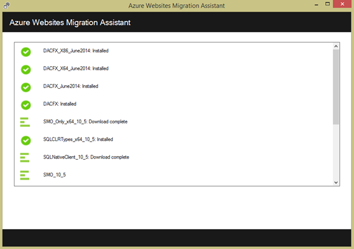
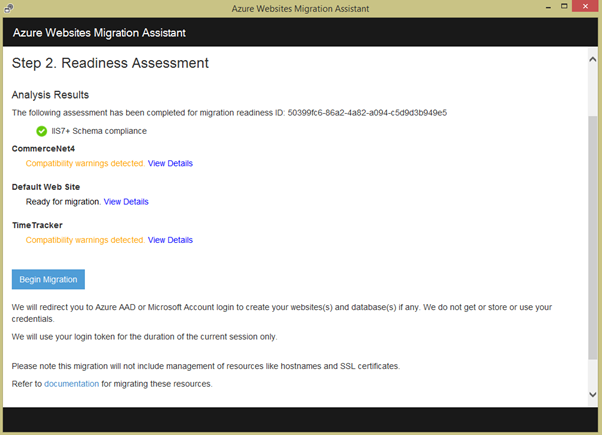

<properties 
	pageTitle="Migrar os sites do IIS para Sites do Azure usando o Assistente de Migração" 
	description="Mostra como usar o Assistente de migração de sites do Azure para migrar rapidamente sites existentes do IIS para sites do Azure" 
	services="web-sites" 
	documentationCenter="" 
	authors="cephalin" 
	writer="cephalin" 
	manager="wpickett" 
	editor=""/>

<tags 
	ms.service="web-sites" 
	ms.workload="web" 
	ms.tgt_pltfrm="na" 
	ms.devlang="na" 
	ms.topic="article" 
	ms.date="10/20/2014" 
	ms.author="cephalin"/>

# Migrar os sites do IIS para sites do Azure usando o Assistente de migração #
Você pode migrar facilmente para sites do Azure seus sites existentes executados no Internet Information Service (IIS) 6 ou posterior. [O Assistente de migração de sites do Azure](https://www.movemetothecloud.net/) pode analisar a instalação do servidor IIS, identificar quais sites podem ser migrados para sites do Azure, realçar todos os elementos que não podem ser migrados ou não têm suporte na plataforma e, em seguida, migrar seus sites e bancos de dados associados para o Azure.

>[AZURE.NOTE] O Windows Server 2003 chegará ao fim do suporte em 14 de julho de 2015. Se você tiver atualmente os sites em um servidor IIS que é o Windows Server 2003, Websites do Azure é uma forma de risco baixo, de baixo custo e de baixa fricção para manter seus sites online e Assistente de migração de Websites do Azure pode ajudar a automatizar o processo de migração para você. 

## Elementos verificados durante a análise de compatibilidade ##
O Assistente de migração de sites do Azure cria um relatório de prontidão para identificar quaisquer causas potenciais de preocupação ou problemas de bloqueio que podem impedir uma migração bem-sucedida do IIS local para sites do Azure. Alguns dos principais itens aos quais você deve se atentar:

-	Associações de porta - sites do Azure somente dão suporte à porta 80 para HTTP e porta 443 para tráfego HTTPS. Configurações de porta diferentes serão ignoradas e o tráfego será roteado para 80 ou 443. 
-	Autenticação - os Sites do Azure dão suporte à autenticação anônima por padrão e autenticação de formulários onde especificados por um aplicativo. A autenticação do Windows pode ser usada somente com a integração com o Active Directory do Azure e o ADFS. Todas as outras formas de autenticação, por exemplo, Autenticação Básica, não têm suporte no momento. 
-	Cache de Assembly Global (GAC) - O GAC não tem suporte nos sites do Azure. Se seu aplicativo faz referência a conjuntos que você normalmente implanta no GAC, você precisará implantar na pasta bin do aplicativo em sites do Azure. 
-	Modo de compatibilidade do IIS 5 - Ele não tem suporte em sites do Azure. 
-	Pools de aplicativos - Em sites do Azure, cada site e seus aplicativos filho são executados no mesmo pool de aplicativos. Se o site tiver vários aplicativos filho utilizando vários pools de aplicativos, consolide-os em um único pool de aplicativos com as mesmas configurações ou migre cada aplicativo em um site separado.
-	Componentes COM - Sites do Azure não permitem o registro de componentes COM na plataforma. Se seus sites ou aplicativos utilizarem componentes COM, você deve reescrevê-los em código gerenciado e implantá-los em seu site ou aplicativo.
-	Filtros ISAPI - Os sites do Azure dão suporte ao uso de filtros ISAPI. Você precisa fazer o seguinte:
	-	implantar as DLLs com seu site 
	-	registrar as DLLs usando o [Web.config](http://www.iis.net/configreference/system.webserver/isapifilters)
	-	Coloque um arquivo applicationHost.xdt na raiz do site com o conteúdo seguinte:

			<?xml version="1.0"?>
			<configuration xmlns:xdt="http://schemas.microsoft.com/XML-Document-Transform">
			<configSections>
			    <sectionGroup name="system.webServer">
			      <section name="isapiFilters" xdt:Transform="SetAttributes(overrideModeDefault)" overrideModeDefault="Allow" />
			    </sectionGroup>
			  </configSections>
			</configuration>

		Para obter mais exemplos de como usar transformações de documentos XML com o seu site, consulte [transformar seu Site do Microsoft Azure](http://blogs.msdn.com/b/waws/archive/2014/06/17/transform-your-microsoft-azure-web-site.aspx).

-	Outros componentes, como SharePoint, extensões de servidor do FrontPage (FPSE), FTP, certificados SSL não serão migrados.

## Como usar o Assistente de migração de sites do Azure ##
Esta seção percorre um exemplo para migrar alguns sites que usam um banco de dados do SQL Server e em execução em um computador Windows Server 2003 R2 (IIS 6.0) no local:

1.	No servidor IIS ou em seu computador cliente, navegue até [https://www.movemetothecloud.net/](https://www.movemetothecloud.net/) 

	

2.	Instale o Assistente de migração de sites do Azure clicando no botão **Servidor IIS dedicado**. Mais opções serão disponibilizadas futuramente. 
4.	Clique no botão **Instalar ferramenta** para instalar o Assistente de migração de sites do Azure em seu computador.

	

	>[AZURE.NOTE] Você também pode clicar em **Download para instalação offline** para baixar um arquivo ZIP para instalação em servidores não conectados à Internet. Ou, você pode clicar em **Carregar um relatório de preparação de migração existente**, que é uma opção avançada para trabalhar com um migração de preparação para o relatório existente que você gerou anteriormente (explicado posteriormente).

5.	Na tela **Instalação do aplicativo**, clique em **Instalar** para instalar em seu computador. Ele também instalará dependências correspondentes, como a implantação da Web, DacFX e IIS, se necessário. 

	

	Uma vez instalado, o Assistente de migração de sites do Azure será iniciado automaticamente.
  
6.	Escolha **Migrar sites e bancos de dados de um servidor remoto para o Azure**. Insira as credenciais administrativas para o servidor remoto e clique em **Continuar**. 

	

	Você certamente pode optar por migrar do servidor local. A opção remota é útil quando você deseja migrar sites de um servidor IIS de produção.
 
	Agora a ferramenta de migração inspecionará a configuração do seu servidor IIS, como sites, aplicativos, pools de aplicativos e dependências para identificar sites candidatos para a migração. 

8.	A captura de tela abaixo mostra três sites -**site padrão**, **TimeTracker** e **CommerceNet4**. Todos eles têm um banco de dados associado que desejamos migrar. Selecione todos os sites que você gostaria de avaliar e, em seguida, clique em **Avançar**.

	
 
9.	Clique em **Carregar** para carregar o relatório de preparação. Se você clicar em **Salvar arquivo localmente**, você pode executar a ferramenta de migração novamente mais tarde e carregar o relatório de prontidão salvo como observado anteriormente.

	
 
	Depois que você carregar o relatório de preparação, o Azure executa análise de preparação e mostra os resultados. Leia os detalhes de avaliação para cada site e certifique-se de que você compreenda ou que tenha resolvido todos os problemas antes de continuar. 
 
	

12.	Clique em **Começar a migração** para iniciar a migração. Você será redirecionado para o Azure para fazer logon em sua conta. É importante que você faça logon com uma conta que tenha uma assinatura ativa do Azure. Se você não tiver uma conta do Azure, então é possível se inscrever para uma avaliação gratuita aqui. 

13.	Selecione a conta de locatário, a assinatura do Azure e a região de uso para seus sites do Azure migrados e bancos de dados e, em seguida, clique em **Iniciar migração**. Você pode selecionar os sites para migrar posteriormente.

	

14.	Na próxima tela, você pode fazer alterações nas configurações de migração padrão, como:

	- usar um banco de dados SQL Azure existente ou criar um novo banco de dados SQL do Azure e configurar suas credenciais
	- Selecione os sites para migrar
	- defina nomes para os sites do Azure e seus bancos de dados SQL vinculados
	- personalize as configurações globais e configurações no nível do site

	A captura de tela abaixo mostra todos os sites selecionados para migração com as configurações padrão.

	

	>[AZURE.NOTE] a caixa de seleção **Habilitar o Active Directory do Azure** em configurações personalizadas integra o site ao [Active Directory do Azure](http://azure.microsoft.com/documentation/articles/active-directory-whatis/) (o **diretório padrão**). Para obter mais informações sobre sincronização do Active Directory do Azure com o Active Directory no local, consulte [Integração de diretórios](http://msdn.microsoft.com/library/jj573653).

16.	 Após fazer as alterações desejadas, clique em **Criar** para iniciar o processo de migração. A ferramenta de migração criará o banco de dados SQL do Azure e o site do Azure e, em seguida, publicará o conteúdo do site e os bancos de dados. O andamento da migração é claramente mostrado na ferramenta de migração, e você verá uma tela de resumo no final, que detalha os sites migrados, se eles foram bem-sucedidos, e vincula aos sites do Azure recém-criados. 

	Se ocorrer algum erro durante a migração, a ferramenta de migração claramente indicará a falha e reverterá as alterações. Você também poderá enviar o relatório de erros diretamente à equipe de engenharia, clicando no botão **Enviar relatório de erros**, com a pilha de chamadas de falhas capturadas e criar o corpo da mensagem. 

	

	Se a migração tiver êxito e não resultar em erros, você também pode clicar no botão **Enviar comentários** para fornecer comentários diretamente. 
 
20.	Clique nos links para os sites do Azure e verifique se a migração foi bem-sucedida.

<!--HONumber=42-->
