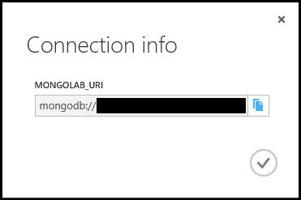
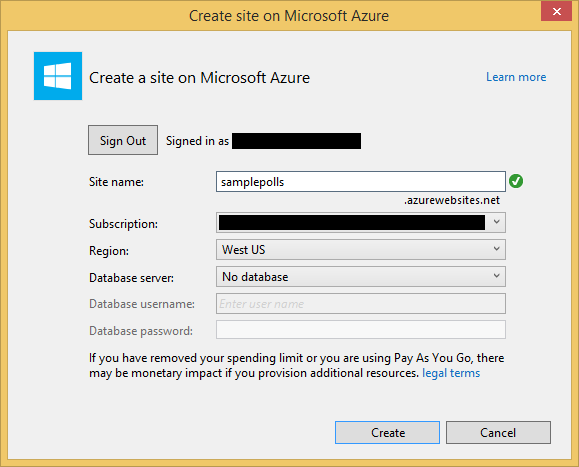

<properties linkid="web-sites-python-ptvs-bottle-mongodb" title="Bottle and MongoDB on Azure with Python Tools 2.1 for Visual Studio" pageTitle="Bottle e MongoDB no Azure com ferramentas 2.1 do Python para Visual Studio" description="Learn how to use the Python Tools for Visual Studio to create a Bottle application that stores data in a MongoDB database instance and can be deployed to a web site." metaKeywords="" services="web-sites" solutions="" documentationCenter="Python" authors="huvalo" videoId="" scriptId="" manager="wpickett" editor="" />

<tags ms.service="web-sites" ms.workload="web" ms.tgt_pltfrm="na" ms.devlang="python" ms.topic="article" ms.date="10/10/2014" ms.author="huvalo" />

# Bottle e MongoDB no Azure com ferramentas 2.1 do Python para Visual Studio

Neste tutorial, vamos criar um aplicativo de pesquisa simples usando um dos modelos de exemplo PTVS.

O aplicativo de pesquisa define um resumo para seu repositório, assim você pode alternar facilmente entre diferentes tipos de repositórios (na memória, armazenamento de tabela do Azure, MongoDB).

Iremos aprender como usar um serviço MongoDB hospedado no Azure, como configurar o aplicativo para usar MongoDB e como publicar o aplicativo em um site do Azure.

Consulte o [Python Developer Center][] para obter mais artigos que abordam o desenvolvimento de sites do Azure com o PTVS usando estruturas web Bottle, Flask e Django, com serviços MongoDB, armazenamento de tabela do Azure, MySQL e banco de dados SQL.  Embora este artigo se concentre em sites do Azure, as etapas são semelhantes ao desenvolvimento de [serviços de nuvem do Azure][].

+ [Pré-requisitos](#prerequisites)
+ [Criar o projeto](#create-the-project)
+ [Criar um banco de dados MongoDB](#create-a-mongodb-database)
+ [Configurar o projeto](#configure-the-project)
+ [Explorar o banco de dados MongoDB](#explore-the-mongodb-database)
+ [Publicar em um Site do Azure](#publish-to-an-azure-website)
+ [Configure o site do Azure](#configure-the-azure-website)
+ [Próximas etapas](#next-steps)

##Pré-requisitos

 - Visual Studio 2012 ou 2013
 - [Python Tools 2,1 para Visual Studio][]
 - [Ferramentas Python 2.1 para amostras VSIX do Visual Studio][]
 - [Azure SDK Tools para VS 2013][] ou [Azure SDK Tools para VS 2012][]
 - [Python 2.7 de 32 bits][] ou [Python 3.4 de 32 bits][]
 - [RoboMongo][] (opcional)

[WACOM.INCLUDE [create-account-and-websites-note](../includes/create-account-and-websites-note.md)]

##Criar o projeto

Nesta seção, vamos criar um projeto do Visual Studio usando um modelo de exemplo.  Vamos criar um ambiente virtual e instalar os pacotes necessários.  Em seguida, vamos executar o aplicativo localmente usando o repositório na memória padrão.

1.  No Visual Studio, selecione **Arquivo**, **Novo projeto**. 

1.  Os modelos de projeto do VSIX de exemplos PTVS estão disponíveis em **Python**, **Exemplos**.  Selecione o **Projeto Web Bottle de pesquisas** e clique em OK para criar o projeto.

  	

1.  Você precisará instalar pacotes externos.  Selecione **Instalar em um ambiente virtual**.

  	

1.  Selecione **Python 2.7** ou **Python 3.4** como o interpretador de base.

  	

1.  Confirme se o aplicativo funciona pressionando <kbd>F5</kbd>.  Por padrão, o aplicativo usa um repositório na memória que não exige nenhuma configuração.  Todos os dados são perdidos quando o servidor Web é interrompido.

1.  Clique em **Criar pesquisas de exemplo**, clique em uma pesquisa e vote.

  	

##Criar um banco de dados MongoDB

Para banco de dados, vamos criar um banco de dados MongoLab hospedado no Azure.

Como alternativa, você pode criar sua própria máquina virtual em execução no Azure, em seguida, instalar e administrar o MongoDB por conta própria.

Você pode criar uma avaliação gratuita com MongoLab seguindo estas etapas.

1.  Faça logon no [Portal de Gerenciamento do Azure][].

1.  Na parte inferior do painel de navegação, clique em **NOVO**.

  	

1.  Clique em **ARMAZENAMENTO**, e em **MongoLab**.

  	

1.  Em Nome, digite um nome a ser usado para o serviço de banco de dados.

1.  Escolha um Grupo de Região/Afinidade no qual deseja localizar serviço do banco de dados. Se você usar o banco de dados de seu aplicativo do Azure, selecione a mesma região onde você implantará seu aplicativo.

  	

1.  Clique em **COMPRAR**.

##Configurar o projeto

Nesta seção, configuraremos nosso aplicativo para usar o banco de dados MongoDB que acabamos de criar.  Veremos como obter as configurações de conexão do portal do Azure.  Em seguida, vamos executar o aplicativo localmente.

1.  No [Portal de Gerenciamento do Azure][], clique em **COMPLEMENTOS**, e clique no serviço MongoLab criado anteriormente.

1.  Clique em **INFORMAÇÕES DE CONEXÃO**.  Você pode usar o botão Copiar para colocar o valor **MONGOLAB\_URI** na área de transferência.

  	

1.  No Visual Studio, clique com o botão direito do mouse no nó do projeto no Gerenciador de Soluções e selecione **Propriedades**.  Clique na guia **Depuração**.

  	

1.  Defina os valores das variáveis de ambiente exigidas pelo aplicativo no **Comando de depuração do servidor**, **Ambiente**.

        REPOSITORY_NAME=mongodb
        MONGODB_HOST=<value of MONGOLAB_URI>
        MONGODB_DATABASE=<database name>

    Isso definirá as variáveis de ambiente quando você **iniciar a depuração**.  Se você quiser que as variáveis sejam definidas quando você **Iniciar sem depuração**, defina os mesmos valores também em **Executar comando de servidor**.

    Como alternativa, você pode definir variáveis de ambiente usando o painel de controle do Windows.  Essa é uma opção melhor se você quiser evitar armazenar credenciais no código-fonte/arquivo de projeto.  Observe que você precisará reiniciar o Visual Studio para os novos valores de ambiente para ficar disponível para o aplicativo.

1.  O código que implementa o repositório do MongoDB está em **models/mongodb.py**.

1.  Execute o aplicativo com <kbd>F5</kbd>.  As pesquisas que são criadas com **Criar pesquisas de exemplo** e os dados enviados por votação poderão ser serializados no MongoDB.

1.  Navegue até a página **Sobre** para verificar se o aplicativo está usando o repositório **MongoDB**.

  	

##Explorar o banco de dados MongoDB

Você pode usar um aplicativo como [RoboMongo][] para consultar e fazer edições em um banco de dados MongoDB.  Nesta seção, usaremos RoboMongo para exibir o conteúdo do banco de dados de aplicativo de pesquisa.

1.  Criar uma nova conexão.  Você precisará do **MONGOLAB\_URI** que recuperamos na seção anterior.

    Observe o formato da URI: `mongodb://<name>:<password>@<address>:<port>/<name>`

    O nome corresponde ao nome digitado quando você criou o serviço com o Azure.  Ele é usado para o nome de usuário e o nome do banco de dados.

1.  Na página de conexão, defina o **Nome** para qualquer nome desejado para a conexão.  Também defina os campos de **Endereço** e **Porta** no *endereço* e *porta* do **MONGOLAB\_URI**.

  	

1.  Na página de autenticação, defina **Banco de dados** e **Nome de usuário** no *nome* do **MONGOLAB\_URI**.  Defina também a **Senha** na *senha* do **MONGOLAB\_URI**.

  	

1.  Salve e conecte-se ao banco de dados.  Agora você pode consultar a coleção de pesquisas.

  	

##Publicar em um Site do Azure

O PTVS fornece uma maneira fácil de implantar seu aplicativo Web em um site do Azure.

1.  No **Gerenciador de Soluções**, clique com o botão direito do mouse no projeto de nó e selecione **Publicar**.

  	

1.  Clique em **Sites do Microsoft Azure**.

1.  Clique em **Novo** para criar um novo site.

1.  Selecione um **Nome de site** e uma **Região** e clique em **Criar**.

  	

1.  Aceite todos os outros padrões e clique em **Publicar**.

1.  Seu navegador da Web será aberto automaticamente no site publicado.  Se navegar até a página Sobre, você verá que ele usa o repositório **Na memória**, não o repositório de **MongoDB**.

    Isso ocorre porque as variáveis de ambiente não são definidas no site do Azure, portanto, ele usa os valores padrão especificados em **settings.py**.

##Configure o site do Azure

Nesta seção, configuraremos variáveis de ambiente para o site.

1.  No [Portal de Gerenciamento do Azure][], clique no site criado na seção anterior.

1.  No menu superior, clique em **CONFIGURAR**.

  	

1.  Role para baixo até a seção de **configurações do aplicativo** e defina os valores para **REPOSITORY\_NAME**, **MONGODB\_HOST** e **MONGODB\_DATABASE**, conforme descrito na seção acima.

  	

1.  No menu inferior, clique em **SALVAR**, **REINICIAR** e em **PROCURAR**.

  	

1.  Você deve ver o aplicativo funcionando conforme o esperado, utilizando o repositório do **MongoDB**.

    Parabéns!

  	

##Próximas etapas

Siga estes links para saber mais sobre as ferramentas do Python para Visual Studio, Bottle e MongoDB.

- [Ferramentas Python para documentação do Visual Studio][]
  - [Projetos da Web][]
  - [Projetos de serviços de nuvem][]
  - [Depuração remota no Microsoft Azure][]
- [Documentação do Bottle][]
- [MongoDB][]
- [Documentação do PyMongo][]
- [PyMongo][]

<!--Link references-->
[Centro de desenvolvedores do Python]: /pt-br/develop/python/
[Serviços de nuvem do Azure]: ../cloud-services-python-ptvs/

<!--External Link references-->
[Portal de Gerenciamento do Azure]: https://manage.windowsazure.com
[RoboMongo]: http://robomongo.org/
[Python Tools 2,1 para Visual Studio]: http://go.microsoft.com/fwlink/?LinkId=517189
[Ferramentas Python 2.1 para amostras VSIX do Visual Studio]: http://go.microsoft.com/fwlink/?LinkId=517189
[Ferramentas do SDK do Azure para VS 2013]: http://go.microsoft.com/fwlink/?LinkId=323510
[Ferramentas do SDK do Azure para VS 2012]: http://go.microsoft.com/fwlink/?LinkId=323511
[Python 2.7 32-bit]: http://go.microsoft.com/fwlink/?LinkId=517190 
[Python 3,4 32-bit]: http://go.microsoft.com/fwlink/?LinkId=517191
[Ferramentas Python para documentação do Visual Studio]: http://pytools.codeplex.com/documentation
[Documentação do Bottle]: http://bottlepy.org/docs/dev/index.html
[MongoDB]: http://www.mongodb.org/
[Documentação do PyMongo]: http://api.mongodb.org/python/current/
[PyMongo]: https://github.com/mongodb/mongo-python-driver
[Depuração remota no Microsoft Azure]: http://pytools.codeplex.com/wikipage?title=Features%20Azure%20Remote%20Debugging
[Projetos da Web]: http://pytools.codeplex.com/wikipage?title=Features%20Web%20Project
[Projetos de serviços de nuvem]: http://pytools.codeplex.com/wikipage?title=Features%20Cloud%20Project
