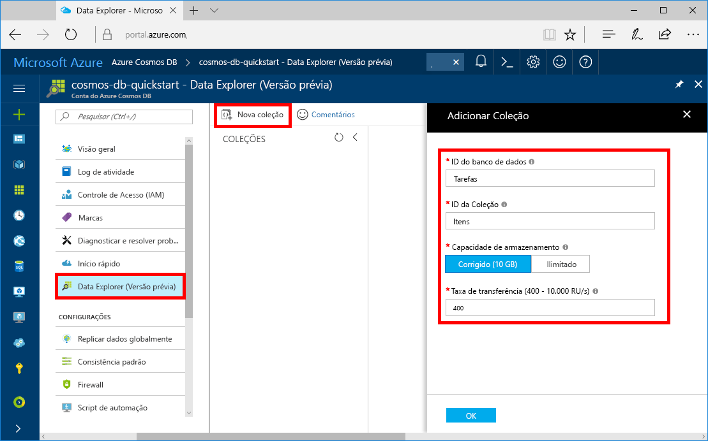

Agora, você pode usar a ferramenta Data Explorer no Portal do Azure para criar um banco de dados e uma coleção. 

1. No Portal do Azure, no menu de navegação à esquerda, clique em **Data Explorer (Versão prévia)**. 

2. Na folha **Data Explorer (Versão prévia)**, clique em **Nova Coleção** e então forneça estas informações:

    

    Configuração|Valor sugerido|Descrição
    ---|---|---
    ID do banco de dados|Tarefas|O nome do novo banco de dados. Os nomes de banco de dados devem conter de 1 a 255 caracteres e não podem conter /, \\, #, ?, ou um espaço à direita.
    ID da coleção|Itens|O nome da nova coleção. Os nomes de coleção têm os mesmos requisitos de caractere que as IDs de banco de dados.
    Capacidade de armazenamento| Fixo (10 GB)|Use o valor padrão. Esse valor é a capacidade de armazenamento do banco de dados.
    Taxa de transferência|400 RU|Use o valor padrão. Se quiser reduzir a latência, você poderá escalar verticalmente a taxa de transferência mais tarde.
    RU/m|Desativar|Mantenha o valor padrão.
    Chave de partição|/category|Uma chave de partição que distribui dados uniformemente para cada partição. É importante selecionar a chave de partição correta ao criar uma coleção de alto desempenho. Para saber mais, veja [Design de particionamento](../articles/cosmos-db/partition-data.md#designing-for-partitioning).    
3. Depois de concluir o formulário, clique em **OK**.

O Data Explorer mostra o novo Banco de Dados e a coleção. 