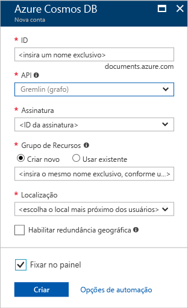

1. Em uma nova janela do navegador, entre no [Portal do Azure](https://portal.azure.com/).

2. Clique em **Criar um recurso** > **Bancos de dados** > **Azure Cosmos DB**.
   
   

3. Na página **Nova conta**, insira as configurações da nova conta do Azure Cosmos DB. 

    Configuração|Valor sugerido|DESCRIÇÃO
    ---|---|---
    ID|*Insira um nome exclusivo*|Insira um nome exclusivo para identificar essa conta do Azure Cosmos DB. Como *documents.Azure.com* é acrescentado à ID que você fornece para criar o URI, use uma ID exclusiva mas identificável.  A ID pode conter apenas letras minúsculas, números e hifens (-), e deve conter de três a 50 caracteres.
    API|Gremlin (grafo)|A API determina o tipo de conta a ser criada. O Azure Cosmos DB fornece cinco APIs para atender às necessidades de seu aplicativo: SQL (banco de dados de documentos), Gremlin (banco de dados de gráfico), MongoDB (banco de dados de documentos), Tabela do Azure e Cassandra, cada um atualmente exigindo uma conta separada.   Selecione **Gremlin (grafo)** porque neste guia de início rápido, você está criando um grafo que é passível de consulta usando a sintaxe Gremlin.  [Saiba mais sobre a API do Graph](../articles/cosmos-db/graph-introduction.md)
    Assinatura|*Sua assinatura*|Selecione a assinatura do Azure que você deseja usar para essa conta do Azure Cosmos DB. 
    Grupo de recursos|*Insira o mesmo nome exclusivo como fornecido acima na ID*|Insira o novo nome de grupo de recursos para sua conta. Para simplificar, você pode usar um nome igual à sua ID. 
    Local padrão|*Selecione a região mais próxima de seus usuários*|Selecione a localização geográfica na qual hospedar a sua conta do Azure Cosmos DB. Use o local mais próximo dos usuários para fornecer a eles acesso mais rápido aos dados.
    Habilitar a redundância geográfica| Deixar em branco | Isso cria uma versão replicada do banco de dados em uma segunda região (par). Deixe em branco.  
    Fixar no painel | Selecionar | Marque esta caixa para que a sua nova conta de banco de dados seja adicionada ao seu painel do portal para fácil acesso.

    Em seguida, clique em **Criar**.

    

4. A criação da conta leva alguns minutos. Durante a criação de conta, o portal exibe o bloco **Implantando o Azure Cosmos DB** do lado direito; talvez você precise rolar no painel para ver o bloco. Também é exibida na parte superior da tela de uma barra de progresso. Você pode assistir a área de andamento.

    

    Depois que a conta é criada, a página **Parabéns. Sua conta do Azure Cosmos DB foi criada** é exibida. 