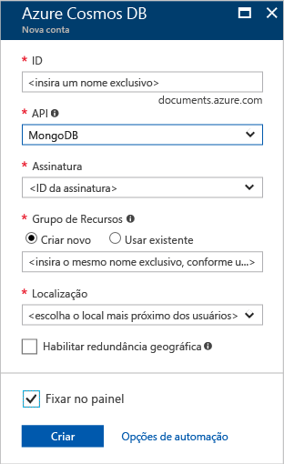
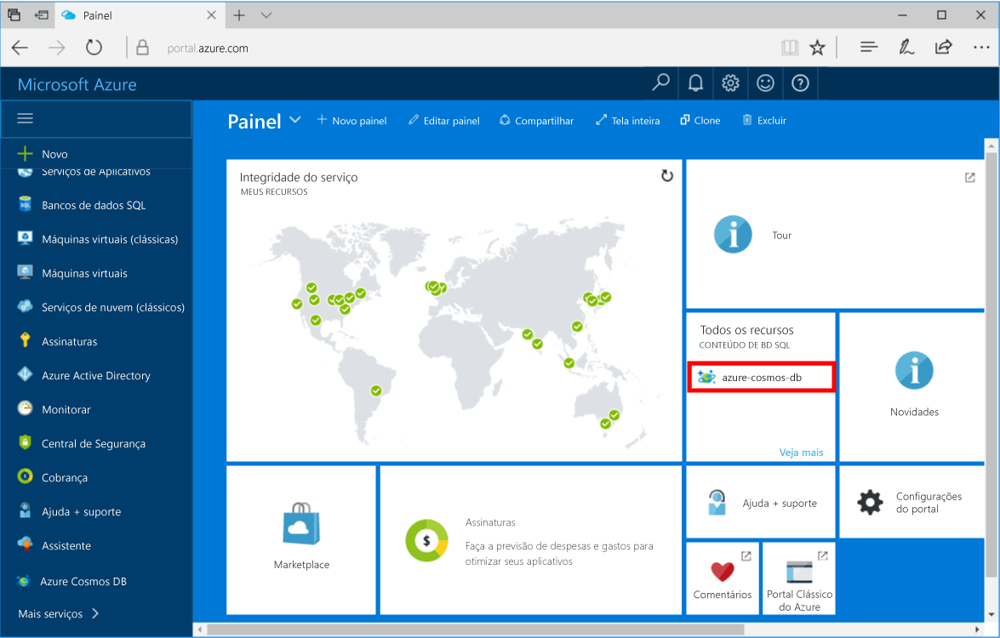

1. Em uma nova janela, entre no [portal do Azure](https://portal.azure.com/).
2. No menu esquerdo, clique em **Novo**, clique em **Bancos de Dados** e então em **Azure Cosmos DB**, clique em **Criar**.
   
   

3. Na folha **Nova conta**, especifique a configuração desejada para a conta do BD Cosmos do Azure. 

    Com o Azure Cosmos DB, você pode escolher um dos quatro modelos de programação: Gremlin (grafo), MongoDB, SQL (DocumentDB) e Tabela (chave-valor). 
       
    Neste início rápido, programaremos a API do MongoDB de modo que você escolherá **MongoDB** quando preencher o formulário. Mas se você tiver dados de grafo de um aplicativo de mídia social, dados de documento de um aplicativo de catálogo ou dados de chave/valor (tabela), perceba que o Azure Cosmos DB poderá fornecer uma plataforma de serviço de banco de dados altamente disponível, distribuída globalmente para todos os aplicativos críticos.

    Preencha a folha **Nova conta** usando as informações na captura de tela como guia.
 
    
   
    Configuração|Valor sugerido|Descrição
    ---|---|---
    ID|*Valor exclusivo*|Um nome exclusivo que você escolhe para identificar a conta do BD Cosmos do Azure. *documents.Azure.com* é acrescentado à ID que você fornece para criar o URI, portanto, use uma ID exclusiva mas identificável. A ID pode conter somente letras minúsculas, números e o caractere '-', e deve ter entre 3 e 50 caracteres.
    API|MongoDB|A API determina o tipo de conta a ser criada. O Azure Cosmos DB fornece cinco APIs para atender às necessidades de seu aplicativo: SQL (banco de dados de documentos), Gremlin (banco de dados de gráfico), MongoDB (banco de dados de documentos), Tabela do Azure e Cassandra, cada um atualmente exigindo uma conta separada.   Selecione **MongoDB** porque, neste início rápido, você está criando um banco de dados de documentos que pode ser consultado com o MongoDB.  [Saiba mais sobre a API do MongoDB](../articles/cosmos-db/mongodb-introduction.md)|
    Assinatura|*Sua assinatura*|A assinatura do Azure que você deseja usar para a conta do BD Cosmos do Azure. 
    Grupo de recursos|*O mesmo valor que a ID*|O novo nome de grupo de recursos para sua conta. Para simplificar, você pode usar um nome igual à sua ID. 
    Local|*A região mais próxima de seus usuários*|A localização geográfica na qual hospedar a sua conta do BD Cosmos do Azure. Escolha o local mais próximo dos usuários para fornecer a eles acesso mais rápido aos dados.

4. Clique em **Criar** para criar a conta.
5. Na barra de ferramentas, clique em **Notificações** para monitorar o processo de implantação.

    

6.  Quando a implantação for concluída, abra a nova conta no bloco Todos os Recursos. 

    
