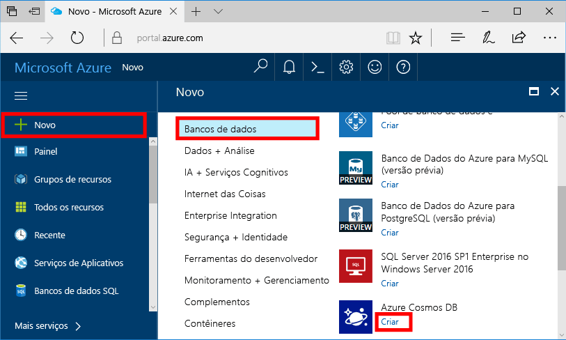
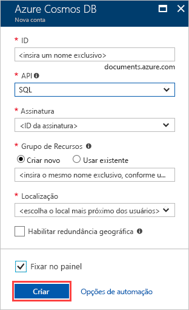

1. Em uma nova janela, entre no [portal do Azure](https://portal.azure.com/).
2. No painel esquerdo, clique em **Novo**, clique em **Bancos de Dados** e então clique em **Azure Cosmos DB**.
   
   

3. Na folha **Nova conta**, especifique a configuração desejada para essa conta do Azure Cosmos DB. 

    Com o Azure Cosmos DB, você pode escolher um dos quatro modelos de programação: Gremlin (gráfico), MongoDB, SQL (DocumentDB) e Tabela (chave-valor), cada um exigindo uma conta separada.
    
    Neste artigo de início rápido, programaremos a API do DocumentDB de modo que você escolherá **SQL (DocumentDB)** quando preencher o formulário. Se você tiver dados gráficos de um aplicativo de mídia social, dados de chave/valor (tabela) ou dados migrados de um aplicativo do MongoDB, perceba que o Azure Cosmos DB poderá fornecer uma plataforma de serviço de banco de dados altamente disponível, distribuída globalmente para todos os aplicativos críticos.

    Preencha os campos da folha **Nova conta** usando as informações na próxima captura de tela como guia - seus valores podem ser diferentes dos valores na captura de tela.
 
    

    Configuração|Valor sugerido|Descrição
    ---|---|---
    ID|*Valor exclusivo*|Um nome exclusivo que identifica essa conta do Azure Cosmos DB. Como *documents.Azure.com* é acrescentado à ID que você fornece para criar o URI, use uma ID exclusiva mas identificável. A ID pode conter apenas letras minúsculas, números e hifens (-), e deve conter de três a 50 caracteres.
    API|SQL (DocumentDB)|Nós programaremos a [API do DocumentDB](../articles/documentdb/documentdb-introduction.md) posteriormente neste artigo.|
    Assinatura|*Sua assinatura*|A assinatura do Azure que você deseja usar para essa conta do Azure Cosmos DB. 
    Grupo de recursos|*O mesmo valor que a ID*|O novo nome de grupo de recursos para sua conta. Para simplificar, você pode usar um nome igual à sua ID. 
    Local|*A região mais próxima de seus usuários*|A localização geográfica na qual hospedar a sua conta do BD Cosmos do Azure. Escolha o local mais próximo dos usuários para fornecer a eles acesso mais rápido aos dados.
4. Clique em **Criar** para criar a conta.
5. Na barra de ferramentas superior, clique no ícone **Notificações**  para monitorar o processo de implantação.

    

6.  Quando a janela Notificações indicar que a implantação foi bem-sucedida, feche a janela de notificação e abra a nova conta no bloco **Todos os Recursos** no painel. 

    
 
