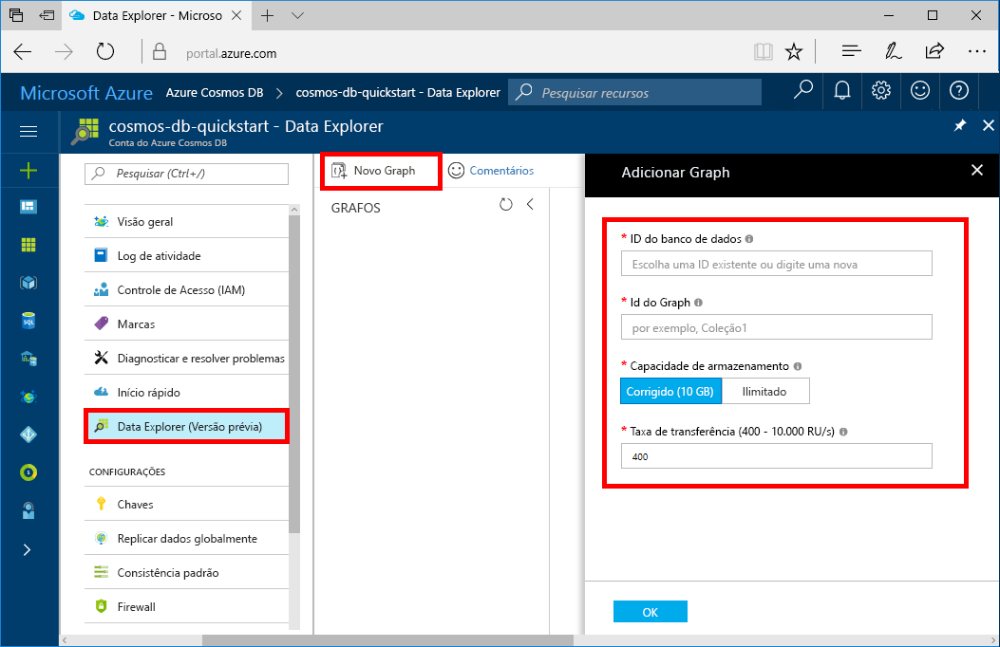

Agora, você pode usar a ferramenta Data Explorer no portal do Azure para criar um banco de dados de gráfico. 

1. No Portal do Azure, no menu de navegação à esquerda, clique em **Data Explorer (Versão prévia)**. 
2. Na folha **Data Explorer (Versão prévia)**, clique em **Novo Gráfico**, então, preencha a página usando as seguintes informações.

    

    Configuração|Valor sugerido|Descrição
    ---|---|---
    ID do banco de dados|banco de dados de exemplo|A ID do novo banco de dados. Os nomes de banco de dados devem ter entre um e 255 caracteres e não podem conter `/ \ # ?` nem espaços à direita.
    Id do Gráfico|gráfico de exemplo|A ID do novo gráfico. Os nomes de Gráfico possuem os mesmos requisitos de caractere que os ids de banco de dados.
    Capacidade de Armazenamento| 10 GB|Mantenha o valor padrão. Essa é a capacidade de armazenamento do banco de dados.
    Taxa de transferência|400 RUs|Mantenha o valor padrão. Você pode escalar verticalmente a taxa de transferência mais tarde se desejar reduzir a latência.
    RU/m|Desativar|Mantenha o valor padrão. Se você precisar lidar com cargas de trabalho com pico de uso mais tarde, poderá ativar o recurso [RU/m](../articles/cosmos-db/request-units-per-minute.md).
    Chave de partição|/userid|Uma chave de partição que distribuirá dados uniformemente para cada partição. É importante selecionar a chave de partição correta ao criar um gráfico de alto desempenho, leia mais a respeito em [Design de particionamento](../articles/cosmos-db/partition-data.md#designing-for-partitioning).

3. Quando o formulário estiver preenchido, clique em **OK**.