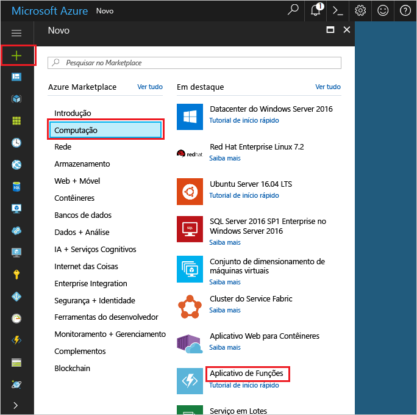

1. Vá para o [portal do Azure](https://portal.azure.com) e entre com sua conta do Azure.

2. Clique em **+Novo** > **Computação** > **Aplicativo de Funções**, selecione sua **Assinatura**, digite um **Nome do aplicativo** exclusivo que identifica seu aplicativo de funções e especifique as seguintes configurações:
   
   * **[Grupo de Recursos](../articles/azure-resource-manager/resource-group-overview.md)**: selecione **Criar novo** e digite um nome para seu novo grupo de recursos. 
   * **[Plano de hospedagem](../articles/app-service/azure-web-sites-web-hosting-plans-in-depth-overview.md)**, que pode ser um destes: 
     * **Plano de consumo**: plano padrão para o Azure Functions. Ao escolher um plano de consumo, você também deve escolher o **Local** e definir a **Alocação de Memória** (em MB). Para saber como a alocação de memória afeta os custos, confira [Preços do Azure Functions](https://azure.microsoft.com/pricing/details/functions/). 
     * **Plano do Serviço de Aplicativo**: esse plano exige que você crie um **plano/local para o Serviço de Aplicativo** ou selecione um existente. Essas configurações determinam o [local, os recursos, o custo e os recursos de computação](https://azure.microsoft.com/pricing/details/app-service/) associados ao seu aplicativo.  
   * **Conta de armazenamento**: cada aplicativo de funções requer uma conta de armazenamento. Você pode usar uma conta de armazenamento existente ou [criar uma nova](../articles/storage/storage-create-storage-account.md#create-a-storage-account). 
     
    

3. Clique em **Criar** para provisionar e implantar o novo aplicativo de funções.  