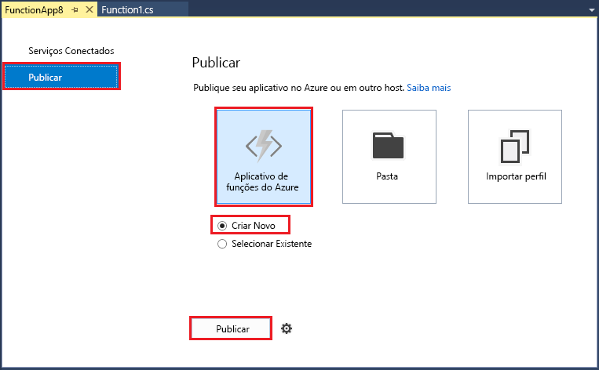

No **Gerenciador de Soluções**, clique com o botão direito do mouse no nome do projeto e selecione **Publicar**. Escolha **Criar Novo** e em **Publicar**. 

Se você já não conectou o Visual Studio à conta do Azure, clique em **Adicionar uma conta...** .  

No diálogo **Criar Serviço de Aplicativo**, use as configurações de hospedagem conforme especificadas na tabela. 

| Configuração      | Valor sugerido  | Descrição                                |
| ------------ |  ------- | -------------------------------------------------- |
| **Nome do aplicativo** | Nome globalmente exclusivo | Nome que identifica seu novo aplicativo de funções de forma exclusiva. |
| **Assinatura** | Escolha sua assinatura | A assinatura do Azure a utilizar. |
| **[Grupo de Recursos](../articles/azure-resource-manager/resource-group-overview.md)** | myResourceGroup |  Nome do grupo de recursos no qual criar o seu aplicativo de funções. |
| **[Plano do Serviço de Aplicativo](../articles/azure-functions/functions-scale.md)** | Plano de consumo | Não deixe de escolher **Consumo** em **Tamanho** ao criar um novo plano.  |
| **[Conta de armazenamento](../articles/storage/storage-create-storage-account.md#create-a-storage-account)** | Nome globalmente exclusivo | Use uma conta de armazenamento existente ou crie uma nova.   |

Clique em **Criar** para criar um aplicativo de funções no Azure com essas configurações. 

Após a conclusão do provisionamento, clique em **Publicar** para implantar o código do projeto no novo aplicativo de funções. 

Anote o valor da **URL do Site**, que é o endereço do seu aplicativo de funções no Azure. 