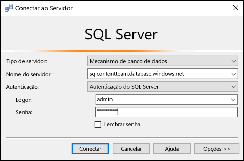

## Conectar-se ao Banco de Dados SQL do Azure usando a autenticação do SQL Server
As etapas a seguir mostram como se conectar a um servidor SQL do Azure e ao banco de dados com o SSMS. Se você não tiver um servidor e um banco de dados, veja [Criar um banco de dados SQL em minutos](../articles/sql-database/sql-database-get-started.md) para criar um.

1. Inicie o SSMS ao digitar **Microsoft SQL Server Management Studio** na caixa de pesquisa do Windows e clique no aplicativo de área de trabalho.
2. Na janela **Conectar ao Servidor**, insira as informações a seguir (se o SSMS já estiver em execução, clique em **Conectar > Mecanismo de Banco de Dados** para abrir a janela **Conectar ao Servidor**):
   
   * **Tipo de servidor**: o padrão é o mecanismo de banco de dados; não altere esse valor.
   * **Nome do servidor**: insira o nome totalmente qualificado do seu servidor do Banco de Dados SQL do Azure no seguinte formato: *&lt;nomedoservidor>*.**database.windows.net**
   * **Tipo de autenticação**: este artigo mostra como se conectar usando a **Autenticação do SQL Server**. Para obter detalhes sobre a conexão com o Azure Active Directory, veja [Conectar-se usando a autenticação integrada do Active Directory](../articles/sql-database/sql-database-aad-authentication.md#connect-using-active-directory-integrated-authentication), [Conectar-se usando a autenticação de senha do Active Directory](../articles/sql-database/sql-database-aad-authentication.md#connect-using-active-directory-password-authentication) e [Conectar-se usando a autenticação do Active Directory Universal](../articles/sql-database/sql-database-ssms-mfa-authentication.md).
   * **Nome de usuário**: insira o nome de um usuário com acesso ao banco de dados no servidor (por exemplo, o *administrador do servidor* que você configura ao criar o servidor). 
   * **Senha**: insira a senha para o usuário especificado (por exemplo, a *senha* que você configura ao criar o servidor).
     
       
3. Clique em **Conectar**.
4. Por padrão, os novos servidores não têm [regras de firewall](../articles/sql-database/sql-database-firewall-configure.md) definidas para clientes e, portanto, estão inicialmente impedidos de se conectar. Se o servidor ainda não tiver uma regra de firewall que permita que seu endereço IP específico se conecte, o SSMS solicitará que você crie uma regra de firewall no nível do servidor.
   
    Clique em **Entrar** e crie uma regra de firewall no nível do servidor. Você deve ser um administrador do Azure para criar uma regra de firewall no nível do servidor.
   
       
5. Depois de se conectar ao banco de dados SQL do Azure, o **Pesquisador de Objetos** será aberto e você poderá acessar seu banco de dados para [executar tarefas administrativas ou consultar dados](../articles/sql-database/sql-database-manage-azure-ssms.md).
   
     

## Solucionar falhas de conexão
Os motivos mais comuns para falhas de conexão são erros no nome do servidor e problemas de conectividade de rede. Lembre-se, <*nomedoservidor*> é o nome do servidor, e não do banco de dados, e você precisa fornecer o nome totalmente qualificado do servidor: `<servername>.database.windows.net`

Além disso, verifique se o nome de usuário e a senha não contém erros de digitação ou espaços extras (os nomes de usuário não diferenciam maiúsculas de minúsculas, mas as senhas sim). 

Você também pode definir explicitamente o número de porta e o protocolo com o nome do servidor desta forma: `tcp:servername.database.windows.net,1433`

Os problemas de conectividade de rede também podem causar erros de conexão e de tempo limite. Simplesmente tentar reconectar (quando você souber que o nome do servidor, as credenciais e as regras de firewall estão corretos) poderá resultar em êxito.

Para obter detalhes e mais informações sobre problemas de conectividade, veja [Solucionar problemas, diagnosticar e evitar erros de conexão SQL e erros transitórios para o Banco de Dados SQL](../articles/sql-database/sql-database-connectivity-issues.md).

